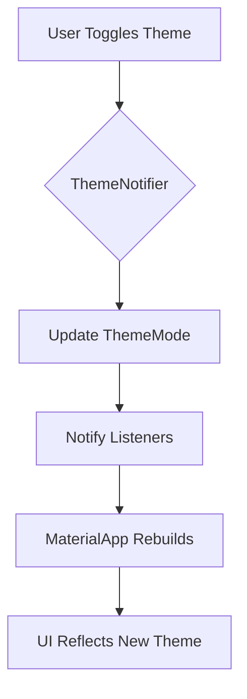

## 12.4.4 Dynamic Theming

In the ever-evolving landscape of mobile applications, providing a personalized user experience is paramount. One effective way to enhance user satisfaction is by implementing dynamic theming, which allows users to switch between different visual themes at runtime. This section will guide you through the process of enabling dynamic theming in Flutter applications, focusing on user theme selection, runtime theme updates, and best practices for a seamless user experience.

### Allowing User Theme Selection

Dynamic theming begins with empowering users to choose their preferred theme. This involves integrating a theme switcher into your app's UI and managing theme changes efficiently.

#### State Management

To manage theme changes effectively, a robust state management solution is essential. Flutter offers several state management options, but for this guide, we'll use the `Provider` package due to its simplicity and integration with Flutter's widget tree.

**Setting Up Provider for Theme Management:**

1. **Add Provider Dependency:**

   First, ensure that the `Provider` package is included in your `pubspec.yaml` file:

   ```yaml
   dependencies:
     flutter:
       sdk: flutter
     provider: ^6.0.0
   ```

2. **Create a ThemeNotifier Class:**

   Define a `ThemeNotifier` class to manage the theme state. This class will extend `ChangeNotifier`, allowing it to notify listeners of state changes.

   ```dart
   import 'package:flutter/material.dart';

   class ThemeNotifier with ChangeNotifier {
     ThemeMode _themeMode = ThemeMode.system;

     ThemeMode get themeMode => _themeMode;

     void setThemeMode(ThemeMode mode) {
       _themeMode = mode;
       notifyListeners();
     }
   }
   ```

3. **Initialize Provider in Main:**

   Wrap your `MaterialApp` with a `ChangeNotifierProvider` to provide the `ThemeNotifier` to the widget tree.

   ```dart
   import 'package:flutter/material.dart';
   import 'package:provider/provider.dart';

   void main() {
     runApp(
       ChangeNotifierProvider(
         create: (_) => ThemeNotifier(),
         child: MyApp(),
       ),
     );
   }
   ```

#### Implementing Theme Switcher

The next step is to create a UI component that allows users to toggle between themes. This can be a simple switch or a more elaborate settings page.

**Creating a Theme Toggle Widget:**

1. **Add a Toggle in the UI:**

   You can add a toggle switch to your app's settings page or main screen to allow users to switch themes.

   ```dart
   class ThemeSwitcher extends StatelessWidget {
     @override
     Widget build(BuildContext context) {
       final themeNotifier = Provider.of<ThemeNotifier>(context);

       return SwitchListTile(
         title: Text('Dark Mode'),
         value: themeNotifier.themeMode == ThemeMode.dark,
         onChanged: (value) {
           themeNotifier.setThemeMode(
             value ? ThemeMode.dark : ThemeMode.light,
           );
         },
       );
     }
   }
   ```

2. **Update MaterialApp:**

   Ensure that your `MaterialApp` uses the theme mode from the `ThemeNotifier`.

   ```dart
   class MyApp extends StatelessWidget {
     @override
     Widget build(BuildContext context) {
       final themeNotifier = Provider.of<ThemeNotifier>(context);

       return MaterialApp(
         themeMode: themeNotifier.themeMode,
         theme: ThemeData.light(),
         darkTheme: ThemeData.dark(),
         home: HomePage(),
       );
     }
   }
   ```

### Updating Theme at Runtime

With the theme switcher in place, your app can now update its theme dynamically based on user input. This section will demonstrate how to apply these changes in real-time.

#### Example with Provider

The `ThemeNotifier` class, as shown earlier, is central to updating the theme at runtime. When the user toggles the theme, the `setThemeMode` method updates the `themeMode` and notifies listeners, prompting the `MaterialApp` to rebuild with the new theme.

**Code Explanation:**

- **ThemeNotifier Class:**

  The `ThemeNotifier` class holds the current `ThemeMode` and provides a method to update it. The `notifyListeners()` call ensures that any widget listening to this notifier rebuilds when the theme changes.

- **MaterialApp Configuration:**

  The `MaterialApp` widget is configured to use the theme mode from the `ThemeNotifier`. It specifies both a light and dark theme, allowing it to switch between them based on the current `themeMode`.

### Best Practices

Implementing dynamic theming involves more than just switching themes. Consider these best practices to enhance user experience and maintain app performance.

#### Persistence

To provide a seamless experience, store the user's theme preference so that it persists across app sessions. You can achieve this using the `SharedPreferences` package.

**Storing Theme Preference:**

1. **Add SharedPreferences Dependency:**

   Include `SharedPreferences` in your `pubspec.yaml`:

   ```yaml
   dependencies:
     shared_preferences: ^2.0.0
   ```

2. **Modify ThemeNotifier to Persist Theme:**

   Update the `ThemeNotifier` to save and load the theme preference.

   ```dart
   import 'package:shared_preferences/shared_preferences.dart';

   class ThemeNotifier with ChangeNotifier {
     ThemeMode _themeMode = ThemeMode.system;

     ThemeNotifier() {
       _loadThemeMode();
     }

     ThemeMode get themeMode => _themeMode;

     void setThemeMode(ThemeMode mode) async {
       _themeMode = mode;
       notifyListeners();
       SharedPreferences prefs = await SharedPreferences.getInstance();
       prefs.setInt('themeMode', mode.index);
     }

     void _loadThemeMode() async {
       SharedPreferences prefs = await SharedPreferences.getInstance();
       int themeIndex = prefs.getInt('themeMode') ?? ThemeMode.system.index;
       _themeMode = ThemeMode.values[themeIndex];
       notifyListeners();
     }
   }
   ```

#### User Experience

Ensure that theme changes provide immediate feedback to users. The UI should update instantly to reflect the new theme, enhancing the overall user experience.

- **Immediate Feedback:**

  When the user toggles the theme, the app should visibly change to the selected theme without delay. This responsiveness is crucial for maintaining a smooth user experience.

### Visual Aids

Visual aids can significantly enhance understanding and engagement. Consider incorporating diagrams or animations to demonstrate theme switching in your app.



**Diagram Explanation:**

- **User Toggles Theme:** The process begins when the user interacts with the theme toggle.
- **ThemeNotifier:** The notifier updates the `ThemeMode` and triggers a notification.
- **MaterialApp Rebuilds:** The `MaterialApp` listens for changes and rebuilds with the new theme.
- **UI Reflects New Theme:** The user interface updates to reflect the selected theme.

### Exercises

To reinforce your understanding and skills, try the following exercises:

#### Exercise 1: Implement a Theme Selector

Create a theme selector that allows users to choose from multiple themes, not just light and dark. Consider adding a custom theme option.

**Hints:**

- Define additional theme data in your app.
- Update the `ThemeNotifier` to handle multiple themes.

#### Exercise 2: Persist User Theme Choice

Extend your app to remember the user's theme choice across sessions using `SharedPreferences`.

**Hints:**

- Ensure that the theme preference is loaded when the app starts.
- Test the persistence by restarting the app and verifying the selected theme.

### Conclusion

Dynamic theming is a powerful feature that enhances user engagement by allowing personalization. By following the steps outlined in this guide, you can implement a flexible theming system in your Flutter applications. Remember to consider user experience and persistence to provide a seamless and responsive interface. As you continue to explore Flutter, consider experimenting with more complex theming scenarios and integrating additional state management solutions to suit your app's needs.

## Quiz Time!



### What is the primary purpose of dynamic theming in Flutter applications?

- [x] To allow users to personalize the app's appearance
- [ ] To improve app performance
- [ ] To reduce app size
- [ ] To enhance security

> **Explanation:** Dynamic theming allows users to personalize the app's appearance by selecting different themes, enhancing user satisfaction and engagement.

### Which state management solution is used in this guide for managing theme changes?

- [x] Provider
- [ ] Redux
- [ ] Bloc
- [ ] Riverpod

> **Explanation:** The guide uses the `Provider` package for managing theme changes due to its simplicity and integration with Flutter's widget tree.

### How can you persist the user's theme preference across app sessions?

- [x] Using SharedPreferences
- [ ] Using a local database
- [ ] Using a file system
- [ ] Using a cloud service

> **Explanation:** The `SharedPreferences` package is used to store the user's theme preference locally, allowing it to persist across app sessions.

### What method is used in the ThemeNotifier class to notify listeners of state changes?

- [x] notifyListeners()
- [ ] setState()
- [ ] updateListeners()
- [ ] refreshListeners()

> **Explanation:** The `notifyListeners()` method is used in the `ThemeNotifier` class to notify listeners of state changes, prompting them to rebuild.

### What is the role of the MaterialApp widget in dynamic theming?

- [x] It applies the selected theme to the entire app
- [ ] It manages state changes
- [ ] It handles user input
- [ ] It stores user preferences

> **Explanation:** The `MaterialApp` widget applies the selected theme to the entire app, ensuring that the UI reflects the current theme mode.

### Which package is used to manage theme persistence in this guide?

- [x] SharedPreferences
- [ ] Hive
- [ ] Sqflite
- [ ] Firebase

> **Explanation:** The `SharedPreferences` package is used to manage theme persistence, storing the user's theme preference locally.

### What is the default theme mode set in the ThemeNotifier class?

- [x] ThemeMode.system
- [ ] ThemeMode.light
- [ ] ThemeMode.dark
- [ ] ThemeMode.custom

> **Explanation:** The default theme mode set in the `ThemeNotifier` class is `ThemeMode.system`, which follows the system's theme setting.

### How does the app provide immediate feedback when the theme changes?

- [x] By rebuilding the MaterialApp with the new theme
- [ ] By displaying a notification
- [ ] By restarting the app
- [ ] By logging the change

> **Explanation:** The app provides immediate feedback by rebuilding the `MaterialApp` with the new theme, ensuring that the UI updates instantly.

### What is the purpose of the notifyListeners() method in the ThemeNotifier class?

- [x] To trigger a rebuild of widgets listening to the notifier
- [ ] To log changes
- [ ] To update the database
- [ ] To send notifications to the user

> **Explanation:** The `notifyListeners()` method triggers a rebuild of widgets listening to the notifier, ensuring that they reflect the updated state.

### True or False: Dynamic theming can only switch between light and dark themes.

- [ ] True
- [x] False

> **Explanation:** False. Dynamic theming can switch between multiple themes, including custom themes, not just light and dark.


