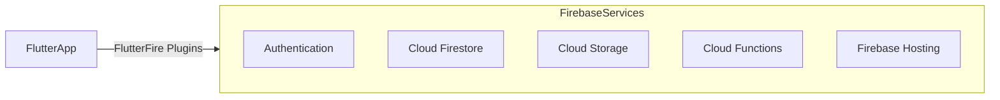

## 13.1.1 What is Firebase

In the rapidly evolving landscape of mobile and web application development, Firebase stands out as a robust and versatile platform that empowers developers to build, improve, and grow their applications with ease. As a comprehensive app development platform provided by Google, Firebase offers a suite of tools and services designed to streamline the development process, allowing developers to focus on creating high-quality user experiences without the burden of managing complex infrastructure.

### Overview of Firebase

#### Definition and Purpose

Firebase is a powerful Backend-as-a-Service (BaaS) platform that provides developers with a wide array of tools and services to facilitate the development of feature-rich applications. Its primary purpose is to simplify the backend development process, offering ready-made solutions for common tasks such as user authentication, data storage, and messaging. By leveraging Firebase, developers can accelerate their development cycles, reduce time-to-market, and focus on crafting engaging user interfaces and experiences.

Firebase's offerings include easy-to-use SDKs and pre-built UI libraries that enable developers to authenticate users, store data securely, send messages, and much more. This comprehensive suite of services is designed to cater to the needs of both small startups and large enterprises, providing scalable solutions that grow with your application.

#### Key Capabilities

One of the standout features of Firebase is its ability to handle the complexities of scaling and server management automatically. This means that as your application grows and attracts more users, Firebase seamlessly scales to accommodate increased demand without requiring manual intervention. This capability allows developers to concentrate on building high-quality applications without worrying about the underlying infrastructure.

Firebase's infrastructure is designed to be highly reliable and performant, ensuring that your applications remain responsive and available even under heavy loads. This reliability is crucial for maintaining user satisfaction and trust, particularly for applications that require real-time data synchronization and communication.

#### Cross-Platform Support

Firebase's cross-platform support is another key advantage, making it an ideal choice for developers working with Flutter. Through official plugins known as FlutterFire, Firebase integrates seamlessly with Flutter, providing a consistent development experience across iOS, Android, and Web platforms. This integration allows developers to write code once and deploy it across multiple platforms, significantly reducing development time and effort.

The FlutterFire plugins offer a wide range of functionalities, from authentication and database management to cloud storage and analytics, all accessible through a unified API. This consistency ensures that developers can leverage Firebase's powerful features without having to learn different APIs for each platform.

### Core Services of Firebase

Firebase offers a comprehensive suite of core services that address various aspects of app development, from user authentication to data storage and beyond. These services are designed to work seamlessly together, providing a cohesive and integrated development experience.

#### Authentication

Firebase Authentication provides secure and reliable user authentication solutions, supporting a variety of authentication methods including email/password, phone numbers, and popular federated identity providers like Google, Facebook, and Apple. This flexibility allows developers to implement authentication mechanisms that best suit their application's needs, ensuring a smooth and secure user experience.

With Firebase Authentication, developers can easily manage user accounts, handle password resets, and implement advanced security features such as two-factor authentication. This service is designed to be easy to integrate, with pre-built UI components and comprehensive documentation to guide developers through the process.

#### Cloud Firestore

Cloud Firestore is a scalable, flexible NoSQL cloud database that enables developers to store and sync data for client- and server-side development. Its real-time synchronization capabilities make it an ideal choice for applications that require live updates, such as collaborative tools and chat applications.

Firestore's powerful querying capabilities allow developers to retrieve specific data sets efficiently, while its flexible data model supports a wide range of use cases. With built-in security rules and offline support, Firestore ensures that your data remains secure and accessible, even in challenging network conditions.

#### Realtime Database

The Firebase Realtime Database is a cloud-hosted NoSQL database that enables real-time data synchronization between users. This service is particularly well-suited for applications that require instant updates, such as multiplayer games and collaborative editing tools.

The Realtime Database's low-latency performance ensures that changes are propagated to all connected clients in milliseconds, providing a seamless user experience. With built-in security and offline capabilities, the Realtime Database is a reliable choice for applications that demand real-time data synchronization.

#### Cloud Storage

Firebase Cloud Storage provides a scalable and secure solution for storing user-generated content such as images, audio, and video. This service is designed to handle large volumes of data efficiently, with automatic scaling to accommodate growing storage needs.

Cloud Storage integrates seamlessly with Firebase Authentication, allowing developers to implement fine-grained access controls and ensure that user data remains secure. With robust security features and comprehensive documentation, Cloud Storage is an ideal choice for applications that require reliable and scalable storage solutions.

#### Cloud Functions

Firebase Cloud Functions is a serverless framework that enables developers to run backend code in response to events triggered by Firebase features and HTTPS requests. This service allows developers to extend their applications with custom logic, without the need to manage servers or infrastructure.

Cloud Functions can be used to implement a wide range of functionalities, from sending notifications and processing payments to integrating with third-party services. With automatic scaling and built-in security, Cloud Functions provides a flexible and reliable solution for extending your application's capabilities.

#### Firebase Hosting

Firebase Hosting offers fast and secure web content hosting for developers, with support for static and dynamic content. This service is designed to deliver content quickly and reliably, with built-in SSL support and global CDN integration.

With Firebase Hosting, developers can deploy web applications and static sites with ease, leveraging Firebase's powerful infrastructure to ensure fast load times and high availability. This service is particularly well-suited for hosting Progressive Web Apps (PWAs) and Single Page Applications (SPAs).

#### Analytics and Performance Monitoring

Firebase provides a suite of tools for gaining insights into app usage and performance, including Firebase Analytics and Performance Monitoring. These tools enable developers to track user behavior, identify performance bottlenecks, and optimize their applications for better user experiences.

With Firebase Analytics, developers can gain a deep understanding of how users interact with their applications, while Performance Monitoring provides detailed insights into app performance, helping developers identify and resolve issues quickly.

### Benefits for Flutter Developers

#### Seamless Integration

Firebase's seamless integration with Flutter through the FlutterFire plugins offers a streamlined development experience, allowing developers to easily incorporate Firebase services into their Flutter applications. This integration simplifies the process of implementing complex backend functionalities, enabling developers to focus on building engaging user interfaces and experiences.

The FlutterFire plugins provide a consistent API across platforms, ensuring that developers can leverage Firebase's powerful features without having to learn different APIs for each platform. This consistency reduces development time and effort, allowing developers to deliver high-quality applications more quickly.

#### Accelerated Development

By offloading backend tasks to Firebase, developers can accelerate their development cycles and focus on frontend development and user experience. Firebase's comprehensive suite of services eliminates the need to manage complex infrastructure, allowing developers to concentrate on crafting engaging user interfaces and experiences.

This accelerated development process enables developers to bring their applications to market more quickly, reducing time-to-market and increasing their competitive advantage.

#### Real-Time Capabilities

Firebase's real-time capabilities make it easy to build applications that require live updates, such as chat applications, collaborative tools, and real-time dashboards. With services like Cloud Firestore and the Realtime Database, developers can implement real-time data synchronization with ease, providing a seamless user experience.

These real-time capabilities are particularly valuable for applications that require instant updates, ensuring that users always have access to the latest information and can collaborate effectively.

### Visual Aids

To better understand how a Flutter app interacts with Firebase services, consider the following diagram:

This diagram illustrates the relationship between a Flutter app and Firebase components, highlighting how the FlutterFire plugins facilitate seamless integration with Firebase services. Each service, from Authentication to Hosting, plays a crucial role in enabling developers to build feature-rich applications with ease.

### Real-World Relevance

Firebase is widely used by developers around the world to power a diverse range of applications, from small startups to large enterprises. Popular apps like Duolingo, Alibaba, and The New York Times leverage Firebase's powerful features to deliver engaging user experiences and scale their applications effectively.

By integrating Firebase into your Flutter projects, you can take advantage of these same capabilities to build high-quality applications that meet the needs of your users. Whether you're developing a chat app, a collaborative tool, or a real-time dashboard, Firebase provides the tools and services you need to succeed.

### Conclusion

Firebase is a comprehensive app development platform that offers a wide range of tools and services to help developers build, improve, and grow their applications. With its seamless integration with Flutter, Firebase provides a consistent and streamlined development experience, enabling developers to focus on creating engaging user interfaces and experiences.

By leveraging Firebase's powerful features, developers can accelerate their development cycles, reduce time-to-market, and deliver high-quality applications that meet the needs of their users. Whether you're building a small startup or a large enterprise application, Firebase provides the tools and services you need to succeed.

## Quiz Time!



### What is Firebase primarily designed to do?

- [x] Simplify backend development for app developers
- [ ] Provide hardware solutions for mobile devices
- [ ] Replace all frontend development tasks
- [ ] Serve as a database-only service

> **Explanation:** Firebase is designed to simplify backend development by offering a suite of tools and services that handle common backend tasks, allowing developers to focus on building high-quality apps.

### Which of the following is NOT a core service provided by Firebase?

- [ ] Authentication
- [ ] Cloud Firestore
- [ ] Cloud Storage
- [x] Mobile Device Manufacturing

> **Explanation:** Firebase provides services like Authentication, Cloud Firestore, and Cloud Storage, but it does not involve in manufacturing mobile devices.

### How does Firebase benefit Flutter developers?

- [x] By providing seamless integration through FlutterFire plugins
- [ ] By offering hardware components for Flutter apps
- [ ] By replacing the need for any coding in Flutter
- [ ] By providing only UI design tools

> **Explanation:** Firebase benefits Flutter developers by offering seamless integration through FlutterFire plugins, which simplify the use of Firebase services in Flutter apps.

### What type of database is Cloud Firestore?

- [x] A scalable, flexible NoSQL cloud database
- [ ] A traditional SQL database
- [ ] A local file-based database
- [ ] A blockchain-based database

> **Explanation:** Cloud Firestore is a scalable, flexible NoSQL cloud database designed to store and sync data for client- and server-side development.

### Which Firebase service is used for real-time data synchronization?

- [x] Realtime Database
- [ ] Cloud Functions
- [ ] Firebase Hosting
- [ ] Firebase Analytics

> **Explanation:** The Firebase Realtime Database is used for real-time data synchronization, allowing data to be stored and synced between users in real-time.

### What is the purpose of Firebase Cloud Functions?

- [x] To run backend code in response to events
- [ ] To store large files like images and videos
- [ ] To provide real-time analytics
- [ ] To host static web content

> **Explanation:** Firebase Cloud Functions is a serverless framework that allows developers to run backend code in response to events triggered by Firebase features and HTTPS requests.

### Which service would you use to store user-generated content like images and videos?

- [x] Cloud Storage
- [ ] Cloud Firestore
- [ ] Realtime Database
- [ ] Firebase Hosting

> **Explanation:** Firebase Cloud Storage is designed to store and manage user-generated content such as images and videos.

### What is a key advantage of using Firebase for app development?

- [x] Automatic scaling and server management
- [ ] It eliminates the need for any frontend development
- [ ] It provides hardware solutions for app developers
- [ ] It only supports Android development

> **Explanation:** A key advantage of using Firebase is its ability to automatically scale and manage servers, allowing developers to focus on building high-quality apps.

### Which Firebase service provides insights into app usage and performance?

- [x] Firebase Analytics
- [ ] Cloud Functions
- [ ] Cloud Firestore
- [ ] Realtime Database

> **Explanation:** Firebase Analytics provides insights into app usage and performance, helping developers understand user behavior and optimize their applications.

### True or False: Firebase only supports Android applications.

- [ ] True
- [x] False

> **Explanation:** False. Firebase supports iOS, Android, Web, and is well-integrated with Flutter, providing a consistent development experience across platforms.


