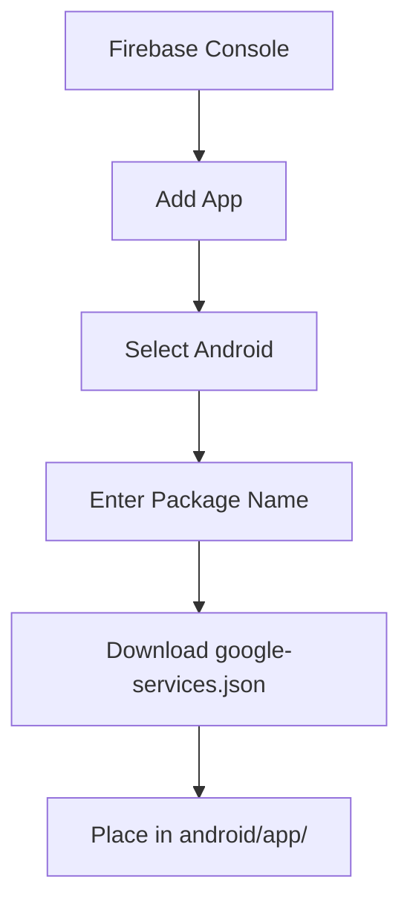
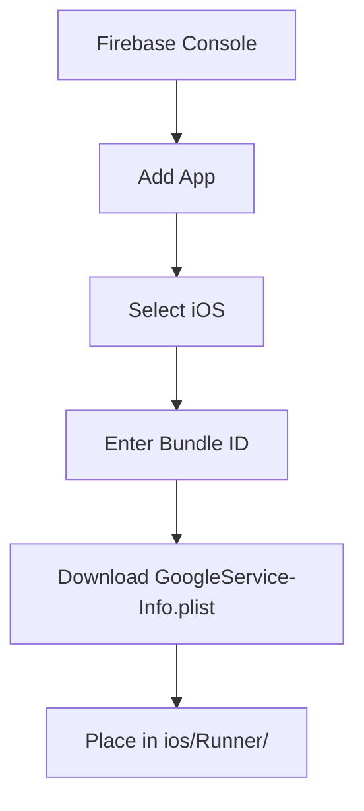

## 13.1.4 Adding Firebase to Your Flutter App

Integrating Firebase into your Flutter application can significantly enhance its capabilities by providing robust backend services such as authentication, real-time databases, analytics, and more. This guide will walk you through the process of adding Firebase to your Flutter app, covering configurations for Android, iOS, and Web platforms. By the end of this section, you'll have a fully integrated Firebase setup ready to power your Flutter application.

### Configuring Firebase for Flutter Platforms

#### Overview

Firebase integration with Flutter requires specific configurations for each platform you intend to support. This ensures that your app can communicate effectively with Firebase services. We'll cover the setup process for Android, iOS, and Web, highlighting the unique steps and considerations for each platform.

### Adding Firebase to an Android App

#### 1. Register App in Firebase Console

To begin, navigate to the [Firebase Console](https://console.firebase.google.com/) and add your Android app:

- **Click on "Add app"** and select Android.
- **Package Name:** Enter your Android package name, which should match the package name specified in your `AndroidManifest.xml` file (e.g., `com.example.myflutterapp`).
- **App Nickname (Optional):** Provide a nickname for easier identification within the Firebase Console.
- **Debug Signing Certificate SHA-1 (Optional):** While not required for basic setup, obtaining the SHA-1 is necessary for features like Google Sign-In. You can obtain it using the following command in your terminal:

  ```bash
  keytool -list -v -keystore ~/.android/debug.keystore -alias androiddebugkey -storepass android -keypass android
  ```

#### 2. Download `google-services.json`

After registering your app, download the `google-services.json` file and place it in the `android/app/` directory of your Flutter project.

#### 3. Add Firebase SDK to Flutter App

To integrate Firebase into your Android app, you'll need to modify your Gradle files:

- **Update `android/build.gradle`:** Ensure the Google services plugin is included in the dependencies section:

  ```gradle
  buildscript {
    dependencies {
      // Add this line
      classpath 'com.google.gms:google-services:4.3.10'
    }
  }
  ```

- **Update `android/app/build.gradle`:** Apply the Google services plugin at the bottom of the file:

  ```gradle
  apply plugin: 'com.android.application'
  // Add this line
  apply plugin: 'com.google.gms.google-services'
  ```

#### Visual Aids

Below are some visual aids to help you through the Firebase console registration process:



### Adding Firebase to an iOS App

#### 1. Register App in Firebase Console

In the Firebase Console, add your iOS app:

- **Click on "Add app"** and select iOS.
- **Bundle ID:** Enter your iOS bundle identifier, which should match the bundle ID in your `ios/Runner.xcodeproj` (e.g., `com.example.myflutterapp`).

#### 2. Download `GoogleService-Info.plist`

After registering, download the `GoogleService-Info.plist` file and place it in the `ios/Runner/` directory.

#### 3. Add Firebase SDK to Flutter App

- **Install CocoaPods:** Ensure CocoaPods is installed on your system. This is common for macOS users and can be done via:

  ```bash
  sudo gem install cocoapods
  ```

- **Update `ios/Podfile`:** Typically, no changes are necessary as Flutter handles plugin dependencies.

- **Run Pod Install:** Navigate to the `ios` directory and execute:

  ```bash
  pod install
  ```

#### Visual Aids

Here are some tips and visual aids for the iOS app registration process:



### Adding Firebase to a Web App (Optional)

#### Web Configuration

1. **Register App in Firebase Console:**

   - **Click on "Add app"** and select Web.
   - **App Nickname:** Provide a nickname for your web app.
   - **Hosting Setup:** You can choose to set up Firebase Hosting now or skip this step.

2. **Add Firebase Config to App:**

   - Copy the Firebase configuration details (`apiKey`, `authDomain`, etc.).
   - Update your `web/index.html` to include the Firebase SDKs and configuration.

### Initializing Firebase in Flutter

#### Add Firebase Core Dependency

To start using Firebase in your Flutter app, add the Firebase Core dependency to your `pubspec.yaml` file:

```yaml
dependencies:
  firebase_core: ^1.0.0
```

Run `flutter pub get` to install the new dependency.

#### Initialize Firebase in Code

Modify your `main.dart` file to initialize Firebase:

```dart
import 'package:flutter/material.dart';
import 'package:firebase_core/firebase_core.dart';

void main() async {
  WidgetsFlutterBinding.ensureInitialized();
  await Firebase.initializeApp();
  runApp(MyApp());
}
```

**Explanation:**

- **WidgetsFlutterBinding.ensureInitialized():** Ensures that Flutter bindings are initialized before Firebase.
- **await Firebase.initializeApp():** Initializes Firebase asynchronously. It's crucial to await this call to ensure Firebase is ready before running the app.

### Verifying Setup

To verify your Firebase setup, run your app and check for any errors in the console. If everything is configured correctly, your app should start without issues. If you encounter errors, double-check your configuration files and ensure all steps were followed accurately.

### Common Issues and Troubleshooting

- **Missing `google-services.json` or `GoogleService-Info.plist`:** Ensure these files are correctly placed in their respective directories.
- **CocoaPods Errors:** If you encounter issues with CocoaPods, try running `pod repo update` and then `pod install` again.
- **Firebase Initialization Errors:** Ensure that `Firebase.initializeApp()` is awaited and that all necessary Firebase services are enabled in the console.

### Conclusion

Integrating Firebase into your Flutter app opens up a world of possibilities, from real-time databases to robust authentication systems. By following this guide, you should have a solid foundation for using Firebase in your Flutter projects. Remember to explore Firebase's extensive documentation and resources for further learning and troubleshooting.

## Quiz Time!



### What is the first step in integrating Firebase with a Flutter app?

- [x] Registering the app in the Firebase Console
- [ ] Downloading the Firebase SDK
- [ ] Adding Firebase dependencies to `pubspec.yaml`
- [ ] Initializing Firebase in `main.dart`

> **Explanation:** The first step is to register your app in the Firebase Console to obtain the necessary configuration files.

### Where should the `google-services.json` file be placed in an Android Flutter project?

- [x] `android/app/`
- [ ] `android/`
- [ ] `android/src/`
- [ ] `android/lib/`

> **Explanation:** The `google-services.json` file should be placed in the `android/app/` directory to configure Firebase services for Android.

### What command is used to install CocoaPods on macOS?

- [x] `sudo gem install cocoapods`
- [ ] `brew install cocoapods`
- [ ] `apt-get install cocoapods`
- [ ] `npm install cocoapods`

> **Explanation:** CocoaPods can be installed on macOS using the `sudo gem install cocoapods` command.

### Why is it important to ensure Flutter bindings are initialized before Firebase?

- [x] To ensure that Firebase services are ready to be used
- [ ] To prevent compilation errors
- [ ] To improve app performance
- [ ] To enable hot reload

> **Explanation:** Initializing Flutter bindings ensures that Firebase services are ready to be used before the app starts.

### What should you do if you encounter CocoaPods errors during Firebase setup?

- [x] Run `pod repo update` and `pod install`
- [ ] Reinstall Flutter
- [ ] Restart your computer
- [ ] Delete the `ios` directory

> **Explanation:** Running `pod repo update` and `pod install` can resolve common CocoaPods errors.

### What is the purpose of the `firebase_core` package in Flutter?

- [x] To initialize Firebase in a Flutter app
- [ ] To handle Firebase authentication
- [ ] To manage Firebase database operations
- [ ] To configure Firebase hosting

> **Explanation:** The `firebase_core` package is used to initialize Firebase in a Flutter app.

### What is the significance of the SHA-1 certificate in Firebase setup for Android?

- [x] It is required for features like Google Sign-In
- [ ] It is necessary for all Firebase services
- [ ] It improves app security
- [ ] It is used for app versioning

> **Explanation:** The SHA-1 certificate is required for features like Google Sign-In but is not necessary for basic Firebase setup.

### Which file needs to be updated to include the Google services plugin for Android?

- [x] `android/build.gradle`
- [ ] `android/app/build.gradle`
- [ ] `android/settings.gradle`
- [ ] `android/gradle.properties`

> **Explanation:** The `android/build.gradle` file needs to be updated to include the Google services plugin.

### What should you do if Firebase initialization fails in your Flutter app?

- [x] Check for missing configuration files and ensure `Firebase.initializeApp()` is awaited
- [ ] Reinstall the Firebase SDK
- [ ] Restart your development environment
- [ ] Disable Firebase services

> **Explanation:** Checking for missing configuration files and ensuring `Firebase.initializeApp()` is awaited can resolve initialization issues.

### True or False: Firebase integration requires different configurations for Android, iOS, and Web platforms.

- [x] True
- [ ] False

> **Explanation:** Firebase integration requires platform-specific configurations to ensure proper communication with Firebase services.


