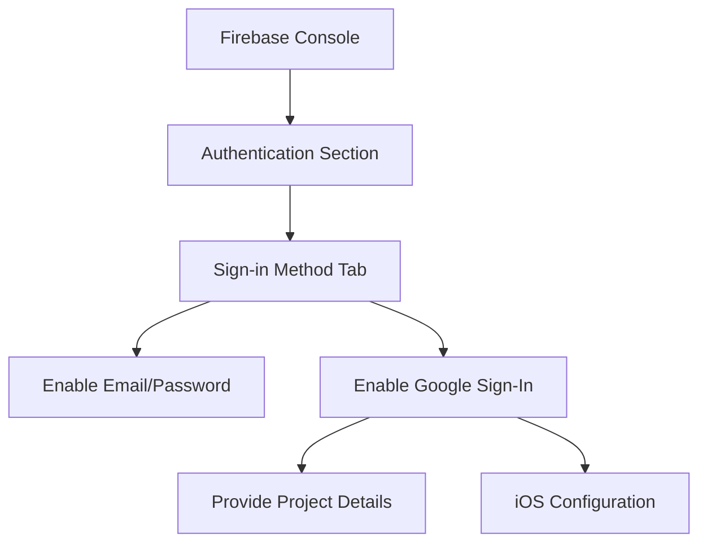

## 13.2.1 Setting Up Authentication Methods

In today's digital landscape, user authentication is a cornerstone of application security and user management. Firebase Authentication provides a robust, easy-to-integrate solution for authenticating users in your Flutter applications. This section will guide you through setting up various authentication methods using Firebase, including Email/Password and OAuth providers like Google and Facebook.

### Enabling Authentication Providers in Firebase Console

To begin, you need to enable the authentication providers you wish to use in your application. This process involves configuring settings in the Firebase console, which acts as the central hub for managing your app's authentication methods.

#### Navigate to Authentication Section

1. **Access Firebase Console:**
   - Open your web browser and navigate to the [Firebase Console](https://console.firebase.google.com/).
   - Select your project from the list or create a new one if you haven't already.

2. **Select Authentication:**
   - In the left sidebar, click on **Authentication**. This will take you to the authentication dashboard where you can manage sign-in methods and view user data.

#### Set Up Sign-In Methods

Once you're in the Authentication section, you can enable various sign-in methods. Let's start with the most common method: Email/Password authentication.

##### Email/Password Authentication

1. **Access Sign-In Method Tab:**
   - Click on the **"Sign-in method"** tab at the top of the page.

2. **Enable Email/Password:**
   - Find **Email/Password** in the list of sign-in providers.
   - Click on it to open the configuration panel.
   - Toggle the **Enable** switch to activate this method.
   - Click **Save** to apply your changes.

By enabling Email/Password authentication, you allow users to register and log in using their email addresses and passwords. This method is straightforward and widely used, making it a great starting point for most applications.

##### Other Providers

Firebase supports a variety of other authentication providers, including Google, Facebook, and Apple. Each provider requires additional setup steps, which are outlined in the Firebase documentation. Here, we'll provide an overview of enabling Google Sign-In as an example.

###### Google Sign-In Example

1. **Enable Google Sign-In:**
   - In the **Sign-in method** tab, locate **Google** in the list of providers.
   - Click on it to open the configuration panel.
   - Toggle the **Enable** switch to activate Google Sign-In.

2. **Provide Project Details:**
   - Enter the necessary project details, such as your app's OAuth 2.0 Client ID and Client Secret. These can be obtained from the Google Cloud Console.

3. **iOS Configuration:**
   - For iOS applications, you need to provide the `REVERSED_CLIENT_ID` found in your `GoogleService-Info.plist` file. This step is crucial for ensuring that your app can handle Google Sign-In correctly on iOS devices.

For other providers like Facebook and Apple, you will need to follow similar steps, ensuring that you configure any required OAuth redirect URIs and obtain necessary credentials from the respective developer consoles.

### Configuring OAuth Providers (Optional)

For applications that require social login capabilities, configuring OAuth providers like Facebook and Apple can enhance user experience by allowing users to sign in using their existing accounts.

#### Facebook Authentication Setup

1. **Create a Facebook App:**
   - Visit the [Facebook for Developers](https://developers.facebook.com/) site and create a new app.
   - Obtain your App ID and App Secret, which are necessary for integrating Facebook authentication.

2. **Configure OAuth Redirect URIs:**
   - In the Firebase console, ensure that your OAuth redirect URIs are correctly set up. This ensures that users are redirected back to your app after successful authentication.

#### Apple Sign-In Setup

1. **Apple Developer Account:**
   - Sign in to your Apple Developer account and configure your app for Apple Sign-In.
   - This process involves setting up your app's identifiers and configuring the necessary capabilities.

2. **Additional Configuration:**
   - Apple Sign-In requires specific configurations in your Xcode project, such as enabling the Sign In with Apple capability and configuring your app's entitlements.

### Best Practices

When setting up authentication methods, it's crucial to follow best practices to ensure security and reliability.

#### Security

- **Secure API Keys and Secrets:**
  - Never expose your API keys and secrets in your client-side code. Use environment variables or secure storage solutions to manage these credentials.

- **Use HTTPS:**
  - Ensure that all communication between your app and Firebase is conducted over HTTPS to protect user data from interception.

#### Testing

- **Thorough Testing:**
  - Test each authentication method thoroughly to ensure that it works as expected across different devices and platforms.
  - Consider edge cases, such as network failures or incorrect credentials, and handle them gracefully in your app.

### Visual Aids

To assist you in the setup process, here are some visual aids that illustrate the steps involved in enabling authentication providers in the Firebase console.

This diagram provides a high-level overview of the steps involved in setting up authentication methods in Firebase.

### Conclusion

Setting up authentication methods in Firebase is a critical step in securing your Flutter applications and providing a seamless user experience. By following the steps outlined in this guide, you can enable various authentication providers and ensure that your app is ready to handle user sign-ins securely and efficiently.

For more detailed instructions on configuring specific providers, refer to the [Firebase Authentication Documentation](https://firebase.google.com/docs/auth). Additionally, consider exploring other authentication methods and best practices to enhance your app's security and user experience.

## Quiz Time!



### What is the first step to enable authentication providers in Firebase?

- [x] Navigate to the Authentication section in the Firebase console.
- [ ] Create a new Firebase project.
- [ ] Enable Google Sign-In.
- [ ] Configure OAuth redirect URIs.

> **Explanation:** The first step is to navigate to the Authentication section in the Firebase console, where you can manage sign-in methods.

### How do you enable Email/Password authentication in Firebase?

- [x] Toggle the Enable switch in the Email/Password configuration panel.
- [ ] Enter the OAuth 2.0 Client ID and Client Secret.
- [ ] Provide the REVERSED_CLIENT_ID for iOS.
- [ ] Set up a Facebook app and obtain an App ID.

> **Explanation:** To enable Email/Password authentication, you need to toggle the Enable switch in the Email/Password configuration panel.

### What additional information is required for Google Sign-In on iOS?

- [x] REVERSED_CLIENT_ID from GoogleService-Info.plist.
- [ ] OAuth 2.0 Client Secret.
- [ ] Facebook App Secret.
- [ ] Apple Developer Account ID.

> **Explanation:** For iOS, you need to provide the REVERSED_CLIENT_ID from the GoogleService-Info.plist file to configure Google Sign-In.

### What is a best practice for securing API keys and secrets?

- [x] Use environment variables or secure storage solutions.
- [ ] Expose them in client-side code.
- [ ] Share them in public repositories.
- [ ] Store them in plain text files.

> **Explanation:** It's best to use environment variables or secure storage solutions to manage API keys and secrets securely.

### Which of the following is a recommended testing practice for authentication methods?

- [x] Test each method thoroughly across different devices.
- [ ] Only test on Android devices.
- [ ] Skip testing for OAuth providers.
- [ ] Test only with correct credentials.

> **Explanation:** Thorough testing across different devices ensures that authentication methods work as expected in various scenarios.

### What is required to set up Facebook authentication?

- [x] Create a Facebook app and obtain an App ID and App Secret.
- [ ] Provide the REVERSED_CLIENT_ID.
- [ ] Configure the Apple Developer account.
- [ ] Enable Email/Password authentication.

> **Explanation:** To set up Facebook authentication, you need to create a Facebook app and obtain an App ID and App Secret.

### What should you ensure when communicating between your app and Firebase?

- [x] Use HTTPS for secure communication.
- [ ] Use HTTP for faster communication.
- [ ] Disable encryption for performance.
- [ ] Use plain text for data transmission.

> **Explanation:** Using HTTPS ensures that all communication between your app and Firebase is secure.

### What is the purpose of configuring OAuth redirect URIs?

- [x] To redirect users back to your app after authentication.
- [ ] To store user credentials securely.
- [ ] To enable Email/Password authentication.
- [ ] To configure the Apple Developer account.

> **Explanation:** OAuth redirect URIs are used to redirect users back to your app after successful authentication.

### Which diagram tool is used in this guide to illustrate the setup process?

- [x] Mermaid.js
- [ ] UML
- [ ] Visio
- [ ] Lucidchart

> **Explanation:** Mermaid.js is used to create diagrams in this guide, providing a visual representation of the setup process.

### True or False: It's important to test authentication methods only on the platform you initially develop for.

- [ ] True
- [x] False

> **Explanation:** It's important to test authentication methods across all platforms your app supports to ensure consistent functionality.


