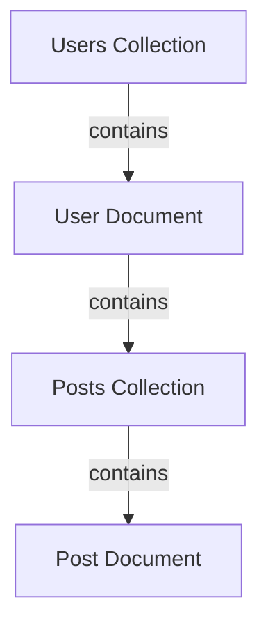

## 13.3.1 Introduction to Firestore

In the realm of modern app development, managing data efficiently and effectively is crucial. Firebase's Cloud Firestore offers a robust solution for developers seeking a flexible, scalable, and real-time database. This section delves into the intricacies of Cloud Firestore, providing a comprehensive understanding of its data model, key features, and practical applications.

### Understanding Cloud Firestore

#### Definition

Cloud Firestore is a NoSQL cloud database provided by Firebase, designed to store and sync data for client- and server-side development. Unlike traditional SQL databases, which use tables and rows, Firestore employs a more flexible data model that allows for hierarchical data structures. This flexibility makes it an ideal choice for applications that require real-time updates and offline capabilities.

#### Data Model

At the core of Firestore's architecture is its unique data model, which organizes data into collections and documents.

- **Collections:**
  - Collections are akin to tables in a SQL database. They serve as containers for documents and can hold any number of documents. Each collection can have subcollections, allowing for a nested data structure that can represent complex relationships.
  
- **Documents:**
  - Documents are the fundamental building blocks of Firestore. They are key-value pairs, similar to JSON objects, and can contain various data types, including strings, numbers, booleans, arrays, and even other documents as subcollections. Each document is identified by a unique ID within its collection.

To visualize this structure, consider the following diagram:

In this diagram, the `Users Collection` contains `User Documents`, each of which can have a `Posts Collection` containing `Post Documents`. This hierarchical structure allows for a flexible and organized way to manage data.

### Key Features of Cloud Firestore

Firestore is packed with features that make it a powerful tool for developers. Here are some of its most notable capabilities:

#### Real-time Updates

One of Firestore's standout features is its ability to provide real-time updates. By setting up listeners on documents or collections, applications can receive immediate notifications when data changes. This is particularly useful for applications that require live data feeds, such as chat apps or collaborative tools.

#### Offline Support

Firestore's offline capabilities are a game-changer for mobile and web applications. It caches data locally on the device, allowing users to access and modify data even without an internet connection. Once connectivity is restored, Firestore automatically synchronizes the local changes with the server, ensuring data consistency.

#### Scalability

Firestore is designed to scale automatically to accommodate large datasets and high traffic. This means developers can focus on building their applications without worrying about the underlying infrastructure. Whether you're handling a few users or millions, Firestore can adjust to meet your needs.

#### Flexible Querying

Firestore offers powerful querying capabilities that allow developers to retrieve data efficiently. It supports compound queries, range filters, and sorting, enabling complex data retrieval operations. For instance, you can query a collection to find documents that match multiple criteria, sort results by a specific field, or filter data based on a range of values.

### Visual Aids

To better understand Firestore's data structure, refer to the diagram provided earlier. This visual representation helps illustrate how collections and documents are organized, making it easier to conceptualize how data is stored and accessed.

### Foundational Knowledge

Before diving deeper into Firestore, it's essential to grasp the basics of NoSQL databases. Unlike SQL databases, which are structured and rigid, NoSQL databases like Firestore offer flexibility and scalability. They are particularly suited for applications with dynamic or unstructured data, where the schema may evolve over time.

To relate Firestore's data model to familiar concepts, consider the analogy of a JSON object. Just as JSON objects can contain nested objects and arrays, Firestore documents can contain subcollections and various data types. This similarity makes it easier for developers to transition from JSON-based data handling to Firestore's document-based model.

### Engaging Examples

To illustrate Firestore's practical applications, let's explore a few real-world scenarios where it shines:

- **Social Media App:**
  - In a social media application, Firestore can manage user profiles, posts, comments, and likes. The real-time update feature ensures that users see the latest content without refreshing the app.

- **E-commerce Platform:**
  - For an e-commerce platform, Firestore can handle product catalogs, user orders, and inventory management. Its scalability ensures that the platform can handle spikes in traffic during sales or promotions.

- **Collaborative Tools:**
  - In collaborative tools like document editors or project management apps, Firestore's real-time capabilities enable multiple users to work on the same document simultaneously, with changes reflected instantly.

### Conclusion

Cloud Firestore is a versatile and powerful database solution that caters to the needs of modern applications. Its flexible data model, real-time updates, offline support, and scalability make it an ideal choice for developers building dynamic and interactive applications. By understanding its core concepts and features, you can leverage Firestore to create robust and efficient applications that meet the demands of today's users.

As you continue your journey with Firestore, consider exploring its integration with other Firebase services, such as Firebase Authentication and Firebase Storage, to build comprehensive and feature-rich applications.

## Quiz Time!



### What is Cloud Firestore?

- [x] A flexible, scalable NoSQL cloud database provided by Firebase.
- [ ] A SQL-based database system.
- [ ] A local database solution for mobile apps.
- [ ] A file storage service.

> **Explanation:** Cloud Firestore is a NoSQL cloud database offered by Firebase, designed for flexible and scalable data management.

### How does Firestore organize its data?

- [x] Collections and documents.
- [ ] Tables and rows.
- [ ] Files and folders.
- [ ] Arrays and objects.

> **Explanation:** Firestore uses collections and documents to organize data, similar to JSON objects.

### What feature allows Firestore to provide real-time updates?

- [x] Listeners.
- [ ] Polling.
- [ ] Batch processing.
- [ ] Scheduled tasks.

> **Explanation:** Firestore uses listeners to provide real-time updates when data changes.

### How does Firestore handle offline access?

- [x] It caches data locally and synchronizes when connectivity is restored.
- [ ] It requires a constant internet connection.
- [ ] It uses a local database for offline access.
- [ ] It does not support offline access.

> **Explanation:** Firestore caches data locally, allowing offline access and synchronization when connectivity is restored.

### What type of queries does Firestore support?

- [x] Compound queries, range filters, and sorting.
- [ ] Only basic queries.
- [ ] Only SQL-like queries.
- [ ] Only full-text search queries.

> **Explanation:** Firestore supports compound queries, range filters, and sorting for flexible data retrieval.

### Which of the following is a key feature of Firestore?

- [x] Scalability.
- [ ] Manual data synchronization.
- [ ] Fixed schema.
- [ ] Limited data types.

> **Explanation:** Firestore is designed to scale automatically, handling large datasets and high traffic.

### What analogy can help understand Firestore's data model?

- [x] JSON objects.
- [ ] XML files.
- [ ] SQL tables.
- [ ] CSV files.

> **Explanation:** Firestore's data model is similar to JSON objects, with documents containing key-value pairs.

### In what scenario is Firestore an ideal solution?

- [x] Applications requiring real-time updates and offline capabilities.
- [ ] Applications with static data requirements.
- [ ] Applications that do not require scalability.
- [ ] Applications with fixed schemas.

> **Explanation:** Firestore is ideal for applications needing real-time updates and offline capabilities.

### What is a document in Firestore?

- [x] A key-value pair structure that can contain subcollections.
- [ ] A table in a SQL database.
- [ ] A file stored in the cloud.
- [ ] A static HTML page.

> **Explanation:** A document in Firestore is a key-value pair structure that can contain subcollections.

### True or False: Firestore requires manual scaling to handle large datasets.

- [ ] True
- [x] False

> **Explanation:** Firestore automatically scales to handle large datasets and high traffic.


