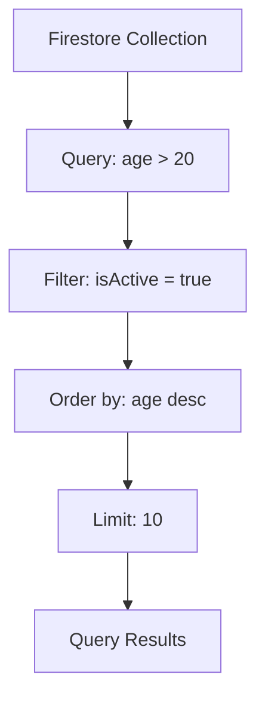

## 13.3.3 Querying Data

In the realm of modern app development, efficient data retrieval is paramount to delivering seamless user experiences. Cloud Firestore, a scalable and flexible NoSQL database from Firebase, offers robust querying capabilities that allow developers to fetch data efficiently. This section delves into the art of querying data in Cloud Firestore using Flutter, covering everything from basic queries to advanced techniques like pagination and real-time listeners. By the end of this chapter, you'll be equipped with the knowledge to harness Firestore's querying power to build responsive and dynamic applications.

### Basic Queries

Firestore queries are designed to be expressive and efficient, allowing you to retrieve data based on specific conditions. Let's start with the basics.

#### Simple Queries

A simple query in Firestore involves fetching documents from a collection based on a single condition. For instance, if you want to retrieve users older than 20 years, you can use the following query:

```dart
Future<void> getUsersByAge() async {
  QuerySnapshot querySnapshot = await users.where('age', isGreaterThan: 20).get();
  final filteredUsers = querySnapshot.docs.map((doc) => doc.data()).toList();
  print('Filtered Users: $filteredUsers');
}
```

In this example, the `where` method is used to filter documents where the `age` field is greater than 20. The `get` method executes the query and returns a `QuerySnapshot`, which contains the matching documents.

### Compound Queries

Firestore supports compound queries, allowing you to combine multiple conditions using logical `AND` clauses. This is particularly useful when you need to filter data based on several criteria.

#### Combining Multiple Conditions

You can combine up to 30 `AND` conditions in a single query. Here's an example of a compound query that retrieves active users older than 20:

```dart
Future<void> getSpecificUsers() async {
  QuerySnapshot querySnapshot = await users
      .where('age', isGreaterThan: 20)
      .where('isActive', isEqualTo: true)
      .get();
  // Process results
}
```

This query filters users based on two conditions: `age` greater than 20 and `isActive` equal to `true`. Firestore processes these conditions efficiently, ensuring that only the relevant documents are retrieved.

### Ordering and Limiting Results

When dealing with large datasets, it's often necessary to sort and limit the results to improve performance and user experience.

#### Sorting

Firestore allows you to order query results based on a specified field. For example, to sort users by age in descending order:

```dart
QuerySnapshot querySnapshot = await users.orderBy('age', descending: true).get();
```

The `orderBy` method sorts the documents by the specified field, and the `descending` parameter determines the sort order.

#### Limiting

To restrict the number of documents returned by a query, use the `limit` method. This is useful for implementing features like "load more" or "infinite scroll":

```dart
QuerySnapshot querySnapshot = await users.limit(10).get();
```

This query retrieves only the first 10 documents, reducing the amount of data transferred and processed.

### Pagination

For applications that handle large datasets, pagination is essential to manage data efficiently. Firestore provides methods like `startAfter` and `endBefore` to paginate query results.

#### Using StartAfter and EndBefore

Pagination involves dividing data into discrete pages. Here's how you can implement pagination using `startAfter`:

```dart
Future<void> getNextPage(DocumentSnapshot lastDocument) async {
  QuerySnapshot querySnapshot = await users
      .orderBy('age')
      .startAfterDocument(lastDocument)
      .limit(10)
      .get();
  // Process the next page of results
}
```

In this example, `startAfterDocument` is used to fetch the next set of documents after the last document of the previous page. This approach ensures smooth and efficient data loading.

### Real-Time Listeners

One of Firestore's standout features is its ability to provide real-time updates. By setting up listeners, your application can respond to changes in the database as they occur.

#### Setting Up a Listener

To listen for real-time updates, use the `snapshots` method, which returns a stream of `QuerySnapshot` objects:

```dart
users.snapshots().listen((QuerySnapshot snapshot) {
  // Respond to changes
  snapshot.docs.forEach((doc) {
    print(doc.data());
  });
});
```

This listener automatically triggers whenever data in the `users` collection changes, allowing your app to update the UI in real-time.

### Example Diversity

Firestore's querying capabilities are versatile, supporting a wide range of use cases. Here are some additional examples:

- **Range Queries:** Retrieve documents within a specific range, such as users aged between 20 and 30.
- **Text Search:** Use Firestore's full-text search capabilities to find documents containing specific keywords.
- **Geospatial Queries:** Combine Firestore with geospatial libraries to query documents based on location.

### Optimization Considerations

Efficient querying is crucial for performance. Here are some tips to optimize your Firestore queries:

- **Indexing:** Firestore automatically indexes fields used in queries. However, certain queries may require composite indexes, which you can define in the Firebase console.
- **Query Limits:** Be mindful of Firestore's query limits, such as the maximum number of `AND` conditions and the maximum result size.
- **Data Structure:** Design your data model to minimize the need for complex queries. Denormalization and data duplication can sometimes improve performance.

### Visual Aids

To better understand how Firestore queries filter and sort data, consider the following diagram:



This diagram illustrates a typical query flow, from the initial collection to the final filtered and sorted results.

### Conclusion

Querying data in Cloud Firestore is a powerful feature that enables developers to build responsive and dynamic applications. By mastering basic and compound queries, ordering, limiting, pagination, and real-time listeners, you can efficiently retrieve and manage data in your Flutter apps. Remember to consider optimization strategies, such as indexing and data structuring, to ensure optimal performance.

For further exploration, refer to the official [Firestore documentation](https://firebase.google.com/docs/firestore) and consider experimenting with different query scenarios in your projects.

## Quiz Time!



### What is the maximum number of logical `AND` clauses you can use in a Firestore compound query?

- [x] 30
- [ ] 10
- [ ] 50
- [ ] 100

> **Explanation:** Firestore supports up to 30 logical `AND` clauses in a compound query.

### Which method is used to sort query results in Firestore?

- [ ] limit
- [x] orderBy
- [ ] where
- [ ] startAfter

> **Explanation:** The `orderBy` method is used to sort query results based on a specified field.

### How can you limit the number of documents returned by a Firestore query?

- [ ] orderBy
- [ ] where
- [x] limit
- [ ] startAfter

> **Explanation:** The `limit` method restricts the number of documents returned by a query.

### What method is used to paginate Firestore query results?

- [ ] orderBy
- [ ] where
- [ ] limit
- [x] startAfter

> **Explanation:** The `startAfter` method is used to paginate query results by fetching documents after a specified document.

### How does Firestore provide real-time updates to your application?

- [ ] By using the get method
- [x] By using the snapshots method
- [ ] By using the limit method
- [ ] By using the orderBy method

> **Explanation:** The `snapshots` method returns a stream of real-time updates from Firestore.

### What is required for certain Firestore queries that involve multiple fields?

- [ ] More memory
- [ ] Additional servers
- [x] Composite indexes
- [ ] More network bandwidth

> **Explanation:** Certain queries involving multiple fields may require composite indexes for efficient execution.

### Which of the following is a best practice for optimizing Firestore queries?

- [x] Designing a suitable data structure
- [ ] Using as many `AND` clauses as possible
- [ ] Avoiding indexing
- [ ] Fetching all documents at once

> **Explanation:** Designing a suitable data structure helps optimize queries by reducing complexity.

### What is the purpose of the `where` method in Firestore queries?

- [ ] To sort results
- [x] To filter documents based on conditions
- [ ] To limit the number of results
- [ ] To paginate results

> **Explanation:** The `where` method filters documents based on specified conditions.

### True or False: Firestore automatically indexes all fields used in queries.

- [x] True
- [ ] False

> **Explanation:** Firestore automatically indexes fields used in queries, but some queries may require additional composite indexes.

### Which method is used to listen for real-time updates in Firestore?

- [ ] get
- [ ] limit
- [x] snapshots
- [ ] orderBy

> **Explanation:** The `snapshots` method is used to listen for real-time updates in Firestore.


