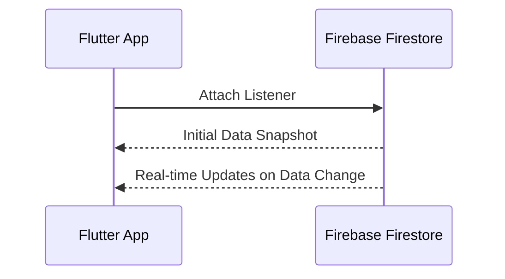

## 13.3.4 Real-time Updates with Firebase Firestore

In the ever-evolving landscape of mobile applications, providing users with real-time data is not just a luxury but often a necessity. Whether it's a chat application, a live dashboard, or collaborative editing software, real-time updates can significantly enhance user engagement and satisfaction. Firebase Firestore, a scalable NoSQL cloud database, offers robust support for real-time data synchronization, making it an ideal choice for developers looking to implement live updates in their Flutter applications.

### Understanding Real-time Updates

Firestore's real-time capabilities allow applications to listen for changes in data as they occur, without the need for manual refreshes or polling. This is achieved through snapshot listeners that can be attached to documents or collections. When data changes, the listeners are triggered, providing the latest data instantly to the application. This seamless flow of information ensures that users always have access to the most current data, enhancing the overall user experience.

#### How Real-time Updates Work

At its core, Firestore's real-time updates rely on a publish-subscribe model. When a listener is attached to a document or collection, it subscribes to changes in that data. Firestore then pushes updates to the client whenever the data changes, ensuring minimal latency and efficient data delivery.



### Implementing Listeners

Firestore provides two primary types of listeners: document snapshot listeners and collection snapshot listeners. Each serves a specific purpose and can be used depending on the granularity of data updates required.

#### Document Snapshot Listener

A document snapshot listener is used to listen for changes to a specific document. This is particularly useful when you need to track updates to a single entity, such as a user's profile or a specific item in a database.

```dart
import 'package:cloud_firestore/cloud_firestore.dart';

void listenToDocument(String userId) {
  FirebaseFirestore.instance.collection('users').doc(userId).snapshots().listen((DocumentSnapshot document) {
    if (document.exists) {
      print('Current Data: ${document.data()}');
    } else {
      print('Document does not exist');
    }
  });
}
```

In this example, the listener is attached to a document with a specific `userId`. Whenever the document is updated, the listener retrieves the latest data and prints it to the console.

#### Collection Snapshot Listener

A collection snapshot listener is used to listen for changes across an entire collection. This is ideal for scenarios where you need to monitor multiple documents, such as a list of users or messages in a chat application.

```dart
import 'package:cloud_firestore/cloud_firestore.dart';

void listenToCollection() {
  FirebaseFirestore.instance.collection('users').snapshots().listen((QuerySnapshot snapshot) {
    for (var change in snapshot.docChanges) {
      if (change.type == DocumentChangeType.added) {
        print('New User: ${change.doc.data()}');
      } else if (change.type == DocumentChangeType.modified) {
        print('Modified User: ${change.doc.data()}');
      } else if (change.type == DocumentChangeType.removed) {
        print('Removed User: ${change.doc.data()}');
      }
    }
  });
}
```

This listener tracks changes to the entire `users` collection, printing messages to the console whenever a document is added, modified, or removed.

### Use Cases for Real-time Data

Real-time updates are invaluable in a variety of applications, providing users with immediate access to the latest information. Here are some common use cases:

- **Chat Applications:** Real-time updates ensure that users receive messages instantly, creating a seamless communication experience.
- **Collaborative Editing:** Multiple users can work on the same document simultaneously, with changes reflected in real-time for all participants.
- **Live Dashboards:** Data-driven applications can display up-to-the-minute analytics and metrics, allowing users to make informed decisions quickly.

### Managing Listener Subscriptions

While real-time updates offer numerous benefits, it's crucial to manage listener subscriptions effectively to prevent memory leaks and optimize resource usage.

#### Cancelling Listeners

Listeners consume resources, and failing to cancel them when they're no longer needed can lead to memory leaks and increased bandwidth usage. It's essential to cancel subscriptions when the data is no longer required, such as when a user navigates away from a screen.

```dart
import 'dart:async';
import 'package:cloud_firestore/cloud_firestore.dart';

StreamSubscription? subscription;

void startListening() {
  subscription = FirebaseFirestore.instance.collection('users').snapshots().listen((snapshot) {
    // Handle snapshot data
  });
}

void stopListening() {
  subscription?.cancel();
}
```

In this example, the `subscription` is stored in a variable, allowing it to be cancelled when the listener is no longer needed.

### Practical Examples

Consider a scenario where a real-time update enhances user experience: a collaborative task management app. Users can create, update, and delete tasks, with changes reflected instantly across all devices. This real-time synchronization ensures that all team members are on the same page, improving collaboration and productivity.

### Performance Considerations

While real-time updates provide significant advantages, they can also impact performance, particularly in terms of bandwidth and battery life. Here are some considerations to keep in mind:

- **Bandwidth Usage:** Frequent updates can consume significant bandwidth, especially in data-intensive applications. It's essential to balance real-time needs with network efficiency.
- **Battery Life:** Continuous data synchronization can drain battery life, particularly on mobile devices. Consider implementing strategies to minimize updates when the app is in the background or when the device is on low power.

### Best Practices

To make the most of Firestore's real-time capabilities, consider the following best practices:

- **Unsubscribe When Not Needed:** Always unsubscribe from listeners when the data is no longer required to conserve resources.
- **Optimize Data Structure:** Design your Firestore data structure to minimize the amount of data transferred during updates.
- **Use Batched Writes:** When making multiple updates, use batched writes to reduce the number of network calls.
- **Monitor Performance:** Regularly monitor your app's performance to identify and address any issues related to real-time updates.

### Conclusion

Real-time updates with Firebase Firestore offer a powerful way to enhance user experience by providing instant access to the latest data. By implementing document and collection snapshot listeners, developers can create dynamic, responsive applications that keep users engaged. However, it's essential to manage listener subscriptions carefully and consider the impact on performance to ensure a seamless and efficient user experience.

For further exploration, consider diving into Firebase's official documentation and experimenting with real-time updates in your own projects. By mastering these techniques, you'll be well-equipped to build cutting-edge applications that meet the demands of today's users.

## Quiz Time!



### What is the primary benefit of using real-time updates in applications?

- [x] Provides users with instant access to the latest data
- [ ] Reduces the need for data storage
- [ ] Increases application load time
- [ ] Simplifies application architecture

> **Explanation:** Real-time updates ensure that users have immediate access to the most current data, enhancing user engagement and satisfaction.

### Which Firestore listener is used to track changes to a specific document?

- [x] Document Snapshot Listener
- [ ] Collection Snapshot Listener
- [ ] Query Listener
- [ ] Data Change Listener

> **Explanation:** A Document Snapshot Listener is used to listen for changes to a specific document in Firestore.

### How can you prevent memory leaks when using listeners in Firestore?

- [x] Cancel subscriptions when they are no longer needed
- [ ] Use more listeners
- [ ] Increase the app's memory allocation
- [ ] Disable real-time updates

> **Explanation:** To prevent memory leaks, it's crucial to cancel listener subscriptions when they are no longer needed.

### What is a common use case for real-time updates?

- [x] Chat applications
- [ ] Static websites
- [ ] Offline games
- [ ] Batch processing

> **Explanation:** Real-time updates are commonly used in chat applications to ensure messages are delivered instantly.

### What is the impact of real-time updates on bandwidth usage?

- [x] Can increase bandwidth usage
- [ ] Reduces bandwidth usage
- [ ] Has no impact on bandwidth
- [ ] Only affects bandwidth on Wi-Fi

> **Explanation:** Real-time updates can increase bandwidth usage due to frequent data synchronization.

### What should you do to optimize battery life when using real-time updates?

- [x] Minimize updates when the app is in the background
- [ ] Increase the device's screen brightness
- [ ] Use more listeners
- [ ] Disable all network connections

> **Explanation:** Minimizing updates when the app is in the background can help conserve battery life.

### Which of the following is a best practice when using Firestore listeners?

- [x] Unsubscribe from listeners when not needed
- [ ] Use as many listeners as possible
- [ ] Avoid using listeners altogether
- [ ] Only use listeners on Wi-Fi

> **Explanation:** Unsubscribing from listeners when they are not needed helps conserve resources and prevent memory leaks.

### What is the purpose of using batched writes in Firestore?

- [x] To reduce the number of network calls
- [ ] To increase the number of network calls
- [ ] To simplify data structure
- [ ] To disable real-time updates

> **Explanation:** Batched writes help reduce the number of network calls by grouping multiple updates into a single request.

### How does Firestore deliver real-time updates to the client?

- [x] By pushing updates whenever data changes
- [ ] By polling the server every minute
- [ ] By sending updates once a day
- [ ] By requiring manual refreshes

> **Explanation:** Firestore pushes updates to the client whenever data changes, ensuring minimal latency.

### True or False: Real-time updates can be used to enhance collaborative editing applications.

- [x] True
- [ ] False

> **Explanation:** Real-time updates are ideal for collaborative editing applications, allowing multiple users to see changes as they happen.


