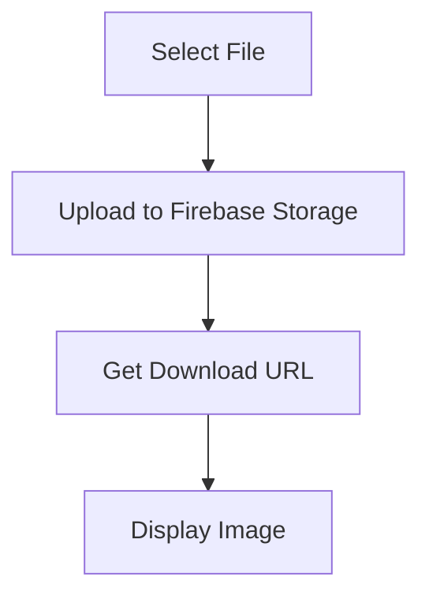

## 13.4.1 Using Firebase Storage

In this section, we delve into the integration of Firebase Storage within Flutter applications. Firebase Storage is a powerful, scalable solution for storing and serving user-generated content such as images, videos, and audio files. This guide will walk you through setting up Firebase Storage in your Flutter project, uploading and downloading files, and ensuring your data is secure.

### Understanding Firebase Storage

Firebase Storage is a cloud-based service that allows developers to store and serve large amounts of user-generated content. It is built on Google Cloud Storage, providing robust and scalable infrastructure. Firebase Storage is particularly useful for applications that require the storage of media files, such as social media apps, e-commerce platforms, and content-sharing services.

**Key Features of Firebase Storage:**

- **Scalability:** Automatically scales to handle large amounts of data and high traffic.
- **Security:** Integrates with Firebase Authentication to provide secure access to files.
- **Reliability:** Built on Google Cloud's infrastructure, ensuring high availability and durability.
- **Ease of Use:** Offers a simple API for uploading, downloading, and managing files.

### Setting Up `firebase_storage` Plugin

To use Firebase Storage in your Flutter project, you need to add the `firebase_storage` plugin to your project dependencies. This plugin provides the necessary tools to interact with Firebase Storage.

**Step-by-Step Setup:**

1. **Add Dependency:**

   Open your `pubspec.yaml` file and add the `firebase_storage` dependency:

   ```yaml
   dependencies:
     firebase_storage: ^10.0.0
   ```

2. **Install the Plugin:**

   Run the following command in your terminal to install the plugin:

   ```bash
   flutter pub get
   ```

3. **Configure Firebase:**

   Ensure that your Flutter project is configured with Firebase. This typically involves setting up a Firebase project, adding your app to the Firebase console, and downloading the `google-services.json` (for Android) or `GoogleService-Info.plist` (for iOS) files into your project.

### Uploading Files to Firebase Storage

Uploading files to Firebase Storage involves selecting a file from the user's device and then uploading it to a specified storage location.

#### Selecting a File

To allow users to select files, you can use packages like `image_picker` or `file_picker`. These packages provide a user-friendly interface for selecting files from the device's storage.

**Example using `image_picker`:**

```dart
import 'package:image_picker/image_picker.dart';

Future<void> selectFile() async {
  final picker = ImagePicker();
  final pickedFile = await picker.pickImage(source: ImageSource.gallery);

  if (pickedFile != null) {
    uploadFile(pickedFile.path);
  }
}
```

#### Uploading to Storage

Once you have the file path, you can upload the file to Firebase Storage using the following code:

```dart
import 'package:firebase_storage/firebase_storage.dart';
import 'dart:io';

Future<void> uploadFile(String filePath) async {
  File file = File(filePath);

  try {
    await FirebaseStorage.instance
        .ref('uploads/file-to-upload.png')
        .putFile(file);
  } on FirebaseException catch (e) {
    print('Error occurred while uploading: $e');
  }
}
```

**Explanation:**

- **File Reference:** The `ref` method specifies the path in Firebase Storage where the file will be stored.
- **putFile:** This method uploads the file to the specified reference.
- **Error Handling:** Use a try-catch block to handle any exceptions that may occur during the upload process.

### Downloading Files from Firebase Storage

Downloading files involves retrieving the file's URL from Firebase Storage and then using it to display or process the file.

#### Getting File URL

To download a file, you first need to get its URL:

```dart
Future<String> getFileURL() async {
  String downloadURL = await FirebaseStorage.instance
      .ref('uploads/file-to-upload.png')
      .getDownloadURL();
  return downloadURL;
}
```

#### Displaying Image

Once you have the download URL, you can display the image using Flutter's `Image.network` widget:

```dart
import 'package:flutter/material.dart';

Widget displayImage(String url) {
  return Image.network(url);
}
```

### Security Rules

Security is paramount when dealing with user-generated content. Firebase Storage integrates with Firebase Authentication, allowing you to set security rules that control access to your files.

**Best Practices for Security Rules:**

- **Restrict Access:** Only authenticated users should have access to upload or download files.
- **Validate File Types:** Ensure that only allowed file types are uploaded to prevent malicious content.
- **Limit File Size:** Set limits on the size of files that can be uploaded to prevent abuse.

**Example Security Rule:**

```json
service firebase.storage {
  match /b/{bucket}/o {
    match /uploads/{allPaths=**} {
      allow read, write: if request.auth != null;
    }
  }
}
```

### Error Handling

Proper error handling is crucial for a smooth user experience. Here are some common scenarios and how to handle them:

- **Network Errors:** Check for connectivity before attempting uploads or downloads.
- **Permission Denied:** Ensure users have the correct permissions and provide informative error messages.
- **File Not Found:** Handle cases where the file does not exist in storage.

**Example Error Handling:**

```dart
try {
  // Upload or download code
} on FirebaseException catch (e) {
  if (e.code == 'permission-denied') {
    print('User does not have permission to access this file.');
  } else if (e.code == 'network-error') {
    print('Network error occurred. Please try again later.');
  } else {
    print('An unknown error occurred: $e');
  }
}
```

### Visual Aids

To better understand the process of uploading and downloading files, consider the following flowchart:



**Explanation:**

- **Select File:** The user selects a file from their device.
- **Upload to Firebase Storage:** The file is uploaded to a specified path in Firebase Storage.
- **Get Download URL:** Retrieve the URL of the uploaded file.
- **Display Image:** Use the URL to display the image in the app.

### Conclusion

Firebase Storage is a powerful tool for managing user-generated content in your Flutter applications. By following the steps outlined in this guide, you can effectively integrate Firebase Storage, handle file uploads and downloads, and ensure your data is secure. Remember to always consider security best practices and handle errors gracefully to provide a seamless user experience.

For further exploration, consider diving into the official [Firebase Storage documentation](https://firebase.google.com/docs/storage) and exploring additional resources such as open-source projects and community forums.

## Quiz Time!



### What is Firebase Storage primarily used for?

- [x] Storing and serving user-generated content like images and videos
- [ ] Managing user authentication
- [ ] Hosting web applications
- [ ] Analyzing app performance

> **Explanation:** Firebase Storage is designed for storing and serving large amounts of user-generated content, such as images, videos, and audio files.

### Which package is used to integrate Firebase Storage in a Flutter project?

- [x] firebase_storage
- [ ] firebase_auth
- [ ] cloud_firestore
- [ ] firebase_analytics

> **Explanation:** The `firebase_storage` package is specifically used for integrating Firebase Storage into a Flutter project.

### How do you add the `firebase_storage` dependency to your Flutter project?

- [x] Add `firebase_storage: ^10.0.0` to the `pubspec.yaml` file
- [ ] Add `firebase_storage: ^10.0.0` to the `build.gradle` file
- [ ] Add `firebase_storage: ^10.0.0` to the `AndroidManifest.xml` file
- [ ] Add `firebase_storage: ^10.0.0` to the `Info.plist` file

> **Explanation:** To add the `firebase_storage` dependency, you need to include it in the `pubspec.yaml` file under dependencies.

### What method is used to upload a file to Firebase Storage?

- [x] putFile
- [ ] uploadFile
- [ ] sendFile
- [ ] storeFile

> **Explanation:** The `putFile` method is used to upload a file to a specified reference in Firebase Storage.

### How can you display an image from Firebase Storage in a Flutter app?

- [x] Use `Image.network(downloadURL)`
- [ ] Use `Image.asset(downloadURL)`
- [ ] Use `Image.file(downloadURL)`
- [ ] Use `Image.memory(downloadURL)`

> **Explanation:** To display an image from a URL, you use the `Image.network` widget in Flutter.

### What is a key consideration when setting security rules for Firebase Storage?

- [x] Ensuring only authenticated users can access files
- [ ] Allowing all users to access files
- [ ] Disabling security rules for easier access
- [ ] Using default settings without changes

> **Explanation:** Security rules should be set to ensure that only authenticated users can access files, protecting user data.

### Which package can be used to allow users to select files in a Flutter app?

- [x] image_picker
- [ ] firebase_auth
- [ ] cloud_firestore
- [ ] firebase_analytics

> **Explanation:** The `image_picker` package is commonly used to allow users to select images from their device's gallery or camera.

### What is the purpose of the `getDownloadURL` method in Firebase Storage?

- [x] To retrieve the URL of a stored file
- [ ] To upload a file to storage
- [ ] To delete a file from storage
- [ ] To update a file in storage

> **Explanation:** The `getDownloadURL` method is used to retrieve the URL of a file stored in Firebase Storage, which can then be used to access or display the file.

### What should you do if a `FirebaseException` occurs during file upload?

- [x] Handle the exception and provide informative error messages
- [ ] Ignore the exception and retry the upload
- [ ] Log the exception and continue without handling
- [ ] Terminate the app immediately

> **Explanation:** It's important to handle exceptions gracefully, providing informative error messages to the user and ensuring the app can recover from the error.

### True or False: Firebase Storage automatically scales to handle large amounts of data and high traffic.

- [x] True
- [ ] False

> **Explanation:** Firebase Storage is built on Google Cloud Storage, which automatically scales to handle large amounts of data and high traffic, ensuring reliability and performance.


