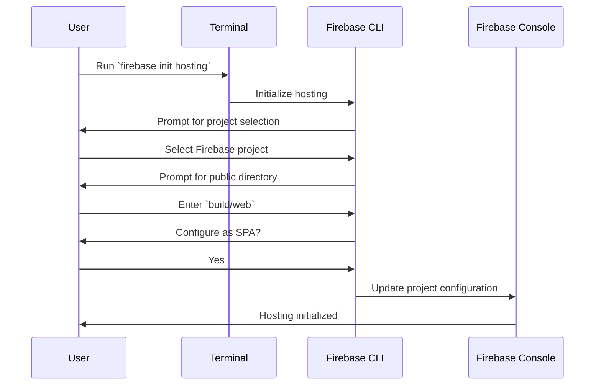
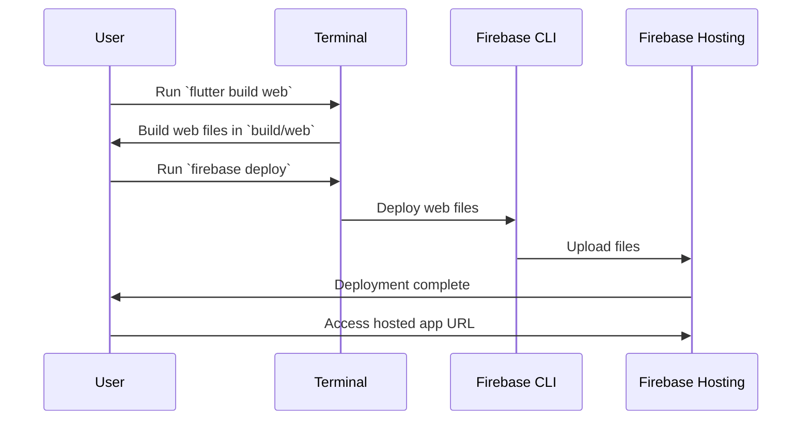

## 13.4.3 Firebase Hosting for Web Apps

In this section, we will explore how to deploy Flutter web applications using Firebase Hosting, a powerful and reliable platform for serving web content. Firebase Hosting provides a fast, secure, and scalable hosting solution, making it an excellent choice for developers looking to bring their web applications to a global audience. We will cover everything from setting up your environment to deploying your application, ensuring you have the knowledge and tools needed to succeed.

### Introduction to Firebase Hosting

Firebase Hosting is a production-grade web content hosting service offered by Google. It is designed to serve both static and dynamic content to users worldwide, providing fast and secure delivery of web applications. Firebase Hosting is particularly well-suited for single-page applications (SPAs) like those built with Flutter, as it supports features such as custom domains, SSL, and automatic scaling.

Key benefits of Firebase Hosting include:

- **Global Content Delivery:** Firebase Hosting uses a global content delivery network (CDN) to ensure fast load times for users around the world.
- **Secure Connections:** All content served by Firebase Hosting is delivered over HTTPS, ensuring secure connections.
- **Seamless Integration:** Firebase Hosting integrates seamlessly with other Firebase services, such as Cloud Functions and Firestore, allowing for dynamic content and backend logic.

### Setting Up for Flutter Web

Before deploying your Flutter web application to Firebase Hosting, you need to ensure that your development environment is properly configured. This involves enabling Flutter's web support and installing the necessary tools.

#### Prerequisites

To get started, make sure you have the following prerequisites:

- **Flutter SDK:** Ensure you have the latest version of the Flutter SDK installed. You can check your Flutter version by running `flutter --version` in your terminal.
- **Web Support:** Flutter's web support must be enabled. If you haven't already done so, enable it by running:
  ```bash
  flutter config --enable-web
  ```

#### Installing Firebase CLI

The Firebase Command Line Interface (CLI) is a powerful tool that allows you to interact with Firebase services directly from your terminal. To install the Firebase CLI, you need Node.js and npm (Node Package Manager) installed on your machine. Once you have these prerequisites, install the Firebase CLI globally by running:

```bash
npm install -g firebase-tools
```

This command installs the Firebase CLI, which you will use to initialize and deploy your project to Firebase Hosting.

#### Login to Firebase

Before you can deploy your application, you need to authenticate with Firebase using your Google account. Run the following command to log in:

```bash
firebase login
```

This command will open a browser window where you can log in to your Google account. Once logged in, the Firebase CLI will have the necessary permissions to manage your Firebase projects.

### Initializing Firebase Hosting

With your environment set up, the next step is to initialize Firebase Hosting for your Flutter web project. This involves configuring Firebase Hosting to serve your web application files.

#### In Project Directory

Navigate to the root directory of your Flutter project in your terminal. This is where you will initialize Firebase Hosting. Run the following command:

```bash
firebase init hosting
```

This command will start an interactive setup process. Follow the prompts to configure Firebase Hosting for your project.

#### Configuration Steps

During the initialization process, you will be prompted to make several configuration choices:

1. **Select Firebase Project:** Choose the Firebase project you want to associate with your web application. If you haven't created a Firebase project yet, you can do so in the Firebase Console.

2. **Set Public Directory:** When prompted for the public directory, enter `build/web`. This is the directory where Flutter outputs the built web files.

3. **Configure as Single-Page App:** You will be asked if you want to configure your app as a single-page app. Choose "Yes" to rewrite all URLs to `index.html`. This is important for handling client-side routing in SPAs.

4. **Configure Redirects and Error Handling:** It's a good practice to configure redirects and error handling in your `firebase.json` file. This ensures that users are directed to the correct pages and that errors are handled gracefully.

Here is an example of a basic `firebase.json` configuration:

```json
{
  "hosting": {
    "public": "build/web",
    "ignore": [
      "firebase.json",
      "**/.*",
      "**/node_modules/**"
    ],
    "rewrites": [
      {
        "source": "**",
        "destination": "/index.html"
      }
    ]
  }
}
```

### Building and Deploying

With Firebase Hosting initialized, you are ready to build and deploy your Flutter web application.

#### Build the Flutter Web App

First, build your Flutter web application by running the following command:

```bash
flutter build web
```

This command compiles your Flutter project into static web files, which are output to the `build/web` directory. These files include HTML, CSS, and JavaScript, which are necessary for your web application to run in a browser.

#### Deploy to Firebase Hosting

Once your web application is built, deploy it to Firebase Hosting using the following command:

```bash
firebase deploy
```

This command uploads your web files to Firebase Hosting and makes them publicly accessible. After deployment, you will receive a URL where your application is hosted. You can share this URL with users to access your web application.

### Best Practices for Firebase Hosting

When deploying your Flutter web application to Firebase Hosting, consider the following best practices:

- **Configure Proper Redirects:** Ensure that your `firebase.json` file includes appropriate redirects to handle client-side routing. This prevents users from encountering 404 errors when navigating directly to specific routes.

- **Error Handling:** Implement error handling in your application to provide users with meaningful feedback when something goes wrong. This can include custom error pages or messages.

- **Optimize Performance:** Use tools like Lighthouse to analyze and optimize the performance of your web application. This can help you identify areas for improvement, such as reducing load times or optimizing images.

- **Monitor Usage:** Use Firebase Analytics to monitor user interactions and gather insights into how your application is being used. This information can guide future improvements and feature development.

### Visual Aids

To enhance your understanding of the deployment process, here are some visual aids:

#### Firebase CLI Initialization



#### Deployment Process



### Conclusion

Deploying your Flutter web application to Firebase Hosting is a straightforward process that provides a robust platform for serving your web content. By following the steps outlined in this guide, you can ensure that your application is deployed efficiently and securely. Remember to follow best practices for redirects, error handling, and performance optimization to provide the best experience for your users.

For further exploration, consider diving into Firebase's documentation and exploring additional features such as Cloud Functions and Firestore integration. These services can enhance your web application by adding dynamic content and backend logic.

## Quiz Time!



### What is Firebase Hosting?

- [x] A production-grade web content hosting service
- [ ] A database service for storing user data
- [ ] A tool for building mobile applications
- [ ] A service for sending push notifications

> **Explanation:** Firebase Hosting is a service provided by Google for hosting web content, including static and dynamic web applications.

### What command is used to install the Firebase CLI?

- [x] `npm install -g firebase-tools`
- [ ] `flutter install firebase-cli`
- [ ] `apt-get install firebase-tools`
- [ ] `brew install firebase-cli`

> **Explanation:** The Firebase CLI is installed using npm with the command `npm install -g firebase-tools`.

### Which directory should be set as the public directory during Firebase Hosting initialization for a Flutter web app?

- [x] `build/web`
- [ ] `src/web`
- [ ] `public`
- [ ] `dist`

> **Explanation:** The `build/web` directory contains the compiled web files for a Flutter web application and should be set as the public directory.

### What command is used to build a Flutter web application?

- [x] `flutter build web`
- [ ] `flutter compile web`
- [ ] `flutter run web`
- [ ] `flutter deploy web`

> **Explanation:** The `flutter build web` command compiles the Flutter project into static web files.

### What is the purpose of configuring your app as a single-page app during Firebase Hosting setup?

- [x] To rewrite all URLs to `index.html` for client-side routing
- [ ] To enable server-side rendering
- [ ] To improve database performance
- [ ] To enhance security features

> **Explanation:** Configuring as a single-page app ensures that all URLs are rewritten to `index.html`, which is essential for handling client-side routing in SPAs.

### What command is used to deploy a Flutter web app to Firebase Hosting?

- [x] `firebase deploy`
- [ ] `firebase push`
- [ ] `firebase upload`
- [ ] `firebase publish`

> **Explanation:** The `firebase deploy` command uploads the web files to Firebase Hosting, making them publicly accessible.

### Why is it important to configure redirects in `firebase.json`?

- [x] To handle client-side routing and prevent 404 errors
- [ ] To improve database performance
- [ ] To enable server-side rendering
- [ ] To enhance security features

> **Explanation:** Configuring redirects in `firebase.json` helps manage client-side routing and prevents users from encountering 404 errors.

### What is a key benefit of using Firebase Hosting?

- [x] Global content delivery through a CDN
- [ ] Built-in database management
- [ ] Automatic code refactoring
- [ ] Integrated payment processing

> **Explanation:** Firebase Hosting uses a global CDN to ensure fast load times for users worldwide.

### How can you monitor user interactions in your Firebase-hosted web app?

- [x] Using Firebase Analytics
- [ ] By checking server logs
- [ ] Through manual user surveys
- [ ] By analyzing error reports

> **Explanation:** Firebase Analytics provides insights into user interactions and app usage, helping you monitor and improve your application.

### True or False: Firebase Hosting only supports static content.

- [ ] True
- [x] False

> **Explanation:** Firebase Hosting supports both static and dynamic content, making it suitable for a wide range of web applications.


