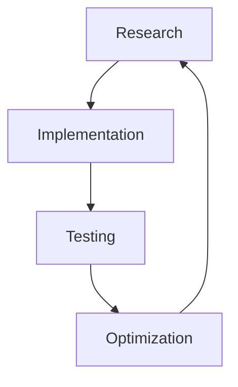

## 14.1.3 App Store Optimization (ASO)

In the competitive world of mobile applications, simply developing a great app is not enough. To ensure your Flutter app reaches its intended audience, App Store Optimization (ASO) is crucial. ASO involves optimizing various elements of your app's store listing to improve its visibility and conversion rate, ultimately leading to increased organic downloads. This section will guide you through the essential components of ASO, advanced strategies, common pitfalls to avoid, and practical tips to implement these strategies effectively.

### Understanding ASO

#### Definition

App Store Optimization is the process of enhancing the visibility of a mobile app in an app store, such as Google Play or Apple's App Store, with the aim of increasing organic downloads. It involves optimizing the app's metadata, visuals, and user engagement strategies to improve its ranking in search results and conversion rates.

#### Goal

The primary goal of ASO is to increase the app's organic downloads by:

- Ranking higher in app store search results.
- Converting more users who view the app's page into actual downloads.

### Key Components of ASO

#### Keyword Optimization

##### Research

Keyword optimization is a cornerstone of ASO. It involves identifying and using the right keywords that potential users might use to search for apps like yours. Here’s how you can effectively research and implement keywords:

- **Use ASO Tools:** Utilize tools like App Annie, Sensor Tower, or Mobile Action to discover high-traffic, low-competition keywords. These tools provide insights into keyword popularity and competition levels.
- **Analyze Competitor Keywords:** Study the keywords used by successful competitors. This can provide ideas for keywords you might have overlooked.

##### Implementation

Once you have a list of potential keywords, strategically incorporate them into your app's metadata:

- **App Title:** Include the most important keywords in the app title, as it has the most significant impact on search rankings.
- **Subtitle (iOS):** Use this space to highlight additional keywords and app features.
- **Description:** Weave keywords naturally into the app description to enhance discoverability without compromising readability.
- **Keyword Field (iOS):** Utilize this field to list additional keywords that are not in the title or subtitle.

#### Visual Assets

Visual elements play a crucial role in attracting users and conveying the app's value proposition.

##### Icon

Your app icon is the first visual element users see. It should be:

- **Eye-catching:** Use bold colors and simple designs to stand out.
- **Representative:** Ensure the icon reflects the app's purpose or brand.

##### Screenshots and Videos

Screenshots and videos are vital for showcasing your app's features and user interface.

- **Use Captions and Annotations:** Highlight key features and benefits with captions.
- **Order Effectively:** Place the most compelling screenshots first, as users often view only the first few images.

#### App Ratings and Reviews

User feedback significantly influences app store rankings and user decisions.

##### Encouraging Positive Reviews

- **In-App Prompts:** Implement prompts to ask for reviews at appropriate times, such as after a positive user interaction. Ensure these prompts comply with platform guidelines to avoid penalties.

##### Responding to Feedback

- **Engage with Users:** Respond to reviews, address concerns, and thank users for positive feedback. This shows that you value user input and are committed to improving the app.

#### Conversion Rate Optimization

##### A/B Testing

Experiment with different versions of your app's visual assets and metadata to determine what resonates best with users.

- **Test Variables:** Conduct A/B tests on app icons, screenshots, and descriptions to find the most effective combinations.

##### Analyzing Metrics

- **Monitor Performance:** Track metrics such as impressions, conversion rates, and retention rates to refine your ASO strategies.

### Advanced ASO Strategies

#### Localization

Expanding your app's reach by localizing its content can significantly boost downloads.

- **Translate Metadata:** Translate your app's title, description, and keywords into the languages of your target markets.
- **Adapt Visual Assets:** Modify screenshots and videos to align with cultural preferences and norms.

#### External Factors

##### Backlinks

- **Increase Visibility:** Gain backlinks from reputable websites to improve your app's authority and visibility in search results.

##### Social Media Presence

- **Drive Traffic:** Promote your app through social media channels to increase awareness and drive traffic to your app store listing.

### Avoiding ASO Pitfalls

#### Keyword Stuffing

Overloading your app's metadata with keywords can lead to penalties from app stores.

- **Maintain Balance:** Use keywords naturally and avoid excessive repetition.

#### Inaccurate Metadata

Misleading descriptions or images can result in negative reviews and store penalties.

- **Be Honest:** Ensure that all metadata accurately represents the app's features and functionality.

### Visual Aids

#### ASO Workflow Diagram

Below is a diagram depicting the iterative process of ASO, from research to optimization.

### Practical Tips

- **Regular Updates:** Keep your app updated with new features and improvements to maintain user interest and engagement.
- **Monitor Competitors:** Regularly analyze competitor apps to identify new trends and opportunities for improvement.
- **Leverage User Feedback:** Use feedback to guide updates and enhancements, ensuring the app meets user expectations.

### Use Case Studies

#### Successful ASO Example

Consider the case of a productivity app that improved its visibility through ASO:

- **Initial Challenge:** The app struggled with low visibility and downloads.
- **ASO Strategy:** The team conducted thorough keyword research, optimized visual assets, and localized the app for multiple regions.
- **Outcome:** The app saw a 150% increase in organic downloads within three months.

### Resource List

- **ASO Tools:** [App Annie](https://www.appannie.com/), [Sensor Tower](https://sensortower.com/), [Mobile Action](https://www.mobileaction.co/)
- **Further Reading:** [App Store Optimization Guide](https://developer.apple.com/app-store/optimization/), [Google Play ASO](https://play.google.com/store/apps/details?id=com.google.android.apps.playconsole)

By implementing these ASO strategies, you can significantly enhance your Flutter app's visibility and conversion rates, leading to increased downloads and user engagement.

## Quiz Time!



### What is the primary goal of App Store Optimization (ASO)?

- [x] To increase organic downloads by improving app visibility and conversion rates.
- [ ] To enhance the app's user interface design.
- [ ] To reduce the app's file size.
- [ ] To increase the app's development speed.

> **Explanation:** The primary goal of ASO is to increase organic downloads by improving the app's visibility in search results and its conversion rates.

### Which of the following is NOT a key component of ASO?

- [ ] Keyword Optimization
- [ ] Visual Assets
- [ ] App Ratings and Reviews
- [x] Code Refactoring

> **Explanation:** Code refactoring is not a component of ASO; it relates to improving the internal structure of the code without changing its external behavior.

### What is the purpose of using ASO tools like App Annie or Sensor Tower?

- [x] To find high-traffic, low-competition keywords.
- [ ] To design app icons.
- [ ] To write app descriptions.
- [ ] To test app performance.

> **Explanation:** ASO tools are used to discover keywords that can help improve an app's visibility in search results.

### Why is it important to localize your app's metadata?

- [x] To reach a broader audience by adapting to different languages and cultures.
- [ ] To reduce the app's loading time.
- [ ] To improve the app's security features.
- [ ] To increase the app's file size.

> **Explanation:** Localizing metadata helps reach a broader audience by making the app more accessible to users in different regions.

### What is a potential consequence of keyword stuffing in app metadata?

- [x] Penalties from app stores.
- [ ] Increased app performance.
- [ ] Improved user interface.
- [ ] Enhanced security features.

> **Explanation:** Keyword stuffing can lead to penalties from app stores, as it is considered a manipulative practice.

### How can A/B testing benefit your ASO strategy?

- [x] By identifying the most effective app icons, screenshots, and descriptions.
- [ ] By reducing the app's development time.
- [ ] By improving the app's security.
- [ ] By increasing the app's file size.

> **Explanation:** A/B testing helps identify which versions of app elements perform best, allowing for data-driven optimization decisions.

### What is the role of app ratings and reviews in ASO?

- [x] They influence app store rankings and user decisions.
- [ ] They determine the app's file size.
- [ ] They enhance the app's security features.
- [ ] They reduce the app's loading time.

> **Explanation:** App ratings and reviews significantly impact app store rankings and can influence potential users' decisions to download the app.

### Which visual asset is considered the first impression of your app?

- [x] App Icon
- [ ] App Description
- [ ] App Screenshots
- [ ] App Video

> **Explanation:** The app icon is often the first visual element users see and plays a crucial role in attracting their attention.

### What is the benefit of responding to user reviews?

- [x] It shows that you value user feedback and are committed to improving the app.
- [ ] It increases the app's file size.
- [ ] It enhances the app's security features.
- [ ] It reduces the app's loading time.

> **Explanation:** Responding to reviews demonstrates that you value user feedback, which can improve user satisfaction and app ratings.

### True or False: Misleading app descriptions can result in negative reviews and store penalties.

- [x] True
- [ ] False

> **Explanation:** Misleading descriptions can lead to user dissatisfaction, resulting in negative reviews and potential penalties from app stores.


