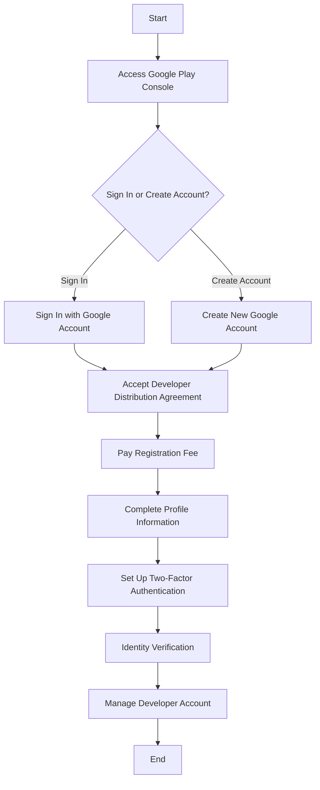

## 14.2.1 Creating a Google Play Developer Account

In this section, we will guide you through the process of creating a Google Play Developer Account, a crucial step for publishing your Flutter applications on the Google Play Store. This comprehensive guide will provide detailed instructions, best practices, and security tips to ensure a smooth setup process.

### Prerequisites

Before you begin, ensure you have the following:

- **Google Account:** A Google account dedicated to app development is essential. This account will be used to access the Google Play Console and manage your developer profile. If you don't have one, you can create a new Google account specifically for this purpose.

### Step-by-Step Account Creation

#### 1. Access Google Play Console

To start the process, navigate to the [Google Play Console](https://play.google.com/console). The Google Play Console is the platform where you will manage your app listings, track app performance, and access developer tools.

#### 2. Sign In or Create Account

- **Sign In:** If you already have a Google account, sign in using your credentials.
- **Create Account:** If you don't have a Google account, click on the option to create a new account. Follow the prompts to set up your account, ensuring you use a professional email address that reflects your app development brand.

#### 3. Accept Developer Distribution Agreement

Once signed in, you will be prompted to accept the Developer Distribution Agreement. This agreement outlines the terms and conditions for distributing apps on the Google Play Store.

- **Read Carefully:** Take the time to read the agreement thoroughly to understand your responsibilities as a developer.
- **Agree to Terms:** If you agree with the terms, click **"I agree"** to proceed.

#### 4. Pay Registration Fee

To complete your registration, you must pay a one-time registration fee of $25. This fee is non-refundable and is required to publish apps on the Google Play Store.

- **Payment Method:** Use a valid credit or debit card to pay via Google Payments. Ensure your card details are up-to-date to avoid any issues during the transaction.

#### 5. Complete Profile Information

After payment, you will need to fill out your developer profile. This information will be displayed on the Google Play Store and is crucial for establishing your brand identity.

- **Developer Name:** Choose a name that represents your brand or company. This name will be visible to users on the Play Store.
- **Email Address:** Provide a contact email for support and communication purposes. Ensure this email is monitored regularly.
- **Website and Phone Number (Optional):** Including a website and phone number can enhance your credibility and provide users with additional contact options.

#### 6. Set Up Two-Factor Authentication (2FA)

For added security, enable Two-Factor Authentication (2FA) on your account. This step is crucial to protect your account from unauthorized access.

- **Enable 2FA:** Follow the prompts to set up 2FA, typically involving a secondary device or app for authentication.

### Verification Process

#### Identity Verification

Google may require you to verify your identity as part of the registration process. This step ensures the security and authenticity of developer accounts.

- **Submit Documentation:** Follow the prompts to submit any necessary documentation, such as a government-issued ID or business registration documents.

### Managing Your Developer Account

Once your account is set up, you can start managing various aspects of your developer profile.

#### User Management

- **Invite Team Members:** If you work with a team, you can invite members to your developer account and assign specific roles and permissions.
- **Role Assignment:** Assign roles based on responsibilities, such as admin, developer, or marketing, to ensure efficient account management.

#### Financial Reports and Tax Information

If you plan to sell apps or offer in-app purchases, you will need to set up payment profiles and provide tax information.

- **Payment Profiles:** Configure your payment settings to receive earnings from app sales.
- **Tax Information:** Ensure all tax-related information is accurate and up-to-date to comply with local regulations.

### Best Practices

#### Consistency

- **Branding:** Use consistent branding across your developer name, app listings, and promotional materials to build a recognizable brand identity.

#### Professionalism

- **Accuracy:** Ensure all information provided in your developer profile is accurate and professional. This includes your developer name, contact details, and app descriptions.

### Visual Support

To assist you further, here are some visual aids to guide you through the process:

### Security Emphasis

Account security is paramount when managing a Google Play Developer Account. Here are some key security measures:

- **Strong Passwords:** Use strong, unique passwords for your Google account.
- **Regular Updates:** Regularly update your account information and security settings.
- **Monitor Activity:** Keep an eye on account activity and report any suspicious behavior immediately.

### References and Further Reading

- [Google Play Console Help](https://support.google.com/googleplay/android-developer)
- [Google Account Security](https://myaccount.google.com/security)
- [Two-Factor Authentication Guide](https://support.google.com/accounts/answer/185839)

By following these steps and best practices, you'll be well on your way to creating a successful Google Play Developer Account, paving the way for your Flutter apps to reach a global audience.

## Quiz Time!



### What is the first step in creating a Google Play Developer Account?

- [x] Access Google Play Console
- [ ] Pay the registration fee
- [ ] Complete profile information
- [ ] Set up Two-Factor Authentication

> **Explanation:** The first step is to access the Google Play Console, where you will manage your developer account and app listings.

### What is the purpose of the Developer Distribution Agreement?

- [x] To outline the terms and conditions for distributing apps on Google Play
- [ ] To provide a guide for app development
- [ ] To set pricing for apps
- [ ] To offer marketing strategies

> **Explanation:** The Developer Distribution Agreement outlines the terms and conditions for distributing apps on the Google Play Store.

### How much is the registration fee for a Google Play Developer Account?

- [x] $25
- [ ] $50
- [ ] $100
- [ ] $10

> **Explanation:** The registration fee for a Google Play Developer Account is a one-time payment of $25.

### Why is Two-Factor Authentication important for your developer account?

- [x] It adds an extra layer of security to protect your account
- [ ] It speeds up the app approval process
- [ ] It allows for multiple users to access the account
- [ ] It is required for app monetization

> **Explanation:** Two-Factor Authentication adds an extra layer of security to protect your account from unauthorized access.

### What information is optional when completing your developer profile?

- [x] Website and Phone Number
- [ ] Developer Name
- [ ] Email Address
- [ ] Payment Information

> **Explanation:** Providing a website and phone number is optional but can enhance your credibility.

### What should you do if Google requires identity verification?

- [x] Submit necessary documentation as prompted
- [ ] Ignore the request
- [ ] Create a new account
- [ ] Contact customer support

> **Explanation:** If Google requires identity verification, you should submit the necessary documentation as prompted.

### What is a best practice for maintaining consistency in your developer account?

- [x] Use consistent branding across your developer name and app listings
- [ ] Change your developer name frequently
- [ ] Use different emails for each app
- [ ] Avoid using a website

> **Explanation:** Consistent branding across your developer name and app listings helps build a recognizable brand identity.

### What role does user management play in a developer account?

- [x] It allows you to invite team members and assign roles
- [ ] It is used for app monetization
- [ ] It speeds up app approval
- [ ] It provides marketing insights

> **Explanation:** User management allows you to invite team members and assign specific roles and permissions.

### What should you do if you plan to sell apps or in-app purchases?

- [x] Set up payment profiles and provide tax information
- [ ] Ignore financial reports
- [ ] Use a personal account for transactions
- [ ] Avoid setting up payment profiles

> **Explanation:** If you plan to sell apps or in-app purchases, you need to set up payment profiles and provide tax information.

### True or False: The registration fee for a Google Play Developer Account is refundable.

- [ ] True
- [x] False

> **Explanation:** The registration fee for a Google Play Developer Account is non-refundable.


