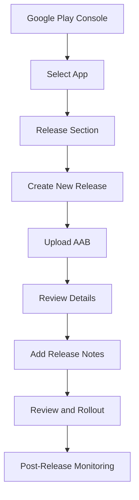

## 14.2.3 Uploading and Releasing Your Flutter App on Google Play

Publishing your Flutter app on Google Play is a significant milestone in your app development journey. This process involves several crucial steps, from building your app for release to monitoring its performance post-launch. In this section, we will walk you through the entire process, providing detailed insights and instructions to ensure a smooth and successful release.

### Building Your App for Release

#### Generating an App Bundle (AAB)

Google Play prefers the Android App Bundle (AAB) format over the traditional APK for app distribution. The AAB format allows Google Play to optimize your app for different device configurations, reducing the app size and improving performance.

To generate an AAB, use the following command in your terminal:

```bash
flutter build appbundle --release
```

**Note:**
- Ensure that your app is correctly configured for app signing. This involves setting up your upload key and ensuring that your `key.properties` file is correctly configured.

### Preparing for Upload

#### Versioning

Before uploading your app, you need to update the version code and version name in your `pubspec.yaml` file. This is crucial for managing app updates and ensuring users receive the latest version.

```yaml
version: 1.0.1+2
```

- **Version Name (1.0.1):** This is the user-visible version string.
- **Version Code (+2):** This is an integer that represents the version of the application code. It must be incremented with each release.

#### Signing the App

Your app must be signed with your upload key before it can be uploaded to Google Play. This ensures that your app is secure and that updates are verified as coming from you.

- **Key Properties File:** Ensure you have a `key.properties` file in your project’s root directory with the following content:

```properties
storePassword=<your-store-password>
keyPassword=<your-key-password>
keyAlias=<your-key-alias>
storeFile=<path-to-your-keystore-file>
```

- **Build Configuration:** Update your `android/app/build.gradle` file to include signing configurations:

```gradle
android {
    ...
    signingConfigs {
        release {
            keyAlias keystoreProperties['keyAlias']
            keyPassword keystoreProperties['keyPassword']
            storeFile file(keystoreProperties['storeFile'])
            storePassword keystoreProperties['storePassword']
        }
    }
    buildTypes {
        release {
            signingConfig signingConfigs.release
        }
    }
}
```

#### Aligning and Optimizing

With the AAB format, Google Play automatically optimizes your app for different device configurations, so you don't need to manually align or optimize your app.

### Uploading to Google Play Console

#### Step 1: Navigate to the "Release" Section

- Log in to your [Google Play Console](https://play.google.com/console).
- Select your app from the dashboard.
- Navigate to the **"Release"** section in the left-hand menu.
- Choose the appropriate track for your release (e.g., Internal testing, Closed testing, Open testing, Production).

#### Step 2: Create a New Release

- Click on **"Create new release"**.
- This will open a new page where you can manage your release details.

#### Step 3: Add Your App Bundle

- Upload your `.aab` file by dragging it into the upload area or selecting it from your file explorer.

#### Step 4: Review Release Details

- Carefully review the release details for any errors or warnings.
- Common issues to address include:
  - **App Signing:** Ensure your app is signed correctly.
  - **Permissions:** Verify that all declared permissions are necessary and justified.
  - **Device Compatibility:** Check for any compatibility issues with different devices.

#### Step 5: Add Release Notes

- Provide detailed release notes that highlight new features, bug fixes, and any other important updates. This helps users understand what’s new in the release.

### Rolling Out the Release

#### Review and Rollout

- Ensure all required fields are completed and that there are no unresolved issues.
- Click **"Review release"** to perform a final check.
- Once satisfied, click **"Start rollout to production"** to release your app.

#### Staged Rollout

- Consider using a staged rollout to release your app to a percentage of users initially. This allows you to monitor the app’s performance and address any issues before a full rollout.

### Post-Release Monitoring

After releasing your app, it’s crucial to monitor its performance and user feedback. The Google Play Console provides several tools to help you with this:

- **Crashes and ANRs:** Monitor crash reports and ANRs (Application Not Responding) to identify and fix stability issues.
- **User Feedback:** Review user ratings and reviews to gather feedback and improve your app.
- **Performance Metrics:** Track key performance metrics such as load times and resource usage.

### Troubleshooting Common Issues

- **Permission Declarations:** If your app requests sensitive permissions, ensure you provide a clear justification in the Play Console.
- **App Signing Errors:** Double-check your signing configuration if you encounter signing errors.
- **Compatibility Warnings:** Use the Play Console’s device catalog to identify and resolve compatibility issues.

### Visual Aids

To enhance your understanding, here are some annotated screenshots of the release process:



### Conclusion

Publishing your Flutter app on Google Play involves several steps, each crucial to ensuring a successful release. By following this guide, you can confidently navigate the process, from building your app bundle to monitoring its performance post-launch. Remember to leverage the tools and resources available in the Google Play Console to optimize your app’s performance and user experience.

## Quiz Time!



### What is the preferred format for publishing apps on Google Play?

- [x] Android App Bundle (AAB)
- [ ] APK
- [ ] ZIP
- [ ] EXE

> **Explanation:** Google Play prefers the Android App Bundle (AAB) format because it allows for better optimization and smaller app sizes.

### Which command is used to generate an app bundle in Flutter?

- [x] `flutter build appbundle --release`
- [ ] `flutter build apk --release`
- [ ] `flutter build ios --release`
- [ ] `flutter build web --release`

> **Explanation:** The command `flutter build appbundle --release` is used to generate an Android App Bundle for release.

### What must be updated in `pubspec.yaml` before uploading a new app version?

- [x] Version code and version name
- [ ] App name and description
- [ ] Developer contact information
- [ ] App icon and splash screen

> **Explanation:** The version code and version name must be updated to manage app updates and ensure users receive the latest version.

### What is required for an app to be uploaded to Google Play?

- [x] The app must be signed with your upload key
- [ ] The app must be open source
- [ ] The app must be free
- [ ] The app must be in beta

> **Explanation:** Apps must be signed with your upload key to ensure security and verify updates.

### What is a staged rollout?

- [x] Releasing the app to a percentage of users initially
- [ ] Releasing the app to all users at once
- [ ] Releasing the app only to beta testers
- [ ] Releasing the app without any testing

> **Explanation:** A staged rollout involves releasing the app to a percentage of users initially to monitor performance and address issues before a full rollout.

### Which section of the Google Play Console allows you to monitor crashes and ANRs?

- [x] Post-Release Monitoring
- [ ] Release Management
- [ ] User Feedback
- [ ] App Signing

> **Explanation:** The Post-Release Monitoring section provides tools to monitor crashes and ANRs.

### What should you do if you encounter app signing errors?

- [x] Double-check your signing configuration
- [ ] Ignore the errors
- [ ] Change the app's name
- [ ] Remove all permissions

> **Explanation:** Double-checking your signing configuration can help resolve app signing errors.

### What is the purpose of providing release notes?

- [x] To highlight new features and fixes
- [ ] To increase app size
- [ ] To change the app's category
- [ ] To remove user reviews

> **Explanation:** Release notes inform users about new features, bug fixes, and important updates.

### What is the role of the `key.properties` file?

- [x] It stores the credentials for app signing
- [ ] It contains the app's metadata
- [ ] It defines the app's UI layout
- [ ] It lists the app's dependencies

> **Explanation:** The `key.properties` file stores the credentials needed for app signing.

### True or False: Google Play automatically optimizes your app for different device configurations when using AAB.

- [x] True
- [ ] False

> **Explanation:** True. Google Play optimizes your app for different device configurations when using the Android App Bundle format.


