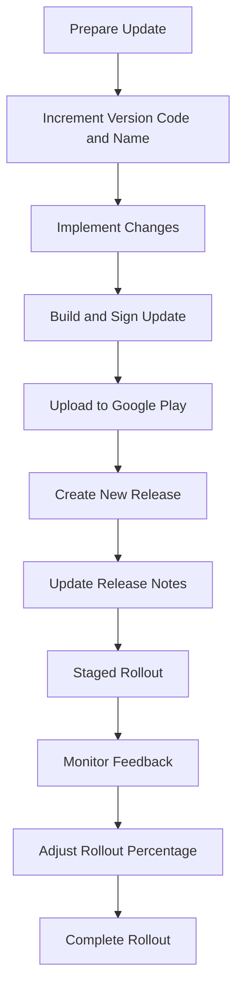

## 14.2.4 Managing App Updates

Keeping your app up-to-date is crucial for maintaining user engagement, ensuring security, and delivering new features. This section will guide you through the process of managing app updates on Google Play, from preparing your update to monitoring its performance post-release. We will explore best practices, practical steps, and tools to ensure a smooth update process.

### Preparing an Update

Before releasing an update, it's essential to prepare your app properly. This involves incrementing the version code and name, implementing changes, and ensuring thorough testing.

#### Increment Version Code and Name

Every update requires a new version code and name. This is crucial for Google Play to recognize the update as a new release.

- **Update in `pubspec.yaml`:**

  The `pubspec.yaml` file is where you define your app's version. The version is specified in the format `major.minor.patch+build`, where the build number (version code) must be incremented with each release.

  ```yaml
  version: 1.0.2+3
  ```

  - **Version Code (+3)**: This number must be higher than the previous release. It is used internally by Google Play to manage updates.
  - **Version Name (1.0.2)**: This is the version number that users see. It should reflect the nature of the update (e.g., minor bug fixes or major feature additions).

#### Implementing Changes

Once the version is updated, focus on implementing and testing changes.

- **Thorough Testing**: Ensure all new features and bug fixes are thoroughly tested. This includes unit tests, integration tests, and user acceptance testing.
- **Backward Compatibility**: Verify that the update does not break existing functionality. This is crucial for maintaining a positive user experience.

### Building and Signing the Update

Building and signing your app update follows the same process as the initial release. This ensures the integrity and authenticity of your app.

- **Build the App Bundle**: Use Flutter's build tools to create an updated app bundle.
- **Sign the App**: Ensure the app is signed with the same key used for previous releases. This is critical for Google Play to accept the update.

### Uploading the Update

Once your app is built and signed, it's time to upload it to Google Play.

#### Create a New Release in the Appropriate Track

- **Select the Correct Track**: Choose the track you wish to update (e.g., Production, Beta, Alpha). This ensures the update reaches the intended audience.
- **Upload the New App Bundle**: The Google Play Console will automatically compare the new version with the previous one to ensure compatibility and correctness.

#### Update Release Notes

- **Communicate Changes**: Clearly describe what's new in this update. This helps users understand the benefits of updating and encourages them to do so.

### Staged Rollout

A staged rollout allows you to release your update gradually, minimizing risk and maximizing feedback.

#### Advantages

- **Monitor Stability**: Observe app performance and user feedback before a full-scale release.
- **User Reactions**: Gather insights on user satisfaction and potential issues.

#### Adjusting Rollout Percentage

- **Start Small**: Begin with a small percentage of users (e.g., 5-10%) to test the waters.
- **Increase Gradually**: If no issues arise, gradually increase the rollout percentage.

#### Halting a Rollout

- **Critical Issues**: If a significant problem is detected, halt the rollout immediately to prevent further distribution. This allows you to address the issue before it affects more users.

### Using In-App Updates API (Optional)

The In-App Updates API is a powerful tool to encourage users to update to the latest version directly within the app.

#### Purpose

- **Seamless Updates**: Provide a smooth update experience without requiring users to leave the app.

#### Implementation

- **Integrate the API**: Use Google's In-App Updates API to prompt users to update. This can be configured to either force an immediate update or allow users to update at their convenience.

### Emphasize Best Practices

Regular updates are vital for app performance, security, and user satisfaction. Here are some best practices to consider:

- **Frequent Updates**: Regular updates keep your app fresh and relevant.
- **Security Patches**: Address security vulnerabilities promptly to protect user data.
- **Performance Improvements**: Continuously optimize app performance to enhance user experience.

### Monitoring and Feedback

After releasing an update, closely monitor user feedback and crash reports. This helps identify issues early and improve future updates.

- **User Feedback**: Engage with users to understand their experiences and gather suggestions.
- **Crash Reports**: Use tools like Firebase Crashlytics to track and resolve crashes.

### Visual Aids

To help you navigate the Google Play Console, here are some visual aids:



This flowchart outlines the steps involved in managing an app update on Google Play, from preparation to completion.

### Conclusion

Managing app updates effectively is crucial for maintaining a successful app on Google Play. By following the steps outlined in this guide, you can ensure a smooth update process that enhances user satisfaction and app performance. Remember to monitor feedback closely and be ready to address any issues that arise promptly.

For further exploration, consider reviewing the official [Google Play Console documentation](https://support.google.com/googleplay/android-developer/answer/9859152?hl=en) and exploring resources on app versioning and update strategies.

## Quiz Time!



### What is the purpose of incrementing the version code in `pubspec.yaml`?

- [x] To ensure Google Play recognizes the update as a new release
- [ ] To change the app's name
- [ ] To improve app performance
- [ ] To reset user data

> **Explanation:** Incrementing the version code ensures that Google Play recognizes the update as a new release, which is necessary for the update process.

### Why is it important to test new features thoroughly before releasing an update?

- [x] To ensure the app functions correctly and maintains user satisfaction
- [ ] To increase the app's download size
- [ ] To make the app look more complex
- [ ] To reduce the app's functionality

> **Explanation:** Thorough testing ensures that new features work as intended and do not introduce bugs, maintaining user satisfaction and app reliability.

### What is the advantage of using a staged rollout for app updates?

- [x] It allows monitoring app stability and user reactions before full deployment
- [ ] It immediately updates all users
- [ ] It reduces the app's download size
- [ ] It hides the update from users

> **Explanation:** A staged rollout allows developers to monitor app performance and user feedback on a smaller scale before releasing the update to all users, minimizing risk.

### How can the In-App Updates API benefit users?

- [x] It encourages users to update to the latest version directly within the app
- [ ] It deletes the app from the user's device
- [ ] It prevents users from updating the app
- [ ] It hides the update from users

> **Explanation:** The In-App Updates API provides a seamless update experience, encouraging users to update without leaving the app.

### What should you do if a critical issue is found during a staged rollout?

- [x] Halt the rollout to prevent further distribution
- [ ] Ignore the issue and continue the rollout
- [ ] Increase the rollout percentage
- [ ] Delete the app from the store

> **Explanation:** Halting the rollout prevents the issue from affecting more users, allowing developers to address the problem before continuing.

### Why is it important to update release notes with each app update?

- [x] To clearly communicate what's new in the update to users
- [ ] To increase the app's download size
- [ ] To hide the update from users
- [ ] To reset user data

> **Explanation:** Updating release notes helps users understand the benefits of the update and encourages them to install it.

### What is the role of Firebase Crashlytics in managing app updates?

- [x] To track and resolve crashes after an update
- [ ] To increase the app's download size
- [ ] To hide the update from users
- [ ] To delete the app from the store

> **Explanation:** Firebase Crashlytics helps developers monitor and resolve crashes, improving app stability and user satisfaction.

### What is a key benefit of regular app updates?

- [x] They improve app performance and security
- [ ] They increase the app's download size
- [ ] They hide the app from users
- [ ] They reset user data

> **Explanation:** Regular updates keep the app secure, improve performance, and maintain user engagement.

### What should you monitor closely after releasing an app update?

- [x] User feedback and crash reports
- [ ] The app's download size
- [ ] The app's color scheme
- [ ] The app's icon

> **Explanation:** Monitoring user feedback and crash reports helps identify issues early and improve future updates.

### True or False: The version name in `pubspec.yaml` is used internally by Google Play to manage updates.

- [ ] True
- [x] False

> **Explanation:** The version code, not the version name, is used internally by Google Play to manage updates. The version name is what users see.


