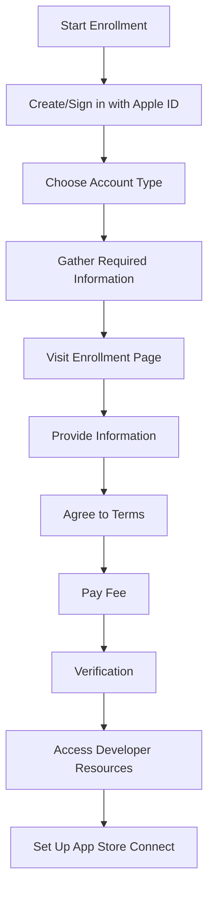

## 14.3.1 Enrolling in the Apple Developer Program

Enrolling in the Apple Developer Program is a crucial step for any developer looking to publish apps on the Apple App Store. This section provides a detailed guide on the enrollment process, highlighting the benefits, costs, and necessary steps to get started. Whether you're an individual developer or part of an organization, understanding the nuances of the program will ensure a smooth and efficient enrollment process.

### Understanding the Apple Developer Program

The Apple Developer Program offers a range of benefits that are essential for app development and distribution on Apple platforms. Here’s what you need to know:

#### Benefits

- **Access to App Distribution on the App Store:**
  - The primary benefit of enrolling in the Apple Developer Program is the ability to distribute your apps on the Apple App Store. This platform provides access to millions of users worldwide, offering a significant opportunity for exposure and revenue generation.

- **Access to Beta Testing with TestFlight:**
  - TestFlight is a powerful tool for beta testing your apps. It allows you to invite users to test your app before its official release, providing valuable feedback and insights that can help improve the app's quality and user experience.

- **Use of Apple Developer Tools and Resources:**
  - As a member of the Apple Developer Program, you gain access to a suite of developer tools and resources, including Xcode, Swift, and various APIs and SDKs. These tools are essential for building, testing, and optimizing your apps for Apple devices.

#### Cost

- **Annual Fee:**
  - The Apple Developer Program requires an annual fee of $99 USD. This fee grants you access to all the benefits mentioned above and is a necessary investment for anyone serious about developing and distributing apps on Apple platforms.

### Enrollment Process

Enrolling in the Apple Developer Program involves several steps. Here’s a detailed breakdown of the process:

#### 1. Apple ID

Before you begin the enrollment process, ensure you have an Apple ID. This ID should be associated with your personal or company's email. If you don't have an Apple ID, you can create one on the [Apple ID website](https://appleid.apple.com/).

#### 2. Developer Account Type

Choosing the right account type is crucial, as it affects how your apps are presented on the App Store.

- **Individual:**
  - If you enroll as an individual, your apps will appear under your personal name. This option is suitable for solo developers who do not have a registered business entity.

- **Organization:**
  - For companies or organizations, enrolling as an organization is the preferred option. Apps will appear under the company's name, which can enhance brand recognition and credibility. This option requires a **D-U-N-S Number**, a unique identifier for businesses.

#### 3. Gather Required Information

- **D-U-N-S Number (For Organizations):**
  - The D-U-N-S Number is a unique nine-digit identifier for businesses. It is required for organizations enrolling in the Apple Developer Program. If your company does not have a D-U-N-S Number, you can request one via Apple's [D-U-N-S Number request page](https://developer.apple.com/enroll/duns-lookup/).

#### 4. Enroll Online

To start the enrollment process, visit the [Apple Developer Program Enrollment](https://developer.apple.com/programs/enroll/) page and sign in with your Apple ID.

#### 5. Provide Personal or Business Information

You will be prompted to fill in personal or business details. For organizations, this includes the legal entity name, D-U-N-S Number, and address. Ensure all information is accurate to prevent delays in the enrollment process.

#### 6. Agree to Terms

Read and accept the Apple Developer Agreement. This agreement outlines the terms and conditions of the program and is a mandatory step in the enrollment process.

#### 7. Payment

Pay the annual fee of $99 USD via credit card. This payment is necessary to complete your enrollment and gain access to the program's benefits.

#### 8. Verification

Apple may contact you to verify the information provided during enrollment. This verification process can take a few days, so be prepared for a short waiting period.

### After Enrollment

Once you have successfully enrolled in the Apple Developer Program, you can begin utilizing the resources and tools available to you.

#### Access Developer Resources

Log in to the [Apple Developer](https://developer.apple.com/) portal to access a wealth of resources, including documentation, sample code, and developer forums.

#### Set Up App Store Connect

App Store Connect is a vital tool for managing your app submissions, analytics, and user feedback. Familiarize yourself with its features to streamline your app development and distribution process.

### Clarifying Differences Between Account Types

Understanding the differences between individual and organizational accounts is essential for making an informed decision:

- **Individual Accounts:**
  - Suitable for solo developers.
  - Apps appear under the developer's personal name.
  - Simpler enrollment process without the need for a D-U-N-S Number.

- **Organizational Accounts:**
  - Ideal for companies and organizations.
  - Apps appear under the company's name, enhancing brand visibility.
  - Requires a D-U-N-S Number and additional verification steps.

### Emphasizing Accuracy

Accuracy is paramount when providing information during the enrollment process. Inaccurate or incomplete information can lead to delays or even rejection of your application. Double-check all details before submission to ensure a smooth enrollment experience.

### Visual Aids

To assist you in the enrollment process, here are some visual aids illustrating key steps:

### Best Practices and Common Pitfalls

- **Best Practices:**
  - Ensure all information is accurate and up-to-date.
  - Choose the appropriate account type based on your needs.
  - Familiarize yourself with the Apple Developer Agreement before accepting it.

- **Common Pitfalls:**
  - Providing incorrect or incomplete information can delay the enrollment process.
  - Failing to obtain a D-U-N-S Number for organizational accounts can result in application rejection.

### Additional Resources

For further exploration and understanding, consider the following resources:

- [Apple Developer Program Enrollment Guide](https://developer.apple.com/programs/enroll/)
- [D-U-N-S Number Request](https://developer.apple.com/enroll/duns-lookup/)
- [Apple Developer Documentation](https://developer.apple.com/documentation/)

These resources provide comprehensive information and support for developers looking to enroll in the Apple Developer Program.

## Quiz Time!



### What is one of the primary benefits of enrolling in the Apple Developer Program?

- [x] Access to app distribution on the App Store
- [ ] Free access to all Apple devices
- [ ] Unlimited cloud storage
- [ ] Free advertising on Apple platforms

> **Explanation:** Enrolling in the Apple Developer Program allows developers to distribute their apps on the Apple App Store, reaching a global audience.

### What is the annual fee for the Apple Developer Program?

- [x] $99 USD
- [ ] $50 USD
- [ ] $199 USD
- [ ] $150 USD

> **Explanation:** The annual fee for the Apple Developer Program is $99 USD, granting access to various developer tools and resources.

### Which account type requires a D-U-N-S Number?

- [ ] Individual
- [x] Organization
- [ ] Both Individual and Organization
- [ ] Neither

> **Explanation:** An organizational account requires a D-U-N-S Number, which is a unique identifier for businesses.

### What tool does the Apple Developer Program provide for beta testing apps?

- [x] TestFlight
- [ ] Xcode
- [ ] Swift
- [ ] App Store Connect

> **Explanation:** TestFlight is used for beta testing apps, allowing developers to gather feedback before the official release.

### What is a D-U-N-S Number?

- [x] A unique identifier for businesses
- [ ] A type of Apple ID
- [ ] A payment method for the Apple Developer Program
- [ ] A security feature for apps

> **Explanation:** A D-U-N-S Number is a unique nine-digit identifier for businesses, required for organizational accounts.

### What should you do if you don't have an Apple ID before enrolling?

- [x] Create one on the Apple ID website
- [ ] Use a friend's Apple ID
- [ ] Skip the Apple ID requirement
- [ ] Contact Apple support

> **Explanation:** You need to create an Apple ID on the Apple ID website if you don't have one before enrolling.

### What is the purpose of App Store Connect?

- [x] To manage app submissions and analytics
- [ ] To provide free app hosting
- [ ] To offer customer support for apps
- [ ] To design app interfaces

> **Explanation:** App Store Connect is used to manage app submissions, analytics, and user feedback.

### What happens if you provide inaccurate information during enrollment?

- [x] It can lead to delays or rejection of your application
- [ ] You will be automatically enrolled
- [ ] You will receive a discount on the enrollment fee
- [ ] Nothing, as Apple does not verify information

> **Explanation:** Providing inaccurate information can delay the enrollment process or result in application rejection.

### Which of the following is NOT a benefit of the Apple Developer Program?

- [ ] Access to app distribution on the App Store
- [ ] Access to beta testing with TestFlight
- [ ] Use of Apple developer tools and resources
- [x] Free Apple devices for testing

> **Explanation:** The Apple Developer Program does not provide free Apple devices for testing.

### True or False: An individual account allows apps to appear under a company's name.

- [ ] True
- [x] False

> **Explanation:** An individual account lists apps under the developer's personal name, not a company's name.


