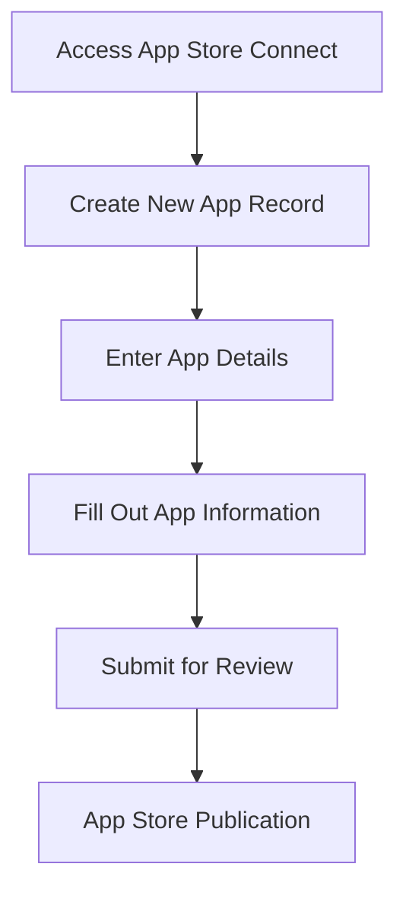

## 14.3.2 Configuring App Store Connect

Publishing your Flutter app on the Apple App Store involves several steps, one of the most crucial being configuring App Store Connect. This platform is where you manage your app's metadata, pricing, availability, and more. In this section, we'll guide you through the process of setting up your app in App Store Connect, ensuring you're ready to submit your app for review and distribution.

### Accessing App Store Connect

To begin, you'll need to access App Store Connect, Apple's platform for managing apps on the App Store. Here's how to get started:

- **Navigate to [App Store Connect](https://appstoreconnect.apple.com/):** Open your web browser and go to the App Store Connect website.
- **Sign in with your Apple Developer credentials:** Use your Apple ID and password associated with your Apple Developer account to log in.

Once logged in, you'll be greeted with the App Store Connect dashboard, where you can manage all aspects of your app's presence on the App Store.

### Creating a New App Record

Creating a new app record is the first step in configuring your app for the App Store. This involves entering essential details about your app, which will be visible to users once your app is published.

#### Step 1: Go to "My Apps"

- **Click the "+" button:** In the top-left corner of the dashboard, click the "+" button.
- **Select "New App":** From the dropdown menu, choose "New App" to start the process of creating a new app record.

#### Step 2: Enter App Details

You'll need to provide several key pieces of information about your app:

- **Platform:** Select **iOS** (or macOS/tvOS if applicable) as the platform for your app.
- **Name:** Enter the name of your app as it will appear on the App Store. This is a critical element of your app's branding, so choose wisely.
- **Primary Language:** Select the default language for your app's metadata. This should be the language most of your target audience speaks.
- **Bundle ID:** Choose the bundle ID that matches your app. This ID should have been configured in the Apple Developer portal beforehand.
- **SKU:** Enter a unique identifier for your app. This is for internal use and won't be visible to users.

#### Step 3: User Access (if applicable)

If you're working with a team, you may need to set user permissions for app management. This allows you to control who can access and modify different aspects of your app's configuration.

### Filling Out App Information

Once your app record is created, you'll need to fill out detailed information about your app. This information will help users understand what your app does and why they should download it.

#### App Information Section

- **Subtitle (Optional):** You can add a subtitle of up to 30 characters that appears below your app's name. This is a great place to highlight a key feature or benefit.
- **Category:** Choose a primary and secondary category for your app. This helps users find your app when browsing the App Store.
- **Content Rights:** Declare whether your app contains third-party content. If it does, ensure you have the necessary rights to use it.
- **Age Rating:** Complete the questionnaire to determine the appropriate age rating for your app. This ensures your app is shown to the right audience.

#### Pricing and Availability

- **Set the app's price tier or select free:** Decide whether your app will be free or paid, and choose the appropriate pricing tier.
- **Choose available territories:** Select the countries and regions where you want your app to be available.

#### App Privacy

- **Privacy Policy URL:** Enter the URL of your app's privacy policy. This is a requirement for all apps on the App Store.
- **Data Collection and Usage:** Provide detailed information on what data your app collects and how it is used. Transparency is key to building trust with your users.

#### Version Information

- **Screenshots:** Upload screenshots for all required device sizes, such as iPhone 12 Pro Max and iPad Pro. Ensure they are in the correct resolutions and showcase your app's key features.
- **App Previews (Optional):** You can upload videos demonstrating your app's functionality. These can be a powerful tool for attracting users.
- **Description:** Write a compelling description of up to 4000 characters. Highlight your app's features and benefits to entice potential users.
- **Keywords:** Enter up to 100 characters of keywords to improve your app's search results.
- **Support URL and Marketing URL:** Provide links to your app's support and marketing pages. These help users find more information and get help if needed.

### Detailed Requirements

When preparing your app for submission, it's crucial to adhere to Apple's specifications for screenshots and other assets. Here are some key requirements:

- **Screenshots:** Must be in PNG or JPEG format, with specific dimensions depending on the device. For example, iPhone screenshots should be 1242 x 2688 pixels for portrait orientation.
- **App Previews:** Videos should be in MP4 format, with a resolution of 1920 x 1080 pixels for landscape orientation.
- **Icons and Graphics:** Ensure your app icon is in the correct format and resolution (1024 x 1024 pixels).

### Workflow Organization

To streamline the process, it's helpful to organize your workflow in the order that information appears in App Store Connect. This ensures you don't miss any critical steps and can efficiently manage your app's configuration.

### Visual Aids

Visual aids can be incredibly helpful in understanding the configuration process. Below are some annotated screenshots to guide you through the setup:

In this diagram, you can see the flow from accessing App Store Connect to the final publication of your app. Each step builds on the previous one, ensuring a smooth transition through the process.

### Best Practices and Common Pitfalls

- **Consistency:** Ensure all information is consistent across your app's metadata, screenshots, and descriptions.
- **Accuracy:** Double-check all details, especially your app's name, bundle ID, and SKU, to avoid errors during submission.
- **Compliance:** Adhere to Apple's guidelines for content, privacy, and data usage to prevent rejection during the review process.

### Additional Resources

For further exploration, consider the following resources:

- [Apple's Official App Store Connect Documentation](https://developer.apple.com/app-store-connect/)
- [Flutter's Guide to iOS Deployment](https://flutter.dev/docs/deployment/ios)
- Online courses on platforms like Udemy or Coursera for in-depth tutorials on app publishing.

By following these detailed instructions and utilizing the resources provided, you'll be well-equipped to configure App Store Connect and successfully publish your Flutter app on the Apple App Store.

## Quiz Time!



### What is the first step in configuring App Store Connect for your app?

- [x] Accessing App Store Connect and signing in with your Apple Developer credentials.
- [ ] Creating a new app record.
- [ ] Filling out app information.
- [ ] Uploading screenshots.

> **Explanation:** The first step is to access App Store Connect and sign in with your Apple Developer credentials to begin the configuration process.

### What information is required when creating a new app record?

- [x] Platform, Name, Primary Language, Bundle ID, SKU.
- [ ] Only the app's name and bundle ID.
- [ ] Platform and SKU only.
- [ ] Name, Bundle ID, and screenshots.

> **Explanation:** When creating a new app record, you need to provide the platform, app name, primary language, bundle ID, and SKU.

### What is the purpose of the SKU in App Store Connect?

- [x] A unique identifier for internal use.
- [ ] The app's public identifier on the App Store.
- [ ] A code for pricing tiers.
- [ ] A placeholder for future updates.

> **Explanation:** The SKU is a unique identifier used internally to manage your app.

### Why is it important to provide a Privacy Policy URL?

- [x] It is a requirement for all apps on the App Store.
- [ ] It helps improve app search results.
- [ ] It is optional for free apps.
- [ ] It is only needed for apps with in-app purchases.

> **Explanation:** Providing a Privacy Policy URL is mandatory for all apps on the App Store to ensure transparency with users.

### What should be included in the app's description?

- [x] Features and benefits of the app.
- [ ] Only technical specifications.
- [ ] A list of competitors.
- [ ] The app's pricing details.

> **Explanation:** The app's description should highlight its features and benefits to attract potential users.

### What is the recommended format for app screenshots?

- [x] PNG or JPEG format.
- [ ] PDF format.
- [ ] GIF format.
- [ ] BMP format.

> **Explanation:** Screenshots should be in PNG or JPEG format to meet Apple's requirements.

### How can you improve your app's search results on the App Store?

- [x] By entering relevant keywords.
- [ ] By increasing the app's price.
- [ ] By reducing the app's size.
- [ ] By limiting the app's availability.

> **Explanation:** Entering relevant keywords can help improve your app's visibility in search results.

### What is the role of the App Previews in App Store Connect?

- [x] To demonstrate app functionality through videos.
- [ ] To provide a written summary of the app.
- [ ] To showcase user reviews.
- [ ] To list technical specifications.

> **Explanation:** App Previews are videos that demonstrate the app's functionality, helping users understand what the app offers.

### What should you do if your app contains third-party content?

- [x] Declare it in the Content Rights section.
- [ ] Ignore it as it is not important.
- [ ] Only mention it in the app's description.
- [ ] Remove all third-party content.

> **Explanation:** You must declare any third-party content in the Content Rights section to comply with Apple's guidelines.

### True or False: You can skip setting a primary language for your app's metadata.

- [ ] True
- [x] False

> **Explanation:** Setting a primary language for your app's metadata is mandatory to ensure users receive information in the correct language.


