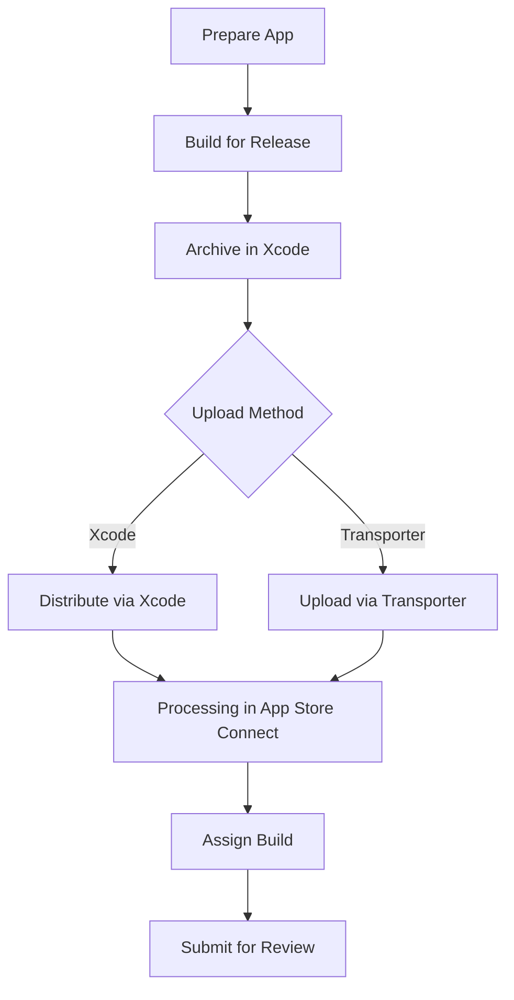

## 14.3.3 Uploading Your Flutter App to Apple App Store

Publishing your Flutter app to the Apple App Store is a crucial step in reaching a wider audience. This process involves several stages, from preparing your app for submission to navigating the complexities of Apple's review process. This guide will walk you through each step, ensuring your app is ready for the App Store.

### Preparing for Submission

Before you can upload your app, you need to ensure that all necessary preparations are complete. This includes managing app signings, certificates, and updating version numbers.

#### App Signings & Certificates

To distribute your app on the App Store, you must have the correct certificates and provisioning profiles. These are essential for code signing, which verifies the identity of the developer and ensures the integrity of the app.

- **Developer Account:** Ensure you have an active Apple Developer account.
- **Certificates:** Use Xcode to create a distribution certificate. Navigate to **Preferences** > **Accounts** > **Manage Certificates** and create a new certificate if necessary.
- **Provisioning Profiles:** Create an App Store provisioning profile in the Apple Developer portal. This profile should be linked to your app's bundle identifier.

#### Updating Version and Build Numbers

Consistency in versioning is crucial for a smooth submission process.

- **Versioning in `pubspec.yaml`:** Ensure that the version number in your `pubspec.yaml` file matches the version you intend to upload. This version number should follow the format `major.minor.patch+build`.
  
  ```yaml
  version: 1.0.0+1
  ```

- **Xcode Project Versioning:** Open your project in Xcode and ensure the version and build numbers match those in `pubspec.yaml`. Navigate to **General** > **Identity** to update these values.

### Building Your App for Release

Once your app is prepared, the next step is to build it for release. This involves creating an archive of your app that can be uploaded to the App Store.

#### Archive the App

1. **Build the App:**
   Use the Flutter CLI to build your app for iOS in release mode.

   ```bash
   flutter build ios --release
   ```

2. **Open the iOS Project in Xcode:**
   Navigate to your iOS project directory and open it in Xcode.

   ```bash
   open ios/Runner.xcworkspace
   ```

3. **Archive the App in Xcode:**
   - Select **Product** > **Archive** from the menu. Ensure that the selected scheme is set to **"Generic iOS Device"** or a specific device.
   - This process will create an archive of your app, which is necessary for distribution.

#### Configure Build Settings

- **Bundle Identifier:** Ensure the bundle identifier in Xcode matches the one registered in App Store Connect. This can be found under **General** > **Identity**.
- **Signing & Capabilities:** Verify that the correct team and provisioning profiles are selected under **Signing & Capabilities**.

### Uploading via Transporter or Xcode

Once your app is archived, you can upload it to App Store Connect using either Xcode or the Transporter app.

#### Using Xcode

1. **Organizer Window:**
   After archiving, Xcode will open the Organizer window. Here, you can manage your app archives.

2. **Distribute App:**
   - Select the archive you wish to upload and click **Distribute App**.
   - Follow the prompts to select the distribution method (App Store Connect) and proceed with the upload.

#### Using Transporter App

1. **Export the IPA File:**
   - In Xcode, select **Export** and choose **App Store Connect** as the destination.
   - This will generate an IPA file, which is the packaged app ready for upload.

2. **Upload with Transporter:**
   - Open the Transporter app, available from the Mac App Store.
   - Sign in with your Apple ID, add the IPA file, and click **Deliver** to upload your app.

### Processing in App Store Connect

Once uploaded, your app will undergo processing in App Store Connect.

#### Wait for Processing

- **Build Processing:** The uploaded build will be processed by Apple. This can take some time, so be patient.
- **Activity Tab:** Monitor the status of your build in the **Activity** tab of App Store Connect. Refresh periodically to check for updates.

#### Assign Build to App Record

- **App Information:** Navigate to your app's page in App Store Connect.
- **Build Section:** Under **App Store** > **App Information**, select the **Build** section and choose the uploaded build to associate it with your app record.

### Submitting for Review

With your build processed and assigned, the final step is to submit your app for review.

#### Complete All Required Fields

- **App Metadata:** Ensure all required fields, such as app description, keywords, and screenshots, are completed in App Store Connect.
- **App Review Information:** Provide contact information and any necessary notes for the reviewer. If your app requires specific configurations or login credentials, include these details.

#### Submit

- **Submit for Review:** Once all fields are complete, click **Submit for Review**. Your app will enter the review queue, where it will be evaluated by Apple's review team.

### Common Issues and Solutions

Navigating the App Store submission process can be challenging. Here are some common issues and solutions:

- **Missing Certificates:** Ensure all certificates and provisioning profiles are correctly configured in Xcode.
- **Version Mismatch:** Double-check that the version numbers in `pubspec.yaml` and Xcode match.
- **Build Rejection:** If your build is rejected, carefully review the feedback provided by Apple and make necessary adjustments.

### Visual Aids

To enhance your understanding, here are some visual aids depicting key stages of the upload process:



### Conclusion

Uploading your Flutter app to the Apple App Store is a detailed process that requires careful preparation and attention to detail. By following the steps outlined in this guide, you can navigate the submission process with confidence. Remember to address any issues promptly and utilize the resources available through Apple's developer support.

For further exploration, consider reviewing Apple's [official documentation](https://developer.apple.com/documentation/) and exploring community forums for additional insights and support.

## Quiz Time!



### What is the first step in preparing your Flutter app for submission to the Apple App Store?

- [x] Ensure you have the necessary certificates and provisioning profiles.
- [ ] Build the app for release.
- [ ] Submit the app for review.
- [ ] Update the app's metadata.

> **Explanation:** The first step is to ensure you have the necessary certificates and provisioning profiles, as these are essential for code signing and app distribution.

### Which command is used to build your Flutter app for iOS in release mode?

- [ ] flutter build android --release
- [x] flutter build ios --release
- [ ] flutter build web --release
- [ ] flutter build desktop --release

> **Explanation:** The command `flutter build ios --release` is used to build your Flutter app for iOS in release mode.

### What tool can you use to upload your app to App Store Connect besides Xcode?

- [ ] Android Studio
- [ ] Visual Studio Code
- [x] Transporter
- [ ] IntelliJ IDEA

> **Explanation:** Besides Xcode, you can use the Transporter app to upload your app to App Store Connect.

### Where do you assign the uploaded build to your app record in App Store Connect?

- [ ] Under "TestFlight"
- [x] Under "App Store" > "App Information"
- [ ] Under "Pricing and Availability"
- [ ] Under "App Analytics"

> **Explanation:** You assign the uploaded build to your app record under "App Store" > "App Information" in App Store Connect.

### What should you do if your app build is rejected by Apple?

- [ ] Ignore the feedback and resubmit.
- [ ] Contact Apple support immediately.
- [x] Review the feedback and make necessary adjustments.
- [ ] Change the app's bundle identifier.

> **Explanation:** If your app build is rejected, you should review the feedback provided by Apple and make the necessary adjustments before resubmitting.

### What is the purpose of the Transporter app?

- [ ] To edit app metadata
- [x] To upload IPA files to App Store Connect
- [ ] To manage app analytics
- [ ] To create app screenshots

> **Explanation:** The Transporter app is used to upload IPA files to App Store Connect.

### What should you ensure about the version number in `pubspec.yaml` before uploading your app?

- [ ] It matches the version number in your Android build.
- [x] It matches the version number in Xcode.
- [ ] It is higher than the previous version.
- [ ] It is set to 1.0.0.

> **Explanation:** You should ensure that the version number in `pubspec.yaml` matches the version number in Xcode.

### What is the role of provisioning profiles in app submission?

- [ ] They provide app analytics.
- [ ] They are used for app marketing.
- [x] They are used for code signing and app distribution.
- [ ] They are used for creating app screenshots.

> **Explanation:** Provisioning profiles are used for code signing and app distribution, ensuring the app is authorized for deployment.

### Which section in App Store Connect allows you to monitor the status of your app build?

- [ ] App Analytics
- [ ] Pricing and Availability
- [x] Activity
- [ ] TestFlight

> **Explanation:** The "Activity" section in App Store Connect allows you to monitor the status of your app build.

### True or False: You can submit your app for review without completing all required fields in App Store Connect.

- [ ] True
- [x] False

> **Explanation:** False. You must complete all required fields in App Store Connect before you can submit your app for review.


