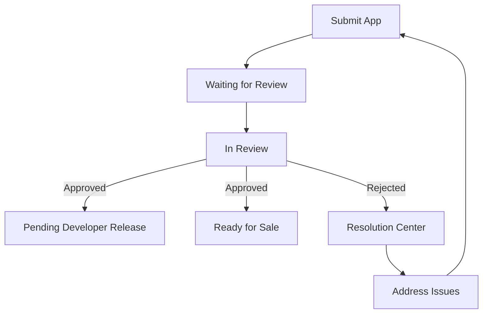

## 14.3.4 App Review Process

Publishing an app on the Apple App Store involves navigating a detailed review process designed to ensure quality, security, and compliance with Apple's guidelines. Understanding this process can significantly increase your chances of a successful app launch. This section will guide you through the key aspects of the Apple App Store review process, from understanding the review timeline to communicating effectively with the Apple review team.

### Understanding the Review Process

The Apple App Store review process is a critical step in getting your app to market. It ensures that all apps meet Apple's high standards for quality and security.

#### Timeframe

- **Review Duration:** The review process can vary significantly in duration, ranging from a few hours to several days. Apple provides an estimated timeframe in App Store Connect, which can help you plan your release schedule.
- **Factors Influencing Time:** The complexity of your app, the volume of submissions, and the time of year (e.g., holiday seasons) can all affect review times.

#### App Statuses

Understanding the different statuses your app can have during the review process is crucial:

- **Waiting for Review:** Your app is in the queue to be reviewed.
- **In Review:** The review team is currently evaluating your app.
- **Pending Developer Release:** Your app has been approved, but you have chosen to release it at a later date.
- **Ready for Sale:** Your app has passed the review and is available on the App Store.
- **Rejected:** Your app did not meet one or more of Apple's guidelines and requires changes.

### Communicating with Apple Review Team

Effective communication with the Apple review team can make a significant difference if your app encounters issues during the review process.

#### Resolution Center

- **Purpose:** The Resolution Center is where Apple communicates any issues or reasons for rejection. It's your primary tool for understanding what needs to be addressed.
- **Accessing Feedback:** Log into App Store Connect to view detailed feedback and communicate with the review team.

#### Responding to Feedback

- **Addressing Issues:** Carefully read the feedback provided and address each point. Ensure that you understand the guidelines you may have violated.
- **Providing Explanations:** If there are misunderstandings, provide clear and concise explanations to clarify your app's functionality or purpose.

#### Appealing Decisions

- **Submitting an Appeal:** If you believe a rejection was unjust, you can submit an appeal through the Resolution Center. Provide detailed justifications and any supporting documentation.

### Common Reasons for Rejection

Understanding common pitfalls can help you avoid them and streamline the review process.

#### Crashes and Bugs

- **Stability:** Ensure your app is stable and free from critical issues. Conduct thorough testing on various devices and iOS versions.
- **Error Handling:** Implement robust error handling to prevent crashes.

#### Incomplete Information

- **Metadata:** Provide accurate and complete metadata, including app descriptions, screenshots, and keywords.
- **Contact Information:** Ensure that all contact information is up-to-date and accessible.

#### Guideline Violations

- **Content Issues:** Ensure your app's content complies with Apple's guidelines, including restrictions on offensive or inappropriate material.
- **Privacy Policies:** Include a clear and accessible privacy policy if your app collects user data.
- **API Usage:** Use Apple APIs correctly and avoid private APIs.

### Tips for a Smooth Review

Here are some best practices to increase your chances of a successful review:

#### Thorough Testing

- **Device Testing:** Test your app on multiple devices and iOS versions to ensure compatibility and performance.
- **Beta Testing:** Consider using TestFlight for beta testing to gather user feedback and identify issues before submission.

#### Provide Demo Account

- **Test Accounts:** If your app requires login, provide a demo account with credentials in the App Review Information section.

#### Clear Communication

- **Special Instructions:** Use the App Review Information section to inform the reviewer of any special instructions or features that may not be immediately obvious.

### After Approval

Once your app is approved, there are several steps to ensure its success on the App Store.

#### App Availability

- **Release Timing:** Once your app is set to **Ready for Sale**, it will appear on the App Store. Plan your marketing and release strategy accordingly.

#### Monitoring Performance

- **Analytics:** Use App Store Connect to track downloads, sales, and crash reports. This data is invaluable for improving your app and planning updates.

### Encouraging a Proactive Approach

Being proactive and responsive during the review process can make a significant difference in the outcome.

- **Thoroughness:** Ensure your app is thoroughly tested and compliant with all guidelines before submission.
- **Responsiveness:** Be prompt and clear in your communications with the review team, especially if issues arise.

### Visual Aids

To help you navigate the review process, here are some visual aids:

This diagram illustrates the typical flow of the app review process, highlighting key stages and actions.

### Conclusion

Navigating the Apple App Store review process requires careful preparation, thorough testing, and clear communication. By understanding the common reasons for rejection and following best practices, you can increase your chances of a successful app launch. Remember to monitor your app's performance post-launch and be prepared to make updates as needed.

## Quiz Time!



### What is the typical timeframe for the Apple App Store review process?

- [x] A few hours to several days
- [ ] Always within 24 hours
- [ ] Always within a week
- [ ] A few minutes

> **Explanation:** The review process can vary from a few hours to several days depending on various factors.

### Which status indicates that your app is currently being evaluated by Apple?

- [ ] Waiting for Review
- [x] In Review
- [ ] Pending Developer Release
- [ ] Ready for Sale

> **Explanation:** "In Review" indicates that the Apple review team is currently evaluating your app.

### What should you do if your app is rejected?

- [x] Use the Resolution Center to address issues
- [ ] Submit a new app immediately
- [ ] Ignore the feedback
- [ ] Appeal without making changes

> **Explanation:** The Resolution Center is used to address issues and communicate with the review team.

### What is a common reason for app rejection?

- [x] Crashes and Bugs
- [ ] Too many downloads
- [ ] High user ratings
- [ ] Frequent updates

> **Explanation:** Crashes and bugs are common reasons for app rejection as they affect app stability.

### How can you provide login credentials for the review team?

- [x] Use the App Review Information section
- [ ] Email them directly
- [ ] Include them in the app description
- [ ] Post them on social media

> **Explanation:** The App Review Information section is the appropriate place to provide login credentials for testing.

### What is the purpose of the Resolution Center?

- [x] To communicate issues and feedback
- [ ] To track app downloads
- [ ] To submit new apps
- [ ] To manage app pricing

> **Explanation:** The Resolution Center is used for communication between developers and the Apple review team regarding issues and feedback.

### What should you do if you believe a rejection was unjust?

- [x] Submit an appeal with detailed justifications
- [ ] Ignore the rejection
- [ ] Submit a new app
- [ ] Complain on social media

> **Explanation:** If you believe a rejection was unjust, you can submit an appeal with detailed justifications through the Resolution Center.

### What is a key factor in ensuring a smooth review process?

- [x] Thorough Testing
- [ ] High app price
- [ ] Large app size
- [ ] Frequent updates

> **Explanation:** Thorough testing ensures that your app is stable and meets all guidelines, which is crucial for a smooth review process.

### What happens when your app is set to "Ready for Sale"?

- [x] It appears on the App Store
- [ ] It is deleted
- [ ] It is sent back for review
- [ ] It is archived

> **Explanation:** Once an app is set to "Ready for Sale," it becomes available on the App Store.

### True or False: You should provide a demo account if your app requires login.

- [x] True
- [ ] False

> **Explanation:** Providing a demo account is important for the review team to test all features of your app.


