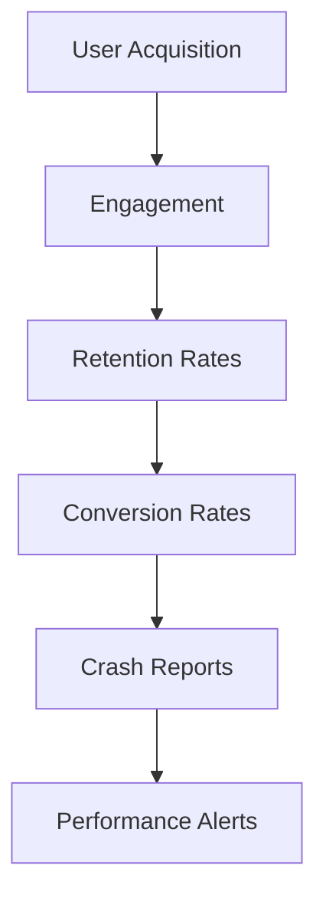

## 14.4.1 Monitoring App Performance

In the fast-paced world of mobile applications, understanding how your app performs in the real world is crucial. Monitoring app performance not only helps in identifying and fixing issues but also provides insights into user behavior, which can drive improvements and enhance user satisfaction. This section will guide you through the importance of monitoring, the tools available, key metrics to track, and how to set up effective monitoring systems.

### Importance of Monitoring

Monitoring your app's performance is akin to maintaining a vehicle; regular checks ensure smooth operation and longevity. Here are some reasons why monitoring is essential:

- **Issue Identification:** Regular monitoring helps in promptly identifying crashes, slowdowns, and other performance issues that could affect user experience.
- **User Behavior Insights:** Understanding how users interact with your app can reveal areas for improvement and new feature opportunities.
- **Performance Optimization:** Continuous tracking allows for performance tuning, ensuring your app runs efficiently across all devices.
- **Informed Decision Making:** Data-driven insights enable you to make informed decisions about updates, marketing strategies, and feature enhancements.

### Using Analytics Tools

To effectively monitor your app's performance, leveraging analytics tools is essential. These tools provide a wealth of data that can be used to understand and improve your app. Here are some of the most popular tools:

#### Google Play Console

For Android apps, the Google Play Console is an invaluable resource:

- **Statistics:** Provides insights into installs, uninstalls, and active users. This data helps you understand your app's reach and user base dynamics.
- **Android Vitals:** Focuses on app health by tracking crash rates, ANRs (Application Not Responding errors), and battery usage. These metrics are crucial for maintaining a high-quality user experience.

#### App Store Connect

For iOS apps, App Store Connect offers comprehensive analytics:

- **App Analytics:** Measures impressions, user engagement, retention, and sales. This data helps you gauge the effectiveness of your marketing efforts and user engagement strategies.
- **Crash Reports:** Provides detailed crash logs, helping you identify and fix issues that could lead to user dissatisfaction.

#### Third-Party Analytics

In addition to platform-specific tools, third-party analytics services can offer deeper insights:

- **Firebase Analytics:** A powerful tool that integrates seamlessly with Flutter, providing detailed insights into user behavior, including user demographics, engagement, and retention.
- **Other Tools:** Services like Mixpanel, Flurry, and AppDynamics offer advanced features such as funnel analysis, cohort analysis, and real-time data tracking.

### Key Metrics to Monitor

Understanding which metrics to monitor is crucial for effective performance tracking. Here are some key metrics to focus on:

- **User Acquisition:** Track where your users are coming from, which marketing channels are most effective, and how your user base is growing.
- **Engagement:** Measure how often and how long users interact with your app. High engagement often correlates with user satisfaction and retention.
- **Retention Rates:** Calculate the percentage of users returning to your app over time. High retention rates indicate a loyal user base.
- **Conversion Rates:** For apps with in-app purchases or subscriptions, monitor how effectively users are converting.
- **Crash and Error Reports:** Keep an eye on the frequency and context of crashes to maintain app stability.

### Setting Up Alerts and Dashboards

To make monitoring more efficient, setting up alerts and dashboards is highly recommended:

- **Alerts:** Configure alerts for key performance indicators (KPIs) to receive notifications when metrics fall outside expected ranges. This allows for quick responses to potential issues.
- **Dashboards:** Create dashboards that provide at-a-glance views of your app's performance. Dashboards should be tailored to highlight the most critical metrics for your app.

### Actionable Advice: Integrating Analytics Tools

Integrating analytics tools into your Flutter app involves several steps. Here's a general guide using Firebase Analytics as an example:

1. **Add Firebase to Your Project:**
   - Go to the Firebase Console and create a new project.
   - Follow the instructions to add Firebase to your Flutter app, which involves adding the Firebase SDK and configuring your app.

2. **Implement Analytics:**
   - Use the `firebase_analytics` package to log events and user properties.
   - Example code to log an event:

     ```dart
     import 'package:firebase_analytics/firebase_analytics.dart';

     FirebaseAnalytics analytics = FirebaseAnalytics();

     void logLoginEvent() {
       analytics.logEvent(
         name: 'login',
         parameters: <String, dynamic>{
           'method': 'email',
         },
       );
     }
     ```

3. **Set Up Custom Events:**
   - Define custom events that are relevant to your app's goals, such as `purchase`, `level_up`, or `share`.

4. **Monitor and Analyze:**
   - Use the Firebase Console to view analytics reports and gain insights into user behavior and app performance.

### Data Interpretation: Understanding Metrics

Interpreting analytics data is as important as collecting it. Here are some tips:

- **Identify Trends:** Look for patterns in user behavior over time. Are there spikes in usage after updates or marketing campaigns?
- **Analyze User Flow:** Understand how users navigate through your app. Are there bottlenecks or drop-off points that need addressing?
- **Evaluate Feature Success:** Use engagement metrics to assess the success of new features. Are users interacting with them as expected?

### Visual Aids: Examples of Analytics Dashboards

To enhance understanding, let's explore a sample dashboard layout using Mermaid.js diagrams:



This diagram illustrates the flow of key metrics from acquisition to performance alerts, providing a holistic view of app performance.

### Best Practices and Common Pitfalls

- **Best Practices:**
  - Regularly review and update your monitoring strategy to align with your app's evolving goals.
  - Encourage a culture of data-driven decision-making within your team.

- **Common Pitfalls:**
  - Avoid data overload by focusing on the most relevant metrics.
  - Ensure data privacy and compliance with regulations like GDPR when collecting user data.

### References and Further Reading

- [Firebase Analytics Documentation](https://firebase.google.com/docs/analytics)
- [Google Play Console Help](https://support.google.com/googleplay/android-developer)
- [App Store Connect Resources](https://developer.apple.com/app-store-connect/)

By effectively monitoring your app's performance, you can ensure a high-quality user experience, drive continuous improvement, and achieve your business goals. Remember, the key to successful monitoring is not just collecting data, but interpreting it and taking action based on insights.

## Quiz Time!



### Why is monitoring app performance important?

- [x] To identify issues and improve user experience
- [ ] To increase app size
- [ ] To decrease app functionality
- [ ] To make the app slower

> **Explanation:** Monitoring app performance helps identify issues, understand user behavior, and improve the app over time, enhancing user experience.

### Which tool provides insights into installs and uninstalls for Android apps?

- [x] Google Play Console
- [ ] App Store Connect
- [ ] Firebase Analytics
- [ ] Mixpanel

> **Explanation:** Google Play Console provides statistics on installs, uninstalls, and active users for Android apps.

### What does Firebase Analytics help with?

- [x] Detailed insights into user behavior
- [ ] Increasing app size
- [ ] Reducing app functionality
- [ ] Slowing down the app

> **Explanation:** Firebase Analytics provides detailed insights into user behavior, helping developers understand how users interact with their app.

### What is a key metric to monitor for user engagement?

- [x] How often and how long users interact with the app
- [ ] The number of app crashes
- [ ] The app's file size
- [ ] The app's color scheme

> **Explanation:** User engagement metrics focus on how often and how long users interact with the app, indicating user satisfaction and retention.

### What should you configure to receive notifications about key performance indicators?

- [x] Alerts
- [ ] Widgets
- [ ] Themes
- [ ] Animations

> **Explanation:** Configuring alerts for key performance indicators allows you to receive notifications when metrics fall outside expected ranges.

### What is the purpose of creating dashboards?

- [x] To provide at-a-glance views of app performance
- [ ] To increase app size
- [ ] To decrease app functionality
- [ ] To make the app slower

> **Explanation:** Dashboards provide at-a-glance views of app performance, helping developers quickly assess the app's health and metrics.

### Which metric helps in understanding user loyalty?

- [x] Retention Rates
- [ ] App Size
- [ ] Color Scheme
- [ ] Animation Speed

> **Explanation:** Retention rates indicate the percentage of users returning to the app over time, reflecting user loyalty.

### What is a common pitfall in monitoring app performance?

- [x] Data overload
- [ ] Too few features
- [ ] Too many colors
- [ ] Slow animations

> **Explanation:** Data overload can occur when too much data is collected without focusing on the most relevant metrics, leading to confusion.

### What should be considered when collecting user data?

- [x] Data privacy and compliance with regulations
- [ ] Increasing app size
- [ ] Decreasing app functionality
- [ ] Slowing down the app

> **Explanation:** Ensuring data privacy and compliance with regulations like GDPR is crucial when collecting user data.

### True or False: Monitoring app performance is only necessary during the initial launch phase.

- [ ] True
- [x] False

> **Explanation:** Monitoring app performance is an ongoing process that is necessary throughout the app's lifecycle to ensure continuous improvement and user satisfaction.


