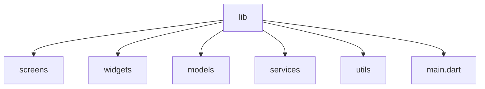

## 15.1.1 Code Organization

In the realm of software development, particularly in Flutter, organizing your code effectively is paramount. A well-structured codebase not only enhances readability but also simplifies maintenance and facilitates collaboration among team members. This section delves into the intricacies of code organization in Flutter, providing you with the tools and insights needed to write clean, maintainable, and scalable code.

### Importance of Code Organization

#### Explanation

Code organization is the backbone of a successful software project. It ensures that your code is easy to read, understand, and modify. When code is well-organized, it reduces the likelihood of bugs and simplifies the debugging process. This is crucial in a collaborative environment where multiple developers might be working on the same codebase. A clean codebase allows new team members to onboard quickly and contribute effectively.

#### Benefits

- **Improved Productivity:** Developers can quickly locate and understand code, leading to faster development cycles.
- **Easier Onboarding:** New developers can understand the project structure and logic more easily, reducing the learning curve.
- **Enhanced Scalability:** A well-organized codebase can be scaled more easily as the project grows, accommodating new features and functionalities.

### Project Structure in Flutter

#### Standard Directory Layout

Flutter provides a default project structure that serves as a solid foundation for organizing your code. Understanding and expanding this structure is crucial for larger projects.

- **lib/**: This is where the main codebase resides. All your Dart files, including the main application logic, are placed here.
- **lib/main.dart**: This file serves as the entry point of the application. It contains the `main()` function, which is the starting point of any Dart application.

#### Recommended Directory Organization

As your project grows, consider organizing your code into the following directories within the `lib/` folder:

- **lib/screens/**: Contains individual screens or pages of the app. Each screen is typically a separate Dart file.
- **lib/widgets/**: Houses reusable widgets that are used across multiple screens. This promotes reusability and consistency.
- **lib/models/**: Defines data models or classes representing data structures. This is where you define the structure of the data your app will handle.
- **lib/services/**: Includes code for network requests, database interactions, and other backend services. This separation helps in managing dependencies and testing.
- **lib/utils/** or **lib/helpers/**: Contains utility functions, constants, and helper classes. These are often used to perform common tasks that don't fit into other categories.
- **lib/bloc/** or **lib/providers/** (if using state management): Contains state management logic. This is crucial for managing the state of your application efficiently.

##### Visual Diagram

To better understand the recommended directory structure, refer to the following diagram:



### File and Class Organization

#### One Class per File

A common best practice in Flutter is to keep one class or widget per file. This enhances clarity and makes it easier to locate and modify specific components. Name files according to the class or widget they contain, using snake_case. For example, a file named `user_profile.dart` should contain the `UserProfile` widget.

#### Grouping Related Files

Organize files into subdirectories within `lib/` when appropriate. For instance, under `lib/models/`, you might group related models into subdirectories based on their functionality or domain.

### Modularization and Reusability

#### Breaking Down Large Widgets

Complex widgets should be broken down into smaller, reusable components. This promotes reusability and makes testing individual components easier. For example, a complex form widget might be broken down into smaller widgets for each form field.

#### Creating Custom Packages

For very large projects, consider creating custom packages or plugins within the app for better separation of concerns. This can be done using the command:

```bash
flutter create --template=package package_name
```

This approach allows you to encapsulate functionality and reuse it across different projects.

### Import Statements and Namespaces

#### Using Relative Imports

In Flutter, you can use both relative and package imports. However, package imports are recommended for clarity and consistency. For example:

```dart
import 'package:your_app/widgets/custom_button.dart';
```

#### Avoiding Import Conflicts

If there are name conflicts between imported libraries, use prefixes to differentiate them. This helps avoid ambiguity and keeps your code clean.

### Consistent Code Layout

#### Ordering of Class Members

Maintaining a consistent order of class members improves readability. A suggested order is:

1. Static constants.
2. Fields (variables).
3. Constructors.
4. Override methods (e.g., `initState`, `build`).
5. Public methods.
6. Private methods.

#### Indentation and Spacing

Adhere to Dart’s style guidelines, using two spaces for indentation. This consistency makes your code more readable and maintainable.

#### Line Length

Keep lines under 80 characters when possible. This improves readability, especially when viewing code on smaller screens or in split-view editors.

### Use of Comments and Documentation

#### Commenting Complex Logic

Add comments to explain why certain approaches are taken, especially in complex algorithms. This helps other developers (and your future self) understand the reasoning behind specific code decisions.

#### Documentation Comments

Use `///` for documentation comments. These comments can be used to generate documentation with tools like `dartdoc`. Here's an example:

```dart
/// A widget that displays a user profile.
///
/// The [UserProfile] widget displays the user's name, avatar, and bio.
class UserProfile extends StatelessWidget {
  // ...
}
```

### Code Review and Collaboration

#### Version Control

Using version control systems like Git is essential for tracking changes and collaborating with other developers. It allows you to manage different versions of your code and collaborate effectively.

#### Code Reviews

Regular code reviews help maintain code quality. They provide an opportunity for developers to learn from each other and ensure that code adheres to established standards.

#### Coding Standards

Establish and follow team coding standards and style guidelines. This ensures consistency across the codebase and helps maintain a high level of quality.

### Exercises

#### Practice Exercise

To reinforce the concepts covered in this section, try reorganizing an existing Flutter project according to the structure discussed. Create a new feature by breaking it down into well-organized files and directories. This hands-on practice will help you internalize the principles of code organization and apply them to your projects.

---

By following these guidelines, you can ensure that your Flutter codebase is clean, maintainable, and scalable. This not only improves your productivity but also enhances the overall quality of your applications. Remember, a well-organized codebase is a foundation for successful software development.

## Quiz Time!



### Why is code organization important in software development?

- [x] It enhances readability and simplifies maintenance.
- [ ] It makes the code run faster.
- [ ] It reduces the need for documentation.
- [ ] It eliminates all bugs.

> **Explanation:** Code organization enhances readability, simplifies maintenance, and facilitates collaboration, but it does not directly affect code execution speed or eliminate bugs.

### What is the entry point of a Flutter application?

- [x] lib/main.dart
- [ ] lib/screens/
- [ ] lib/widgets/
- [ ] lib/services/

> **Explanation:** The entry point of a Flutter application is the `lib/main.dart` file, which contains the `main()` function.

### Which directory is recommended for storing reusable widgets in a Flutter project?

- [x] lib/widgets/
- [ ] lib/screens/
- [ ] lib/models/
- [ ] lib/services/

> **Explanation:** Reusable widgets should be stored in the `lib/widgets/` directory to promote reusability and consistency across the app.

### What is the purpose of using package imports in Flutter?

- [x] To provide clarity and consistency in import statements.
- [ ] To reduce the size of the application.
- [ ] To increase the speed of the application.
- [ ] To automatically resolve import conflicts.

> **Explanation:** Package imports provide clarity and consistency in import statements, making it easier to manage dependencies.

### How should class members be ordered for consistency?

- [x] Static constants, fields, constructors, override methods, public methods, private methods.
- [ ] Constructors, fields, static constants, public methods, private methods, override methods.
- [ ] Fields, static constants, constructors, private methods, public methods, override methods.
- [ ] Public methods, private methods, constructors, fields, static constants, override methods.

> **Explanation:** A consistent order for class members is static constants, fields, constructors, override methods, public methods, and private methods.

### What is the recommended line length for Dart code?

- [x] Under 80 characters
- [ ] Exactly 100 characters
- [ ] Over 120 characters
- [ ] No limit

> **Explanation:** Keeping lines under 80 characters improves readability, especially in split-view editors or on smaller screens.

### Which tool can be used to generate documentation from Dart comments?

- [x] dartdoc
- [ ] dartfmt
- [ ] dartanalyzer
- [ ] dart2js

> **Explanation:** `dartdoc` is used to generate documentation from Dart comments, particularly those using `///`.

### What is a benefit of breaking down large widgets into smaller components?

- [x] It promotes reusability and simplifies testing.
- [ ] It increases the application's performance.
- [ ] It reduces the application's memory usage.
- [ ] It eliminates the need for state management.

> **Explanation:** Breaking down large widgets into smaller components promotes reusability and simplifies testing, but it does not directly affect performance or memory usage.

### What command is used to create a custom package in Flutter?

- [x] flutter create --template=package package_name
- [ ] flutter build package package_name
- [ ] flutter run package package_name
- [ ] flutter install package package_name

> **Explanation:** The command `flutter create --template=package package_name` is used to create a custom package in Flutter.

### True or False: Code reviews are unnecessary if you use version control.

- [ ] True
- [x] False

> **Explanation:** Code reviews are essential for maintaining code quality and ensuring adherence to coding standards, even when using version control.


