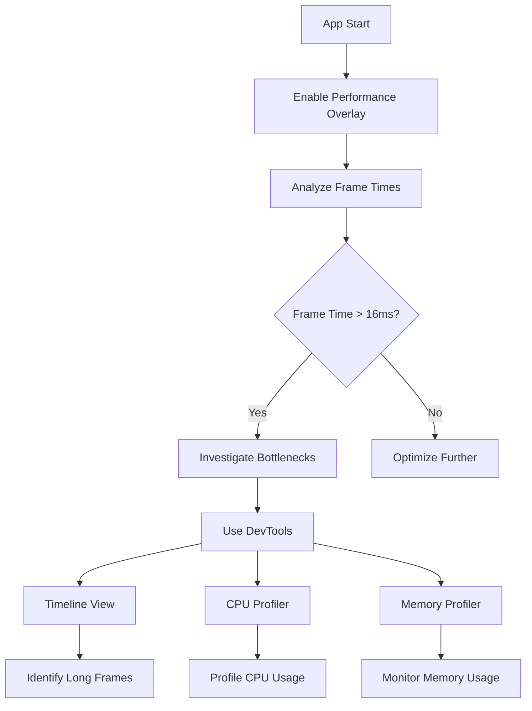

## 15.2.1 Identifying Performance Bottlenecks

In the world of mobile app development, performance is paramount. Users expect applications to be smooth, responsive, and efficient. Any lag or jank can lead to a poor user experience, resulting in negative reviews and potential uninstalls. This section will guide you through identifying performance bottlenecks in Flutter applications, using powerful tools and techniques to ensure your app runs seamlessly.

### Importance of Performance

Performance is not just a technical concern; it's a critical aspect of user experience. Here’s why it matters:

- **User Expectations:** Modern users expect apps to be fast and responsive. A delay of even a few milliseconds can be noticeable and frustrating.
- **User Retention:** Poor performance can lead to user dissatisfaction, resulting in app uninstalls and negative reviews.
- **Competitive Edge:** In a crowded app market, performance can be a differentiator that sets your app apart from others.

### Tools for Identifying Bottlenecks

Flutter provides several tools to help developers identify and resolve performance issues. Two of the most essential tools are Flutter DevTools and the Performance Overlay.

#### Flutter DevTools

Flutter DevTools is a suite of performance and debugging tools for Flutter and Dart applications. It provides insights into your app's performance, helping you identify bottlenecks and optimize your code.

- **Accessing DevTools:** You can access Flutter DevTools by running your app with the `flutter run --observatory-port` command or through IDE integrations like Visual Studio Code or Android Studio.
- **Features:** DevTools includes a timeline view, CPU profiler, memory profiler, and more, each offering detailed insights into different aspects of your app's performance.

#### Performance Overlay

The Performance Overlay is a built-in tool in Flutter that provides a visual representation of your app's frame rendering times.

- **Enabling the Performance Overlay:**
  ```dart
  MaterialApp(
    showPerformanceOverlay: true,
    home: MyHomePage(),
  );
  ```
- **Interpreting the Overlay:** The overlay displays graphs that show the rendering times for each frame. If the graphs exceed the 16ms threshold, it indicates potential performance issues.

### Common Performance Issues

Understanding common performance issues is the first step in identifying and resolving them. Here are some typical problems you might encounter:

- **Jank and Lag:** Occurs when frames take longer than 16ms to render, causing noticeable stutter or lag.
- **Excessive Rebuilds:** Widgets rebuilding unnecessarily due to state changes, leading to inefficient rendering.
- **Expensive Operations in the Main Thread:** Heavy computations or blocking calls in the UI thread can cause delays and affect responsiveness.

### Analyzing with DevTools

Flutter DevTools offers several features to help you analyze and optimize your app's performance.

#### Timeline View

The timeline view in DevTools allows you to track the rendering performance of your app.

- **Identifying Long Frames:** Use the timeline to spot frames that take longer than 16ms to render. These are potential bottlenecks.
- **Examining Frame Events:** Dive into the details of each frame to see which functions or operations are consuming the most time.

#### CPU Profiler

The CPU profiler helps you identify expensive operations that might be slowing down your app.

- **Profiling CPU Usage:** Analyze CPU usage to pinpoint functions or methods that are resource-intensive.
- **Optimizing Code:** Use the insights from the profiler to optimize or refactor code for better performance.

#### Memory Profiling

Memory management is crucial for maintaining app performance, especially on resource-constrained devices.

- **Monitoring Memory Usage:** Keep an eye on memory allocations to detect leaks or excessive usage.
- **Identifying Leaks:** Use the memory profiler to identify and fix memory leaks, ensuring efficient resource utilization.

### Identifying Rebuilds

Excessive widget rebuilds can be a significant source of performance issues. Flutter provides a handy flag to help you track these rebuilds.

- **Using `debugPrintRebuildDirtyWidgets`:**
  ```dart
  debugPrintRebuildDirtyWidgets = true;
  ```
- **Analyzing Rebuilds:** This flag prints information about widget rebuilds in the console, helping you identify unnecessary rebuilds and optimize your widget tree.

### Visual Aids

Visual aids can significantly enhance your understanding of performance profiling. Here are some examples:



- **Annotated Screenshots:** Use screenshots of the Flutter DevTools interface to illustrate how to interpret profiling data. Annotate key areas to highlight important metrics and insights.

### Hands-On Experimentation

Encourage hands-on experimentation with these tools to gain practical experience. Here are some steps you can follow:

1. **Enable the Performance Overlay** in your app and observe the frame rendering times.
2. **Run your app with Flutter DevTools** and explore the timeline view to identify long frames.
3. **Use the CPU profiler** to analyze which functions are consuming the most resources.
4. **Monitor memory usage** to detect leaks or excessive allocations.

### Practical Code Example

Here's a simple example to illustrate how you might use these tools in practice:

```dart
import 'package:flutter/material.dart';

void main() {
  debugPrintRebuildDirtyWidgets = true; // Enable rebuild logging
  runApp(MyApp());
}

class MyApp extends StatelessWidget {
  @override
  Widget build(BuildContext context) {
    return MaterialApp(
      showPerformanceOverlay: true, // Enable performance overlay
      home: MyHomePage(),
    );
  }
}

class MyHomePage extends StatefulWidget {
  @override
  _MyHomePageState createState() => _MyHomePageState();
}

class _MyHomePageState extends State<MyHomePage> {
  int _counter = 0;

  void _incrementCounter() {
    setState(() {
      _counter++;
    });
  }

  @override
  Widget build(BuildContext context) {
    return Scaffold(
      appBar: AppBar(
        title: Text('Performance Demo'),
      ),
      body: Center(
        child: Column(
          mainAxisAlignment: MainAxisAlignment.center,
          children: <Widget>[
            Text(
              'You have pushed the button this many times:',
            ),
            Text(
              '$_counter',
              style: Theme.of(context).textTheme.headline4,
            ),
          ],
        ),
      ),
      floatingActionButton: FloatingActionButton(
        onPressed: _incrementCounter,
        tooltip: 'Increment',
        child: Icon(Icons.add),
      ),
    );
  }
}
```

### Best Practices and Tips

- **Avoid Heavy Computations in the UI Thread:** Offload intensive tasks to background threads or use isolates.
- **Minimize Widget Rebuilds:** Use keys and avoid unnecessary state changes to reduce rebuilds.
- **Optimize Images and Assets:** Use appropriate image formats and resolutions to reduce loading times.
- **Profile Regularly:** Make performance profiling a regular part of your development process to catch issues early.

### Conclusion

Identifying and resolving performance bottlenecks is crucial for delivering a smooth and responsive user experience. By leveraging tools like Flutter DevTools and the Performance Overlay, you can gain valuable insights into your app's performance and make informed optimizations. Remember, performance optimization is an ongoing process, and regular profiling can help you maintain a high-performing application.

### Further Reading and Resources

- [Flutter Performance Best Practices](https://flutter.dev/docs/perf/best-practices)
- [Flutter DevTools Documentation](https://flutter.dev/docs/development/tools/devtools/overview)
- [Dart Profiling Tools](https://dart.dev/tools/dart-devtools)

## Quiz Time!



### What is the significance of performance in mobile apps?

- [x] It affects user experience and retention.
- [ ] It only matters for large applications.
- [ ] It is not important for simple apps.
- [ ] It only impacts the app's appearance.

> **Explanation:** Performance directly impacts user experience and retention, as users expect smooth and responsive apps.

### How can you access Flutter DevTools?

- [x] By running `flutter run --observatory-port`.
- [ ] By using the `flutter build` command.
- [ ] By installing a separate package.
- [ ] By accessing it through the app's settings.

> **Explanation:** Flutter DevTools can be accessed by running the app with `flutter run --observatory-port` or through IDE integrations.

### What does the Performance Overlay in Flutter show?

- [x] Frame rendering times.
- [ ] CPU usage.
- [ ] Memory allocations.
- [ ] Network requests.

> **Explanation:** The Performance Overlay displays graphs showing the rendering times for each frame.

### What is a common cause of jank in Flutter apps?

- [x] Frames taking longer than 16ms to render.
- [ ] Using too many images.
- [ ] Having a large number of screens.
- [ ] Using complex animations.

> **Explanation:** Jank occurs when frames take longer than 16ms to render, causing noticeable stutter.

### Which tool helps identify expensive operations in the main thread?

- [x] CPU Profiler.
- [ ] Memory Profiler.
- [ ] Network Profiler.
- [ ] Layout Inspector.

> **Explanation:** The CPU Profiler helps identify expensive operations that might be slowing down the app.

### How can you track widget rebuilds in Flutter?

- [x] By setting `debugPrintRebuildDirtyWidgets = true`.
- [ ] By using the `flutter analyze` command.
- [ ] By enabling the Performance Overlay.
- [ ] By checking the app logs.

> **Explanation:** Setting `debugPrintRebuildDirtyWidgets = true` prints information about widget rebuilds in the console.

### What is a best practice for avoiding heavy computations in the UI thread?

- [x] Offload tasks to background threads or use isolates.
- [ ] Use more widgets.
- [ ] Increase the app's memory allocation.
- [ ] Optimize the app's layout.

> **Explanation:** Offloading intensive tasks to background threads or using isolates helps avoid blocking the UI thread.

### What should you do to optimize images and assets in Flutter?

- [x] Use appropriate image formats and resolutions.
- [ ] Use only vector images.
- [ ] Load all images at once.
- [ ] Avoid using images altogether.

> **Explanation:** Using appropriate image formats and resolutions helps reduce loading times and optimize performance.

### Why is regular profiling important in app development?

- [x] To catch performance issues early.
- [ ] To increase the app's size.
- [ ] To make the app look better.
- [ ] To reduce the number of features.

> **Explanation:** Regular profiling helps catch performance issues early, ensuring a high-performing application.

### True or False: Performance optimization is a one-time task.

- [ ] True
- [x] False

> **Explanation:** Performance optimization is an ongoing process that requires regular profiling and adjustments.


