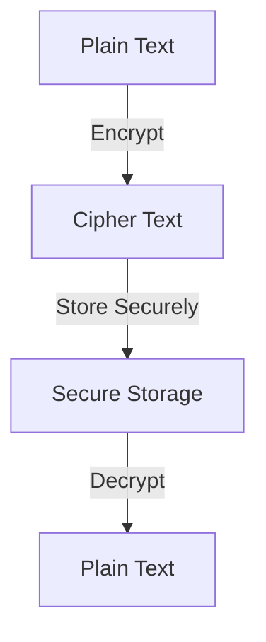

## 15.4.4 Handling Data Encryption

In today's digital landscape, data security is paramount. As developers, ensuring the confidentiality and integrity of user data is a critical responsibility. This section delves into the intricacies of data encryption within Flutter applications, offering insights into best practices, practical implementations, and key management strategies.

### Understanding Encryption

Encryption is the process of converting data into a coded format, making it unreadable to unauthorized users. This transformation ensures that sensitive information remains confidential and secure, accessible only to those with the correct decryption key. Encryption is a cornerstone of data security, protecting information both in transit and at rest.

#### Types of Encryption

- **Symmetric Encryption:** Uses the same key for both encryption and decryption. It's fast and suitable for encrypting large amounts of data.
- **Asymmetric Encryption:** Utilizes a pair of keys (public and private) for encryption and decryption. It's more secure but computationally intensive, often used for encrypting small data like keys.

### Encryption in Transit

Data in transit refers to information actively moving from one location to another, such as across the internet or through a private network. Encrypting data in transit is crucial to prevent interception by malicious actors.

#### Using TLS/SSL Protocols

Transport Layer Security (TLS) and Secure Sockets Layer (SSL) are cryptographic protocols designed to provide secure communication over a network. They encrypt the data being transmitted, ensuring that it cannot be read or tampered with during transit.

- **Implementing TLS/SSL in Flutter:**
  - Use HTTPS for all network requests.
  - Validate SSL certificates to prevent man-in-the-middle attacks.
  - Consider using libraries like `http` or `dio` that support HTTPS out of the box.

```dart
import 'package:http/http.dart' as http;

Future<void> fetchData() async {
  final response = await http.get(Uri.parse('https://secureapi.example.com/data'));

  if (response.statusCode == 200) {
    // Process the data
  } else {
    // Handle the error
  }
}
```

### Encryption at Rest

Data at rest refers to inactive data stored physically in any digital form (e.g., databases, data warehouses). Encrypting data at rest protects it from unauthorized access and breaches.

#### Encrypting Sensitive Data

Sensitive data stored on devices or servers should be encrypted to prevent unauthorized access. This includes personal information, passwords, and financial data.

- **Using the `encrypt` Package:**

The `encrypt` package in Dart provides a simple API for encrypting and decrypting data using various algorithms.

```dart
import 'package:encrypt/encrypt.dart';

void main() {
  final key = Key.fromUtf8('my 32 length key................');
  final iv = IV.fromLength(16);

  final encrypter = Encrypter(AES(key));

  final encrypted = encrypter.encrypt('Sensitive Data', iv: iv);
  print('Encrypted: ${encrypted.base64}');

  final decrypted = encrypter.decrypt(encrypted, iv: iv);
  print('Decrypted: $decrypted');
}
```

### Using Cryptography Libraries

Cryptography libraries provide the tools necessary to implement encryption and decryption in applications. They offer various algorithms and utilities to ensure data security.

#### Trusted Libraries

- **`encrypt`:** A popular Dart package for encryption tasks, supporting AES, RSA, and more.
- **`pointycastle`:** A comprehensive cryptographic library for Dart, offering a wide range of algorithms.

### Key Management

Proper key management is crucial for maintaining the security of encrypted data. Poor key management can lead to data breaches and unauthorized access.

#### Best Practices for Key Management

- **Do Not Hard-Code Keys:** Avoid embedding encryption keys directly in your application's source code. This practice exposes keys to potential attackers.
- **Use Secure Storage Solutions:** Store keys securely using platforms like Android's Keystore or iOS's Keychain.
- **Rotate Keys Regularly:** Regularly update encryption keys to minimize the risk of compromise.
- **Access Control:** Limit access to encryption keys to only those who absolutely need it.

#### Example of Secure Key Storage

- **Android Keystore:**

```java
KeyStore keyStore = KeyStore.getInstance("AndroidKeyStore");
keyStore.load(null);

KeyGenerator keyGenerator = KeyGenerator.getInstance(KeyProperties.KEY_ALGORITHM_AES, "AndroidKeyStore");
keyGenerator.init(
    new KeyGenParameterSpec.Builder("keyAlias",
        KeyProperties.PURPOSE_ENCRYPT | KeyProperties.PURPOSE_DECRYPT)
        .setBlockModes(KeyProperties.BLOCK_MODE_CBC)
        .setEncryptionPaddings(KeyProperties.ENCRYPTION_PADDING_PKCS7)
        .build());
SecretKey key = keyGenerator.generateKey();
```

- **iOS Keychain:**

```swift
let keychain = Keychain(service: "com.example.app")
keychain["encryptionKey"] = "mySecureKey"
```

### Practical Examples and Real-World Scenarios

Consider a scenario where you are developing a Flutter application that handles user credentials. Encrypting these credentials before storing them on the device ensures that even if the device is compromised, the data remains secure.

#### Encrypting User Credentials

```dart
import 'package:encrypt/encrypt.dart';

class SecureStorage {
  final _key = Key.fromUtf8('my 32 length key................');
  final _iv = IV.fromLength(16);
  final _encrypter = Encrypter(AES(_key));

  String encryptData(String data) {
    final encrypted = _encrypter.encrypt(data, iv: _iv);
    return encrypted.base64;
  }

  String decryptData(String encryptedData) {
    final decrypted = _encrypter.decrypt64(encryptedData, iv: _iv);
    return decrypted;
  }
}
```

### Diagrams and Visual Aids

To better understand the flow of data encryption and decryption, consider the following diagram illustrating the process:



### Best Practices and Common Pitfalls

- **Avoid Weak Encryption Algorithms:** Use strong, industry-standard algorithms like AES-256.
- **Regularly Update Libraries:** Keep cryptographic libraries up to date to benefit from security patches.
- **Test Encryption Implementations:** Regularly test your encryption logic to ensure it functions correctly and securely.

### Additional Resources

- [Flutter Security Guidelines](https://flutter.dev/docs/development/ui/advanced/security)
- [Dart `encrypt` Package Documentation](https://pub.dev/packages/encrypt)
- [OWASP Mobile Security Project](https://owasp.org/www-project-mobile-security/)

### Conclusion

Handling data encryption in Flutter is a critical aspect of building secure applications. By understanding encryption principles, implementing secure data transmission and storage, and managing encryption keys effectively, you can protect sensitive information and maintain user trust. As you continue to develop your Flutter applications, keep these best practices in mind to ensure robust data security.

## Quiz Time!



### What is the primary purpose of encryption?

- [x] To transform data into a secure format that can only be read with the correct key.
- [ ] To compress data for faster transmission.
- [ ] To convert data into a human-readable format.
- [ ] To duplicate data for backup purposes.

> **Explanation:** Encryption is used to secure data by transforming it into a format that is unreadable without the correct decryption key.

### Which protocol is commonly used to secure data in transit?

- [x] TLS/SSL
- [ ] FTP
- [ ] HTTP
- [ ] SMTP

> **Explanation:** TLS/SSL protocols are used to encrypt data in transit, ensuring secure communication over networks.

### What is a key difference between symmetric and asymmetric encryption?

- [x] Symmetric encryption uses the same key for encryption and decryption, while asymmetric encryption uses a pair of keys.
- [ ] Symmetric encryption is slower than asymmetric encryption.
- [ ] Asymmetric encryption uses the same key for encryption and decryption.
- [ ] Symmetric encryption is more secure than asymmetric encryption.

> **Explanation:** Symmetric encryption uses a single key for both processes, whereas asymmetric encryption uses a public and private key pair.

### Why should encryption keys not be hard-coded in an app?

- [x] It exposes the keys to potential attackers.
- [ ] It makes the app run slower.
- [ ] It increases the app's size.
- [ ] It complicates the code structure.

> **Explanation:** Hard-coding keys in an app's source code can lead to security vulnerabilities if the code is accessed by unauthorized users.

### Which library is recommended for encryption tasks in Flutter?

- [x] encrypt
- [ ] dio
- [ ] http
- [ ] json_serializable

> **Explanation:** The `encrypt` package is specifically designed for encryption tasks in Flutter, providing a simple API for various encryption algorithms.

### What is the purpose of using an IV (Initialization Vector) in encryption?

- [x] To ensure that the same plaintext encrypts to different ciphertexts each time.
- [ ] To increase the speed of encryption.
- [ ] To compress the data before encryption.
- [ ] To convert ciphertext back to plaintext.

> **Explanation:** An IV is used to add randomness to the encryption process, ensuring that identical plaintexts result in different ciphertexts.

### What is a common method for securely storing encryption keys on Android?

- [x] Android Keystore
- [ ] Shared Preferences
- [ ] SQLite Database
- [ ] External Storage

> **Explanation:** The Android Keystore system provides a secure way to store cryptographic keys, protecting them from unauthorized access.

### What is a key benefit of encrypting data at rest?

- [x] It protects stored data from unauthorized access.
- [ ] It speeds up data retrieval.
- [ ] It reduces storage space requirements.
- [ ] It simplifies data management.

> **Explanation:** Encrypting data at rest ensures that even if storage is compromised, the data remains secure and inaccessible without the decryption key.

### Which of the following is a best practice for key management?

- [x] Regularly rotate encryption keys.
- [ ] Store keys in plain text files.
- [ ] Share keys with all team members.
- [ ] Use the same key for all applications.

> **Explanation:** Regularly rotating encryption keys minimizes the risk of key compromise and enhances security.

### True or False: Using outdated cryptographic libraries can lead to security vulnerabilities.

- [x] True
- [ ] False

> **Explanation:** Outdated libraries may contain known vulnerabilities that can be exploited, so it's important to keep them updated.


