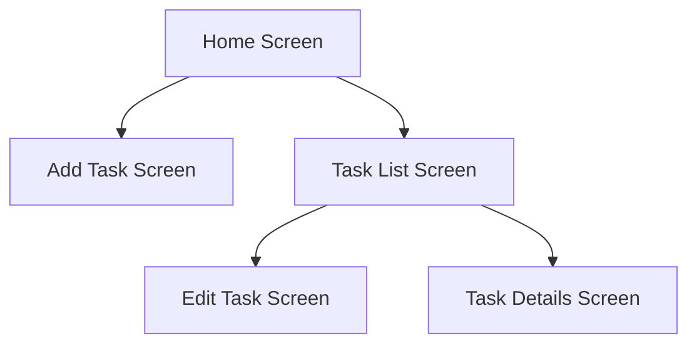
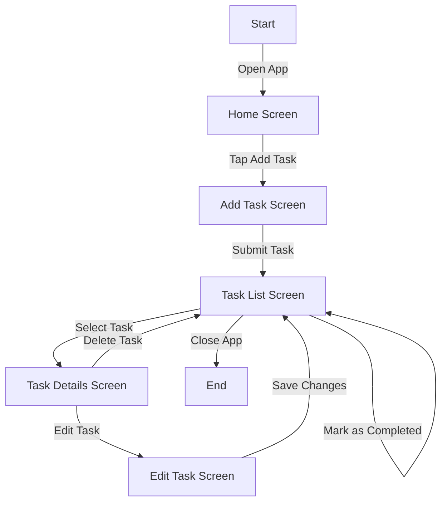

## 16.1.1 Project Overview

### Introduction to the To-Do App Project

#### Purpose and Goals

The To-Do app is a quintessential project for beginners diving into Flutter development. It serves as a practical exercise to reinforce fundamental concepts and techniques that are crucial for building robust mobile applications. The primary goal of this project is to create a simple, yet functional application that allows users to manage their tasks efficiently. Through this project, you will gain hands-on experience in implementing CRUD (Create, Read, Update, Delete) operations, which are essential for any data-driven application.

The To-Do app will enable users to:

- Add new tasks with specific titles and descriptions.
- View a list of all tasks, categorized by their completion status.
- Edit existing tasks to update their details.
- Delete tasks that are no longer needed.

By the end of this project, you will have a deeper understanding of how to manage state in Flutter applications, build interactive user interfaces, and ensure data persistence using local storage solutions.

#### Learning Objectives

This project is designed to help you achieve the following learning objectives:

- **Implement CRUD Operations:** Learn how to create, read, update, and delete tasks within the app. This will involve understanding how to manipulate data and update the UI accordingly.
- **State Management:** Explore different state management techniques to handle user input and maintain the state of tasks. This includes using `setState`, Provider, or other state management solutions.
- **Interactive UI Elements:** Practice building interactive UI components that respond to user actions, such as buttons, input fields, and lists.
- **Data Persistence:** Implement local data storage to ensure that tasks are saved and retrieved even after the app is closed and reopened. You will explore options like `SharedPreferences`, `sqflite`, or `hive` for data persistence.

### Features of the To-Do App

#### Task Management

The core functionality of the To-Do app revolves around effective task management. Users should be able to:

- **Add Tasks:** Provide a simple form where users can enter a task title and description. This form should validate input to ensure that tasks are meaningful.
- **View Tasks:** Display a list of tasks, allowing users to easily see which tasks are pending and which are completed. Consider using a ListView for an efficient and scrollable list.
- **Edit Tasks:** Allow users to modify the details of existing tasks. This requires updating the task data and reflecting changes in the UI.
- **Delete Tasks:** Enable users to remove tasks they no longer need, with a confirmation prompt to prevent accidental deletions.

#### Persistence

To enhance the user experience, the app should save tasks locally so that they persist across sessions. This involves:

- **Local Storage Options:** Choose a suitable local storage solution such as `SharedPreferences` for simple key-value pairs, `sqflite` for a full-fledged SQLite database, or `hive` for a lightweight and fast NoSQL database.
- **Data Synchronization:** Ensure that the app synchronizes data between the UI and the local storage, updating the display whenever tasks are added, edited, or deleted.

#### User Interface

A clean and intuitive user interface is crucial for user engagement. The UI should be:

- **Easy to Navigate:** Design a layout that is straightforward and user-friendly, allowing users to perform actions with minimal effort.
- **Visually Appealing:** Use Flutter's rich set of widgets to create a visually appealing interface. Consider incorporating Material Design principles for consistency and familiarity.
- **Responsive:** Ensure that the UI adapts to different screen sizes and orientations, providing a seamless experience on both phones and tablets.

### Visual Aids

#### Mockups and Wireframes

Before diving into the code, it's beneficial to sketch out the app's design. Wireframes help visualize the layout and flow of the app, providing a blueprint for development. Below is a simple wireframe of the To-Do app's main screens:

- **Home Screen:** The entry point of the app, displaying a summary of tasks and navigation options.
- **Add Task Screen:** A form for entering new task details.
- **Task List Screen:** A comprehensive list of all tasks, with options to edit or delete.
- **Edit Task Screen:** A form similar to the Add Task Screen, pre-filled with the task's current details for editing.
- **Task Details Screen:** An optional screen providing more information about a selected task.

#### Flow Diagram

Understanding how users interact with the app is crucial for designing a smooth user experience. The following flowchart illustrates the user journey through the app's features:

- **Start:** The user opens the app and lands on the Home Screen.
- **Add Task:** The user navigates to the Add Task Screen to create a new task.
- **Task List:** After adding a task, the user returns to the Task List Screen to view all tasks.
- **Task Details:** Selecting a task leads to the Task Details Screen, where the user can choose to edit or delete the task.
- **Edit Task:** If editing, the user is taken to the Edit Task Screen to make changes.
- **Completion:** Tasks can be marked as completed directly from the Task List Screen.

### Engaging the Reader

Building a To-Do app is not just about coding; it's an opportunity to apply theoretical knowledge in a practical setting. As you work through this project, consider the following:

- **Additional Features:** Think about what other features could enhance the app. For example, you might add categories for tasks, implement notifications for due dates, or integrate cloud storage for cross-device synchronization.
- **Customization:** Customize the app's appearance and functionality to suit your preferences. This could involve experimenting with different color schemes, fonts, or animations.
- **Challenges:** Embrace challenges as learning opportunities. Debugging and problem-solving are integral parts of the development process.

### Setting Clear Expectations

By the end of this project, you will have:

- Developed a fully functional To-Do app with a clean and intuitive user interface.
- Gained experience in implementing CRUD operations and managing state in Flutter.
- Learned how to persist data locally using various storage solutions.
- Enhanced your understanding of Flutter's widget system and UI design principles.

### Reference Previous Chapters

As you embark on this project, remember to leverage the knowledge and skills acquired in previous chapters:

- **Chapter 2: Dart Programming Fundamentals** - Review Dart syntax and data structures, which are essential for handling task data.
- **Chapter 3: Flutter Basics: Widgets and Layouts** - Revisit the concepts of widgets and layouts to design the app's UI.
- **Chapter 6: State Management** - Apply state management techniques to keep the app responsive and efficient.
- **Chapter 8: Working with APIs and Data** - Although this project focuses on local storage, understanding data handling will be beneficial for future projects involving remote data.

By integrating these concepts, you'll be well-equipped to tackle the To-Do app project and any future Flutter endeavors.

## Quiz Time!



### What is the primary goal of building a To-Do app in Flutter?

- [x] To reinforce fundamental Flutter concepts through practical application.
- [ ] To create a complex enterprise-level application.
- [ ] To learn about advanced networking in Flutter.
- [ ] To implement machine learning algorithms in Flutter.

> **Explanation:** The primary goal is to reinforce fundamental Flutter concepts through practical application, focusing on CRUD operations, state management, and UI design.

### Which operations are essential for managing tasks in the To-Do app?

- [x] Create, Read, Update, Delete (CRUD)
- [ ] Search, Filter, Sort, Export
- [ ] Encrypt, Decrypt, Compress, Decompress
- [ ] Connect, Disconnect, Sync, Backup

> **Explanation:** CRUD operations are essential for managing tasks, allowing users to create, read, update, and delete tasks.

### What is a key feature of the To-Do app related to data persistence?

- [x] Saving tasks locally so they persist across sessions.
- [ ] Synchronizing tasks with a remote server.
- [ ] Encrypting all task data for security.
- [ ] Automatically generating tasks based on user behavior.

> **Explanation:** A key feature is saving tasks locally so they persist across sessions, using local storage solutions like `SharedPreferences`, `sqflite`, or `hive`.

### Which Flutter concept is crucial for handling user input and maintaining task state?

- [x] State Management
- [ ] Animation Framework
- [ ] Networking
- [ ] Theming

> **Explanation:** State management is crucial for handling user input and maintaining task state, ensuring the app remains responsive and data is accurately reflected in the UI.

### What should the user interface of the To-Do app prioritize?

- [x] Clean and intuitive design
- [ ] Complex animations
- [ ] Advanced networking features
- [ ] High-level security protocols

> **Explanation:** The user interface should prioritize a clean and intuitive design to enhance user engagement and ease of navigation.

### Which local storage option is NOT mentioned as a possibility for the To-Do app?

- [ ] SharedPreferences
- [ ] sqflite
- [ ] hive
- [x] Firebase

> **Explanation:** Firebase is not mentioned as a local storage option; the focus is on local solutions like `SharedPreferences`, `sqflite`, and `hive`.

### What is the purpose of wireframes in the app development process?

- [x] To visualize the layout and flow of the app before coding.
- [ ] To test the app's performance under load.
- [ ] To encrypt user data.
- [ ] To generate automated test cases.

> **Explanation:** Wireframes are used to visualize the layout and flow of the app before coding, providing a blueprint for development.

### Which chapter should you reference for understanding Flutter's widget system?

- [x] Chapter 3: Flutter Basics: Widgets and Layouts
- [ ] Chapter 5: Navigation and Routing
- [ ] Chapter 7: Handling User Input
- [ ] Chapter 9: Animations and Transitions

> **Explanation:** Chapter 3 covers Flutter's widget system and layouts, which are essential for designing the app's UI.

### What additional feature could enhance the To-Do app?

- [x] Implementing notifications for due dates.
- [ ] Adding machine learning capabilities.
- [ ] Integrating blockchain technology.
- [ ] Developing a virtual reality interface.

> **Explanation:** Implementing notifications for due dates could enhance the app by reminding users of upcoming tasks.

### True or False: The To-Do app project is designed to teach advanced networking techniques.

- [ ] True
- [x] False

> **Explanation:** False. The To-Do app project focuses on fundamental Flutter concepts, not advanced networking techniques.


