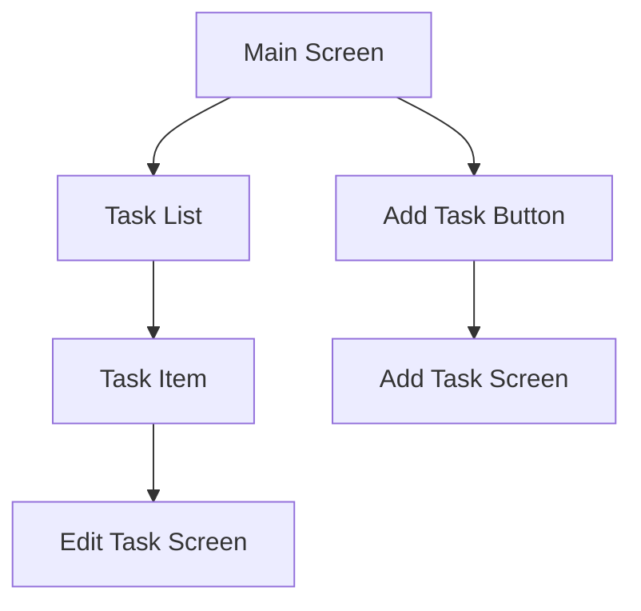

## 16.1.2 Designing the UI

Designing the user interface (UI) for a Flutter To-Do app involves combining various widgets and design principles to create an intuitive and efficient user experience. This section will guide you through the process of building a functional and visually appealing UI, focusing on fundamental components, user interactions, and best practices.

### Fundamental UI Components

#### App Structure

The foundation of our To-Do app's UI will be built using the `Scaffold` widget. This widget provides a basic structure that includes an `AppBar` and a `FloatingActionButton`, essential for any Flutter app.

```dart
import 'package:flutter/material.dart';

void main() => runApp(ToDoApp());

class ToDoApp extends StatelessWidget {
  @override
  Widget build(BuildContext context) {
    return MaterialApp(
      title: 'To-Do App',
      theme: ThemeData(
        primarySwatch: Colors.blue,
      ),
      home: ToDoHomePage(),
    );
  }
}

class ToDoHomePage extends StatelessWidget {
  @override
  Widget build(BuildContext context) {
    return Scaffold(
      appBar: AppBar(
        title: Text('To-Do List'),
      ),
      body: TaskList(),
      floatingActionButton: FloatingActionButton(
        onPressed: () {
          // Action to add a new task
        },
        child: Icon(Icons.add),
      ),
    );
  }
}
```

**Explanation:**

- **`Scaffold`:** Provides the basic structure with an `AppBar` and `FloatingActionButton`.
- **`AppBar`:** Displays the title of the app.
- **`FloatingActionButton`:** Used to add new tasks, enhancing user interaction.

#### Task List Display

To display tasks, we will use a `ListView` with `ListTile` widgets. Each `ListTile` will represent an individual task, with an icon or checkbox to indicate completion status.

```dart
class TaskList extends StatelessWidget {
  final List<String> tasks = ['Task 1', 'Task 2', 'Task 3'];

  @override
  Widget build(BuildContext context) {
    return ListView.builder(
      itemCount: tasks.length,
      itemBuilder: (context, index) {
        return ListTile(
          title: Text(tasks[index]),
          leading: Icon(Icons.check_box_outline_blank),
          onTap: () {
            // Action to edit task
          },
        );
      },
    );
  }
}
```

**Explanation:**

- **`ListView.builder`:** Efficiently creates a scrollable list of tasks.
- **`ListTile`:** Represents each task with a title and an icon.
- **`leading`:** Displays an icon to indicate task status.

### Adding New Tasks

#### Input Forms

To add new tasks, we need an input form using `TextField` or `TextFormField` widgets. This form will capture the task title and description, with validation to ensure the title is not empty.

```dart
class AddTaskScreen extends StatelessWidget {
  final _formKey = GlobalKey<FormState>();
  final TextEditingController _titleController = TextEditingController();

  @override
  Widget build(BuildContext context) {
    return Scaffold(
      appBar: AppBar(
        title: Text('Add New Task'),
      ),
      body: Padding(
        padding: const EdgeInsets.all(16.0),
        child: Form(
          key: _formKey,
          child: Column(
            children: [
              TextFormField(
                controller: _titleController,
                decoration: InputDecoration(labelText: 'Task Title'),
                validator: (value) {
                  if (value == null || value.isEmpty) {
                    return 'Please enter a task title';
                  }
                  return null;
                },
              ),
              SizedBox(height: 20),
              ElevatedButton(
                onPressed: () {
                  if (_formKey.currentState!.validate()) {
                    // Save the task
                  }
                },
                child: Text('Add Task'),
              ),
            ],
          ),
        ),
      ),
    );
  }
}
```

**Explanation:**

- **`TextFormField`:** Captures user input for the task title.
- **`validator`:** Ensures the task title is not empty.
- **`ElevatedButton`:** Submits the form to add the task.

#### Dialog or New Screen

Decide whether to use a dialog or navigate to a new screen for task input. Here, we demonstrate using a new screen, but a dialog can be implemented using `showDialog`.

### Editing and Deleting Tasks

#### Swipe Actions

Implement swipe-to-delete functionality using the `Dismissible` widget, allowing users to remove tasks with a swipe gesture.

```dart
class TaskList extends StatelessWidget {
  final List<String> tasks = ['Task 1', 'Task 2', 'Task 3'];

  @override
  Widget build(BuildContext context) {
    return ListView.builder(
      itemCount: tasks.length,
      itemBuilder: (context, index) {
        return Dismissible(
          key: Key(tasks[index]),
          onDismissed: (direction) {
            // Remove the task from the list
          },
          background: Container(color: Colors.red),
          child: ListTile(
            title: Text(tasks[index]),
            leading: Icon(Icons.check_box_outline_blank),
            onTap: () {
              // Action to edit task
            },
          ),
        );
      },
    );
  }
}
```

**Explanation:**

- **`Dismissible`:** Wraps each `ListTile` to enable swipe-to-delete.
- **`background`:** Provides a visual cue during the swipe action.

#### Editing Tasks

Enable task editing by tapping on a task to open an edit screen or dialog. This can be achieved by navigating to an edit screen with pre-filled form fields.

### User Experience Enhancements

#### Visual Feedback

Use animations or transitions when adding or removing tasks to provide visual feedback and enhance user experience. For example, use `AnimatedList` for dynamic list changes.

#### Theming and Styling

Apply consistent styling using the app's theme. Use icons and colors to enhance the UI, ensuring a cohesive look and feel.

```dart
ThemeData appTheme = ThemeData(
  primarySwatch: Colors.blue,
  accentColor: Colors.orange,
  textTheme: TextTheme(
    bodyText1: TextStyle(fontSize: 18.0, fontWeight: FontWeight.bold),
  ),
);
```

**Explanation:**

- **`ThemeData`:** Defines the app's color scheme and text styles.
- **`primarySwatch` and `accentColor`:** Set the primary and accent colors.

### Visual Aids

#### UI Layout Diagrams

Below is a diagram illustrating the layout of the main screen and add/edit task screens.



**Explanation:**

- **Main Screen:** Contains the task list and add task button.
- **Add Task Screen:** Allows users to input new task details.
- **Edit Task Screen:** Enables task modification.

#### Before-and-After Screenshots

Provide examples of the UI before and after applying styling to illustrate the impact of theming and design choices.

### Best Practices

#### Accessibility

Ensure that interactive elements are accessible and have appropriate `semanticsLabel` properties. This improves usability for users with disabilities.

#### Responsive Design

Test the UI on different screen sizes and orientations to ensure a consistent experience across devices.

### Exercises

Encourage readers to customize the UI by adding personalized themes or additional UI elements, such as priority indicators or due dates.

### Step-by-Step Guidance

Break down the UI design process into manageable steps, providing clear instructions and code examples for each component.

### Code Examples

Include code snippets demonstrating how to build key UI components, with comments explaining important lines.

### Conclusion

Designing the UI for a Flutter To-Do app involves combining various widgets and design principles to create an intuitive and efficient user experience. By following best practices and focusing on accessibility and responsiveness, you can build a user-friendly app that meets the needs of a diverse audience.

## Quiz Time!



### What widget provides the basic structure for a Flutter app with an AppBar and FloatingActionButton?

- [x] Scaffold
- [ ] Container
- [ ] Column
- [ ] Row

> **Explanation:** The `Scaffold` widget provides a basic layout structure with an `AppBar` and `FloatingActionButton`.


### Which widget is used to display a scrollable list of tasks in the To-Do app?

- [x] ListView
- [ ] GridView
- [ ] Stack
- [ ] Card

> **Explanation:** `ListView` is used to display a scrollable list of items, such as tasks in a To-Do app.


### What widget is used to represent individual tasks within a ListView?

- [x] ListTile
- [ ] Card
- [ ] Container
- [ ] Text

> **Explanation:** `ListTile` is a convenient widget for displaying a single row of information, such as a task.


### How can you implement swipe-to-delete functionality in a Flutter app?

- [x] Using the Dismissible widget
- [ ] Using the GestureDetector widget
- [ ] Using the InkWell widget
- [ ] Using the AnimatedContainer widget

> **Explanation:** The `Dismissible` widget allows you to implement swipe-to-delete functionality by wrapping each item.


### What is the purpose of the validator property in a TextFormField?

- [x] To ensure the input meets certain criteria
- [ ] To style the input field
- [ ] To handle input focus
- [ ] To display input suggestions

> **Explanation:** The `validator` property is used to ensure that the input meets specific criteria, such as not being empty.


### Which widget can be used to provide visual feedback when adding or removing tasks?

- [x] AnimatedList
- [ ] ListView
- [ ] GridView
- [ ] Stack

> **Explanation:** `AnimatedList` provides animations for adding or removing items, enhancing visual feedback.


### How can you ensure that interactive elements are accessible in a Flutter app?

- [x] By using semanticsLabel properties
- [ ] By using Container widgets
- [ ] By using GestureDetector widgets
- [ ] By using Stack widgets

> **Explanation:** Using `semanticsLabel` properties ensures that interactive elements are accessible to users with disabilities.


### What is a key benefit of applying consistent theming in a Flutter app?

- [x] It ensures a cohesive look and feel
- [ ] It reduces app size
- [ ] It improves network performance
- [ ] It simplifies code logic

> **Explanation:** Consistent theming ensures a cohesive look and feel across the app, enhancing user experience.


### Which widget is used to capture user input for a new task title?

- [x] TextFormField
- [ ] Text
- [ ] Icon
- [ ] Button

> **Explanation:** `TextFormField` is used to capture user input, such as a new task title, with validation capabilities.


### True or False: The Dismissible widget can only be used for swipe-to-delete actions.

- [ ] True
- [x] False

> **Explanation:** While the `Dismissible` widget is commonly used for swipe-to-delete actions, it can also be used for other swipe-based interactions.


