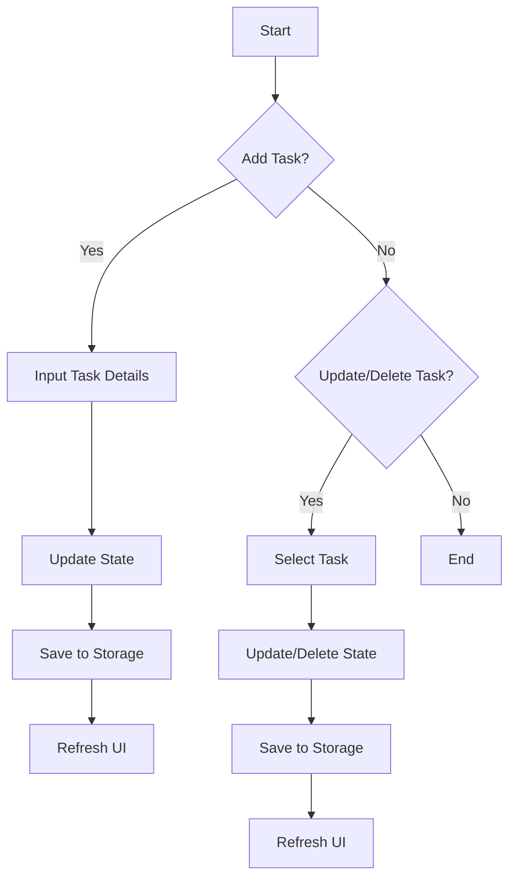
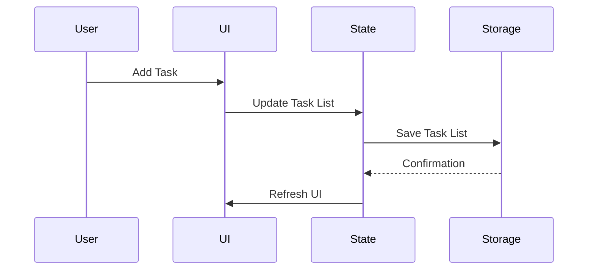

## 16.1.3 Implementing Functionality

In this section, we will delve into the implementation of core functionalities for a Flutter To-Do app. This involves managing state, performing CRUD operations, ensuring data persistence, and handling user interactions. By the end of this chapter, you will have a comprehensive understanding of how to build a functional To-Do app with Flutter, equipped with best practices and scalable architecture.

### State Management

#### Choosing a State Management Solution

State management is a crucial aspect of any Flutter application. For a simple To-Do app, using Flutter's built-in `setState` method might be sufficient. However, as the app grows, you might want to consider more scalable solutions like `Provider`, `Riverpod`, or `Bloc`.

- **Using `setState`:** Ideal for small applications where state changes are minimal and localized. It is straightforward but can become cumbersome as the app complexity increases.
  
- **Using `Provider`:** A popular choice for managing state in Flutter apps. It offers a more scalable approach by separating business logic from UI components, making the codebase more maintainable.

Here's a simple example of using `Provider` to manage a list of tasks:

```dart
import 'package:flutter/material.dart';
import 'package:provider/provider.dart';

void main() {
  runApp(
    ChangeNotifierProvider(
      create: (context) => TaskData(),
      child: MyApp(),
    ),
  );
}

class TaskData extends ChangeNotifier {
  List<String> _tasks = [];

  List<String> get tasks => _tasks;

  void addTask(String task) {
    _tasks.add(task);
    notifyListeners();
  }

  void removeTask(int index) {
    _tasks.removeAt(index);
    notifyListeners();
  }
}
```

#### Managing Task Data

The core of our To-Do app is the task list, which we will maintain in the app's state. This list will be dynamically updated as users add, edit, or delete tasks.

### CRUD Operations

CRUD (Create, Read, Update, Delete) operations form the backbone of our app's functionality. Let's explore how to implement each of these operations.

#### Creating Tasks

To add a new task, we need a user interface that allows users to input task details. We will then update the task list in the state.

```dart
class AddTaskScreen extends StatelessWidget {
  @override
  Widget build(BuildContext context) {
    String newTaskTitle;

    return Container(
      padding: EdgeInsets.all(20.0),
      child: Column(
        crossAxisAlignment: CrossAxisAlignment.stretch,
        children: <Widget>[
          TextField(
            autofocus: true,
            onChanged: (newText) {
              newTaskTitle = newText;
            },
          ),
          FlatButton(
            child: Text('Add'),
            onPressed: () {
              Provider.of<TaskData>(context, listen: false).addTask(newTaskTitle);
              Navigator.pop(context);
            },
          ),
        ],
      ),
    );
  }
}
```

#### Reading Tasks

Displaying tasks involves reading the current state and rendering it in the UI. We can use Flutter's `ListView` widget to dynamically display the list of tasks.

```dart
class TaskList extends StatelessWidget {
  @override
  Widget build(BuildContext context) {
    return Consumer<TaskData>(
      builder: (context, taskData, child) {
        return ListView.builder(
          itemCount: taskData.tasks.length,
          itemBuilder: (context, index) {
            return ListTile(
              title: Text(taskData.tasks[index]),
            );
          },
        );
      },
    );
  }
}
```

#### Updating Tasks

To update a task, we need to allow users to edit the task details and then update the state accordingly.

```dart
void updateTask(int index, String newTaskTitle) {
  _tasks[index] = newTaskTitle;
  notifyListeners();
}
```

#### Deleting Tasks

Removing a task from the list is straightforward. We simply remove the task from the state and refresh the UI.

```dart
void removeTask(int index) {
  _tasks.removeAt(index);
  notifyListeners();
}
```

### Data Persistence

To ensure that tasks are not lost when the app is closed, we need to implement data persistence. There are several options available in Flutter for local storage.

#### Local Storage Options

- **`SharedPreferences`:** Suitable for simple key-value storage. Ideal for storing small amounts of data like user preferences.
  
- **`sqflite`:** A SQLite plugin for Flutter. It is a good choice for more complex data storage needs.
  
- **`hive`:** A lightweight and fast NoSQL database for Flutter. It is easy to use and integrates well with Flutter apps.

#### Implementing Persistence

Let's use `SharedPreferences` to persist our task list. This involves saving the task list whenever changes occur and loading it when the app starts.

```dart
import 'package:shared_preferences/shared_preferences.dart';

class TaskData extends ChangeNotifier {
  List<String> _tasks = [];

  List<String> get tasks => _tasks;

  Future<void> loadTasks() async {
    SharedPreferences prefs = await SharedPreferences.getInstance();
    _tasks = prefs.getStringList('tasks') ?? [];
    notifyListeners();
  }

  Future<void> saveTasks() async {
    SharedPreferences prefs = await SharedPreferences.getInstance();
    prefs.setStringList('tasks', _tasks);
  }

  void addTask(String task) {
    _tasks.add(task);
    saveTasks();
    notifyListeners();
  }

  void removeTask(int index) {
    _tasks.removeAt(index);
    saveTasks();
    notifyListeners();
  }
}
```

### Marking Tasks as Completed

To mark tasks as completed, we can add a boolean property to each task and update the UI accordingly.

```dart
class Task {
  final String name;
  bool isDone;

  Task({this.name, this.isDone = false});

  void toggleDone() {
    isDone = !isDone;
  }
}
```

Update the UI to reflect the completed status:

```dart
ListTile(
  title: Text(
    task.name,
    style: TextStyle(
      decoration: task.isDone ? TextDecoration.lineThrough : null,
    ),
  ),
  trailing: Checkbox(
    value: task.isDone,
    onChanged: (bool newValue) {
      task.toggleDone();
      notifyListeners();
    },
  ),
)
```

### Error Handling

#### Validations

Ensure that users cannot add empty tasks by validating input before updating the state.

```dart
if (newTaskTitle != null && newTaskTitle.isNotEmpty) {
  Provider.of<TaskData>(context, listen: false).addTask(newTaskTitle);
}
```

#### Exception Handling

Handle exceptions when interacting with local storage to prevent app crashes.

```dart
try {
  prefs.setStringList('tasks', _tasks);
} catch (e) {
  print('Failed to save tasks: $e');
}
```

### Visual Aids

#### Flowcharts

Below is a flowchart illustrating the logic flow for adding, updating, and deleting tasks.



#### Code Diagrams

The following diagram shows how state changes impact the UI.



### Best Practices

#### Separation of Concerns

Keep business logic separate from UI code to enhance maintainability and scalability. Use models and services to handle data operations.

#### Scalability

Structure your code to facilitate future feature additions. Use design patterns like MVVM (Model-View-ViewModel) or MVC (Model-View-Controller) to organize your codebase.

### Exercises

#### Feature Extension

- **Sorting Tasks:** Implement a feature that sorts tasks by creation date or priority.
- **Task Categories:** Allow users to categorize tasks and filter them based on categories.

### Conclusion

By following the steps outlined in this chapter, you have implemented a functional To-Do app in Flutter. This app demonstrates key concepts such as state management, CRUD operations, data persistence, and error handling. As you continue to develop your app, consider exploring more advanced features and optimizations.

## Quiz Time!



### What is the primary purpose of state management in a Flutter app?

- [x] To manage and update the UI based on data changes
- [ ] To handle network requests
- [ ] To store data permanently
- [ ] To design the app's layout

> **Explanation:** State management is crucial for managing and updating the UI based on changes in the app's data.

### Which state management solution is recommended for a simple Flutter app?

- [x] setState
- [ ] Bloc
- [ ] Redux
- [ ] Riverpod

> **Explanation:** For simple apps, `setState` is often sufficient to manage state changes.

### What is the role of the `Provider` package in Flutter?

- [x] To manage state and provide data to widgets
- [ ] To handle HTTP requests
- [ ] To create animations
- [ ] To manage app navigation

> **Explanation:** The `Provider` package is used for state management, allowing data to be shared across widgets efficiently.

### How can tasks be persisted locally in a Flutter app?

- [x] Using SharedPreferences, sqflite, or hive
- [ ] Using HTTP requests
- [ ] Using Firebase
- [ ] Using XML files

> **Explanation:** Local storage options like `SharedPreferences`, `sqflite`, and `hive` are used to persist data locally in Flutter apps.

### What is the purpose of marking tasks as completed in a To-Do app?

- [x] To visually indicate task completion
- [ ] To delete tasks
- [ ] To prioritize tasks
- [ ] To sort tasks

> **Explanation:** Marking tasks as completed provides a visual indication of their completion status, often using styles like strikethrough.

### What should be done to prevent empty tasks from being added?

- [x] Validate input before updating the state
- [ ] Use a database
- [ ] Use a different state management solution
- [ ] Use a different UI framework

> **Explanation:** Input validation ensures that only non-empty tasks are added to the state.

### Which of the following is a best practice for scalable app development?

- [x] Separation of concerns
- [ ] Using only `setState`
- [ ] Hardcoding values
- [ ] Avoiding state management

> **Explanation:** Separation of concerns helps in organizing code and making it scalable and maintainable.

### What is the benefit of using flowcharts in app development?

- [x] To visualize logic flow and processes
- [ ] To write code
- [ ] To design UI
- [ ] To manage state

> **Explanation:** Flowcharts help in visualizing the logic flow and processes, aiding in better understanding and planning.

### How can you handle exceptions when reading from or writing to storage?

- [x] Use try-catch blocks
- [ ] Ignore them
- [ ] Use a different storage solution
- [ ] Use a different programming language

> **Explanation:** Using try-catch blocks allows you to handle exceptions gracefully, preventing app crashes.

### True or False: The `Provider` package can only be used for state management in large applications.

- [ ] True
- [x] False

> **Explanation:** The `Provider` package can be used for state management in both small and large applications, offering scalability and flexibility.


