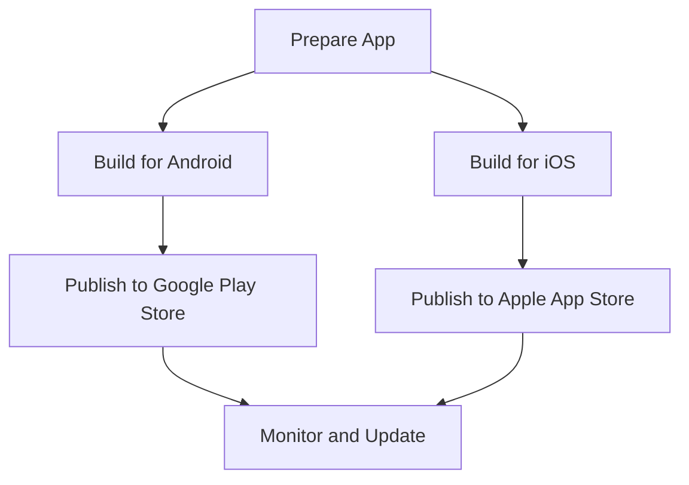

## 16.1.4 Deploying the To-Do App

Deploying your Flutter To-Do app is an exciting milestone that transforms your project from a local development environment to a globally accessible application. This section provides a comprehensive guide to preparing, building, and deploying your app to both the Google Play Store and the Apple App Store. We will cover essential steps, from customizing app icons and splash screens to setting up continuous integration and monitoring post-deployment performance.

### Preparing for Deployment

Before you can deploy your app, it's crucial to ensure that it is polished and ready for the public. This involves customizing visual elements, preparing metadata, and thoroughly testing your application.

#### App Icons and Splash Screens

Customizing your app's icon and splash screen is a vital step in branding your application. These elements are the first things users see and can significantly impact their first impression.

- **App Icons:**
  Use the `flutter_launcher_icons` package to generate app icons for different platforms. This tool simplifies the process of creating icons in various sizes required by Android and iOS.

  ```yaml
  dev_dependencies:
    flutter_launcher_icons: ^0.9.0

  flutter_icons:
    android: true
    ios: true
    image_path: "assets/icon/icon.png"
  ```

  Run the following command to generate the icons:

  ```bash
  flutter pub run flutter_launcher_icons:main
  ```

- **Splash Screens:**
  The `flutter_native_splash` package helps you create a splash screen that appears while your app is loading.

  ```yaml
  dev_dependencies:
    flutter_native_splash: ^1.2.0

  flutter_native_splash:
    color: "#ffffff"
    image: assets/splash/splash.png
  ```

  Generate the splash screen with:

  ```bash
  flutter pub run flutter_native_splash:create
  ```

These tools automate the process of creating and configuring icons and splash screens, ensuring consistency across devices.

#### App Metadata

Writing compelling app metadata is crucial for attracting users and improving your app's visibility in app stores. This includes:

- **App Description:** Clearly describe what your app does, highlighting its unique features and benefits.
- **Keywords:** Use relevant keywords to improve searchability.
- **Screenshots:** Capture high-quality screenshots that showcase your app's interface and functionality.

#### Testing

Testing is a critical phase that ensures your app functions correctly across different devices and screen sizes. Use the following strategies:

- **Device Testing:** Test your app on various devices to ensure compatibility and responsiveness.
- **Automated Testing:** Use `flutter test` to run unit and widget tests, ensuring your app's logic and UI behave as expected.

```bash
flutter test
```

### Building the App

Once your app is ready and thoroughly tested, the next step is to build it for deployment.

#### Android

To build a release APK for Android, use the following command:

```bash
flutter build apk --release
```

This command compiles your app into a release-ready APK, optimized for performance and size.

#### iOS

Building for iOS requires a macOS system with Xcode installed. Use the following command to create a release build:

```bash
flutter build ios --release
```

Ensure that your Xcode project is configured correctly, with the necessary signing certificates and provisioning profiles.

### Publishing

With your app built, it's time to publish it to app stores. This process varies slightly between the Google Play Store and the Apple App Store.

#### Google Play Store

1. **Create a Developer Account:** Sign up for a Google Play Developer account if you haven't already.
2. **Prepare App Listing:** Fill out the app listing details, including the app description, screenshots, and pricing.
3. **Upload the APK/App Bundle:** Use the Google Play Console to upload your APK or app bundle.

#### Apple App Store

1. **Enroll in the Apple Developer Program:** This is required to publish apps on the App Store.
2. **Use Xcode for Uploading:** Open your project in Xcode and use the Archive feature to upload your app.
3. **Manage App Store Listing:** Configure your app's metadata and submit it for review.

### Continuous Integration/Continuous Deployment (CI/CD)

Implementing CI/CD can streamline your deployment process, automating builds and tests. Consider using tools like Codemagic, GitHub Actions, or Bitrise to set up a CI/CD pipeline.

- **Codemagic:** Offers seamless integration with Flutter, automating the build and deployment process.
- **GitHub Actions:** Provides customizable workflows for building, testing, and deploying your app.
- **Bitrise:** A flexible CI/CD platform with support for Flutter and other mobile frameworks.

### Post-Deployment

After your app is live, continuous monitoring and updates are essential to maintain its success.

#### Monitoring

Use analytics tools to track app performance and user engagement. This data can provide insights into how users interact with your app and identify areas for improvement.

#### Updates

Regularly update your app based on user feedback and performance data. This not only improves user satisfaction but also keeps your app relevant and competitive.

### Visual Aids

#### Deployment Flowchart

Below is a flowchart illustrating the deployment process from building the app to publishing it on app stores.



#### Screenshots

Include screenshots of the app store submission process to provide a visual guide for each step.

### Encouragement

Publishing your first app is a significant achievement. It not only showcases your skills but also opens up opportunities for feedback and growth. Embrace the journey, learn from user interactions, and continue to iterate on your app to make it even better.

By following this comprehensive guide, you are well on your way to successfully deploying your Flutter To-Do app. Remember, the key to a successful deployment is thorough preparation, testing, and a willingness to adapt based on user feedback.

## Quiz Time!



### What tool can you use to generate app icons for Flutter?

- [x] flutter_launcher_icons
- [ ] flutter_native_splash
- [ ] flutter_icons_generator
- [ ] icon_maker

> **Explanation:** The `flutter_launcher_icons` package is used to generate app icons for Flutter applications.

### Which command is used to build a release APK for Android?

- [x] flutter build apk --release
- [ ] flutter build ios --release
- [ ] flutter build appbundle --release
- [ ] flutter build android --release

> **Explanation:** The command `flutter build apk --release` is used to build a release APK for Android.

### What is required to publish an app on the Apple App Store?

- [x] Enrollment in the Apple Developer Program
- [ ] A Google Play Developer account
- [ ] A Windows operating system
- [ ] An Android device

> **Explanation:** To publish an app on the Apple App Store, you must be enrolled in the Apple Developer Program.

### Which tool can be used for automating the build and deployment process in Flutter?

- [x] Codemagic
- [ ] Xcode
- [ ] Android Studio
- [ ] Visual Studio Code

> **Explanation:** Codemagic is a CI/CD tool that can automate the build and deployment process for Flutter applications.

### What should you do after deploying your app?

- [x] Monitor app performance and user engagement
- [ ] Delete all test data
- [ ] Stop updating the app
- [ ] Ignore user feedback

> **Explanation:** After deploying your app, it's important to monitor its performance and user engagement to identify areas for improvement.

### What package helps create a splash screen in Flutter?

- [x] flutter_native_splash
- [ ] flutter_splash_screen
- [ ] splash_creator
- [ ] splash_maker

> **Explanation:** The `flutter_native_splash` package is used to create splash screens for Flutter applications.

### What is a key benefit of using CI/CD in app deployment?

- [x] Automating builds and tests
- [ ] Increasing app size
- [ ] Reducing code quality
- [ ] Eliminating the need for testing

> **Explanation:** CI/CD automates the build and test processes, making deployment more efficient and reliable.

### Which command is used to run unit and widget tests in Flutter?

- [x] flutter test
- [ ] flutter run
- [ ] flutter build
- [ ] flutter analyze

> **Explanation:** The `flutter test` command is used to run unit and widget tests in Flutter.

### What is the purpose of app metadata?

- [x] To attract users and improve app visibility
- [ ] To increase app size
- [ ] To reduce app functionality
- [ ] To hide app features

> **Explanation:** App metadata, including descriptions and keywords, helps attract users and improve the app's visibility in app stores.

### True or False: You can publish an iOS app using a Windows operating system.

- [ ] True
- [x] False

> **Explanation:** Publishing an iOS app requires a macOS system with Xcode, as Apple's development tools are not available on Windows.


