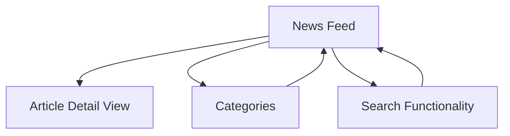
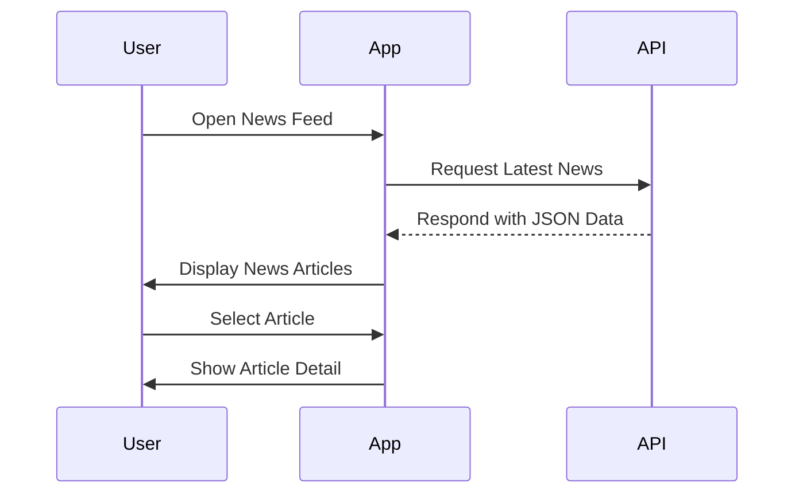

## 16.2.1 Project Overview

In this section, we delve into the development of a News Reader App using Flutter, a project that not only enhances your understanding of Flutter but also equips you with practical skills in working with RESTful APIs, JSON parsing, and asynchronous programming. This project is designed to be both educational and practical, providing a real-world application of the concepts covered in previous chapters.

### Introduction to the News Reader App

#### Purpose

The News Reader App serves as a comprehensive project to teach you how to build an application that fetches and displays news articles from external sources. This project will guide you through the process of integrating RESTful APIs, handling JSON data, and creating a dynamic user interface that updates with real-time content.

#### Learning Objectives

By the end of this project, you will have achieved the following objectives:

- **Work with RESTful APIs:** Learn how to connect your Flutter app to external data sources using RESTful APIs.
- **Parse JSON Data:** Understand how to parse JSON data and map it to Dart models for use within your application.
- **Implement Asynchronous Programming:** Master the use of `Future` and `async`/`await` to handle asynchronous operations efficiently.
- **Enhance UI Skills:** Develop your UI skills by creating dynamic content that updates as new data is fetched.

### Features of the News Reader App

The News Reader App is designed to be feature-rich, providing users with a seamless experience while exploring the latest news. Here are the key features you will implement:

#### News Feed

The core of the app is the news feed, which displays a list of the latest news articles. This feature will teach you how to fetch data from an API and display it in a user-friendly format using Flutter's powerful widget system.

#### Article Detail View

When a user selects an article from the news feed, they will be taken to a detailed view that shows the full content of the article. This feature will involve navigating between screens and passing data between them.

#### Categories

To enhance user experience, the app will allow users to filter news articles by categories such as sports, technology, and more. This will involve implementing a filtering mechanism that updates the news feed based on the selected category.

#### Search Functionality

The app will include a search feature that enables users to find articles by entering keywords. This will require implementing a search bar and handling user input to filter the displayed articles.

### Visual Aids

To better understand the structure and flow of the News Reader App, we will use visual aids such as diagrams to illustrate the app's architecture and data flow.

#### App Flow Diagram

The app flow diagram provides a visual representation of how users navigate through the app's screens. This diagram will help you understand the user journey and the interactions between different components of the app.

#### API Data Flow

The API data flow diagram illustrates how data is fetched from external sources and displayed within the app. This will help you visualize the process of making API requests, receiving responses, and updating the UI.

### Contextualization

Working with APIs is a crucial skill in modern app development, as it allows applications to access and display data from external sources. This project will give you hands-on experience in integrating APIs, a common requirement in many real-world applications. By learning to handle JSON data and implement asynchronous programming, you will be well-equipped to build robust and responsive applications.

### Prerequisite Knowledge

Before embarking on this project, ensure you are comfortable with the concepts covered in previous chapters, particularly those related to networking and data handling. Familiarity with Flutter's widget system and basic Dart programming is also essential.

### Conclusion

The News Reader App project is an excellent opportunity to apply your Flutter skills in a practical setting. By the end of this project, you will have a fully functional app that demonstrates your ability to work with APIs, handle dynamic data, and create a polished user interface. This project not only reinforces your learning but also provides a solid foundation for building more complex applications in the future.

## Quiz Time!



### What is the primary purpose of the News Reader App project?

- [x] To teach readers how to build an app that fetches and displays news articles from external sources.
- [ ] To create a static app with pre-loaded articles.
- [ ] To develop a game using Flutter.
- [ ] To implement a chat application.

> **Explanation:** The primary purpose of the News Reader App project is to teach readers how to build an app that fetches and displays news articles from external sources, focusing on RESTful APIs, JSON parsing, and asynchronous programming.

### Which feature allows users to filter news by categories?

- [x] Categories
- [ ] Search Functionality
- [ ] News Feed
- [ ] Article Detail View

> **Explanation:** The Categories feature allows users to filter news articles by categories such as sports, technology, etc.

### What programming concepts are emphasized in this project?

- [x] RESTful APIs, JSON parsing, and asynchronous programming
- [ ] Game development and animation
- [ ] Database management and SQL
- [ ] Machine learning and AI

> **Explanation:** The project emphasizes working with RESTful APIs, JSON parsing, and asynchronous programming to handle dynamic data and create a responsive UI.

### What is the role of the App Flow Diagram?

- [x] To illustrate how users navigate through the app screens.
- [ ] To show the internal code structure of the app.
- [ ] To display the app's color scheme.
- [ ] To list all the features of the app.

> **Explanation:** The App Flow Diagram illustrates how users navigate through the app screens, providing a visual representation of the user journey.

### What does the API Data Flow diagram depict?

- [x] How data is fetched from external sources and displayed in the app.
- [ ] The design layout of the app.
- [ ] The user interface components.
- [ ] The app's security features.

> **Explanation:** The API Data Flow diagram depicts how data is fetched from external sources and displayed in the app, showing the interaction between the app and the API.

### Which feature enables users to search for articles by keywords?

- [x] Search Functionality
- [ ] Categories
- [ ] News Feed
- [ ] Article Detail View

> **Explanation:** The Search Functionality feature enables users to search for articles by entering keywords, filtering the displayed articles accordingly.

### What is a prerequisite knowledge area for this project?

- [x] Networking and data handling
- [ ] Advanced machine learning
- [ ] Game development
- [ ] Blockchain technology

> **Explanation:** A prerequisite knowledge area for this project is networking and data handling, as the project involves working with APIs and dynamic data.

### What is the significance of asynchronous programming in this project?

- [x] It allows handling of asynchronous operations efficiently.
- [ ] It is used for styling the app.
- [ ] It is necessary for database management.
- [ ] It is required for creating animations.

> **Explanation:** Asynchronous programming is significant in this project as it allows handling of asynchronous operations efficiently, which is crucial when working with APIs and dynamic data.

### What is the main learning objective related to UI in this project?

- [x] Enhance UI skills with dynamic content
- [ ] Create static UI components
- [ ] Develop 3D graphics
- [ ] Implement VR interfaces

> **Explanation:** The main learning objective related to UI in this project is to enhance UI skills with dynamic content, allowing the app to update as new data is fetched.

### True or False: The News Reader App project focuses on building a static app with pre-loaded articles.

- [ ] True
- [x] False

> **Explanation:** False. The News Reader App project focuses on building a dynamic app that fetches and displays news articles from external sources, not a static app with pre-loaded articles.


