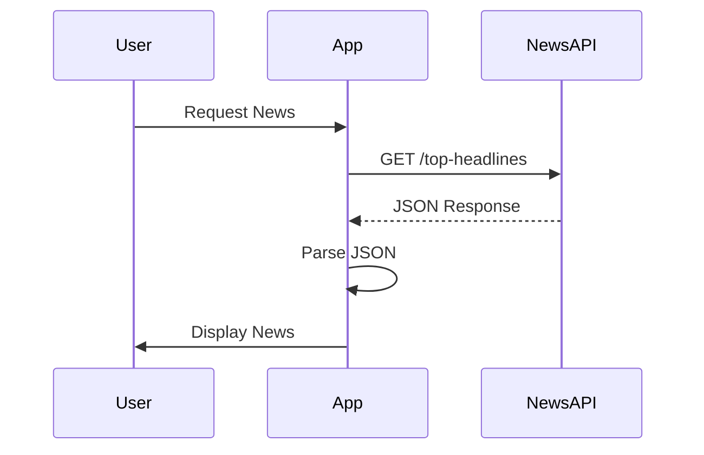

## 16.2.2 Integrating with News APIs

In this section, we will explore how to integrate news APIs into a Flutter application, transforming it into a dynamic news reader app. This involves selecting a suitable news API, setting up HTTP requests, handling asynchronous data, and parsing JSON responses. By the end of this guide, you will be equipped with the skills to fetch and display news articles in your Flutter app.

### Choosing a News API

#### Recommendations

When selecting a news API, consider factors such as ease of use, available features, and pricing. **NewsAPI.org** is a popular choice for developers due to its comprehensive coverage of news sources and a generous free tier, which is ideal for development and testing purposes.

#### API Key Registration

Most news APIs require an API key for authentication. Follow these steps to obtain an API key from NewsAPI.org:

1. **Visit the Website:** Go to [NewsAPI.org](https://newsapi.org/).
2. **Sign Up:** Create an account by providing your email and setting a password.
3. **Obtain API Key:** Once registered, navigate to your account dashboard to find your API key.
4. **Note the Key:** Keep this key secure, as it will be used to authenticate your requests.

### Setting Up HTTP Requests

#### Adding Dependencies

To make HTTP requests in Flutter, you need to add the `http` package to your project. Open your `pubspec.yaml` file and add the following dependency:

```yaml
dependencies:
  flutter:
    sdk: flutter
  http: ^0.13.0
```

Run `flutter pub get` to install the package.

#### Making GET Requests

With the `http` package installed, you can now make GET requests to fetch news data. Here's how to do it:

```dart
import 'package:http/http.dart' as http;

Future<void> fetchNews() async {
  final response = await http.get(Uri.parse('https://newsapi.org/v2/top-headlines?country=us&apiKey=YOUR_API_KEY'));

  if (response.statusCode == 200) {
    // Successfully received data
    print(response.body);
  } else {
    // Handle error
    throw Exception('Failed to load news');
  }
}
```

Replace `YOUR_API_KEY` with the API key you obtained earlier.

### Handling Asynchronous Data

#### Using `Future` and `async`/`await`

Network requests in Flutter are asynchronous, meaning they don't block the main thread. Use `async` and `await` to handle these operations:

```dart
Future<void> fetchNews() async {
  try {
    final response = await http.get(Uri.parse('https://newsapi.org/v2/top-headlines?country=us&apiKey=YOUR_API_KEY'));
    if (response.statusCode == 200) {
      // Process the JSON data
    } else {
      throw Exception('Failed to load news');
    }
  } catch (e) {
    print('Error: $e');
  }
}
```

#### Error Handling

Implement error handling using try-catch blocks to manage potential issues such as network failures or invalid responses:

```dart
try {
  // Network request
} catch (e) {
  print('Error: $e');
}
```

### Parsing JSON Data

#### Decoding JSON

Use the `dart:convert` library to decode JSON responses into Dart objects:

```dart
import 'dart:convert';

void parseNews(String responseBody) {
  final parsed = jsonDecode(responseBody);
  // Further processing
}
```

#### Creating Data Models

Define a `NewsArticle` class to represent each news article. This class will map the JSON fields to Dart object properties:

```dart
class NewsArticle {
  final String title;
  final String description;
  final String url;
  final String imageUrl;

  NewsArticle({
    required this.title,
    required this.description,
    required this.url,
    required this.imageUrl,
  });

  factory NewsArticle.fromJson(Map<String, dynamic> json) {
    return NewsArticle(
      title: json['title'] as String,
      description: json['description'] as String,
      url: json['url'] as String,
      imageUrl: json['urlToImage'] as String,
    );
  }
}
```

### Visual Aids

#### Sequence Diagram

Below is a sequence diagram illustrating the process of making a request, receiving a response, parsing data, and updating the UI:



### API Documentation

For more detailed information on the API endpoints and parameters, consult the [NewsAPI.org documentation](https://newsapi.org/docs/endpoints).

### Conclusion

Integrating news APIs into your Flutter app is a powerful way to provide dynamic content to users. By following this guide, you can fetch and display news articles, enhancing your app's functionality and user engagement. Remember to explore the API documentation for additional features and customization options.

## Quiz Time!



### Which of the following is a recommended news API for development?

- [x] NewsAPI.org
- [ ] WeatherAPI.com
- [ ] FinanceAPI.net
- [ ] SportsAPI.org

> **Explanation:** NewsAPI.org is recommended for its comprehensive coverage and free tier suitable for development.

### What is the purpose of an API key in the context of news APIs?

- [x] To authenticate requests
- [ ] To encrypt data
- [ ] To format responses
- [ ] To cache data

> **Explanation:** An API key is used to authenticate requests to the API, ensuring that the requests are authorized.

### How do you add the `http` package to a Flutter project?

- [x] By adding it to the `pubspec.yaml` file
- [ ] By downloading it from the internet
- [ ] By writing custom code
- [ ] By using a third-party tool

> **Explanation:** The `http` package is added to a Flutter project by including it in the `pubspec.yaml` file.

### What Dart library is used to decode JSON data?

- [x] dart:convert
- [ ] dart:async
- [ ] dart:io
- [ ] dart:core

> **Explanation:** The `dart:convert` library is used to decode JSON data into Dart objects.

### What is the purpose of the `async` and `await` keywords in Dart?

- [x] To handle asynchronous operations
- [ ] To declare variables
- [ ] To define classes
- [ ] To manage errors

> **Explanation:** `async` and `await` are used to handle asynchronous operations, allowing non-blocking code execution.

### Which method is used to make a GET request in the `http` package?

- [x] http.get
- [ ] http.post
- [ ] http.put
- [ ] http.delete

> **Explanation:** The `http.get` method is used to make GET requests to fetch data from an API.

### What should you do if a network request fails in Flutter?

- [x] Use a try-catch block to handle the error
- [ ] Ignore the error
- [ ] Restart the app
- [ ] Log out the user

> **Explanation:** A try-catch block should be used to handle errors that occur during network requests.

### What is the role of the `NewsArticle` class in the app?

- [x] To represent news articles as Dart objects
- [ ] To manage user authentication
- [ ] To handle UI rendering
- [ ] To store app settings

> **Explanation:** The `NewsArticle` class is used to represent news articles as Dart objects, mapping JSON fields to object properties.

### What is the first step in obtaining an API key from NewsAPI.org?

- [x] Creating an account
- [ ] Making a GET request
- [ ] Decoding JSON
- [ ] Parsing data

> **Explanation:** The first step is to create an account on NewsAPI.org to obtain an API key.

### True or False: The `http` package is used for handling UI components in Flutter.

- [ ] True
- [x] False

> **Explanation:** False. The `http` package is used for making HTTP requests, not for handling UI components.


