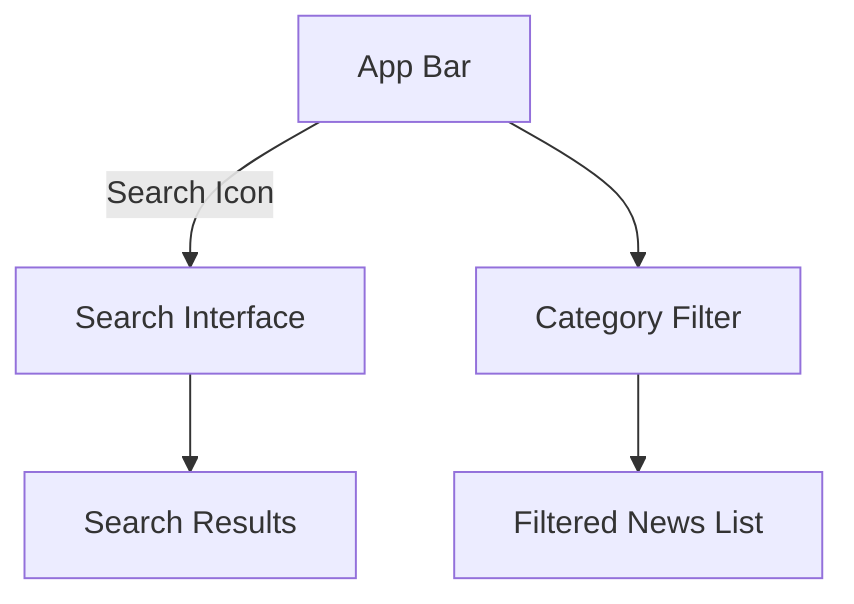

## 16.2.3 Implementing Search and Filtering

In this section, we will delve into the implementation of search and filtering functionalities in a Flutter-based news reader app. These features are crucial for enhancing user experience by allowing users to easily find and filter news articles based on their interests. We will cover the UI components, handling user input, updating the news feed, and optimizing the user experience with best practices.

### Search Functionality

#### UI Components

To begin with, integrating a search bar into your app's UI is essential. The `SearchBar` widget can be added to the app bar or as a standalone component within the UI. This widget serves as the primary interface for users to input their search queries.

```dart
AppBar(
  title: Text('News Reader'),
  actions: [
    IconButton(
      icon: Icon(Icons.search),
      onPressed: () {
        showSearch(context: context, delegate: NewsSearchDelegate());
      },
    ),
  ],
)
```

In this example, the `IconButton` triggers a search interface using a custom `NewsSearchDelegate`, which we'll define to handle search logic.

#### Handling User Input

Capturing user input is achieved using `TextField` or `TextFormField` widgets. These widgets provide a text input field where users can type their search queries.

```dart
class NewsSearchDelegate extends SearchDelegate {
  @override
  Widget buildSuggestions(BuildContext context) {
    return ListView(
      children: [
        ListTile(
          title: Text('Example Suggestion'),
          onTap: () {
            query = 'Example Suggestion';
            showResults(context);
          },
        ),
      ],
    );
  }

  @override
  Widget buildResults(BuildContext context) {
    return FutureBuilder(
      future: fetchNews(query),
      builder: (context, snapshot) {
        if (snapshot.connectionState == ConnectionState.waiting) {
          return Center(child: CircularProgressIndicator());
        } else if (snapshot.hasError) {
          return Center(child: Text('Error: ${snapshot.error}'));
        } else if (!snapshot.hasData || snapshot.data.isEmpty) {
          return Center(child: Text('No results found.'));
        } else {
          return ListView.builder(
            itemCount: snapshot.data.length,
            itemBuilder: (context, index) {
              return ListTile(
                title: Text(snapshot.data[index].title),
              );
            },
          );
        }
      },
    );
  }
}
```

In this code, the `NewsSearchDelegate` handles both suggestions and search results. The `buildResults` method uses a `FutureBuilder` to fetch and display news articles based on the search query.

#### Updating the News Feed

To update the news feed with search results, modify the API request to include search parameters. This allows the app to fetch articles that match the user's query.

```dart
Future<List<Article>> fetchNews(String query) async {
  final response = await http.get(Uri.parse('https://newsapi.org/v2/everything?q=$query&apiKey=YOUR_API_KEY'));
  if (response.statusCode == 200) {
    // Parse the JSON data
    final List<dynamic> data = json.decode(response.body)['articles'];
    return data.map((article) => Article.fromJson(article)).toList();
  } else {
    throw Exception('Failed to load news');
  }
}
```

This function sends an HTTP GET request to the news API, including the search query as a parameter. It then parses the JSON response to extract and return a list of articles.

### Filtering by Categories

#### Category List

To implement filtering by categories, present a list or horizontal scroll of categories. This allows users to select a category and view articles related to that topic.

```dart
class CategoryFilter extends StatelessWidget {
  final List<String> categories = ['Business', 'Entertainment', 'Health', 'Science', 'Sports', 'Technology'];

  @override
  Widget build(BuildContext context) {
    return Container(
      height: 50,
      child: ListView.builder(
        scrollDirection: Axis.horizontal,
        itemCount: categories.length,
        itemBuilder: (context, index) {
          return Padding(
            padding: const EdgeInsets.symmetric(horizontal: 8.0),
            child: ChoiceChip(
              label: Text(categories[index]),
              selected: false,
              onSelected: (selected) {
                // Handle category selection
              },
            ),
          );
        },
      ),
    );
  }
}
```

The `CategoryFilter` widget uses a `ListView.builder` to display a horizontal list of `ChoiceChip` widgets, each representing a category.

#### Updating Content

When a category is selected, fetch articles based on the selected category by modifying the API request.

```dart
Future<List<Article>> fetchCategoryNews(String category) async {
  final response = await http.get(Uri.parse('https://newsapi.org/v2/top-headlines?category=$category&apiKey=YOUR_API_KEY'));
  if (response.statusCode == 200) {
    final List<dynamic> data = json.decode(response.body)['articles'];
    return data.map((article) => Article.fromJson(article)).toList();
  } else {
    throw Exception('Failed to load news');
  }
}
```

This function fetches top headlines for the selected category, similar to the search functionality.

#### State Management

Use state management to handle the selected category and refresh the news list accordingly. Flutter offers various state management solutions, such as `Provider`, `Bloc`, or `Riverpod`, to manage state efficiently.

```dart
class NewsProvider with ChangeNotifier {
  String _selectedCategory = 'Business';
  List<Article> _articles = [];

  String get selectedCategory => _selectedCategory;
  List<Article> get articles => _articles;

  void updateCategory(String category) {
    _selectedCategory = category;
    fetchCategoryNews(category).then((articles) {
      _articles = articles;
      notifyListeners();
    });
  }
}
```

In this example, `NewsProvider` uses `ChangeNotifier` to manage the selected category and articles. When the category is updated, it fetches new articles and notifies listeners to refresh the UI.

### Optimizing UX

#### Loading Indicators

Display a `CircularProgressIndicator` while fetching data to inform users that the app is processing their request.

```dart
Center(
  child: CircularProgressIndicator(),
)
```

This simple widget provides a visual cue that data is being loaded, enhancing the user experience.

#### Error Messages

Inform users when no results are found or if an error occurs during data fetching. This can be achieved by displaying appropriate messages in the UI.

```dart
if (snapshot.hasError) {
  return Center(child: Text('Error: ${snapshot.error}'));
} else if (!snapshot.hasData || snapshot.data.isEmpty) {
  return Center(child: Text('No results found.'));
}
```

These checks ensure that users receive feedback about the status of their search or filter actions.

### Visual Aids

#### UI Mockups

To help visualize the integration of search and category filters into the app's design, consider creating UI mockups. These mockups can illustrate how the search bar and category filters are positioned within the app, providing a clear picture of the user interface.



This diagram represents the flow from the app bar to the search interface and category filter, leading to the display of search results or filtered news lists.

### Interactive Elements

Highlight the importance of responsive and interactive UI components. Ensure that the search bar and category filters are intuitive and easy to use, providing a seamless experience for users.

### Best Practices

#### Handling Debouncing

Implement debouncing for search input to prevent excessive API calls. Debouncing delays the processing of user input until a specified time has passed since the last keystroke, reducing unnecessary network requests.

```dart
Timer? _debounce;

void onSearchChanged(String query) {
  if (_debounce?.isActive ?? false) _debounce!.cancel();
  _debounce = Timer(const Duration(milliseconds: 500), () {
    // Perform search
    fetchNews(query);
  });
}
```

This code snippet demonstrates how to use a `Timer` to debounce search input, ensuring that the search function is only called after the user has stopped typing for a specified duration.

### Conclusion

Implementing search and filtering functionalities in a Flutter news reader app significantly enhances the user experience by allowing users to easily find and filter news articles. By following the steps outlined in this section, you can create a responsive and interactive app that meets user needs. Remember to optimize the user experience with loading indicators and error messages, and consider using state management solutions to efficiently handle state changes.

For further exploration, consider integrating additional features such as bookmarking articles, sharing news via social media, or implementing push notifications for breaking news alerts. These enhancements can further enrich the user experience and increase engagement with your app.

## Quiz Time!



### What is the primary purpose of a `SearchBar` widget in a Flutter app?

- [x] To capture user search queries
- [ ] To display search results
- [ ] To filter categories
- [ ] To manage state

> **Explanation:** The `SearchBar` widget is used to capture user search queries, allowing users to input text for searching content within the app.

### How can you capture user input for search queries in Flutter?

- [x] Using `TextField` or `TextFormField`
- [ ] Using `ListView`
- [ ] Using `ChoiceChip`
- [ ] Using `CircularProgressIndicator`

> **Explanation:** `TextField` or `TextFormField` widgets are used to capture user input, such as search queries, in Flutter applications.

### What is the purpose of modifying the API request with search parameters?

- [x] To fetch articles that match the user's search query
- [ ] To display a loading indicator
- [ ] To manage state changes
- [ ] To handle user input

> **Explanation:** Modifying the API request with search parameters allows the app to fetch articles that match the user's search query, providing relevant search results.

### How can you present a list of categories for filtering in a Flutter app?

- [x] Using a horizontal `ListView` with `ChoiceChip` widgets
- [ ] Using a vertical `ListView` with `TextField` widgets
- [ ] Using a `CircularProgressIndicator`
- [ ] Using a `SearchBar`

> **Explanation:** A horizontal `ListView` with `ChoiceChip` widgets can be used to present a list of categories for filtering, allowing users to select a category and view related articles.

### What is the role of state management in implementing category filtering?

- [x] To handle the selected category and refresh the news list
- [ ] To display error messages
- [ ] To capture user input
- [ ] To fetch articles from the API

> **Explanation:** State management is used to handle the selected category and refresh the news list accordingly, ensuring that the app displays articles related to the chosen category.

### Which widget is used to display a loading indicator while fetching data?

- [x] `CircularProgressIndicator`
- [ ] `TextField`
- [ ] `ChoiceChip`
- [ ] `ListView`

> **Explanation:** The `CircularProgressIndicator` widget is used to display a loading indicator while fetching data, providing a visual cue to users that the app is processing their request.

### How can you inform users when no results are found during a search?

- [x] Display a message in the UI
- [ ] Use a `CircularProgressIndicator`
- [ ] Capture user input
- [ ] Modify the API request

> **Explanation:** Displaying a message in the UI informs users when no results are found during a search, providing feedback about the status of their search action.

### What is the purpose of implementing debouncing for search input?

- [x] To prevent excessive API calls
- [ ] To capture user input
- [ ] To display search results
- [ ] To manage state changes

> **Explanation:** Debouncing is implemented to prevent excessive API calls by delaying the processing of user input until a specified time has passed since the last keystroke.

### How can you visualize the integration of search and category filters in the app's design?

- [x] Create UI mockups
- [ ] Use a `CircularProgressIndicator`
- [ ] Capture user input
- [ ] Modify the API request

> **Explanation:** Creating UI mockups helps visualize the integration of search and category filters in the app's design, providing a clear picture of the user interface.

### True or False: State management is not necessary for implementing search and filtering functionalities in a Flutter app.

- [ ] True
- [x] False

> **Explanation:** False. State management is necessary for implementing search and filtering functionalities in a Flutter app, as it helps manage state changes and refresh the UI accordingly.


