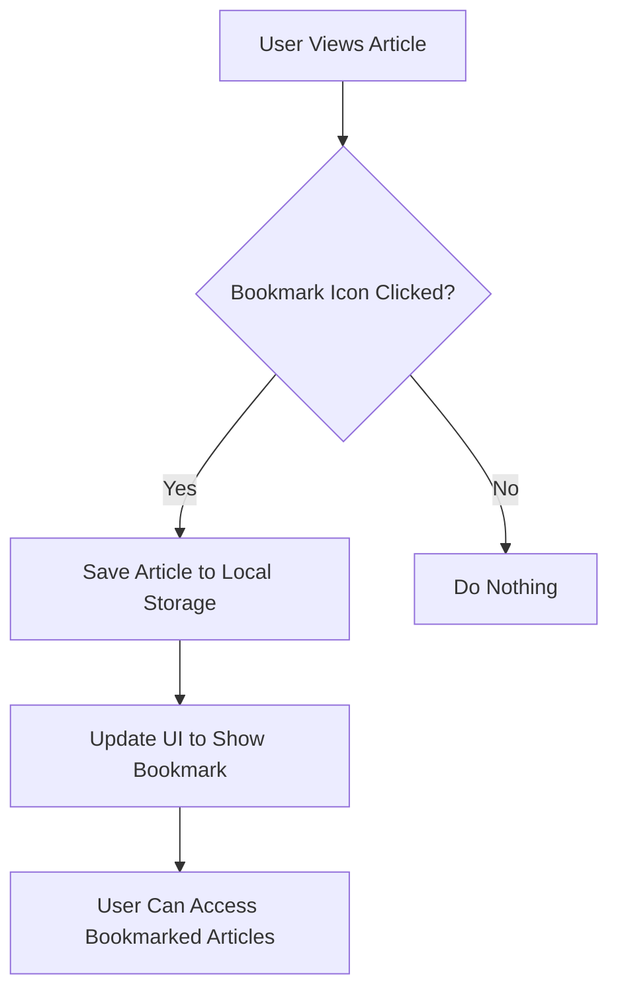
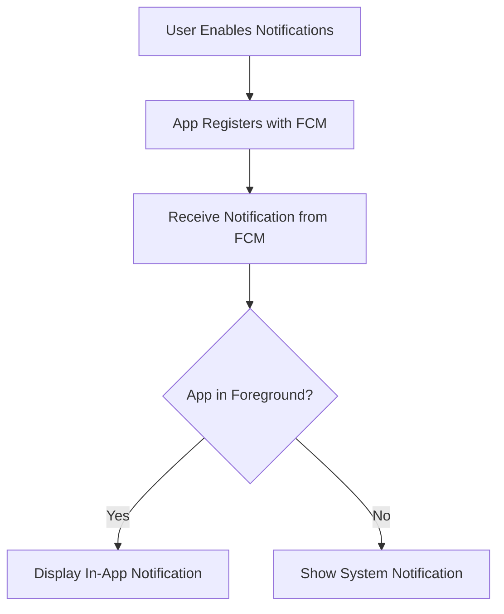

## 16.2.4 Enhancing User Engagement

In today's digital age, user engagement is a critical factor in the success of any mobile application. For a news reader app, keeping users engaged means providing them with features that enhance their reading experience, keep them informed, and allow them to interact with the content in meaningful ways. This section will delve into various strategies to enhance user engagement in a Flutter-based news reader app, focusing on implementing bookmarking, notifications, social sharing, and user customization.

### Bookmarking Articles

#### Implementing Bookmarks

Bookmarking is a fundamental feature that allows users to save articles for later reading. This feature not only enhances user engagement by providing a personalized reading experience but also encourages users to return to the app to revisit their saved content.

**Steps to Implement Bookmarks:**

1. **Create a Bookmark Model:**
   Define a data model to represent bookmarked articles. This model should include essential information such as the article's title, URL, and a unique identifier.

   ```dart
   class Bookmark {
     final String id;
     final String title;
     final String url;

     Bookmark({required this.id, required this.title, required this.url});

     Map<String, dynamic> toMap() {
       return {
         'id': id,
         'title': title,
         'url': url,
       };
     }

     factory Bookmark.fromMap(Map<String, dynamic> map) {
       return Bookmark(
         id: map['id'],
         title: map['title'],
         url: map['url'],
       );
     }
   }
   ```

2. **Persisting Bookmarks with Local Storage:**
   Use `SharedPreferences` or a local database like SQLite to store bookmarked articles. `SharedPreferences` is suitable for simple key-value storage, while SQLite is better for more complex data structures.

   ```dart
   import 'package:shared_preferences/shared_preferences.dart';
   import 'dart:convert';

   class BookmarkService {
     Future<void> saveBookmark(Bookmark bookmark) async {
       final prefs = await SharedPreferences.getInstance();
       List<String> bookmarks = prefs.getStringList('bookmarks') ?? [];
       bookmarks.add(jsonEncode(bookmark.toMap()));
       await prefs.setStringList('bookmarks', bookmarks);
     }

     Future<List<Bookmark>> getBookmarks() async {
       final prefs = await SharedPreferences.getInstance();
       List<String> bookmarks = prefs.getStringList('bookmarks') ?? [];
       return bookmarks.map((bookmark) => Bookmark.fromMap(jsonDecode(bookmark))).toList();
     }
   }
   ```

3. **UI Updates for Bookmarks:**
   Add a bookmark icon to each article in the list. Users can tap this icon to save or remove an article from their bookmarks.

   ```dart
   IconButton(
     icon: Icon(isBookmarked ? Icons.bookmark : Icons.bookmark_border),
     onPressed: () {
       setState(() {
         if (isBookmarked) {
           // Remove from bookmarks
         } else {
           // Add to bookmarks
         }
       });
     },
   )
   ```

#### Visualizing the Bookmarking Process



### Notifications

#### Push Notifications

Push notifications are a powerful tool for re-engaging users by alerting them to breaking news or updates. Implementing push notifications requires integrating a service like Firebase Cloud Messaging (FCM).

**Steps to Implement Push Notifications:**

1. **Set Up Firebase Cloud Messaging:**
   - Create a Firebase project and add your app to it.
   - Enable Firebase Cloud Messaging in the Firebase console.

2. **Integrate FCM in Your Flutter App:**
   - Add the `firebase_messaging` package to your `pubspec.yaml`.
   - Configure the app to receive messages.

   ```yaml
   dependencies:
     firebase_messaging: ^11.2.8
   ```

   ```dart
   import 'package:firebase_messaging/firebase_messaging.dart';

   class NotificationService {
     final FirebaseMessaging _firebaseMessaging = FirebaseMessaging.instance;

     void initialize() {
       _firebaseMessaging.requestPermission();
       FirebaseMessaging.onMessage.listen((RemoteMessage message) {
         // Handle foreground messages
       });
     }
   }
   ```

3. **Scheduling Notifications:**
   Allow users to set preferences for receiving notifications. This can be done by providing options in the app's settings.

   ```dart
   SwitchListTile(
     title: Text('Receive Breaking News Alerts'),
     value: _receiveNotifications,
     onChanged: (bool value) {
       setState(() {
         _receiveNotifications = value;
         // Update user preferences
       });
     },
   )
   ```

#### Visualizing the Notification Flow



### Social Sharing

#### Sharing Content

Social sharing allows users to share interesting articles with their network, increasing the app's visibility and user engagement. The `share_plus` package makes it easy to implement sharing functionality.

**Steps to Implement Social Sharing:**

1. **Add the `share_plus` Package:**

   ```yaml
   dependencies:
     share_plus: ^4.0.0
   ```

2. **Implement Sharing Functionality:**

   ```dart
   import 'package:share_plus/share_plus.dart';

   void shareArticle(String title, String url) {
     Share.share('Check out this article: $title\n$url');
   }
   ```

3. **Add a Share Button to the UI:**

   ```dart
   IconButton(
     icon: Icon(Icons.share),
     onPressed: () {
       shareArticle(article.title, article.url);
     },
   )
   ```

### User Settings

#### Customization

Providing customization options enhances user engagement by allowing users to tailor the app to their preferences. This can include theme selection, font size adjustments, and notification settings.

**Steps to Implement User Customization:**

1. **Create a Settings Screen:**
   Use a `ListView` to display various settings options.

   ```dart
   class SettingsScreen extends StatelessWidget {
     @override
     Widget build(BuildContext context) {
       return Scaffold(
         appBar: AppBar(title: Text('Settings')),
         body: ListView(
           children: <Widget>[
             ListTile(
               title: Text('Theme'),
               trailing: DropdownButton<String>(
                 value: _selectedTheme,
                 onChanged: (String? newValue) {
                   setState(() {
                     _selectedTheme = newValue!;
                     // Apply theme change
                   });
                 },
                 items: <String>['Light', 'Dark']
                     .map<DropdownMenuItem<String>>((String value) {
                   return DropdownMenuItem<String>(
                     value: value,
                     child: Text(value),
                   );
                 }).toList(),
               ),
             ),
             ListTile(
               title: Text('Font Size'),
               trailing: Slider(
                 value: _fontSize,
                 min: 12.0,
                 max: 24.0,
                 onChanged: (double value) {
                   setState(() {
                     _fontSize = value;
                     // Apply font size change
                   });
                 },
               ),
             ),
           ],
         ),
       );
     }
   }
   ```

2. **Persist User Preferences:**
   Use `SharedPreferences` to save user settings.

   ```dart
   Future<void> saveUserSettings(String theme, double fontSize) async {
     final prefs = await SharedPreferences.getInstance();
     await prefs.setString('theme', theme);
     await prefs.setDouble('fontSize', fontSize);
   }
   ```

### Encouraging Further Development

Encourage readers to think creatively about additional features that could enhance the app. Consider implementing:

- **Article Recommendations:** Suggest articles based on user reading history.
- **Offline Reading:** Allow users to download articles for offline access.
- **User Profiles:** Enable users to create profiles and track their reading habits.

### Security Considerations

Handling user data responsibly is crucial, especially when dealing with notifications and user preferences. Consider the following best practices:

- **Data Encryption:** Encrypt sensitive data stored locally or transmitted over the network.
- **Privacy Policies:** Clearly communicate how user data is collected, used, and protected.
- **Secure Authentication:** Use secure methods for user authentication and authorization.

### Conclusion

Enhancing user engagement in a news reader app involves implementing features that provide value and convenience to users. By allowing users to bookmark articles, receive timely notifications, share content, and customize their app experience, you can create a more engaging and personalized app. Always consider security and privacy implications when handling user data, and encourage continuous improvement by exploring additional features and enhancements.

## Quiz Time!



### What is a key benefit of implementing bookmarking in a news reader app?

- [x] It allows users to save articles for later reading.
- [ ] It increases the app's download size.
- [ ] It decreases user engagement.
- [ ] It complicates the app's UI.

> **Explanation:** Bookmarking allows users to save articles for later reading, enhancing user engagement by providing a personalized reading experience.

### Which package is recommended for implementing push notifications in a Flutter app?

- [ ] share_plus
- [x] firebase_messaging
- [ ] shared_preferences
- [ ] provider

> **Explanation:** The `firebase_messaging` package is used to implement push notifications in Flutter apps using Firebase Cloud Messaging.

### How can you persist user bookmarks in a Flutter app?

- [ ] By using the network
- [x] By using SharedPreferences or a local database
- [ ] By using a remote server
- [ ] By using a third-party API

> **Explanation:** User bookmarks can be persisted using `SharedPreferences` for simple key-value storage or a local database like SQLite for more complex data structures.

### What is the purpose of the `share_plus` package in Flutter?

- [ ] To manage user authentication
- [x] To enable sharing content via social media or messaging apps
- [ ] To handle push notifications
- [ ] To store user preferences

> **Explanation:** The `share_plus` package is used to enable sharing content via social media or messaging apps in Flutter applications.

### What should be considered when implementing user notifications?

- [x] User preferences for receiving notifications
- [x] Security and privacy of user data
- [ ] Increasing app size
- [ ] Reducing app performance

> **Explanation:** When implementing user notifications, consider user preferences for receiving notifications and ensure the security and privacy of user data.

### How can you allow users to customize their app experience?

- [x] By providing settings for theme and font size
- [ ] By removing all settings options
- [ ] By limiting user interactions
- [ ] By disabling notifications

> **Explanation:** Allowing users to customize their app experience by providing settings for theme and font size enhances user engagement.

### What is a potential feature to further enhance a news reader app?

- [x] Article recommendations based on user reading history
- [ ] Removing bookmarking functionality
- [ ] Disabling notifications
- [ ] Limiting social sharing options

> **Explanation:** Implementing article recommendations based on user reading history can further enhance a news reader app by providing personalized content suggestions.

### Why is it important to handle user data responsibly?

- [x] To ensure user privacy and data security
- [ ] To increase app complexity
- [ ] To reduce app performance
- [ ] To limit user engagement

> **Explanation:** Handling user data responsibly is important to ensure user privacy and data security, which builds trust and enhances user engagement.

### What is a common method for storing user settings in a Flutter app?

- [ ] Using a remote server
- [x] Using SharedPreferences
- [ ] Using a third-party API
- [ ] Using the network

> **Explanation:** `SharedPreferences` is commonly used to store user settings in a Flutter app as it provides simple key-value storage.

### True or False: Social sharing can increase the app's visibility and user engagement.

- [x] True
- [ ] False

> **Explanation:** True. Social sharing allows users to share interesting articles with their network, increasing the app's visibility and user engagement.


