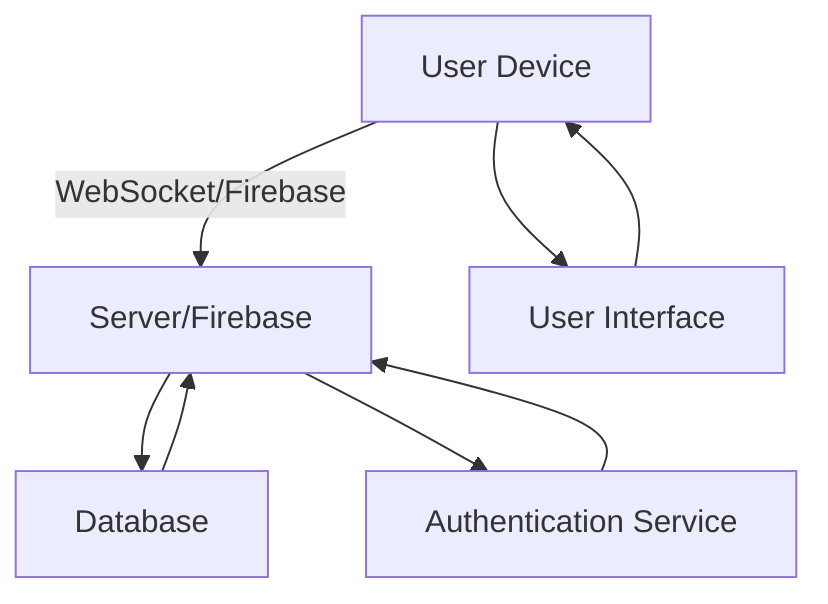

## 16.3.1 Project Overview

In this section, we delve into the creation of a real-time chat application using Flutter. This project serves as a comprehensive case study to enhance your understanding of networking, state management, and user interface design in Flutter. By the end of this project, you will have a solid grasp of how to implement real-time data exchange, manage user authentication, and design intuitive messaging interfaces.

### Introduction to the Chat App Project

#### Purpose

The primary purpose of this chat application project is to provide a hands-on experience in building a real-time communication app. This project will help you understand the intricacies of networking and state management, which are crucial for developing dynamic and responsive applications. Through this project, you will learn how to leverage technologies like WebSockets or Firebase to facilitate real-time communication between users.

#### Learning Objectives

- **Implement Real-Time Data Exchange:** Gain practical experience in setting up and managing real-time data flows between clients and servers.
- **Work with WebSockets or Firebase:** Understand how to use WebSockets or Firebase for establishing persistent connections that allow instant data transmission.
- **Design User Interfaces for Messaging:** Develop skills in creating user-friendly interfaces that enhance the messaging experience.

### Key Features

#### User Authentication

User authentication is a fundamental feature of any chat application. It ensures that only authorized users can access the app and engage in conversations. In this project, you will implement a robust authentication system that allows users to sign up and log in securely. This will involve setting up authentication mechanisms using Firebase Authentication or another suitable service.

#### One-on-One Chat

The core functionality of the chat application is to enable private messaging between users. You will implement a one-on-one chat feature that allows users to send and receive messages in real-time. This will involve setting up a messaging protocol, designing the chat interface, and ensuring that messages are delivered promptly and reliably.

#### Group Chat (Optional)

For those looking to extend the functionality of the chat application, implementing group chat capabilities is an excellent challenge. Group chat allows multiple users to participate in a single conversation, requiring additional considerations for message synchronization and user management.

#### Message History

Storing and retrieving past conversations is essential for providing users with a seamless chat experience. You will implement a message history feature that allows users to view previous messages. This will involve setting up a database to store messages and designing an interface to display them.

### Visual Aids

#### Architecture Diagram

To better understand the flow of data and the interaction between different components of the chat application, let's examine an architecture diagram. This diagram illustrates how clients communicate with the server or Firebase to facilitate real-time messaging.

- **User Device:** Represents the client-side application running on the user's device.
- **Server/Firebase:** Acts as the intermediary that handles real-time communication and data storage.
- **Database:** Stores user data, message history, and other relevant information.
- **Authentication Service:** Manages user authentication and session management.
- **User Interface:** The front-end interface that users interact with to send and receive messages.

### Complexity Management

Building a chat application is inherently complex due to the need for real-time communication, state management, and user interface design. To manage this complexity, we will break down the project into manageable sections, each focusing on a specific aspect of the application. This approach will allow you to tackle each component individually, ensuring a thorough understanding of each part before integrating them into a cohesive whole.

#### Step-by-Step Breakdown

1. **Setting Up the Project:**
   - Initialize a new Flutter project.
   - Configure dependencies for networking and state management.

2. **Implementing User Authentication:**
   - Set up Firebase Authentication or another authentication service.
   - Create sign-up and login interfaces.

3. **Developing the Messaging Protocol:**
   - Choose between WebSockets or Firebase for real-time communication.
   - Implement the messaging protocol for sending and receiving messages.

4. **Designing the User Interface:**
   - Create the chat interface using Flutter widgets.
   - Ensure the interface is responsive and user-friendly.

5. **Storing and Retrieving Message History:**
   - Set up a database to store messages.
   - Implement functionality to retrieve and display past conversations.

6. **Testing and Debugging:**
   - Test the application for real-time performance and reliability.
   - Debug any issues related to networking or state management.

7. **Optional Features:**
   - Implement group chat functionality.
   - Add additional features such as message notifications or media sharing.

### Conclusion

By the end of this project, you will have developed a fully functional chat application that demonstrates your ability to implement real-time communication, manage user authentication, and design intuitive user interfaces. This project will not only enhance your technical skills but also provide you with a valuable addition to your portfolio.

### Further Exploration

To deepen your understanding of the concepts covered in this project, consider exploring the following resources:

- **Official Flutter Documentation:** [Flutter Documentation](https://flutter.dev/docs)
- **Firebase Documentation:** [Firebase Documentation](https://firebase.google.com/docs)
- **WebSockets in Flutter:** [WebSockets Guide](https://flutter.dev/docs/cookbook/networking/web-sockets)
- **State Management in Flutter:** [Provider Package](https://pub.dev/packages/provider)

These resources will provide you with additional insights and examples to further enhance your skills in Flutter development.

## Quiz Time!



### What is the primary purpose of building a chat application in this project?

- [x] To understand networking and state management at a deeper level
- [ ] To create a social media platform
- [ ] To learn about database management
- [ ] To develop a gaming application

> **Explanation:** The primary purpose is to understand networking and state management at a deeper level through the development of a real-time communication app.

### Which technology can be used for real-time communication in the chat app?

- [x] WebSockets
- [x] Firebase
- [ ] HTTP
- [ ] FTP

> **Explanation:** WebSockets and Firebase are suitable for real-time communication, providing persistent connections for instant data transmission.

### What is a key feature of the chat application?

- [x] User Authentication
- [ ] Video Streaming
- [ ] E-commerce Integration
- [ ] Image Editing

> **Explanation:** User authentication is a key feature, ensuring that only authorized users can access the app and engage in conversations.

### What optional feature can be implemented in the chat app?

- [x] Group Chat
- [ ] Video Conferencing
- [ ] Online Shopping
- [ ] Music Streaming

> **Explanation:** Group chat is an optional feature that allows multiple users to participate in a single conversation.

### What is the role of the architecture diagram in the project?

- [x] To illustrate how clients communicate with the server or Firebase
- [ ] To show the user interface design
- [ ] To display the project timeline
- [ ] To outline the marketing strategy

> **Explanation:** The architecture diagram illustrates how clients communicate with the server or Firebase, facilitating real-time messaging.

### What is the first step in the step-by-step breakdown of the project?

- [x] Setting Up the Project
- [ ] Implementing User Authentication
- [ ] Developing the Messaging Protocol
- [ ] Designing the User Interface

> **Explanation:** The first step is setting up the project, which involves initializing a new Flutter project and configuring dependencies.

### Which service can be used for user authentication in the chat app?

- [x] Firebase Authentication
- [ ] Google Maps
- [ ] Stripe
- [ ] AWS Lambda

> **Explanation:** Firebase Authentication is a suitable service for managing user authentication and session management in the chat app.

### What is the purpose of storing and retrieving message history?

- [x] To provide users with a seamless chat experience
- [ ] To increase app monetization
- [ ] To enhance app security
- [ ] To improve app performance

> **Explanation:** Storing and retrieving message history provides users with a seamless chat experience by allowing them to view previous messages.

### What is a recommended resource for further exploration of state management in Flutter?

- [x] Provider Package
- [ ] Google Maps API
- [ ] AWS S3
- [ ] Stripe API

> **Explanation:** The Provider Package is a recommended resource for further exploration of state management in Flutter.

### True or False: The chat application project is designed to be simple and easy to implement.

- [ ] True
- [x] False

> **Explanation:** False. The chat application project is inherently complex due to the need for real-time communication, state management, and user interface design.


