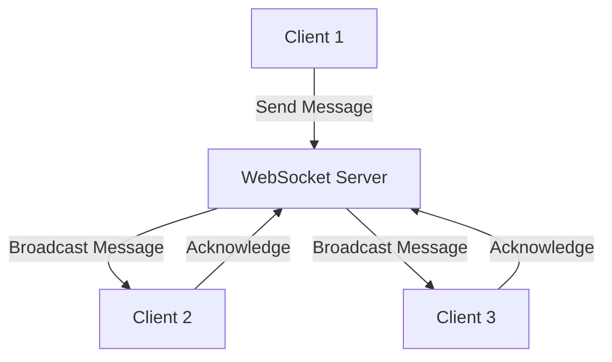

## 16.3.2 Setting Up Real-time Communication

In the world of mobile applications, real-time communication is a crucial feature, especially for chat applications. It allows users to send and receive messages instantly, creating a seamless and interactive experience. In this section, we will explore how to set up real-time communication in a Flutter chat application using two popular methods: WebSockets and Firebase. We will delve into the technical aspects, provide practical code examples, and discuss security considerations to ensure your application is both functional and secure.

### Choosing a Backend Solution

When setting up real-time communication, choosing the right backend solution is essential. The two primary options we'll explore are WebSockets and Firebase.

#### WebSockets

WebSockets provide a full-duplex communication channel over a single TCP connection, making them ideal for real-time applications. They allow for low-latency communication between the client and server, which is perfect for chat applications.

- **Use `web_socket_channel` Package:** Flutter provides the `web_socket_channel` package, which makes it easy to work with WebSockets. This package allows you to establish a WebSocket connection and handle incoming and outgoing messages.

- **Requires a Server that Supports WebSockets:** To use WebSockets, you need a server that can handle WebSocket connections. This could be a custom server built with Node.js, Python, or any other language that supports WebSockets.

#### Firebase Realtime Database or Firestore

Firebase offers two services that support real-time data synchronization: Firebase Realtime Database and Firestore. Both services provide a robust and scalable solution for real-time communication.

- **Leverage Firebase's Real-time Data Synchronization:** Firebase handles the complexities of real-time data synchronization, allowing you to focus on building your application. It automatically updates data across all connected clients whenever there is a change.

### Implementing with Firebase

Firebase is a popular choice for real-time communication due to its ease of use and powerful features. Let's explore how to implement real-time communication using Firebase.

#### Setup

Before you can use Firebase in your Flutter app, you need to add Firebase to your project. This involves setting up a Firebase project, adding the necessary dependencies, and configuring your app to use Firebase services. Refer to earlier chapters for detailed instructions on setting up Firebase.

#### Database Structure

Organizing your data effectively is crucial for a chat application. A common approach is to store messages under chat rooms or user IDs. Here's an example of how you might structure your data in Firestore:

```plaintext
chats/
  chatRoomId/
    messages/
      messageId/
        senderId: "user123"
        text: "Hello, world!"
        timestamp: 1625247600
```

This structure allows you to easily retrieve messages for a specific chat room and display them in your application.

#### Listening for Updates

One of the key features of Firebase is its ability to listen for real-time updates. You can use streams to listen for new messages and update your UI accordingly. Here's an example of how to listen for new messages in a chat room:

```dart
StreamBuilder<QuerySnapshot>(
  stream: FirebaseFirestore.instance
      .collection('chats')
      .doc(chatRoomId)
      .collection('messages')
      .orderBy('timestamp')
      .snapshots(),
  builder: (context, snapshot) {
    if (!snapshot.hasData) {
      return CircularProgressIndicator();
    }
    final messages = snapshot.data!.docs;
    return ListView.builder(
      itemCount: messages.length,
      itemBuilder: (context, index) {
        final message = messages[index];
        return ListTile(
          title: Text(message['text']),
          subtitle: Text('Sent by: ${message['senderId']}'),
        );
      },
    );
  },
);
```

This code uses a `StreamBuilder` to listen for changes in the `messages` collection and updates the UI whenever a new message is added.

### Implementing with WebSockets

WebSockets provide a more traditional approach to real-time communication. Let's explore how to implement real-time communication using WebSockets in Flutter.

#### Connecting to a WebSocket Server

To connect to a WebSocket server, you can use the `WebSocketChannel.connect` method provided by the `web_socket_channel` package. Here's an example of how to establish a connection:

```dart
import 'package:web_socket_channel/web_socket_channel.dart';

final channel = WebSocketChannel.connect(
  Uri.parse('ws://yourserver.com/socket'),
);
```

This code establishes a connection to a WebSocket server at the specified URL.

#### Sending and Receiving Messages

Once connected, you can send and receive messages using the `sink` and `stream` properties of the `WebSocketChannel`. Here's an example of how to send and receive messages:

```dart
// Sending a message
channel.sink.add('Hello, server!');

// Receiving messages
channel.stream.listen((message) {
  print('Received: $message');
});
```

This code sends a message to the server and listens for incoming messages, printing them to the console.

### Visual Aids

To better understand the flow of data in a real-time communication setup, let's look at a data flow diagram illustrating the interaction between clients and the server.



This diagram shows how a message sent by Client 1 is received by the WebSocket server and then broadcast to other connected clients (Client 2 and Client 3).

### Security Considerations

When implementing real-time communication, security is a critical concern. Here are some best practices to ensure your application is secure:

- **Authentication Mechanisms:** Ensure that only authenticated users can send and receive messages. Firebase provides built-in authentication mechanisms, while WebSockets require custom authentication logic.

- **Data Security:** Encrypt sensitive data before sending it over the network. Use HTTPS for WebSocket connections to prevent eavesdropping.

- **Rate Limiting:** Implement rate limiting to prevent abuse and ensure fair usage of your server resources.

- **Input Validation:** Validate all incoming data to prevent injection attacks and other malicious activities.

### Conclusion

Setting up real-time communication in a Flutter chat application can be achieved using either WebSockets or Firebase. Each method has its advantages and trade-offs, and the choice depends on your specific requirements and constraints. By following the guidelines and examples provided in this section, you can implement a robust and secure real-time communication system in your Flutter application.

### Further Reading and Resources

- [Firebase Documentation](https://firebase.google.com/docs)
- [WebSocketChannel Package](https://pub.dev/packages/web_socket_channel)
- [Flutter Official Documentation](https://flutter.dev/docs)

## Quiz Time!



### What is the primary advantage of using WebSockets for real-time communication?

- [x] Low-latency communication
- [ ] Easy to set up without a server
- [ ] Built-in authentication
- [ ] Automatic data synchronization

> **Explanation:** WebSockets provide low-latency communication, making them ideal for real-time applications like chat.

### Which Firebase service is commonly used for real-time data synchronization in chat applications?

- [ ] Firebase Storage
- [x] Firebase Realtime Database
- [x] Firestore
- [ ] Firebase Hosting

> **Explanation:** Both Firebase Realtime Database and Firestore offer real-time data synchronization capabilities.

### What package is used in Flutter to work with WebSockets?

- [ ] http
- [x] web_socket_channel
- [ ] dio
- [ ] provider

> **Explanation:** The `web_socket_channel` package is used in Flutter to work with WebSockets.

### How can you listen for real-time updates in Firebase?

- [ ] Using HTTP requests
- [ ] Using WebSocket connections
- [x] Using streams
- [ ] Using polling

> **Explanation:** Firebase provides streams to listen for real-time updates, allowing you to react to data changes instantly.

### What is a common data structure for storing messages in a chat application using Firestore?

- [x] Messages under chat rooms
- [ ] Messages under user profiles
- [ ] Messages under a single collection
- [ ] Messages under a global document

> **Explanation:** Storing messages under chat rooms allows for efficient retrieval and organization of chat data.

### What is a key security consideration when using WebSockets?

- [x] Encrypting data
- [ ] Using HTTP instead of HTTPS
- [ ] Allowing anonymous connections
- [ ] Disabling authentication

> **Explanation:** Encrypting data is crucial to ensure the security of information transmitted over WebSockets.

### Which method is used to establish a WebSocket connection in Flutter?

- [ ] HttpClient.connect
- [x] WebSocketChannel.connect
- [ ] Socket.connect
- [ ] Stream.connect

> **Explanation:** The `WebSocketChannel.connect` method is used to establish a WebSocket connection in Flutter.

### What is a benefit of using Firebase for real-time communication?

- [x] Automatic data synchronization
- [ ] Requires no internet connection
- [ ] Built-in WebSocket support
- [ ] No need for authentication

> **Explanation:** Firebase automatically synchronizes data across all connected clients, simplifying real-time communication.

### Which of the following is a best practice for securing real-time communication?

- [x] Implementing rate limiting
- [ ] Allowing all users to connect without authentication
- [ ] Using plain text for data transmission
- [ ] Disabling encryption

> **Explanation:** Implementing rate limiting helps prevent abuse and ensures fair usage of server resources.

### True or False: WebSockets require a server that supports WebSocket connections.

- [x] True
- [ ] False

> **Explanation:** WebSockets require a server that can handle WebSocket connections to facilitate real-time communication.


