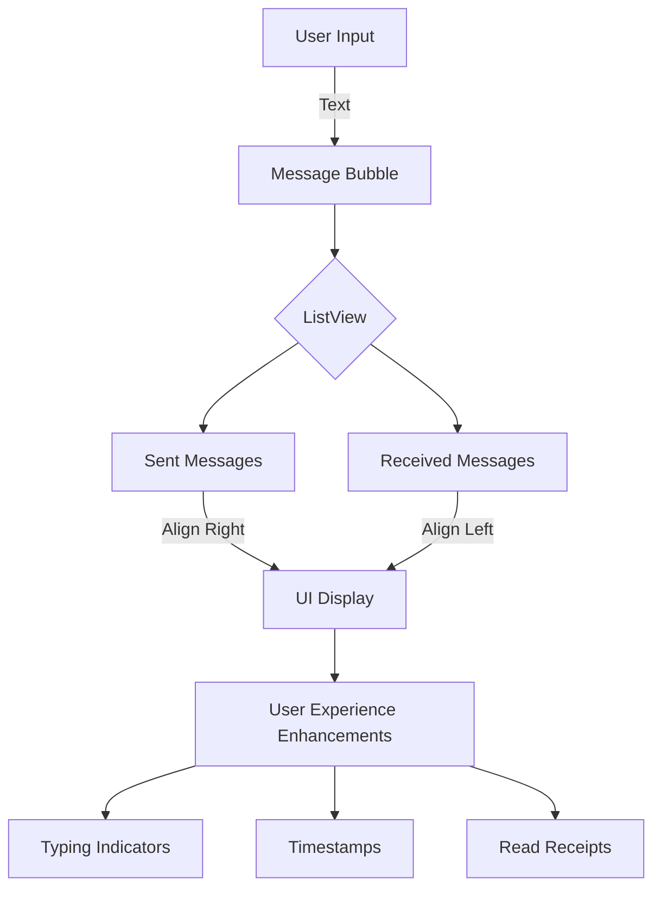

## 16.3.3 Designing Chat Interfaces

Designing a chat interface involves more than just displaying messages; it requires creating an engaging, intuitive, and accessible user experience. In this section, we will explore how to build a chat UI using Flutter, focusing on message bubbles, user experience enhancements, themes, and customization. We'll also discuss best practices for creating reusable and accessible components.

### Building the Chat UI

A chat interface is a dynamic environment where messages flow between users. To create a seamless experience, we need to focus on the core components of a chat UI: message bubbles and the input field.

#### Message Bubbles

Message bubbles are the heart of any chat application. They convey the conversation's content and need to be visually distinct to differentiate between sent and received messages.

- **Using `ListView` for Message Display:**

  A `ListView` is ideal for displaying messages in a scrolling view. It allows for efficient rendering of a large number of messages and provides a smooth scrolling experience.

  ```dart
  ListView.builder(
    reverse: true, // To display the latest message at the bottom
    itemCount: messages.length,
    itemBuilder: (context, index) {
      final message = messages[index];
      return MessageBubble(
        text: message.text,
        isSentByMe: message.isSentByMe,
      );
    },
  );
  ```

- **Differentiating Sent and Received Messages:**

  Sent and received messages can be differentiated using alignment and styling. Typically, sent messages are aligned to the right and received messages to the left.

  ```dart
  class MessageBubble extends StatelessWidget {
    final String text;
    final bool isSentByMe;

    MessageBubble({required this.text, required this.isSentByMe});

    @override
    Widget build(BuildContext context) {
      return Align(
        alignment: isSentByMe ? Alignment.centerRight : Alignment.centerLeft,
        child: Container(
          padding: EdgeInsets.all(10),
          margin: EdgeInsets.symmetric(vertical: 5, horizontal: 10),
          decoration: BoxDecoration(
            color: isSentByMe ? Colors.blue : Colors.grey[300],
            borderRadius: BorderRadius.circular(15),
          ),
          child: Text(
            text,
            style: TextStyle(color: isSentByMe ? Colors.white : Colors.black),
          ),
        ),
      );
    }
  }
  ```

  This approach not only visually distinguishes the messages but also enhances readability.

#### Input Field

The input field is where users type their messages. It should be intuitive and responsive, with a clear send button.

- **Creating the Input Field:**

  ```dart
  class ChatInputField extends StatelessWidget {
    final TextEditingController controller;
    final VoidCallback onSend;

    ChatInputField({required this.controller, required this.onSend});

    @override
    Widget build(BuildContext context) {
      return Container(
        padding: EdgeInsets.symmetric(horizontal: 10),
        child: Row(
          children: [
            Expanded(
              child: TextField(
                controller: controller,
                decoration: InputDecoration(
                  hintText: 'Type a message...',
                  border: InputBorder.none,
                ),
              ),
            ),
            IconButton(
              icon: Icon(Icons.send),
              onPressed: onSend,
            ),
          ],
        ),
      );
    }
  }
  ```

  This widget provides a simple and effective way for users to input and send messages.

### User Experience Enhancements

Enhancing the user experience involves adding features that make the chat interface more interactive and informative.

#### Typing Indicators

Typing indicators show when another user is typing, providing real-time feedback and making the conversation feel more alive.

- **Implementing Typing Indicators:**

  You can use a simple `Text` widget or an animated indicator to show typing status. This feature typically requires backend support to notify when a user is typing.

  ```dart
  Widget typingIndicator(bool isTyping) {
    return isTyping
        ? Text('User is typing...', style: TextStyle(fontStyle: FontStyle.italic))
        : Container();
  }
  ```

#### Timestamp Display

Including timestamps for messages helps users track the conversation's timeline.

- **Displaying Timestamps:**

  Timestamps can be added to the `MessageBubble` widget, formatted to show time or date as needed.

  ```dart
  Text(
    DateFormat('hh:mm a').format(message.timestamp),
    style: TextStyle(fontSize: 10, color: Colors.grey),
  );
  ```

#### Read Receipts

Read receipts indicate when a message has been read, adding another layer of interactivity.

- **Implementing Read Receipts:**

  This feature requires backend support to track message status. You can use icons or text to indicate read status.

  ```dart
  Icon(
    message.isRead ? Icons.done_all : Icons.done,
    color: message.isRead ? Colors.blue : Colors.grey,
    size: 16,
  );
  ```

### Themes and Customization

Allowing users to customize the chat appearance enhances personalization and user satisfaction.

#### Customizing Chat Appearance

Users should be able to change background colors, text sizes, and bubble styles.

- **Implementing Theme Customization:**

  Use `ThemeData` and `Provider` or `Bloc` for managing theme changes.

  ```dart
  ThemeData chatTheme = ThemeData(
    primaryColor: Colors.blue,
    accentColor: Colors.white,
    textTheme: TextTheme(
      bodyText1: TextStyle(fontSize: 16),
    ),
  );
  ```

  Allow users to select themes from a settings menu, applying changes dynamically.

### Visual Aids

Visual aids such as UI mockups help in understanding the design and layout of the chat interface.

#### UI Mockups

Creating mockups provides a visual representation of the chat interface, aiding in design and development.



### Reusability and Accessibility

Creating reusable widgets and ensuring accessibility are crucial for a robust chat interface.

#### Reusability

Encourage creating reusable components for message bubbles and input fields to maintain consistency and reduce redundancy.

- **Reusable Widgets:**

  ```dart
  class ReusableMessageBubble extends StatelessWidget {
    // Implementation as shown earlier
  }
  ```

#### Accessibility

Ensure the chat interface is accessible to all users, including those with disabilities.

- **Accessibility Features:**

  - Use semantic labels for screen readers.
  - Ensure color contrast meets accessibility standards.
  - Provide alternative text for icons and images.

### Conclusion

Designing a chat interface in Flutter involves balancing functionality, aesthetics, and user experience. By focusing on message bubbles, input fields, user experience enhancements, and customization, you can create a chat application that is both engaging and accessible. Remember to leverage reusable components and prioritize accessibility to ensure your app is inclusive and maintainable.

For further exploration, consider diving into Flutter's official documentation and exploring open-source chat applications for inspiration and best practices.

## Quiz Time!



### What widget is ideal for displaying messages in a scrolling view in Flutter?

- [x] ListView
- [ ] GridView
- [ ] Stack
- [ ] Column

> **Explanation:** `ListView` is used for displaying a list of items in a scrolling view, making it ideal for chat messages.

### How can you differentiate sent and received messages in a chat interface?

- [x] By using alignment and styling
- [ ] By using different fonts
- [ ] By using different text sizes
- [ ] By using different icons

> **Explanation:** Sent and received messages are typically differentiated by alignment (right for sent, left for received) and styling (color).

### What feature shows when another user is typing in a chat application?

- [x] Typing Indicator
- [ ] Read Receipt
- [ ] Timestamp
- [ ] Message Bubble

> **Explanation:** A typing indicator shows when another user is typing, providing real-time feedback.

### What is the purpose of timestamps in a chat interface?

- [x] To track the conversation's timeline
- [ ] To show message importance
- [ ] To indicate message length
- [ ] To display user location

> **Explanation:** Timestamps help users track when messages were sent or received, providing context to the conversation.

### Which feature indicates when a message has been read?

- [x] Read Receipts
- [ ] Typing Indicators
- [ ] Timestamps
- [ ] Message Bubbles

> **Explanation:** Read receipts indicate when a message has been read by the recipient.

### How can users customize the appearance of a chat interface?

- [x] By changing background colors and text sizes
- [ ] By changing message content
- [ ] By changing app icons
- [ ] By changing app permissions

> **Explanation:** Users can customize the chat appearance by altering background colors, text sizes, and bubble styles.

### What is a key benefit of creating reusable widgets in Flutter?

- [x] Consistency and reduced redundancy
- [ ] Faster app launch
- [ ] Increased app size
- [ ] More complex code

> **Explanation:** Reusable widgets ensure consistency across the app and reduce code redundancy, making maintenance easier.

### Why is accessibility important in chat interfaces?

- [x] To ensure the app is usable by all users, including those with disabilities
- [ ] To increase app speed
- [ ] To reduce app size
- [ ] To enhance graphics

> **Explanation:** Accessibility ensures that the app can be used by everyone, including those with disabilities, by providing features like semantic labels and proper color contrast.

### What tool can be used to manage theme changes in a Flutter app?

- [x] Provider or Bloc
- [ ] ListView
- [ ] Stack
- [ ] Column

> **Explanation:** Provider or Bloc can be used to manage state, including theme changes, in a Flutter app.

### True or False: A `Stack` widget is ideal for displaying chat messages in a scrolling view.

- [ ] True
- [x] False

> **Explanation:** A `Stack` widget is not ideal for scrolling views; `ListView` is more suitable for displaying chat messages.


