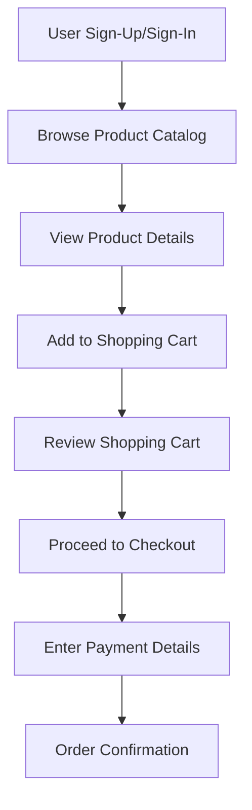

## 16.4.1 Project Overview

### Introduction to the E-Commerce App

In this section, we embark on an exciting journey to build a comprehensive e-commerce application using Flutter. This project serves as a culmination of the skills and concepts you've acquired throughout this book, offering a practical application that integrates various aspects of Flutter development. The e-commerce app project is designed to challenge you while providing a rewarding experience that enhances your understanding of building complex applications.

#### Purpose

The primary purpose of this e-commerce app project is to consolidate your learning and provide a real-world application scenario where you can apply the diverse skills you've acquired. By building this app, you'll gain hands-on experience in managing complex state, implementing user authentication, fetching and displaying data, and ensuring secure transactions. This project will not only solidify your understanding of Flutter but also prepare you for developing robust applications in a professional setting.

#### Learning Objectives

- **Manage Complex State:** Learn to handle intricate state management scenarios, ensuring a seamless user experience across different parts of the app.
- **Implement User Authentication:** Develop secure sign-up and sign-in functionalities, allowing users to create and manage their accounts.
- **Data Fetching and Display:** Fetch product data from a backend service and display it effectively within the app.
- **Secure Transactions:** Integrate payment processing to facilitate secure checkout processes, ensuring user data protection.

#### Scope Clarification

Given the complexity of an e-commerce application, this project will focus on core features that form the backbone of any e-commerce platform. While the project will cover essential functionalities, there will be ample opportunities to expand and enhance the app with additional features as you become more comfortable with the concepts.

### Key Features

#### User Accounts

A fundamental aspect of any e-commerce app is the ability for users to create and manage their accounts. This feature will include:

- **Sign-Up and Sign-In:** Allow users to register and log in using their email and password. Implement validation to ensure data integrity and security.
- **Profile Management:** Enable users to view and update their profile information, such as name, email, and password.

#### Product Catalog

The product catalog is the heart of the e-commerce app, showcasing the available products to users. Key components include:

- **Product Display:** Present products with images, descriptions, and prices. Implement a grid or list view to organize products effectively.
- **Search and Filter:** Allow users to search for specific products and apply filters to narrow down their choices.

#### Shopping Cart

The shopping cart feature enables users to manage their selected items before proceeding to checkout. This includes:

- **Add/Remove Items:** Users can add products to their cart, remove them, or adjust quantities as needed.
- **Cart Summary:** Display a summary of the items in the cart, including total price and quantity.

#### Checkout Process

The checkout process is a critical component that involves integrating payment processing to complete transactions securely. This feature will cover:

- **Order Review:** Allow users to review their order details before proceeding to payment.
- **Payment Integration:** Implement a payment gateway to handle transactions securely. Ensure that sensitive data is protected throughout the process.

### Visual Aids

#### App Flowchart

To better understand the user journey within the app, we will create a flowchart that maps out the process from browsing products to completing a purchase. This visual representation will help you conceptualize the app's structure and user interactions.

### Project Planning

Building an e-commerce app is a significant undertaking that requires careful planning and organization. Before diving into the development process, it's crucial to outline the project's structure, identify the necessary components, and establish a timeline for completion. Here are some key considerations for effective project planning:

- **Define Requirements:** Clearly outline the app's features and functionalities. Determine what is essential for the initial version and what can be added later.
- **Design the UI/UX:** Create wireframes and mockups to visualize the app's layout and user flow. Ensure that the design is intuitive and user-friendly.
- **Choose the Right Tools:** Select the appropriate tools and libraries for state management, authentication, and payment processing. Consider using packages like `provider` for state management and `firebase_auth` for authentication.
- **Set Milestones:** Break down the project into manageable tasks and set milestones to track progress. This will help you stay organized and motivated throughout the development process.

### Encouragement

Building an e-commerce app may seem daunting at first, but with the foundations you've built throughout this book, it is entirely achievable. Remember that every complex application is simply a combination of smaller, manageable components. By approaching the project step-by-step and leveraging the skills you've acquired, you'll be able to create a functional and impressive e-commerce app. Embrace the challenge, and don't hesitate to experiment and explore new solutions as you progress.

### Conclusion

The e-commerce app project is an excellent opportunity to apply your Flutter knowledge in a practical setting. By focusing on core features such as user accounts, product catalogs, shopping carts, and secure checkout processes, you'll gain valuable experience in building a comprehensive application. As you work through the project, remember to plan effectively, stay organized, and enjoy the process of bringing your app to life.

## Quiz Time!



### What is the primary purpose of building the e-commerce app in this project?

- [x] To consolidate learning and provide a real-world application scenario
- [ ] To create a simple app with limited functionality
- [ ] To focus solely on UI design
- [ ] To develop an app without using any backend services

> **Explanation:** The primary purpose of building the e-commerce app is to consolidate learning and provide a real-world application scenario where various skills can be applied.

### Which feature is NOT a part of the e-commerce app's key features?

- [ ] User Accounts
- [ ] Product Catalog
- [ ] Shopping Cart
- [x] Social Media Integration

> **Explanation:** Social Media Integration is not listed as a key feature of the e-commerce app in this project overview.

### What is a crucial aspect of the checkout process in the e-commerce app?

- [ ] Implementing a search feature
- [x] Integrating payment processing
- [ ] Displaying product reviews
- [ ] Adding social media sharing options

> **Explanation:** Integrating payment processing is a crucial aspect of the checkout process to ensure secure transactions.

### What tool is suggested for state management in the e-commerce app?

- [x] Provider
- [ ] Redux
- [ ] Bloc
- [ ] MobX

> **Explanation:** The `provider` package is suggested for state management in the e-commerce app.

### What should be done before starting the development of the e-commerce app?

- [x] Define requirements and design the UI/UX
- [ ] Start coding immediately
- [ ] Focus only on backend development
- [ ] Ignore project planning

> **Explanation:** Before starting development, it's important to define requirements and design the UI/UX to ensure a clear understanding of the app's structure and functionality.

### What is the purpose of creating a flowchart for the e-commerce app?

- [x] To map out the user journey and app structure
- [ ] To design the app's database schema
- [ ] To create a marketing plan
- [ ] To list all possible bugs

> **Explanation:** A flowchart is created to map out the user journey and app structure, helping to visualize the app's flow and interactions.

### How can the e-commerce app project be broken down for better management?

- [x] By setting milestones and breaking down tasks
- [ ] By focusing on one feature at a time without planning
- [ ] By ignoring deadlines
- [ ] By working on all features simultaneously

> **Explanation:** Breaking down the project into tasks and setting milestones helps manage the development process effectively.

### What is a key learning objective of the e-commerce app project?

- [x] Managing complex state
- [ ] Designing complex animations
- [ ] Creating a blogging platform
- [ ] Developing a game

> **Explanation:** Managing complex state is a key learning objective of the e-commerce app project.

### What should be considered when choosing tools for the e-commerce app?

- [x] Appropriateness for state management, authentication, and payment processing
- [ ] Popularity among developers
- [ ] Cost of the tools
- [ ] Complexity of the tools

> **Explanation:** Tools should be chosen based on their appropriateness for state management, authentication, and payment processing.

### True or False: Building an e-commerce app is achievable with the foundations provided in this book.

- [x] True
- [ ] False

> **Explanation:** True. Building an e-commerce app is achievable with the foundations and skills provided in this book.


