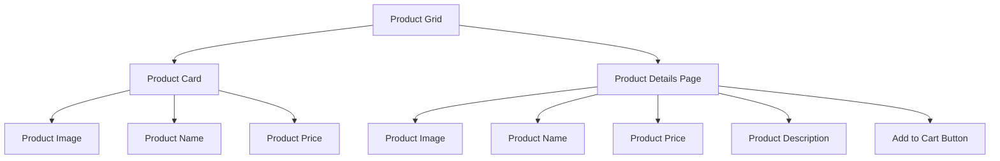

## 16.4.2 Product Listings and Catalogs

In the realm of e-commerce applications, product listings and catalogs form the backbone of the user interface, offering a gateway for users to explore and interact with the available products. This section will guide you through the process of designing and implementing product listings and catalogs in a Flutter e-commerce app. We will cover the creation of a product model, fetching and parsing product data, displaying products in a grid view, and navigating to detailed product pages. Additionally, we will discuss user experience considerations and performance optimizations to ensure a smooth and engaging app experience.

### Designing the Product Model

The first step in building a product listing is to define a robust data model that represents the products in your catalog. In Flutter, this is typically done using a Dart class. Let's create a `Product` class with essential properties such as `id`, `name`, `description`, `price`, and `imageUrl`.

```dart
class Product {
  final String id;
  final String name;
  final String description;
  final double price;
  final String imageUrl;

  Product({
    required this.id,
    required this.name,
    required this.description,
    required this.price,
    required this.imageUrl,
  });

  // Factory method to create a Product from JSON
  factory Product.fromJson(Map<String, dynamic> json) {
    return Product(
      id: json['id'],
      name: json['name'],
      description: json['description'],
      price: json['price'],
      imageUrl: json['imageUrl'],
    );
  }
}
```

**Explanation:**

- **Properties:** Each product has a unique `id`, a `name`, a `description`, a `price`, and an `imageUrl` for the product image.
- **Factory Method:** The `fromJson` factory method allows easy conversion from JSON data to a `Product` object, facilitating data parsing from various sources.

### Fetching Products

Fetching product data can be achieved through multiple sources, such as a mock JSON file, a local database, or a backend API. For simplicity, we'll demonstrate using a mock JSON file.

#### Data Source

Let's assume we have a JSON file named `products.json` stored locally in the `assets` directory of our Flutter project. Here's a sample structure of the JSON data:

```json
[
  {
    "id": "1",
    "name": "Product 1",
    "description": "Description of Product 1",
    "price": 29.99,
    "imageUrl": "https://example.com/product1.jpg"
  },
  {
    "id": "2",
    "name": "Product 2",
    "description": "Description of Product 2",
    "price": 49.99,
    "imageUrl": "https://example.com/product2.jpg"
  }
]
```

#### Parsing Data

To parse this JSON data into `Product` objects, we'll use Dart's `dart:convert` library.

```dart
import 'dart:convert';
import 'package:flutter/services.dart' show rootBundle;

Future<List<Product>> fetchProducts() async {
  final String response = await rootBundle.loadString('assets/products.json');
  final List<dynamic> data = json.decode(response);
  return data.map((json) => Product.fromJson(json)).toList();
}
```

**Explanation:**

- **rootBundle:** This is used to load the JSON file from the assets directory.
- **json.decode:** Converts the JSON string into a list of dynamic objects.
- **map and toList:** Transforms each JSON object into a `Product` instance using the `fromJson` method.

### Displaying Products

Once we have our product data, the next step is to display it in a user-friendly manner. A grid view is a popular choice for product listings in e-commerce apps.

#### Grid View

We'll use `GridView.builder` to create a responsive grid of product cards.

```dart
import 'package:flutter/material.dart';

class ProductGrid extends StatelessWidget {
  final List<Product> products;

  ProductGrid({required this.products});

  @override
  Widget build(BuildContext context) {
    return GridView.builder(
      gridDelegate: SliverGridDelegateWithFixedCrossAxisCount(
        crossAxisCount: 2,
        childAspectRatio: 3 / 4,
        crossAxisSpacing: 10,
        mainAxisSpacing: 10,
      ),
      itemCount: products.length,
      itemBuilder: (context, index) {
        return ProductCard(product: products[index]);
      },
    );
  }
}
```

**Explanation:**

- **GridView.builder:** Efficiently creates a scrollable grid of widgets.
- **SliverGridDelegateWithFixedCrossAxisCount:** Defines the number of columns and the aspect ratio of each grid item.
- **ProductCard:** A custom widget to display individual product details.

#### Product Cards

Let's design a `ProductCard` widget that includes product images, names, and prices.

```dart
class ProductCard extends StatelessWidget {
  final Product product;

  ProductCard({required this.product});

  @override
  Widget build(BuildContext context) {
    return Card(
      elevation: 2,
      child: Column(
        crossAxisAlignment: CrossAxisAlignment.start,
        children: [
          Image.network(product.imageUrl, fit: BoxFit.cover),
          Padding(
            padding: const EdgeInsets.all(8.0),
            child: Text(product.name, style: TextStyle(fontSize: 16, fontWeight: FontWeight.bold)),
          ),
          Padding(
            padding: const EdgeInsets.symmetric(horizontal: 8.0),
            child: Text('\$${product.price.toStringAsFixed(2)}', style: TextStyle(fontSize: 14, color: Colors.grey)),
          ),
        ],
      ),
    );
  }
}
```

**Explanation:**

- **Card Widget:** Provides a material design card with elevation for a shadow effect.
- **Image.network:** Loads the product image from a URL.
- **Text Widgets:** Display the product name and price with styling.

### Product Details Page

When a user selects a product, it's essential to navigate to a detailed view that provides more information and an option to add the product to the cart.

```dart
class ProductDetailsPage extends StatelessWidget {
  final Product product;

  ProductDetailsPage({required this.product});

  @override
  Widget build(BuildContext context) {
    return Scaffold(
      appBar: AppBar(title: Text(product.name)),
      body: Padding(
        padding: const EdgeInsets.all(16.0),
        child: Column(
          crossAxisAlignment: CrossAxisAlignment.start,
          children: [
            Image.network(product.imageUrl, fit: BoxFit.cover),
            SizedBox(height: 16),
            Text(product.name, style: TextStyle(fontSize: 24, fontWeight: FontWeight.bold)),
            SizedBox(height: 8),
            Text('\$${product.price.toStringAsFixed(2)}', style: TextStyle(fontSize: 20, color: Colors.grey)),
            SizedBox(height: 16),
            Text(product.description, style: TextStyle(fontSize: 16)),
            Spacer(),
            ElevatedButton(
              onPressed: () {
                // Add to cart functionality
              },
              child: Text('Add to Cart'),
            ),
          ],
        ),
      ),
    );
  }
}
```

**Explanation:**

- **Scaffold:** Provides the basic structure for the page, including an app bar.
- **Column:** Arranges the product details vertically.
- **ElevatedButton:** Allows users to add the product to their cart.

### Visual Aids

#### UI Designs

Below is a simple diagram illustrating the layout of the product grid and detail pages.



**Explanation:**

- **Product Grid:** Displays multiple `ProductCard` widgets.
- **Product Details Page:** Provides a detailed view of a selected product with additional information and actions.

### User Experience

A well-designed product listing enhances user experience by providing clear visuals and easy navigation. Consider the following:

- **Consistency:** Maintain a consistent layout and style across all product cards.
- **Accessibility:** Ensure text is readable and images are appropriately sized.
- **Navigation:** Provide intuitive navigation to and from the product details page.

### Performance Considerations

To ensure optimal performance, especially with large product catalogs, consider the following:

- **Lazy Loading Images:** Use packages like `cached_network_image` to load images lazily and cache them for better performance.
- **Efficient List Rendering:** Use `GridView.builder` or `ListView.builder` to efficiently render large lists of products.
- **Optimize Data Fetching:** Implement pagination or lazy loading for fetching product data to reduce initial load times.

### Conclusion

Building a product listing and catalog in a Flutter e-commerce app involves designing a robust product model, fetching and parsing data, and creating an intuitive user interface. By following best practices for user experience and performance, you can create a seamless and engaging shopping experience for your users.

## Quiz Time!



### What is the primary purpose of the `Product` class in a Flutter e-commerce app?

- [x] To define the structure and properties of a product.
- [ ] To handle user authentication.
- [ ] To manage app navigation.
- [ ] To store user preferences.

> **Explanation:** The `Product` class defines the structure and properties of a product, such as `id`, `name`, `description`, `price`, and `imageUrl`.

### How can you efficiently display a large number of products in a grid layout?

- [x] Use `GridView.builder`.
- [ ] Use `ListView`.
- [ ] Use `Column`.
- [ ] Use `Row`.

> **Explanation:** `GridView.builder` is used to efficiently display a large number of items in a grid layout, providing better performance for dynamic content.

### What is the role of the `fromJson` factory method in the `Product` class?

- [x] To convert JSON data into a `Product` object.
- [ ] To save a product to a database.
- [ ] To update product details.
- [ ] To delete a product.

> **Explanation:** The `fromJson` factory method is used to convert JSON data into a `Product` object, facilitating data parsing from various sources.

### Which widget is used to create a material design card with elevation?

- [x] Card
- [ ] Container
- [ ] Scaffold
- [ ] AppBar

> **Explanation:** The `Card` widget is used to create a material design card with elevation, providing a shadow effect.

### What is the benefit of using `cached_network_image` in a Flutter app?

- [x] It allows lazy loading and caching of images.
- [ ] It provides animations for images.
- [ ] It compresses images.
- [ ] It enhances image quality.

> **Explanation:** `cached_network_image` allows lazy loading and caching of images, improving performance by reducing network requests.

### What should you consider for a good user experience in product listings?

- [x] Consistency in layout and style.
- [x] Readable text and appropriately sized images.
- [ ] Complex navigation.
- [ ] High-resolution images only.

> **Explanation:** Consistency in layout and style, along with readable text and appropriately sized images, enhances user experience.

### How can you navigate to a detailed product page when a product is selected?

- [x] Use `Navigator.push`.
- [ ] Use `setState`.
- [ ] Use `FutureBuilder`.
- [ ] Use `StreamBuilder`.

> **Explanation:** `Navigator.push` is used to navigate to a new page, such as a detailed product page, when a product is selected.

### What is the purpose of the `SliverGridDelegateWithFixedCrossAxisCount` in a `GridView`?

- [x] To define the number of columns and aspect ratio of grid items.
- [ ] To manage the state of grid items.
- [ ] To handle user interactions.
- [ ] To fetch data from a server.

> **Explanation:** `SliverGridDelegateWithFixedCrossAxisCount` defines the number of columns and aspect ratio of grid items in a `GridView`.

### Why is it important to use `GridView.builder` instead of `GridView` for large lists?

- [x] It provides better performance for dynamic content.
- [ ] It supports more columns.
- [ ] It allows for more complex layouts.
- [ ] It automatically handles pagination.

> **Explanation:** `GridView.builder` provides better performance for dynamic content by efficiently creating grid items as needed.

### True or False: The `ProductDetailsPage` should include an option to add the product to the cart.

- [x] True
- [ ] False

> **Explanation:** True. The `ProductDetailsPage` should include an option to add the product to the cart, enhancing user interaction and functionality.


