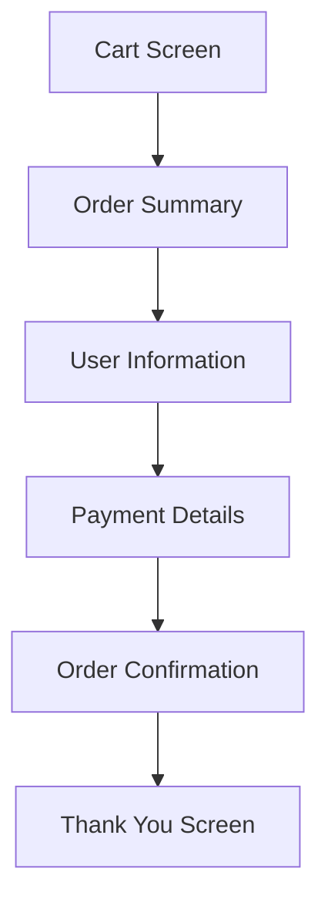

---

linkTitle: "16.4.3 Shopping Cart and Checkout"
title: "Shopping Cart and Checkout in Flutter E-Commerce Apps"
description: "Learn how to implement a shopping cart and checkout process in a Flutter e-commerce app, focusing on data structures, state management, UI design, and security best practices."
categories:
- Flutter Development
- E-Commerce
- Mobile App Development
tags:
- Flutter
- Shopping Cart
- Checkout Process
- State Management
- Security
date: 2024-10-25
type: docs
nav_weight: 16430

---

## 16.4.3 Shopping Cart and Checkout

Building a shopping cart and checkout system is a crucial component of any e-commerce application. In this section, we will explore how to implement these features in a Flutter app, focusing on data structures, state management, user interface design, and security considerations. By the end of this chapter, you will have a comprehensive understanding of how to create a seamless shopping experience for users.

### Implementing the Shopping Cart

#### Data Structure

The foundation of a shopping cart system is the data structure used to represent items in the cart. In Flutter, we can define a `CartItem` model to encapsulate the properties of each item.

```dart
class CartItem {
  final String id;
  final String title;
  final int quantity;
  final double price;

  CartItem({
    required this.id,
    required this.title,
    required this.quantity,
    required this.price,
  });

  double get totalPrice => price * quantity;
}
```

This model includes essential fields such as `id`, `title`, `quantity`, and `price`, along with a computed property `totalPrice` to calculate the total cost of the item based on its quantity.

#### State Management

Managing the state of the shopping cart is critical, as it needs to be accessible across various parts of the application. For this purpose, we can use state management solutions like `Provider` or `Bloc`.

##### Using Provider

`Provider` is a popular choice for state management in Flutter due to its simplicity and ease of use. Here’s how you can set up a cart provider:

```dart
import 'package:flutter/material.dart';

class CartProvider with ChangeNotifier {
  Map<String, CartItem> _items = {};

  Map<String, CartItem> get items => {..._items};

  int get itemCount => _items.length;

  double get totalAmount {
    return _items.values.fold(0.0, (sum, item) => sum + item.totalPrice);
  }

  void addItem(String productId, String title, double price) {
    if (_items.containsKey(productId)) {
      _items.update(
        productId,
        (existingItem) => CartItem(
          id: existingItem.id,
          title: existingItem.title,
          quantity: existingItem.quantity + 1,
          price: existingItem.price,
        ),
      );
    } else {
      _items.putIfAbsent(
        productId,
        () => CartItem(
          id: DateTime.now().toString(),
          title: title,
          quantity: 1,
          price: price,
        ),
      );
    }
    notifyListeners();
  }

  void removeItem(String productId) {
    _items.remove(productId);
    notifyListeners();
  }

  void clear() {
    _items = {};
    notifyListeners();
  }
}
```

In this `CartProvider`, we maintain a map of `CartItem` objects, allowing us to add, update, and remove items, as well as calculate the total amount.

### Cart UI

#### Cart Screen

The cart screen is where users can view the items they have added to their cart. It should display a list of items, each with its quantity and subtotal.

```dart
class CartScreen extends StatelessWidget {
  @override
  Widget build(BuildContext context) {
    final cart = Provider.of<CartProvider>(context);
    return Scaffold(
      appBar: AppBar(title: Text('Your Cart')),
      body: Column(
        children: [
          Expanded(
            child: ListView.builder(
              itemCount: cart.itemCount,
              itemBuilder: (ctx, i) => CartItemWidget(
                id: cart.items.values.toList()[i].id,
                title: cart.items.values.toList()[i].title,
                quantity: cart.items.values.toList()[i].quantity,
                price: cart.items.values.toList()[i].price,
              ),
            ),
          ),
          CheckoutButton(cart: cart),
        ],
      ),
    );
  }
}

class CartItemWidget extends StatelessWidget {
  final String id;
  final String title;
  final int quantity;
  final double price;

  CartItemWidget({
    required this.id,
    required this.title,
    required this.quantity,
    required this.price,
  });

  @override
  Widget build(BuildContext context) {
    return ListTile(
      title: Text(title),
      subtitle: Text('Total: \$${(price * quantity).toStringAsFixed(2)}'),
      trailing: Text('$quantity x'),
    );
  }
}
```

This UI component uses a `ListView.builder` to dynamically generate a list of cart items, each represented by a `CartItemWidget`.

#### Updating Quantities

To allow users to adjust the quantity of items in their cart, we can add buttons to increase or decrease the quantity.

```dart
class CartItemWidget extends StatelessWidget {
  // ... existing code ...

  @override
  Widget build(BuildContext context) {
    final cart = Provider.of<CartProvider>(context, listen: false);
    return ListTile(
      title: Text(title),
      subtitle: Text('Total: \$${(price * quantity).toStringAsFixed(2)}'),
      trailing: Row(
        mainAxisSize: MainAxisSize.min,
        children: [
          IconButton(
            icon: Icon(Icons.remove),
            onPressed: () {
              if (quantity > 1) {
                cart.addItem(id, title, price);
              } else {
                cart.removeItem(id);
              }
            },
          ),
          Text('$quantity x'),
          IconButton(
            icon: Icon(Icons.add),
            onPressed: () {
              cart.addItem(id, title, price);
            },
          ),
        ],
      ),
    );
  }
}
```

This implementation provides `IconButton` widgets to increase or decrease the quantity of each item.

#### Removing Items

Users should also have the option to remove items from their cart entirely.

```dart
IconButton(
  icon: Icon(Icons.delete),
  onPressed: () {
    cart.removeItem(id);
  },
)
```

Adding a delete button allows users to remove items with a single tap.

### Checkout Process

#### Order Summary

The checkout process begins with an order summary, which includes the total cost, taxes, and any applicable discounts.

```dart
class CheckoutButton extends StatelessWidget {
  final CartProvider cart;

  CheckoutButton({required this.cart});

  @override
  Widget build(BuildContext context) {
    return ElevatedButton(
      onPressed: () {
        // Navigate to checkout screen
      },
      child: Text('Checkout (\$${cart.totalAmount.toStringAsFixed(2)})'),
    );
  }
}
```

This button displays the total amount and navigates to the checkout screen.

#### User Information

During checkout, collect necessary user information such as shipping and billing details.

```dart
class CheckoutScreen extends StatelessWidget {
  final _formKey = GlobalKey<FormState>();
  final _addressController = TextEditingController();

  @override
  Widget build(BuildContext context) {
    return Scaffold(
      appBar: AppBar(title: Text('Checkout')),
      body: Form(
        key: _formKey,
        child: Column(
          children: [
            TextFormField(
              controller: _addressController,
              decoration: InputDecoration(labelText: 'Shipping Address'),
              validator: (value) {
                if (value == null || value.isEmpty) {
                  return 'Please enter your address';
                }
                return null;
              },
            ),
            // Additional fields for billing information
            ElevatedButton(
              onPressed: () {
                if (_formKey.currentState!.validate()) {
                  // Proceed with order
                }
              },
              child: Text('Confirm Order'),
            ),
          ],
        ),
      ),
    );
  }
}
```

This form collects user information and validates it before proceeding.

#### Order Confirmation

After a successful checkout, display a confirmation screen to the user.

```dart
class OrderConfirmationScreen extends StatelessWidget {
  @override
  Widget build(BuildContext context) {
    return Scaffold(
      appBar: AppBar(title: Text('Order Confirmation')),
      body: Center(
        child: Text('Thank you for your purchase!'),
      ),
    );
  }
}
```

This simple screen acknowledges the user's order and provides a sense of completion.

### Data Validation

Ensuring that all required fields are completed and valid is crucial for a smooth checkout process. Use form validation techniques to enforce this.

- **Required Fields:** Ensure fields like shipping address and payment details are not empty.
- **Format Validation:** Check that email addresses and phone numbers are in the correct format.
- **Security Checks:** Validate payment information securely to prevent fraud.

### Visual Aids

#### Workflow Diagram

To better understand the checkout process, let's visualize it with a workflow diagram.



This diagram outlines the steps from viewing the cart to completing the order.

### Security Emphasis

Handling user data securely is paramount in e-commerce applications. Here are some best practices:

- **Data Encryption:** Encrypt sensitive data, such as payment information, both in transit and at rest.
- **Secure Connections:** Use HTTPS to ensure secure communication between the app and server.
- **Authentication:** Implement strong authentication mechanisms to protect user accounts.

### User Feedback

Providing clear feedback at each step of the process enhances the user experience:

- **Error Messages:** Display informative error messages when validation fails.
- **Loading Indicators:** Use progress indicators during network operations.
- **Success Notifications:** Confirm successful actions with toast messages or dialogs.

### Conclusion

Implementing a shopping cart and checkout process in a Flutter e-commerce app involves careful consideration of data structures, state management, UI design, and security. By following the guidelines and examples provided in this chapter, you can create a robust and user-friendly shopping experience.

## Quiz Time!



### What is the primary purpose of the `CartItem` model in a Flutter e-commerce app?

- [x] To represent items in the shopping cart
- [ ] To manage user authentication
- [ ] To handle network requests
- [ ] To store app settings

> **Explanation:** The `CartItem` model is used to represent individual items in the shopping cart, including details like ID, title, quantity, and price.

### Which state management solution is recommended for managing the cart state across the app?

- [x] Provider
- [ ] setState
- [ ] InheritedWidget
- [ ] StatefulWidget

> **Explanation:** Provider is recommended for managing the cart state across the app due to its simplicity and ability to provide state to multiple widgets efficiently.

### What UI component is used to display a list of items in the cart?

- [x] ListView.builder
- [ ] GridView
- [ ] Column
- [ ] Stack

> **Explanation:** ListView.builder is used to dynamically generate a list of cart items, making it suitable for displaying a list of items in the cart.

### How can users adjust the quantity of items in their cart?

- [x] By using buttons to increase or decrease the quantity
- [ ] By editing the quantity directly in a text field
- [ ] By dragging items to a different position
- [ ] By swiping left or right

> **Explanation:** Users can adjust the quantity of items in their cart by using buttons to increase or decrease the quantity, providing a simple and intuitive interface.

### What should be displayed during the checkout process to summarize the order?

- [x] Total cost, taxes, and any discounts
- [ ] User's profile information
- [ ] App settings
- [ ] Recent search history

> **Explanation:** During the checkout process, an order summary should display the total cost, taxes, and any discounts to provide the user with a clear understanding of their purchase.

### What is the purpose of the `OrderConfirmationScreen`?

- [x] To acknowledge the user's order and provide a sense of completion
- [ ] To collect additional user information
- [ ] To display promotional offers
- [ ] To navigate back to the home screen

> **Explanation:** The `OrderConfirmationScreen` acknowledges the user's order and provides a sense of completion, enhancing the user experience.

### Which of the following is a best practice for handling user data securely?

- [x] Encrypt sensitive data both in transit and at rest
- [ ] Store passwords in plain text
- [ ] Use HTTP instead of HTTPS
- [ ] Disable authentication

> **Explanation:** Encrypting sensitive data both in transit and at rest is a best practice for handling user data securely, protecting it from unauthorized access.

### What type of feedback should be provided when a network operation is in progress?

- [x] Loading indicators
- [ ] Error messages
- [ ] Success notifications
- [ ] Promotional banners

> **Explanation:** Loading indicators should be provided when a network operation is in progress to inform the user that the app is working on their request.

### What is the role of form validation during the checkout process?

- [x] To ensure all required fields are completed and valid
- [ ] To enhance the visual appeal of the app
- [ ] To increase app performance
- [ ] To reduce app size

> **Explanation:** Form validation ensures that all required fields are completed and valid, preventing errors and ensuring a smooth checkout process.

### True or False: The `CartProvider` class should notify listeners whenever the cart state changes.

- [x] True
- [ ] False

> **Explanation:** True. The `CartProvider` class should notify listeners whenever the cart state changes to ensure that the UI updates accordingly.


