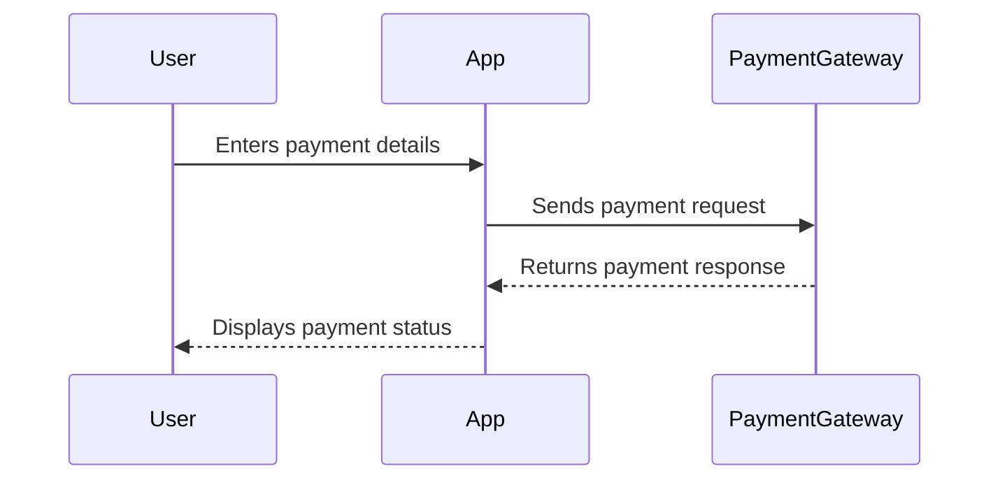

## 16.4.4 Payment Integration

Integrating a payment gateway into your Flutter e-commerce app is a crucial step that enables you to handle transactions securely and efficiently. This section will guide you through the process of choosing a payment gateway, implementing payments, testing, and ensuring compliance with security standards.

### Choosing a Payment Gateway

Selecting the right payment gateway is essential for the success of your e-commerce app. Here are some popular options and considerations to keep in mind:

#### Options

- **Stripe:** Known for its developer-friendly API and extensive documentation, Stripe is a popular choice for many developers. It supports a wide range of payment methods and currencies.
- **PayPal:** A well-established payment platform with a large user base. It offers various integration options and is widely recognized by consumers.
- **Others:** Consider other gateways like Square, Braintree, or Razorpay, which may offer specific features or regional advantages.

#### Considerations

- **Ease of Integration:** Evaluate the complexity of integrating the payment gateway with your Flutter app. Look for SDKs or packages that simplify the process.
- **Fees:** Compare transaction fees, setup costs, and any other charges associated with each gateway.
- **Supported Countries:** Ensure that the gateway supports transactions in the countries where your app will operate.

### Implementing Payments

Once you've chosen a payment gateway, the next step is to implement it in your Flutter app. This involves setting up the gateway, integrating SDKs, processing payments, and handling responses.

#### Setting Up the Payment Gateway

1. **Register for an Account:** Sign up for an account with your chosen payment gateway. This will give you access to the necessary tools and resources.
2. **Obtain API Keys:** After registration, obtain the API keys required to authenticate your app with the payment gateway.

#### Integrating SDKs

- **Add the SDK or Package:** Use Flutter's package manager to add the payment gateway's SDK or package to your project. For example, to integrate Stripe, you can use the `stripe_payment` package.

```yaml
dependencies:
  stripe_payment: ^1.0.9
```

- **Import the Package:** Import the package into your Dart files where you plan to handle payments.

```dart
import 'package:stripe_payment/stripe_payment.dart';
```

#### Processing Payments

- **Create a Secure Payment Form:** Design a payment form that collects necessary information from users. Ensure that the form is secure and user-friendly.

```dart
StripePayment.setOptions(
  StripeOptions(
    publishableKey: "your_publishable_key",
    merchantId: "Test",
    androidPayMode: 'test',
  ),
);

PaymentMethod paymentMethod = await StripePayment.paymentRequestWithCardForm(
  CardFormPaymentRequest(),
);
```

- **Use Pre-built UI Components:** Some SDKs offer pre-built UI components that simplify the process of collecting payment information.

#### Handling Payment Responses

- **Process Success or Failure Responses:** Implement logic to handle the response from the payment gateway. Update the app's UI and backend accordingly.

```dart
StripePayment.confirmPaymentIntent(
  PaymentIntent(
    clientSecret: "your_client_secret",
    paymentMethodId: paymentMethod.id,
  ),
).then((paymentIntent) {
  // Handle successful payment
}).catchError((error) {
  // Handle payment failure
});
```

- **Secure Data Handling:** Ensure that sensitive data, such as credit card information, is not stored or transmitted insecurely. Use encryption and secure communication protocols.

### Testing Payments

Testing is a critical step in the payment integration process. It ensures that your implementation works as expected and is secure.

#### Sandbox/Test Mode

- **Use Test Credentials:** Most payment gateways provide test credentials that allow you to simulate transactions without processing real payments. This is essential for testing your integration in a safe environment.

```dart
StripePayment.setOptions(
  StripeOptions(
    publishableKey: "your_test_publishable_key",
    merchantId: "Test",
    androidPayMode: 'test',
  ),
);
```

### Compliance and Security

Ensuring compliance with industry standards and securing user data is paramount when handling payments.

#### PCI DSS Compliance

- **Understand PCI DSS Requirements:** The Payment Card Industry Data Security Standard (PCI DSS) outlines security measures for handling cardholder data. Ensure your app complies with these standards to protect user information.

#### Secure Data Handling

- **Do Not Store Sensitive Information:** Avoid storing sensitive payment information on your servers. Use tokenization and secure APIs provided by the payment gateway to handle transactions.

### Visual Aids

#### Integration Flow Diagram

Below is a diagram illustrating the flow of communication between your Flutter app and the payment gateway:



### Highlight Complexity

Integrating a payment gateway can be complex, requiring careful attention to detail. It's important to thoroughly test your implementation and ensure compliance with legal and security standards.

### Legal Considerations

- **Comply with Financial Regulations:** Ensure that your app complies with relevant financial regulations in the regions where it operates. This may include obtaining necessary licenses or certifications.

### Conclusion

Integrating a payment gateway into your Flutter e-commerce app is a multifaceted process that involves careful planning, implementation, and testing. By choosing the right gateway, securing user data, and ensuring compliance with industry standards, you can provide a seamless and secure payment experience for your users.

## Quiz Time!



### Which of the following is a popular payment gateway option for Flutter apps?

- [x] Stripe
- [ ] MongoDB
- [ ] Firebase
- [ ] AWS

> **Explanation:** Stripe is a popular payment gateway known for its developer-friendly API and extensive documentation, making it a common choice for Flutter apps.


### What is a key consideration when choosing a payment gateway?

- [x] Supported countries
- [ ] Code complexity
- [ ] Number of developers
- [ ] App color scheme

> **Explanation:** Supported countries are crucial when choosing a payment gateway to ensure it can process transactions in the regions where your app operates.


### What is the purpose of obtaining API keys from a payment gateway?

- [x] To authenticate your app with the payment gateway
- [ ] To store user data
- [ ] To design the app's UI
- [ ] To manage app permissions

> **Explanation:** API keys are used to authenticate your app with the payment gateway, allowing it to process payments securely.


### Which package can be used to integrate Stripe into a Flutter app?

- [x] stripe_payment
- [ ] flutter_firebase
- [ ] http
- [ ] dio

> **Explanation:** The `stripe_payment` package is used to integrate Stripe into a Flutter app, providing tools for handling payments.


### What should you do to test payment integration without processing real payments?

- [x] Use test credentials
- [ ] Use real credit cards
- [ ] Disable security features
- [ ] Skip testing

> **Explanation:** Using test credentials allows you to simulate transactions without processing real payments, ensuring a safe testing environment.


### What is PCI DSS compliance?

- [x] A security standard for handling cardholder data
- [ ] A programming language
- [ ] A design pattern
- [ ] A type of database

> **Explanation:** PCI DSS compliance refers to the Payment Card Industry Data Security Standard, which outlines security measures for handling cardholder data.


### Why is it important not to store sensitive payment information?

- [x] To prevent data breaches
- [ ] To reduce app size
- [ ] To improve UI design
- [ ] To increase app speed

> **Explanation:** Not storing sensitive payment information helps prevent data breaches and ensures user data is handled securely.


### What is the role of a secure payment form in payment integration?

- [x] To collect necessary payment information securely
- [ ] To display app analytics
- [ ] To manage app settings
- [ ] To store user preferences

> **Explanation:** A secure payment form collects necessary payment information from users while ensuring data is handled securely.


### What is the benefit of using pre-built UI components for payment integration?

- [x] Simplifies the process of collecting payment information
- [ ] Increases app size
- [ ] Reduces app functionality
- [ ] Complicates the integration process

> **Explanation:** Pre-built UI components simplify the process of collecting payment information, making integration easier and more secure.


### True or False: Legal compliance is not necessary when integrating payment gateways.

- [ ] True
- [x] False

> **Explanation:** Legal compliance is crucial when integrating payment gateways to ensure adherence to financial regulations and protect user data.


