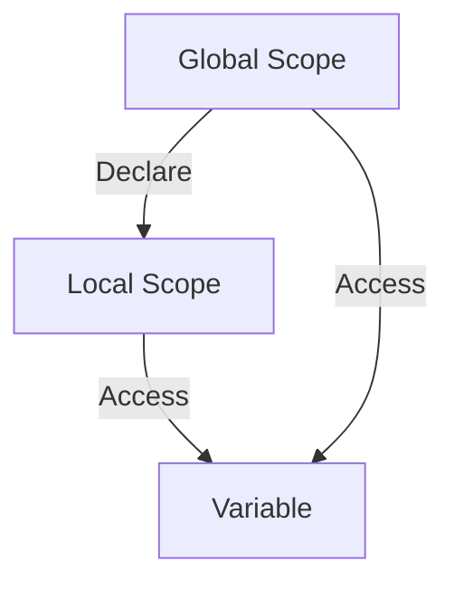

## 2.1.1 Declaring Variables

In the realm of programming, variables are fundamental constructs that serve as containers for storing data values. They are pivotal in enabling developers to store, retrieve, and manipulate data dynamically within a program. Understanding how to declare and use variables effectively is crucial for any developer, especially when working with a language like Dart, which is integral to Flutter development.

### Introduction to Variables

Variables are akin to labeled boxes in which you can store data. This data can be numbers, text, or more complex structures. The ability to reference and manipulate these values makes variables indispensable in programming. They allow for dynamic data handling, enabling applications to respond to user input, perform calculations, and manage state.

In Dart, as in many programming languages, variables are used to hold data that your program can use and manipulate. They provide a way to label data with a descriptive name, making your code more readable and maintainable.

### Variable Declaration Syntax in Dart

Dart offers flexible syntax for declaring variables, allowing for both type inference and explicit type annotations. Understanding these options is key to writing clear and efficient Dart code.

#### Using the `var` Keyword for Type Inference

Dart's `var` keyword allows you to declare a variable without explicitly specifying its type. The Dart compiler infers the type based on the assigned value.

```dart
var variableName = value;
```

**Example:**

```dart
var name = 'Alice'; // Dart infers that 'name' is of type String
```

Using `var` is convenient and can make your code concise. However, it may sometimes obscure the intended type, especially in complex codebases.

#### Using Explicit Type Annotations

For greater clarity and type safety, you can declare variables with explicit type annotations. This practice can make your code more readable and helps prevent type-related errors.

```dart
String name = 'Alice';
int age = 30;
```

Specifying the type explicitly is beneficial in collaborative projects where code readability and maintainability are paramount.

### The `final` and `const` Keywords

Dart provides `final` and `const` keywords for declaring variables that should not be reassigned after their initial assignment. Understanding the distinction between these two is crucial for effective Dart programming.

#### `final` Variables

A `final` variable is initialized at runtime and can only be set once. It is useful for values that are computed during runtime and should not change thereafter.

```dart
final currentTime = DateTime.now();
```

In this example, `currentTime` is assigned the current date and time when the program runs and cannot be reassigned.

#### `const` Variables

A `const` variable is a compile-time constant, meaning its value must be known at compile time. `const` variables are implicitly `final`.

```dart
const pi = 3.1416;
```

Use `const` for values that are truly constant and do not change, such as mathematical constants.

#### Visual Aid: Comparing `var`, `final`, and `const`

| Keyword | Mutability | Initialization Time | Use Case |
|---------|------------|---------------------|----------|
| `var`   | Mutable    | Runtime             | General-purpose, when type inference is sufficient |
| `final` | Immutable  | Runtime             | Values that should not change after initialization |
| `const` | Immutable  | Compile-time        | Compile-time constants, such as configuration values |

### Understanding Null Safety

Dart's null safety feature is designed to prevent null reference errors, a common source of runtime exceptions. It distinguishes between nullable and non-nullable types.

#### Non-nullable (Default)

By default, Dart variables are non-nullable, meaning they cannot hold a null value.

```dart
int age = 25; // Cannot be null
```

#### Nullable

To allow a variable to hold a null value, you must explicitly declare it as nullable using the `?` symbol.

```dart
int? age = null; // Can be null
```

Null safety enhances the robustness of your code by catching potential null reference errors at compile time.

### Best Practices

- **Meaningful Variable Names**: Use descriptive names following the `lowerCamelCase` convention to enhance code readability.
- **Explicit Types**: Prefer explicit types for clarity, especially in large or collaborative projects.
- **Use of `final` and `const`**: Utilize `final` for values that should not change after being set, and `const` for compile-time constants to make your code more predictable and less prone to bugs.

### Interactive Exercise

To solidify your understanding, try declaring various variables in DartPad or your preferred IDE. Experiment with `var`, explicit types, `final`, and `const`. Attempt to reassign values to `final` and `const` variables to observe the resulting errors.

### Visual Diagrams

To further illustrate the concept of variable scopes, consider the following Mermaid.js diagram that shows local vs. global variables within code blocks:



This diagram represents how variables can be declared in different scopes and accessed accordingly.

### Conclusion

Understanding how to declare and use variables effectively is a foundational skill in Dart programming. By mastering variable declaration syntax, null safety, and the use of `final` and `const`, you can write more robust and maintainable code. Remember to follow best practices and experiment with different variable types to deepen your understanding.

## Quiz Time!



### What is the primary purpose of variables in programming?

- [x] To store, retrieve, and manipulate data dynamically
- [ ] To execute code
- [ ] To define functions
- [ ] To create classes

> **Explanation:** Variables are used to store, retrieve, and manipulate data dynamically within a program, making them essential for managing data.

### Which keyword in Dart allows for type inference when declaring a variable?

- [x] var
- [ ] final
- [ ] const
- [ ] int

> **Explanation:** The `var` keyword in Dart allows the compiler to infer the type of the variable based on the assigned value.

### What is the difference between `final` and `const` in Dart?

- [x] `final` is initialized at runtime, `const` at compile-time
- [ ] `const` is mutable, `final` is immutable
- [ ] `final` can be reassigned, `const` cannot
- [ ] `const` is used for variables, `final` for functions

> **Explanation:** `final` variables are initialized at runtime and can only be set once, while `const` variables are compile-time constants.

### How do you declare a nullable integer variable in Dart?

- [x] int? age = null;
- [ ] int age = null;
- [ ] var age = null;
- [ ] final int age = null;

> **Explanation:** The `int?` syntax is used to declare a nullable integer variable in Dart, allowing it to hold a null value.

### What is the default nullability of variables in Dart?

- [x] Non-nullable
- [ ] Nullable
- [ ] Optional
- [ ] Undefined

> **Explanation:** By default, Dart variables are non-nullable, meaning they cannot hold a null value unless explicitly declared as nullable.

### Which of the following is a compile-time constant in Dart?

- [x] const pi = 3.1416;
- [ ] final pi = 3.1416;
- [ ] var pi = 3.1416;
- [ ] double pi = 3.1416;

> **Explanation:** The `const` keyword is used to declare compile-time constants in Dart.

### What is the benefit of using explicit type annotations in Dart?

- [x] It makes the code more readable and helps with type safety
- [ ] It reduces the code size
- [ ] It allows for dynamic typing
- [ ] It improves runtime performance

> **Explanation:** Explicit type annotations make the code more readable and help with type safety by clearly indicating the expected type.

### Which keyword should you use for values that should not change after being set?

- [x] final
- [ ] var
- [ ] const
- [ ] dynamic

> **Explanation:** The `final` keyword is used for values that should not change after being set, ensuring immutability.

### What error occurs if you try to reassign a `final` variable?

- [x] A compile-time error
- [ ] A runtime error
- [ ] A syntax error
- [ ] No error occurs

> **Explanation:** Reassigning a `final` variable results in a compile-time error, as `final` variables can only be set once.

### True or False: `const` variables in Dart are implicitly `final`.

- [x] True
- [ ] False

> **Explanation:** `const` variables are implicitly `final`, meaning they cannot be reassigned after their initial assignment.


