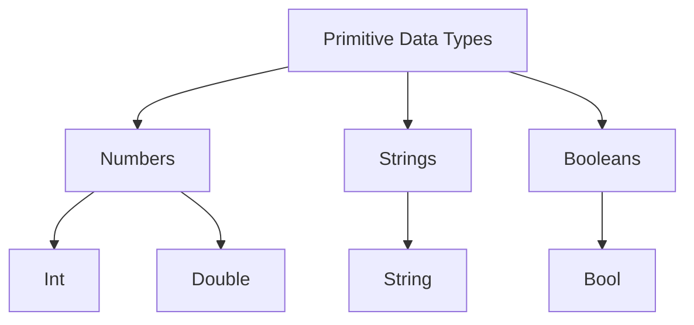

## 2.1.2 Primitive Data Types

In the world of programming, understanding data types is crucial as they define the kind of data you can work with and how you can manipulate it. Dart, the language used for Flutter development, provides a set of primitive data types that form the building blocks for more complex data structures. In this section, we will delve into these primitive data types, focusing on numbers, strings, and booleans, and briefly touching on runes and symbols for completeness.

### Overview of Primitive Data Types

Primitive data types in Dart are the simplest forms of data that can be used to represent values. They include:

- **Numbers**: Represented by `int` and `double`.
- **Strings**: Represented by `String`.
- **Booleans**: Represented by `bool`.
- **Runes and Symbols**: Used for special purposes, such as representing Unicode characters and unique identifiers.

These data types are essential for performing basic operations and serve as the foundation for more complex data manipulations.

### Numbers

Numbers in Dart are divided into two categories: integers and doubles. These types are used to represent numerical values, whether whole numbers or those with decimal points.

#### Integers (`int`)

Integers are used for whole numbers without any fractional component. They are ideal for counting, indexing, and any scenario where decimal precision is not required.

```dart
int count = 10;
```

**Example Usage:**

- Counting items in a list.
- Representing age or year.

#### Doubles (`double`)

Doubles are used for floating-point numbers, which include decimal points. They are suitable for representing measurements, currency, and any scenario requiring precision.

```dart
double price = 19.99;
```

**Example Usage:**

- Calculating the price of items.
- Representing scientific measurements.

**Visual Aid: Number Line Diagram**

```mermaid
graph LR
    A[Integers] -->|Whole Numbers| B(0, 1, 2, 3, ...)
    A -->|Negative Integers| C(-1, -2, -3, ...)
    D[Doubles] -->|Decimal Numbers| E(0.1, 1.5, 2.75, ...)
```

### Strings

Strings in Dart are used to represent textual data. They are sequences of characters and are enclosed in single or double quotes.

```dart
String greeting = 'Hello, World!';
```

#### String Interpolation and Concatenation

Dart provides powerful features for working with strings, such as interpolation and concatenation.

**String Interpolation:**

Allows embedding expressions inside string literals using the `$` symbol.

```dart
String name = 'Alice';
String message = 'Hello, $name!';
```

**String Concatenation:**

Combines multiple strings into one.

```dart
String firstName = 'John';
String lastName = 'Doe';
String fullName = firstName + ' ' + lastName;
```

#### Multi-line Strings

Dart supports multi-line strings using triple quotes, which can be single or double.

```dart
String multiline = '''
This is a
multi-line string.
''';
```

### Booleans

Booleans represent logical values and are used in conditional statements and loops. They can be either `true` or `false`.

```dart
bool isLoggedIn = false;
```

**Example Usage:**

- Checking user authentication status.
- Controlling flow in conditional statements.

### Type Conversion

Type conversion is the process of converting a value from one data type to another. Dart provides methods for converting between its primitive types.

#### String to Int

Converts a string representation of a number to an integer.

```dart
int number = int.parse('42');
```

#### Int to String

Converts an integer to its string representation.

```dart
String numberAsString = 42.toString();
```

**Common Pitfalls:**

- Parsing errors occur when trying to convert a non-numeric string to a number.

```dart
int invalidNumber = int.parse('abc'); // Throws an error
```

### Visual Diagrams

**Infographic: Primitive Data Types**



### Common Pitfalls

- **Parsing Errors**: Ensure that the string being parsed to a number is a valid numeric string to avoid runtime errors.
- **Precision Loss**: Be cautious when performing arithmetic operations with doubles, as precision loss can occur.

### Interactive Exercise

To solidify your understanding, try the following exercises:

- Declare variables of each primitive type and print them.
- Perform basic arithmetic operations with numbers.
- Concatenate strings and use interpolation.
- Use booleans in conditional statements.

**Example Exercise:**

```dart
void main() {
  // Declare and print variables
  int age = 25;
  double height = 5.9;
  String name = 'Alice';
  bool isStudent = true;

  print('Age: $age');
  print('Height: $height');
  print('Name: $name');
  print('Is Student: $isStudent');

  // Perform arithmetic operations
  int sum = age + 5;
  double product = height * 2;

  print('Sum: $sum');
  print('Product: $product');

  // String concatenation
  String greeting = 'Hello, ' + name + '!';
  print(greeting);

  // Boolean logic
  bool canVote = age >= 18;
  print('Can Vote: $canVote');
}
```

### Conclusion

Understanding primitive data types in Dart is fundamental to mastering the language and building robust Flutter applications. By grasping how to work with numbers, strings, and booleans, you lay the groundwork for more complex programming concepts. Remember to practice type conversion and be mindful of common pitfalls to avoid errors in your code.

For further exploration, consider diving into the official Dart documentation and experimenting with more advanced data structures and operations.

## Quiz Time!



### What are the primary primitive data types in Dart?

- [x] Numbers, Strings, Booleans
- [ ] Arrays, Objects, Functions
- [ ] Lists, Maps, Sets
- [ ] Classes, Interfaces, Enums

> **Explanation:** The primary primitive data types in Dart are Numbers (`int` and `double`), Strings, and Booleans.

### Which data type is used for whole numbers in Dart?

- [x] int
- [ ] double
- [ ] String
- [ ] bool

> **Explanation:** The `int` data type is used for whole numbers without a decimal point in Dart.

### How do you declare a multi-line string in Dart?

- [x] Using triple quotes
- [ ] Using double quotes
- [ ] Using single quotes
- [ ] Using backticks

> **Explanation:** Multi-line strings in Dart are declared using triple quotes, either single or double.

### What is the result of the following code: `int.parse('abc');`?

- [x] Throws an error
- [ ] Returns 0
- [ ] Returns null
- [ ] Returns 'abc'

> **Explanation:** The code throws an error because 'abc' is not a valid numeric string.

### How can you convert an integer to a string in Dart?

- [x] Using the `toString()` method
- [ ] Using the `parse()` method
- [ ] Using the `convert()` method
- [ ] Using the `cast()` method

> **Explanation:** The `toString()` method is used to convert an integer to its string representation in Dart.

### What is the boolean value of the expression `5 > 3`?

- [x] true
- [ ] false
- [ ] null
- [ ] undefined

> **Explanation:** The expression `5 > 3` evaluates to `true` because 5 is greater than 3.

### Which of the following is a valid string interpolation in Dart?

- [x] 'Hello, $name!'
- [ ] 'Hello, name!'
- [ ] 'Hello, ${name}'
- [ ] 'Hello, name'

> **Explanation:** String interpolation in Dart uses the `$` symbol to embed expressions within string literals.

### What is the purpose of the `bool` data type in Dart?

- [x] To represent logical values
- [ ] To store numbers
- [ ] To hold text data
- [ ] To define classes

> **Explanation:** The `bool` data type is used to represent logical values, either `true` or `false`.

### Which method is used to convert a string to an integer in Dart?

- [x] int.parse()
- [ ] int.toString()
- [ ] int.convert()
- [ ] int.cast()

> **Explanation:** The `int.parse()` method is used to convert a string representation of a number to an integer.

### True or False: Runes and Symbols are commonly used primitive data types in Dart.

- [ ] True
- [x] False

> **Explanation:** Runes and Symbols are not commonly used as primitive data types in Dart. They are used for special purposes like representing Unicode characters and unique identifiers.


