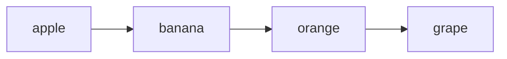
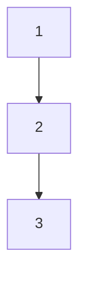
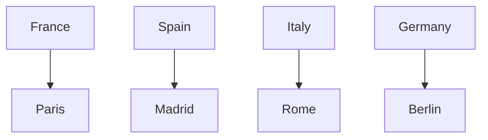

## 2.1.3 Collections: Lists, Sets, and Maps

In the world of programming, collections are indispensable tools for managing groups of related data. Dart, the language behind Flutter, offers robust collection types that allow developers to handle data efficiently and effectively. This section will delve into three primary types of collections in Dart: Lists, Sets, and Maps. We will explore their characteristics, use cases, and how to manipulate them through practical examples and visual aids.

### Introduction to Collections

Collections in Dart are objects designed to hold multiple values, providing a way to manage and organize data efficiently. They are essential for tasks that involve grouping, storing, and retrieving related data. Whether you're developing a simple app or a complex system, understanding collections is crucial for effective data management.

### Lists

Lists in Dart are ordered collections of items, similar to arrays in other programming languages. They are versatile and commonly used when the order of elements matters.

#### Declaring a List

To declare a list in Dart, you specify the type of elements it will hold and initialize it with values:

```dart
List<String> fruits = ['apple', 'banana', 'orange'];
```

This creates a list of strings containing three fruit names. Lists can hold any data type, including custom objects.

#### Accessing Elements by Index

Lists are indexed, meaning you can access elements using their position in the list:

```dart
String firstFruit = fruits[0]; // 'apple'
```

The index starts at 0, so `fruits[0]` retrieves the first element.

#### Common List Methods

Dart provides several methods to manipulate lists:

- **Add an Item**: Use `add()` to append an element to the list.

  ```dart
  fruits.add('grape');
  ```

- **Remove an Item**: Use `remove()` to delete an element by value.

  ```dart
  fruits.remove('banana');
  ```

- **Length of the List**: Use `length` to get the number of elements.

  ```dart
  int count = fruits.length;
  ```

#### Visual Diagram: Lists



This diagram illustrates a list as an ordered sequence of elements.

### Sets

Sets in Dart are collections of unique items, meaning they automatically ignore duplicate values. They are unordered, which makes them ideal for operations where the uniqueness of elements is more important than their order.

#### Declaring a Set

To declare a set, use curly braces:

```dart
Set<int> uniqueNumbers = {1, 2, 3};
```

#### Adding Elements

When you add a duplicate element, the set remains unchanged:

```dart
uniqueNumbers.add(2); // Set remains {1, 2, 3}
```

#### Useful Operations

Sets are particularly useful for mathematical operations like union, intersection, and difference.

#### Visual Diagram: Sets



This diagram represents a set with unique elements.

### Maps

Maps in Dart are collections of key-value pairs, similar to dictionaries or hash tables in other languages. They are perfect for scenarios where you need to associate keys with values.

#### Declaring a Map

To declare a map, use curly braces with key-value pairs:

```dart
Map<String, String> capitals = {
  'France': 'Paris',
  'Spain': 'Madrid',
  'Italy': 'Rome',
};
```

#### Accessing Values by Key

Retrieve values using their keys:

```dart
String capitalOfFrance = capitals['France']!; // 'Paris'
```

#### Adding Entries

Add new key-value pairs by assigning a value to a key:

```dart
capitals['Germany'] = 'Berlin';
```

#### Visual Diagram: Maps



This diagram shows a map with key-value relationships.

### Iteration Over Collections

Iterating over collections is a common task in programming. Dart provides straightforward ways to loop through lists, sets, and maps.

#### Iterating Over Lists

Use a `for` loop to iterate over list elements:

```dart
for (var fruit in fruits) {
  print(fruit);
}
```

#### Iterating Over Sets

Similarly, use a `for` loop for sets:

```dart
for (var number in uniqueNumbers) {
  print(number);
}
```

#### Iterating Over Maps

Use `forEach` to iterate over map entries:

```dart
capitals.forEach((country, capital) {
  print('$capital is the capital of $country');
});
```

### Interactive Exercise

Now it's your turn! Create your own lists, sets, and maps. Try adding and removing items, and iterate over your collections to print their contents. Experiment with different data types and see how Dart handles them.

### Common Errors and Tips

- **Accessing Non-Existent Keys**: When accessing a map with a non-existent key, Dart returns `null`. With null safety, this can throw an error if not handled properly. Always check for null or use the null-aware operator (`?`) when accessing map values.
  
- **Mutable vs Immutable Collections**: Dart collections are mutable by default, meaning you can change their contents. However, you can create immutable collections using the `const` keyword, which can be useful for performance optimization and ensuring data integrity.

### Best Practices

- **Use Lists When Order Matters**: Lists are ideal when the order of elements is important, such as in a to-do list or a playlist.
  
- **Use Sets for Unique Elements**: Sets are perfect for scenarios where you need to ensure all elements are unique, like storing user IDs or tags.

- **Use Maps for Key-Value Associations**: Maps are best when you need to associate keys with values, such as storing configuration settings or user profiles.

### Further Reading and Resources

- [Dart Collections Official Documentation](https://dart.dev/guides/libraries/library-tour#collections)
- [Effective Dart: Usage](https://dart.dev/guides/language/effective-dart/usage)
- [Flutter & Dart: The Complete Guide [2023 Edition]](https://www.udemy.com/course/learn-flutter-dart-to-build-ios-android-apps/)

By mastering Dart collections, you can efficiently manage data in your Flutter applications, leading to cleaner, more maintainable code. Experiment with these concepts in your projects and explore the vast possibilities they offer.

## Quiz Time!



### What is a collection in Dart?

- [x] An object that can hold multiple values.
- [ ] A single value data type.
- [ ] A function that returns multiple values.
- [ ] A Dart package for UI components.

> **Explanation:** Collections in Dart are objects designed to hold multiple values, allowing for efficient data management.

### How do you declare a list of strings in Dart?

- [x] `List<String> fruits = ['apple', 'banana', 'orange'];`
- [ ] `Set<String> fruits = ['apple', 'banana', 'orange'];`
- [ ] `Map<String> fruits = ['apple', 'banana', 'orange'];`
- [ ] `Array<String> fruits = ['apple', 'banana', 'orange'];`

> **Explanation:** Lists in Dart are declared using the `List` keyword followed by the data type in angle brackets.

### What is the output of `fruits[0]` if `fruits` is `['apple', 'banana', 'orange']`?

- [x] 'apple'
- [ ] 'banana'
- [ ] 'orange'
- [ ] 'grape'

> **Explanation:** Lists are indexed starting from 0, so `fruits[0]` accesses the first element, which is 'apple'.

### Which collection type automatically ignores duplicate values?

- [ ] List
- [x] Set
- [ ] Map
- [ ] Array

> **Explanation:** Sets in Dart are designed to hold unique items, automatically ignoring duplicates.

### How do you add a key-value pair to a map in Dart?

- [x] `capitals['Germany'] = 'Berlin';`
- [ ] `capitals.add('Germany', 'Berlin');`
- [ ] `capitals.insert('Germany', 'Berlin');`
- [ ] `capitals.push('Germany', 'Berlin');`

> **Explanation:** In Dart, you add a key-value pair to a map by assigning a value to a key using the bracket notation.

### What will `capitals['France']` return if `capitals` is a map with `{'France': 'Paris'}`?

- [x] 'Paris'
- [ ] 'France'
- [ ] null
- [ ] 'Berlin'

> **Explanation:** Accessing a map with a key returns the associated value, so `capitals['France']` returns 'Paris'.

### Which method is used to iterate over a map in Dart?

- [ ] `forEach` for lists
- [ ] `forEach` for sets
- [x] `forEach` for maps
- [ ] `map` for lists

> **Explanation:** The `forEach` method is used to iterate over map entries, allowing access to both keys and values.

### What happens if you try to access a non-existent key in a map with null safety enabled?

- [ ] Returns a default value
- [ ] Throws a compile-time error
- [x] Throws a runtime error
- [ ] Returns an empty string

> **Explanation:** With null safety, accessing a non-existent key in a map can throw a runtime error if not handled properly.

### Which collection type is best for storing key-value pairs?

- [ ] List
- [ ] Set
- [x] Map
- [ ] Array

> **Explanation:** Maps are designed for storing key-value pairs, making them ideal for scenarios requiring associations.

### True or False: Lists in Dart are unordered collections.

- [ ] True
- [x] False

> **Explanation:** Lists in Dart are ordered collections, meaning the order of elements is maintained.


