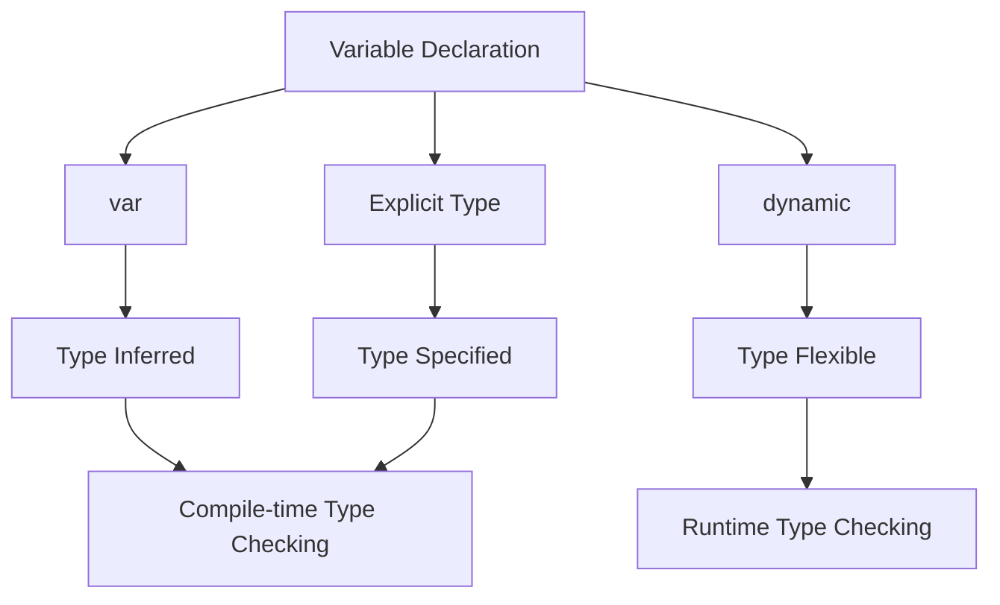

## 2.1.4 Type Inference and Explicit Typing

In the world of programming, understanding how a language handles types is crucial for writing efficient and error-free code. Dart, the language behind Flutter, offers a robust type system that includes both type inference and explicit typing. This section will delve into these concepts, providing you with the knowledge to make informed decisions about when to use each approach in your Flutter applications.

### Type Inference with `var`

Type inference is a powerful feature in Dart that allows the compiler to deduce the type of a variable based on the value assigned to it. This feature simplifies code by reducing the need for explicit type declarations, making it easier to read and write.

#### How Type Inference Works

When you declare a variable using `var`, Dart automatically infers the type from the initial value assigned to the variable. This means you don't have to specify the type explicitly, as Dart does it for you. Here's how it works:

```dart
var count = 10; // Inferred as int
var name = 'Bob'; // Inferred as String
```

In the examples above, Dart infers `count` as an `int` and `name` as a `String`. Once the type is inferred, it cannot change. This means you cannot assign a value of a different type to these variables later in the code:

```dart
count = 'ten'; // Error: A value of type 'String' can't be assigned to a variable of type 'int'.
```

#### Advantages of Type Inference

- **Conciseness**: Reduces the verbosity of the code by eliminating the need for explicit type declarations.
- **Readability**: Makes the code cleaner and easier to read, especially when the type is obvious from the context.

### Explicit Typing

While type inference is convenient, there are situations where explicitly declaring the type of a variable is beneficial. Explicit typing involves specifying the type of a variable at the time of declaration.

#### Why Use Explicit Typing?

Explicit typing enhances code clarity and helps prevent type-related errors. It is particularly useful in the following scenarios:

- **Code Readability**: When the type of a variable is not immediately clear from the context, explicit typing makes the code easier to understand.
- **Public APIs**: In public APIs, explicit types provide clear documentation of what types are expected, reducing the likelihood of misuse.
- **Complex Logic**: In complex logic or algorithms, explicit types can help maintain clarity and prevent errors.

Here's how you can declare variables with explicit types:

```dart
String city = 'New York';
int population = 8000000;
```

In these examples, the types `String` and `int` are explicitly declared, making it clear what kind of data each variable is expected to hold.

### The `dynamic` Type

Dart also provides a special type called `dynamic`, which can hold any value. This type is flexible but should be used with caution.

#### Using `dynamic`

When a variable is declared with the `dynamic` type, it can change types at runtime. This can be useful in certain scenarios where flexibility is required, but it comes with risks:

```dart
dynamic flexibleVariable = 'Hello';
flexibleVariable = 123; // No error
```

While `dynamic` allows for flexibility, it bypasses Dart's type checking, leading to potential runtime errors. Therefore, it should be used sparingly and only when necessary.

#### Caution with `dynamic`

- **Runtime Errors**: Since `dynamic` bypasses compile-time type checking, errors may only surface at runtime, making them harder to debug.
- **Performance**: Using `dynamic` can impact performance due to the lack of type optimizations.

### Type Safety and Null Safety

Dart's strong type system is designed to catch errors at compile time, enhancing the reliability and robustness of your code. Type safety ensures that variables are used consistently with their declared types, preventing type-related errors.

#### Null Safety

Dart also incorporates null safety, which helps prevent null reference errors by ensuring that non-nullable variables cannot be assigned a null value. This feature further enhances the reliability of your code by catching potential null-related issues at compile time.

### Best Practices

To leverage Dart's type system effectively, consider the following best practices:

- **Use `var` for Obvious Types**: When the type of a variable is clear from the context, use `var` to keep the code concise.
- **Explicit Types for Clarity**: Use explicit types when the type is not immediately clear or when defining public APIs.
- **Avoid Overusing `dynamic`**: Prefer specific types to take advantage of Dart's type checking and avoid runtime errors.

### Visual Diagrams

To better understand the differences between `var`, `dynamic`, and explicit typing, consider the following infographic:



### Exercises

To reinforce your understanding of type inference and explicit typing, try the following exercises:

- **Refactor Code**: Take a piece of code that uses `var` and refactor it to use explicit types. Then, do the reverse by changing explicit types to `var` where appropriate.
- **Predict and Confirm**: Predict the type of variables in a given code snippet and confirm your predictions by hovering over the variables in your IDE.

### Conclusion

Understanding type inference and explicit typing in Dart is essential for writing clear, efficient, and error-free code. By leveraging these features appropriately, you can enhance the readability and reliability of your Flutter applications. Remember to use `var` for obvious types, explicit types for clarity, and avoid overusing `dynamic` to maintain type safety.

For further exploration, consider reviewing the [Dart Language Tour](https://dart.dev/guides/language/language-tour) and experimenting with different type declarations in your projects.

## Quiz Time!



### What does Dart infer the type of the variable `count` in the following declaration?
```dart
var count = 10;
```

- [x] int
- [ ] double
- [ ] String
- [ ] dynamic

> **Explanation:** Dart infers the type of `count` as `int` because the assigned value is an integer.


### Which of the following is a reason to use explicit typing in Dart?

- [x] Enhancing code readability
- [ ] Reducing code verbosity
- [x] Preventing type-related errors
- [ ] Allowing type changes at runtime

> **Explanation:** Explicit typing enhances code readability and helps prevent type-related errors by clearly specifying the expected type.


### What is the main risk of using the `dynamic` type in Dart?

- [x] Runtime errors
- [ ] Compile-time errors
- [ ] Increased code verbosity
- [ ] Reduced code readability

> **Explanation:** The main risk of using `dynamic` is that it can lead to runtime errors due to the lack of compile-time type checking.


### In which scenario is it most appropriate to use `var` in Dart?

- [x] When the type is obvious and unambiguous
- [ ] When the type is complex and unclear
- [ ] When the variable needs to change types
- [ ] When defining public APIs

> **Explanation:** `var` is most appropriate when the type is obvious and unambiguous, as it keeps the code concise.


### What does Dart's null safety feature help prevent?

- [x] Null reference errors
- [ ] Type inference errors
- [ ] Compile-time errors
- [ ] Runtime errors

> **Explanation:** Dart's null safety feature helps prevent null reference errors by ensuring non-nullable variables cannot be assigned null.


### Which of the following is a benefit of type inference in Dart?

- [x] Reduces code verbosity
- [ ] Increases code complexity
- [ ] Allows type changes at runtime
- [ ] Requires explicit type declarations

> **Explanation:** Type inference reduces code verbosity by eliminating the need for explicit type declarations when the type is obvious.


### What happens if you try to assign a `String` to a variable inferred as `int`?

- [x] Compile-time error
- [ ] Runtime error
- [ ] No error
- [ ] The type changes to `String`

> **Explanation:** Assigning a `String` to a variable inferred as `int` results in a compile-time error because the type cannot change.


### Which type should be used sparingly due to potential runtime errors?

- [x] dynamic
- [ ] var
- [ ] int
- [ ] String

> **Explanation:** The `dynamic` type should be used sparingly because it can lead to runtime errors due to the lack of compile-time type checking.


### What is the advantage of using explicit types in public APIs?

- [x] Provides clear documentation of expected types
- [ ] Allows for type changes at runtime
- [ ] Reduces code verbosity
- [ ] Increases code complexity

> **Explanation:** Using explicit types in public APIs provides clear documentation of expected types, reducing the likelihood of misuse.


### True or False: Once a type is inferred by Dart, it can change during runtime.

- [ ] True
- [x] False

> **Explanation:** False. Once a type is inferred by Dart, it cannot change during runtime, ensuring type safety.


