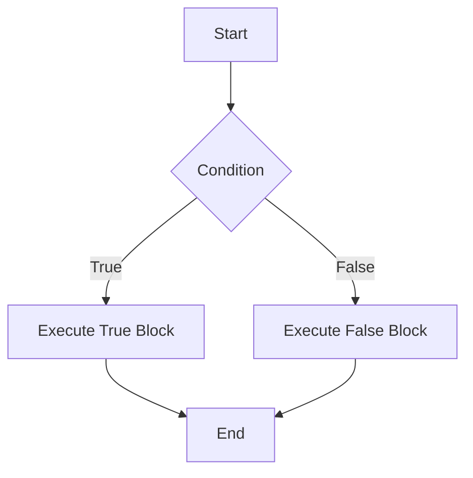
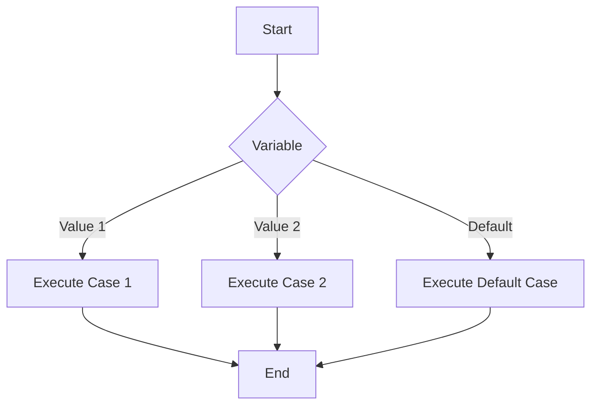

## 2.2.1 Conditional Statements

In the realm of programming, the ability to make decisions is crucial. Conditional statements are the building blocks that allow programs to choose different paths of execution based on certain conditions. In this section, we will delve into the intricacies of conditional statements in Dart, a language that powers Flutter applications. We will explore the syntax, use cases, and best practices for using `if`, `if-else`, `else-if`, and `switch` statements, complemented by practical examples and visual aids.

### Understanding Control Flow

Control flow statements are the backbone of any programming language, directing the order in which statements are executed. They enable programs to make decisions, repeat tasks, and handle different scenarios dynamically. In Dart, control flow is primarily managed through conditional statements and loops.

#### The Role of Conditions

Conditions are expressions that evaluate to either `true` or `false`. They are pivotal in decision-making processes within your code. By evaluating conditions, your program can decide which block of code to execute, allowing for dynamic and flexible applications.

### If Statements

The `if` statement is the simplest form of conditional statement. It allows you to execute a block of code only if a specified condition is true.

#### Syntax

```dart
if (condition) {
  // Code to execute if condition is true
}
```

#### Example

Consider a scenario where you want to check if a person is an adult:

```dart
int age = 20;
if (age >= 18) {
  print('You are an adult.');
}
```

In this example, the condition `age >= 18` evaluates to `true`, so the message "You are an adult." is printed.

#### Relational and Logical Operators

To construct conditions, Dart provides relational operators such as `==`, `!=`, `<`, `>`, `<=`, and `>=`, as well as logical operators like `&&` (AND), `||` (OR), and `!` (NOT). These operators allow you to build complex conditions.

- **Relational Operators**: Compare two values.
  - `==`: Equal to
  - `!=`: Not equal to
  - `<`: Less than
  - `>`: Greater than
  - `<=`: Less than or equal to
  - `>=`: Greater than or equal to

- **Logical Operators**: Combine multiple conditions.
  - `&&`: True if both operands are true
  - `||`: True if at least one operand is true
  - `!`: Inverts the truth value

### If-Else Statements

The `if-else` statement extends the `if` statement by providing an alternative block of code to execute if the condition is false.

#### Syntax

```dart
if (condition) {
  // Code if true
} else {
  // Code if false
}
```

#### Example

Let's enhance our previous example to handle both adults and non-adults:

```dart
int age = 16;
if (age >= 18) {
  print('Welcome!');
} else {
  print('Access denied.');
}
```

Here, since `age` is less than 18, the program prints "Access denied."

### Else-If Ladder

The `else-if` ladder allows you to check multiple conditions sequentially. It is useful when you have more than two possible paths of execution.

#### Syntax

```dart
if (condition1) {
  // Code
} else if (condition2) {
  // Code
} else {
  // Code
}
```

#### Example

Consider a grading system based on scores:

```dart
int score = 85;
if (score >= 90) {
  print('Grade: A');
} else if (score >= 80) {
  print('Grade: B');
} else {
  print('Try again.');
}
```

In this example, the score of 85 results in a "Grade: B" because the first condition is false, but the second condition is true.

### Switch Statements

The `switch` statement provides a way to execute different parts of code based on the value of a variable. It is often more readable than multiple `if-else` statements when dealing with a single variable.

#### Syntax

```dart
switch (variable) {
  case value1:
    // Code
    break;
  case value2:
    // Code
    break;
  default:
    // Code
}
```

#### Example

Let's use a `switch` statement to determine the day of the week:

```dart
String day = 'Monday';
switch (day) {
  case 'Monday':
    print('Start of the work week.');
    break;
  case 'Friday':
    print('End of the work week.');
    break;
  default:
    print('Midweek days.');
}
```

In this example, the program prints "Start of the work week." because the `day` variable matches the first case.

#### Importance of the `break` Keyword

The `break` keyword is crucial in `switch` statements to prevent fall-through, where subsequent cases are executed unintentionally. Without `break`, the program continues executing the next case, which can lead to unexpected behavior.

### Visual Diagrams

To better understand the flow of execution in conditional statements, let's use flowcharts and decision trees.

#### If-Else Flowchart



#### Switch Statement Flowchart



### Common Mistakes

- **Forgetting the `break` Statement**: Omitting `break` in a `switch` case can cause unintended fall-through.
- **Misusing Logical Operators**: Ensure logical operators are used correctly to avoid unexpected results.

### Interactive Exercise

Let's put your knowledge to the test. Write a program that assigns letter grades based on numerical scores. Use an `else-if` ladder to handle different score ranges. Test your program with various inputs to observe the control flow.

```dart
int score = 75; // Try different values
if (score >= 90) {
  print('Grade: A');
} else if (score >= 80) {
  print('Grade: B');
} else if (score >= 70) {
  print('Grade: C');
} else if (score >= 60) {
  print('Grade: D');
} else {
  print('Grade: F');
}
```

### Conclusion

Conditional statements are a fundamental aspect of programming, enabling your Dart applications to make decisions and respond dynamically to different scenarios. By mastering `if`, `if-else`, `else-if`, and `switch` statements, you can create more flexible and responsive applications. Remember to test your conditions thoroughly and use visual aids to conceptualize the flow of execution.

For further exploration, consider diving into Dart's official documentation and experimenting with more complex conditional logic in your projects.

## Quiz Time!



### What is the primary purpose of conditional statements in programming?

- [x] To direct the order of execution of statements based on conditions
- [ ] To define variables and constants
- [ ] To create loops for repetitive tasks
- [ ] To handle exceptions and errors

> **Explanation:** Conditional statements allow programs to make decisions and execute different blocks of code based on whether conditions evaluate to true or false.


### Which of the following is a relational operator in Dart?

- [x] ==
- [ ] &&
- [ ] ||
- [ ] !

> **Explanation:** The `==` operator is used to compare two values for equality, making it a relational operator.


### What will the following code print if `age` is 16?
```dart
if (age >= 18) {
  print('Welcome!');
} else {
  print('Access denied.');
}
```

- [ ] Welcome!
- [x] Access denied.
- [ ] Error
- [ ] Nothing

> **Explanation:** Since `age` is 16, the condition `age >= 18` is false, so the else block executes, printing "Access denied."


### In a switch statement, what is the purpose of the `break` keyword?

- [x] To prevent fall-through to the next case
- [ ] To exit the program
- [ ] To repeat the current case
- [ ] To skip the default case

> **Explanation:** The `break` keyword stops the execution of the current case and prevents the program from executing subsequent cases unintentionally.


### Which logical operator represents "AND" in Dart?

- [x] &&
- [ ] ||
- [ ] !
- [ ] ==

> **Explanation:** The `&&` operator is used to combine two conditions, both of which must be true for the overall expression to be true.


### What will the following code print if `score` is 85?
```dart
if (score >= 90) {
  print('Grade: A');
} else if (score >= 80) {
  print('Grade: B');
} else {
  print('Try again.');
}
```

- [ ] Grade: A
- [x] Grade: B
- [ ] Try again.
- [ ] Error

> **Explanation:** The score of 85 satisfies the condition `score >= 80`, so the program prints "Grade: B."


### Which of the following is NOT a logical operator in Dart?

- [ ] &&
- [ ] ||
- [x] ==
- [ ] !

> **Explanation:** The `==` operator is a relational operator, not a logical operator.


### What is the output of the following code if `day` is 'Wednesday'?
```dart
switch (day) {
  case 'Monday':
    print('Start of the work week.');
    break;
  case 'Friday':
    print('End of the work week.');
    break;
  default:
    print('Midweek days.');
}
```

- [ ] Start of the work week.
- [ ] End of the work week.
- [x] Midweek days.
- [ ] Error

> **Explanation:** Since 'Wednesday' does not match any case, the default case executes, printing "Midweek days."


### True or False: The `else` block in an if-else statement is mandatory.

- [ ] True
- [x] False

> **Explanation:** The `else` block is optional. You can have an `if` statement without an `else` block.


### Which statement is used to handle multiple conditions sequentially?

- [ ] If statement
- [ ] Switch statement
- [x] Else-if ladder
- [ ] For loop

> **Explanation:** An else-if ladder allows you to evaluate multiple conditions in sequence, executing the block of code for the first true condition.


