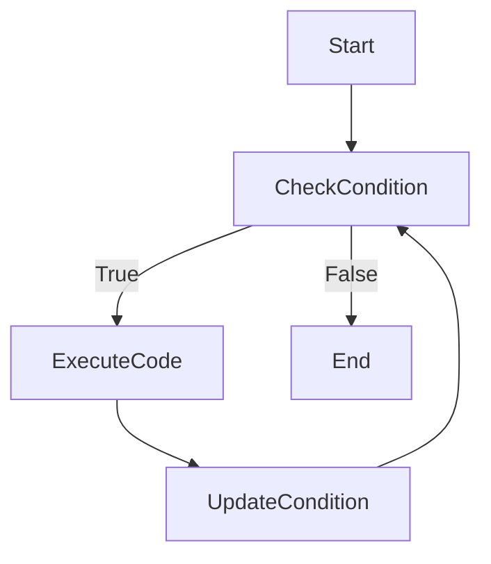
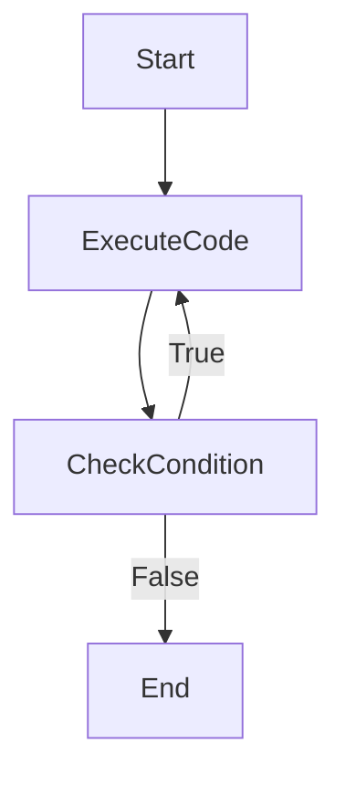

## 2.2.2 For and While Loops

In programming, loops are fundamental constructs that allow you to execute a block of code multiple times without manually repeating it. They are essential for tasks such as iterating over collections, performing repetitive operations, and executing code until a specific condition is met. In Dart, the `for` and `while` loops are powerful tools that help streamline your code and make it more efficient. This section will delve into the intricacies of these loops, providing you with the knowledge to use them effectively in your Flutter applications.

### Purpose of Loops

Loops are designed to automate repetitive tasks, reducing the need for redundant code. They enable you to:

- **Iterate over Collections**: Process each element in a list, set, or map.
- **Perform Repetitive Tasks**: Execute a block of code a specific number of times.
- **Conditional Execution**: Continue executing code until a condition is no longer true.

By understanding loops, you can write cleaner, more efficient code that is easier to maintain and understand.

### For Loops

The `for` loop is one of the most commonly used loops in programming. It is particularly useful when you know in advance how many times you need to execute a block of code.

#### Standard For Loop

The standard `for` loop in Dart has the following syntax:

```dart
for (initialization; condition; increment) {
  // Code to execute
}
```

Let's break down each component:

- **Initialization**: Sets the starting point for the loop. This is executed once at the beginning.
- **Condition**: Evaluated before each iteration. If true, the loop continues; if false, the loop stops.
- **Increment**: Updates the loop variable after each iteration.

**Example:**

```dart
for (int i = 0; i < 5; i++) {
  print('Iteration $i');
}
```

- **Initialization**: `int i = 0;` initializes the loop variable `i` to 0.
- **Condition**: `i < 5;` ensures the loop runs as long as `i` is less than 5.
- **Increment**: `i++` increases the value of `i` by 1 after each iteration.

This loop will print:

```
Iteration 0
Iteration 1
Iteration 2
Iteration 3
Iteration 4
```

#### For-in Loops

The `for-in` loop is a simplified version of the `for` loop, used for iterating over collections like lists or sets. It is particularly useful when you don't need the index of the elements.

**Example:**

```dart
List<String> names = ['Alice', 'Bob', 'Charlie'];
for (var name in names) {
  print(name);
}
```

This loop will print each name in the list:

```
Alice
Bob
Charlie
```

### While Loops

The `while` loop is used when you want to execute a block of code as long as a condition remains true. It is ideal for situations where the number of iterations is not known beforehand.

**Syntax:**

```dart
while (condition) {
  // Code to execute
}
```

**Example:**

```dart
int countdown = 5;
while (countdown > 0) {
  print(countdown);
  countdown--;
}
print('Blast off!');
```

This loop will count down from 5 to 1 and then print "Blast off!".

### Do-While Loops

The `do-while` loop is similar to the `while` loop, but it guarantees that the code block is executed at least once before the condition is checked.

**Syntax:**

```dart
do {
  // Code to execute
} while (condition);
```

**Example:**

```dart
int number = 0;
do {
  print(number);
  number++;
} while (number < 5);
```

This loop will print numbers from 0 to 4.

### Visual Diagrams

To better understand the flow of `while` and `do-while` loops, let's look at some flowcharts.

#### While Loop Flowchart



#### Do-While Loop Flowchart



### Common Pitfalls

When working with loops, it's important to be aware of common pitfalls:

- **Infinite Loops**: Occur when the loop's exit condition is never met. This can happen if you forget to update the loop variable.
  - Example: Forgetting `i++` in a `for` loop.
  
- **Off-by-One Errors**: These occur when the loop runs one time too many or too few, often due to incorrect conditions.

### Interactive Exercise

Let's put your knowledge to the test with a practical exercise. Write a Dart program that calculates the factorial of a given number using a loop. Experiment with different loop types (`for`, `while`, `do-while`) to achieve the same result.

**Hint**: The factorial of a number `n` is the product of all positive integers less than or equal to `n`.

### Conclusion

Understanding and mastering loops is crucial for efficient programming. They allow you to automate repetitive tasks, iterate over collections, and execute code conditionally. By practicing with different loop types and scenarios, you can enhance your problem-solving skills and write more efficient code.

## Quiz Time!



### What is the primary purpose of loops in programming?

- [x] To execute a block of code multiple times without manual repetition.
- [ ] To execute a block of code only once.
- [ ] To execute a block of code based on user input.
- [ ] To execute a block of code in a random order.

> **Explanation:** Loops are used to automate repetitive tasks by executing a block of code multiple times, reducing the need for redundant code.

### Which part of a standard for loop is executed only once?

- [x] Initialization
- [ ] Condition
- [ ] Increment
- [ ] Code block

> **Explanation:** The initialization part of a for loop is executed only once at the beginning of the loop.

### What is the correct syntax for a for-in loop in Dart?

- [x] `for (var element in collection) { // Code }`
- [ ] `for (int i = 0; i < collection.length; i++) { // Code }`
- [ ] `while (condition) { // Code }`
- [ ] `do { // Code } while (condition);`

> **Explanation:** The for-in loop syntax is used to iterate over each element in a collection without needing an index.

### How does a while loop differ from a do-while loop?

- [x] A while loop checks the condition before executing the code block, while a do-while loop checks the condition after executing the code block.
- [ ] A while loop executes the code block only once, while a do-while loop executes it multiple times.
- [ ] A while loop is used for collections, while a do-while loop is used for arrays.
- [ ] A while loop requires an index, while a do-while loop does not.

> **Explanation:** A while loop checks the condition before executing the code block, whereas a do-while loop executes the code block once before checking the condition.

### What can cause an infinite loop?

- [x] Forgetting to update the loop variable
- [ ] Using a for-in loop
- [ ] Using a while loop with a true condition
- [ ] Using a do-while loop

> **Explanation:** An infinite loop can occur if the loop variable is not updated, causing the exit condition to never be met.

### Which loop is best for iterating over a collection when you don't need the index?

- [x] For-in loop
- [ ] Standard for loop
- [ ] While loop
- [ ] Do-while loop

> **Explanation:** The for-in loop is ideal for iterating over collections when the index is not needed.

### What is the output of the following code snippet?

```dart
int i = 0;
do {
  print(i);
  i++;
} while (i < 3);
```

- [x] 0 1 2
- [ ] 0 1 2 3
- [ ] 1 2 3
- [ ] 0 1

> **Explanation:** The do-while loop executes the code block once before checking the condition, resulting in the output 0, 1, 2.

### What is the main advantage of using a for-in loop over a standard for loop?

- [x] Simplifies code when you don't need the index
- [ ] Allows for more complex conditions
- [ ] Executes faster than a standard for loop
- [ ] Requires less memory

> **Explanation:** The for-in loop simplifies code by eliminating the need for an index when iterating over collections.

### Which loop type guarantees that the code block is executed at least once?

- [x] Do-while loop
- [ ] While loop
- [ ] For loop
- [ ] For-in loop

> **Explanation:** The do-while loop executes the code block once before checking the condition, ensuring it runs at least once.

### True or False: A while loop can be used to iterate over a collection.

- [x] True
- [ ] False

> **Explanation:** A while loop can be used to iterate over a collection by manually managing the index or iterator.


