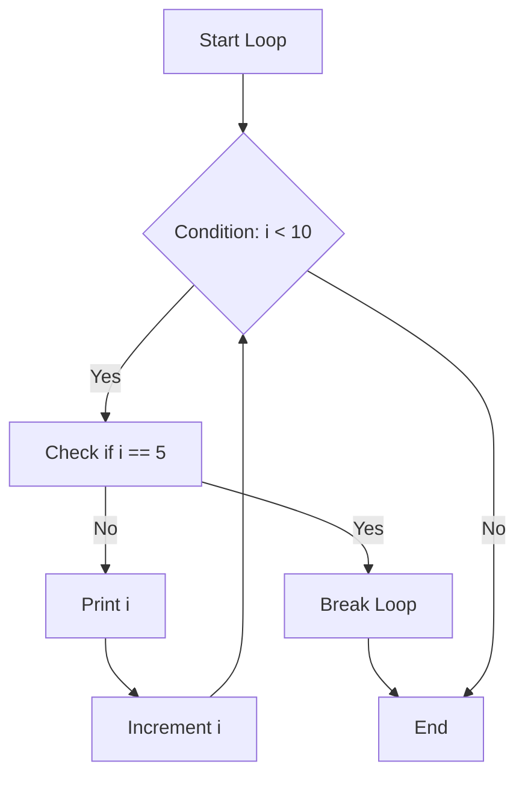
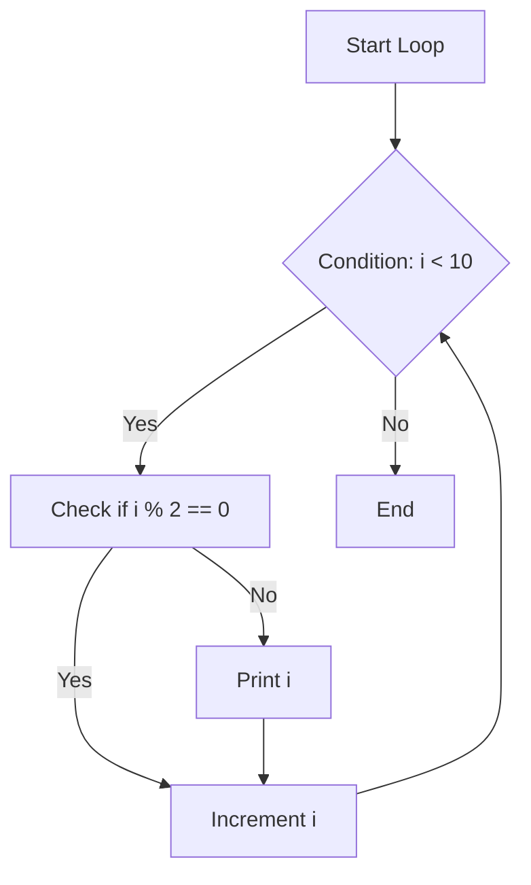
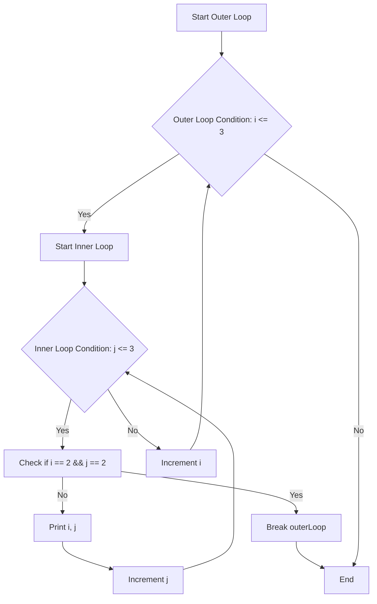

## 2.2.3 Breaking and Continuing Loops

In programming, loops are fundamental constructs that allow us to execute a block of code repeatedly. However, there are times when we need to alter the natural flow of these loops. Dart, like many other programming languages, provides mechanisms to control loop execution using the `break` and `continue` statements. Understanding how to use these statements effectively can lead to more efficient and readable code. In this section, we will delve into these concepts, explore practical examples, and discuss best practices.

### The `break` Statement

The `break` statement is used to exit the nearest enclosing loop immediately. This can be particularly useful when a certain condition is met, and continuing the loop is unnecessary or undesirable. Let's explore this with an example:

```dart
for (int i = 0; i < 10; i++) {
  if (i == 5) {
    break;
  }
  print(i);
}
// Prints numbers 0 to 4
```

#### How It Works

- **Loop Initialization**: The loop starts with `i` initialized to 0.
- **Condition Check**: The loop continues as long as `i` is less than 10.
- **Iteration**: For each iteration, the code checks if `i` equals 5.
- **Break Execution**: When `i` is 5, the `break` statement is executed, terminating the loop immediately.
- **Output**: The numbers 0 through 4 are printed, as the loop exits before printing 5.

#### Visualizing the `break` Statement

To better understand how the `break` statement affects loop execution, consider the following flowchart:



### The `continue` Statement

The `continue` statement skips the current iteration of the loop and proceeds to the next iteration. This can be useful when you want to skip certain iterations based on a condition. Here's an example:

```dart
for (int i = 0; i < 10; i++) {
  if (i % 2 == 0) {
    continue;
  }
  print(i);
}
// Prints odd numbers less than 10
```

#### How It Works

- **Loop Initialization**: The loop starts with `i` initialized to 0.
- **Condition Check**: The loop continues as long as `i` is less than 10.
- **Iteration**: For each iteration, the code checks if `i` is even.
- **Continue Execution**: If `i` is even, the `continue` statement is executed, skipping the rest of the loop body for that iteration.
- **Output**: Only odd numbers (1, 3, 5, 7, 9) are printed.

#### Visualizing the `continue` Statement

The following flowchart illustrates how the `continue` statement alters loop execution:



### Using Labels for Nested Loops

In Dart, labels can be used to specify which loop to break or continue, especially useful in nested loops. Here's an example:

```dart
outerLoop:
for (int i = 1; i <= 3; i++) {
  for (int j = 1; j <= 3; j++) {
    if (i == 2 && j == 2) {
      break outerLoop;
    }
    print('i = $i, j = $j');
  }
}
```

#### How It Works

- **Outer Loop**: Labeled as `outerLoop`, iterates with `i` from 1 to 3.
- **Inner Loop**: Iterates with `j` from 1 to 3.
- **Condition Check**: If `i` is 2 and `j` is 2, the `break outerLoop` statement is executed.
- **Break Execution**: The `break` statement exits the `outerLoop`, not just the inner loop.
- **Output**: The pairs `(i, j)` are printed until `(2, 2)`, after which the loop exits.

#### Visualizing Labeled Breaks

The following diagram illustrates how labeled breaks work in nested loops:



### Best Practices

- **Clarity**: Use `break` and `continue` sparingly to maintain code readability. Overuse can lead to complex and hard-to-follow logic.
- **Refactoring**: If the logic becomes too convoluted, consider refactoring the code. Sometimes, restructuring the loop or using functions can simplify the logic.
- **Documentation**: Clearly comment on the use of `break` and `continue` to explain why they are necessary.

### Interactive Exercise

**Challenge**: Write a Dart program that searches for a specific value in a list and exits the loop once the value is found.

```dart
void main() {
  List<int> numbers = [1, 2, 3, 4, 5, 6, 7, 8, 9, 10];
  int searchValue = 7;
  bool found = false;

  for (int number in numbers) {
    if (number == searchValue) {
      print('Found $searchValue!');
      found = true;
      break;
    }
  }

  if (!found) {
    print('$searchValue not found in the list.');
  }
}
```

#### Explanation

- **List Initialization**: A list of numbers from 1 to 10 is created.
- **Search Value**: The value to search for is set to 7.
- **Loop Execution**: The loop iterates over each number in the list.
- **Condition Check**: If the current number equals the search value, a message is printed, and the loop exits.
- **Output**: If the value is found, "Found 7!" is printed; otherwise, "7 not found in the list." is printed.

### Conclusion

Understanding and effectively using `break` and `continue` statements can significantly enhance your ability to control loop execution in Dart. These tools, when used judiciously, can lead to more efficient and readable code. Remember to always consider the readability and maintainability of your code when using these statements.

For further exploration, consider reading the official [Dart documentation](https://dart.dev/guides/language/language-tour#loops) on loops and control flow. Additionally, experimenting with different loop structures and conditions can deepen your understanding of these concepts.

## Quiz Time!



### What does the `break` statement do in a loop?

- [x] Exits the nearest enclosing loop immediately.
- [ ] Skips the current iteration and moves to the next one.
- [ ] Continues executing the loop without any changes.
- [ ] Restarts the loop from the beginning.

> **Explanation:** The `break` statement is used to exit the nearest enclosing loop immediately, terminating its execution.

### What is the purpose of the `continue` statement?

- [ ] Exits the loop entirely.
- [x] Skips the current iteration and moves to the next one.
- [ ] Restarts the loop from the beginning.
- [ ] Ends the program execution.

> **Explanation:** The `continue` statement skips the current iteration of the loop and proceeds to the next iteration.

### How can you specify which loop to break in nested loops?

- [x] By using labels.
- [ ] By using a special keyword.
- [ ] By using a different loop type.
- [ ] By changing the loop condition.

> **Explanation:** Labels can be used in Dart to specify which loop to break or continue in nested loops.

### What will the following code print?
```dart
for (int i = 0; i < 5; i++) {
  if (i == 3) {
    break;
  }
  print(i);
}
```

- [x] 0, 1, 2
- [ ] 0, 1, 2, 3
- [ ] 0, 1, 2, 3, 4
- [ ] 3, 4

> **Explanation:** The loop will print 0, 1, and 2. When `i` is 3, the `break` statement will terminate the loop.

### What will the following code print?
```dart
for (int i = 0; i < 5; i++) {
  if (i % 2 == 0) {
    continue;
  }
  print(i);
}
```

- [ ] 0, 2, 4
- [x] 1, 3
- [ ] 0, 1, 2, 3, 4
- [ ] 2, 4

> **Explanation:** The loop will print 1 and 3. The `continue` statement skips even numbers.

### What is a potential downside of overusing `break` and `continue` statements?

- [x] It can make the code harder to understand.
- [ ] It can improve code readability.
- [ ] It can reduce the number of lines of code.
- [ ] It can increase the execution speed.

> **Explanation:** Overusing `break` and `continue` can lead to complex and hard-to-follow logic, making the code harder to understand.

### In the context of loops, what does a label do?

- [x] It allows you to specify which loop to break or continue.
- [ ] It changes the loop condition.
- [ ] It modifies the loop variable.
- [ ] It restarts the loop.

> **Explanation:** A label in Dart allows you to specify which loop to break or continue, particularly useful in nested loops.

### What will the following code print?
```dart
outerLoop:
for (int i = 1; i <= 3; i++) {
  for (int j = 1; j <= 3; j++) {
    if (i == 2 && j == 2) {
      break outerLoop;
    }
    print('i = $i, j = $j');
  }
}
```

- [x] i = 1, j = 1; i = 1, j = 2; i = 1, j = 3; i = 2, j = 1
- [ ] i = 1, j = 1; i = 1, j = 2; i = 1, j = 3; i = 2, j = 1; i = 2, j = 2
- [ ] i = 1, j = 1; i = 1, j = 2; i = 1, j = 3; i = 2, j = 1; i = 2, j = 2; i = 2, j = 3
- [ ] i = 1, j = 1; i = 1, j = 2; i = 1, j = 3

> **Explanation:** The loop will print until `i = 2, j = 1`. When `i` is 2 and `j` is 2, the `break outerLoop` statement will terminate the outer loop.

### True or False: The `continue` statement can be used to exit a loop.

- [ ] True
- [x] False

> **Explanation:** The `continue` statement does not exit a loop; it skips the current iteration and moves to the next one.

### True or False: Using labels in loops is a best practice for all scenarios.

- [ ] True
- [x] False

> **Explanation:** While labels can be useful, they should be used judiciously as they can make the code harder to follow if overused or used inappropriately.


