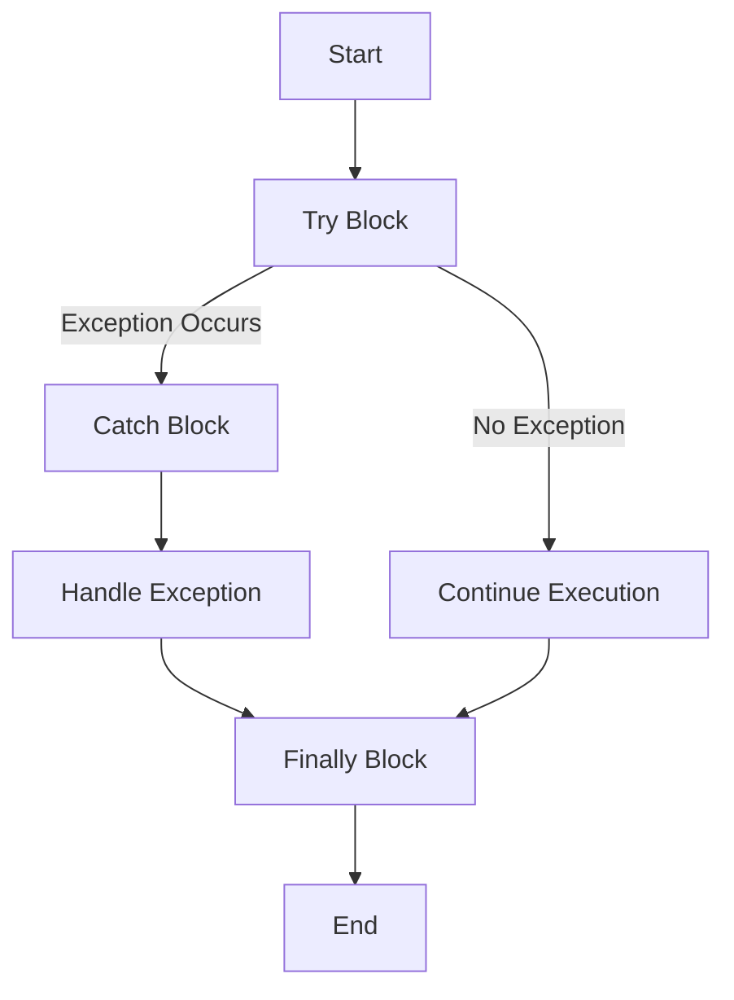

## 2.2.4 Exception Handling

In the world of programming, errors are inevitable. They can arise from various sources, such as invalid user input, missing files, or network issues. Dart, like many modern programming languages, provides a robust mechanism for handling such errors through exceptions. Understanding how to effectively manage exceptions is crucial for building resilient applications. This section delves into the intricacies of exception handling in Dart, equipping you with the knowledge to write robust and error-resistant code.

### Understanding Exceptions

Exceptions are events that occur during the execution of a program, disrupting the normal flow of instructions. They are not necessarily errors but are conditions that a program should be able to handle gracefully. Common causes of exceptions include:

- **Invalid User Input**: When a user provides input that the program cannot process, such as entering a string where a number is expected.
- **File Not Found**: Attempting to access a file that does not exist or is inaccessible.
- **Network Errors**: Issues that arise during network communication, such as timeouts or unreachable servers.

Handling exceptions allows a program to continue running or to terminate gracefully, providing feedback to the user or logging the error for further analysis.

### The `try-catch` Block

The `try-catch` block is the cornerstone of exception handling in Dart. It allows you to execute code that might throw an exception and to handle any exceptions that occur.

#### Syntax

The basic syntax of a `try-catch` block in Dart is as follows:

```dart
try {
  // Code that might throw an exception
} catch (e) {
  // Handle exception
}
```

#### Example

Consider the following example, where we attempt to divide a number by zero, which will throw an exception:

```dart
try {
  int result = 100 ~/ 0; // Throws an exception
} catch (e) {
  print('An error occurred: $e');
}
```

In this example, the division by zero operation throws an exception, which is caught by the `catch` block, and an error message is printed.

### Specific Exception Handling with `on`

Dart allows you to catch specific types of exceptions using the `on` keyword. This is useful when you want to handle different exceptions in different ways.

#### Example

Here’s how you can catch a specific exception, such as `FormatException`, which occurs when trying to parse a non-numeric string as an integer:

```dart
try {
  int num = int.parse('abc');
} on FormatException catch (e) {
  print('Invalid number format: $e');
}
```

In this example, the `on FormatException` clause catches only `FormatException` errors, allowing you to handle them specifically.

### The `finally` Block

The `finally` block is used to execute code that should run regardless of whether an exception was thrown or not. This is typically used for cleanup operations, such as closing files or releasing resources.

#### Example

```dart
try {
  // Code that might throw an exception
} catch (e) {
  // Handle exception
} finally {
  // Cleanup code
  print('This will always execute.');
}
```

The `finally` block ensures that the cleanup code runs even if an exception occurs, making it a reliable place for resource management.

### Throwing Exceptions

In Dart, you can manually trigger exceptions using the `throw` keyword. This is useful for enforcing certain conditions or rules within your code.

#### Example

Consider a banking application where you want to prevent withdrawals that exceed the account balance:

```dart
void withdraw(double amount) {
  if (amount > balance) {
    throw Exception('Insufficient funds');
  }
  // Proceed with withdrawal
}
```

In this example, an exception is thrown if the withdrawal amount exceeds the available balance, preventing the operation from proceeding.

### Custom Exceptions

Dart allows you to define your own exception classes, providing more meaningful error messages and handling specific error conditions.

#### Example

Here’s how you can create a custom exception class:

```dart
class InsufficientFundsException implements Exception {
  String errMsg() => 'Insufficient funds';
}
```

You can then use this custom exception in your code:

```dart
void withdraw(double amount) {
  if (amount > balance) {
    throw InsufficientFundsException();
  }
  // Proceed with withdrawal
}
```

Custom exceptions make your code more readable and maintainable by clearly indicating the nature of the error.

### Visual Diagrams

To better understand the flow of exception handling, consider the following flowchart illustrating the `try-catch-finally` mechanism:



This diagram shows the flow of control through a `try-catch-finally` block, highlighting how exceptions are caught and handled.

### Best Practices

When handling exceptions, consider the following best practices:

- **Catch Only What You Can Handle**: Avoid catching exceptions you cannot handle meaningfully. Let them propagate to a higher level where they can be managed appropriately.
- **Avoid Using Exceptions for Control Flow**: Exceptions should not be used for regular control flow, as they can obscure the logic of your program and degrade performance.
- **Provide Informative Error Messages**: Ensure that error messages are clear and informative, helping users or developers understand the issue.

### Interactive Exercise

To solidify your understanding of exception handling, try writing a function that reads a list index provided by the user and handles potential exceptions. Consider scenarios such as invalid input or out-of-bounds access.

```dart
void accessListElement(List<int> numbers) {
  try {
    print('Enter an index:');
    int index = int.parse(stdin.readLineSync()!);
    print('Element at index $index: ${numbers[index]}');
  } on FormatException {
    print('Please enter a valid integer.');
  } on RangeError {
    print('Index out of range.');
  } catch (e) {
    print('An unexpected error occurred: $e');
  } finally {
    print('Operation complete.');
  }
}
```

### Conclusion

Exception handling is a critical aspect of robust software development. By understanding and implementing effective exception handling strategies in Dart, you can build applications that are resilient to errors and provide a better user experience. Remember to follow best practices and continuously refine your approach to error management as you gain more experience.

## Quiz Time!



### What is an exception in programming?

- [x] An event that disrupts the normal flow of a program
- [ ] A syntax error in the code
- [ ] A successful execution of a program
- [ ] A type of data structure

> **Explanation:** An exception is an event that occurs during the execution of a program that disrupts the normal flow of instructions.

### Which block is used to handle exceptions in Dart?

- [x] try-catch
- [ ] if-else
- [ ] switch-case
- [ ] for-loop

> **Explanation:** The try-catch block is used in Dart to handle exceptions that may occur during program execution.

### What does the `finally` block do?

- [x] Executes code regardless of whether an exception was thrown
- [ ] Catches specific exceptions
- [ ] Throws an exception
- [ ] Skips the execution of the catch block

> **Explanation:** The `finally` block is used to execute code that should run regardless of whether an exception was thrown or not.

### How do you manually trigger an exception in Dart?

- [x] Using the `throw` keyword
- [ ] Using the `catch` keyword
- [ ] Using the `try` keyword
- [ ] Using the `on` keyword

> **Explanation:** The `throw` keyword is used in Dart to manually trigger exceptions.

### What is the purpose of custom exceptions?

- [x] To provide more meaningful error messages
- [ ] To replace built-in exceptions
- [ ] To avoid handling exceptions
- [ ] To improve code performance

> **Explanation:** Custom exceptions allow developers to define specific error conditions and provide more meaningful error messages.

### What should you avoid using exceptions for?

- [x] Regular control flow
- [ ] Error handling
- [ ] Logging errors
- [ ] Debugging

> **Explanation:** Exceptions should not be used for regular control flow as they can obscure the logic of your program and degrade performance.

### Which keyword is used to catch specific exceptions?

- [x] on
- [ ] catch
- [ ] throw
- [ ] finally

> **Explanation:** The `on` keyword is used in Dart to catch specific types of exceptions.

### What happens if an exception is not caught?

- [x] It propagates up the call stack
- [ ] It is ignored
- [ ] It stops the program immediately
- [ ] It is automatically logged

> **Explanation:** If an exception is not caught, it propagates up the call stack until it is caught or the program terminates.

### Can the `finally` block be used without a `catch` block?

- [x] True
- [ ] False

> **Explanation:** The `finally` block can be used without a `catch` block to ensure that certain code runs regardless of whether an exception is thrown.

### What is a common cause of exceptions?

- [x] Invalid user input
- [ ] Correct program execution
- [ ] Successful network requests
- [ ] Proper file access

> **Explanation:** Invalid user input is a common cause of exceptions, as it can lead to errors during program execution.


