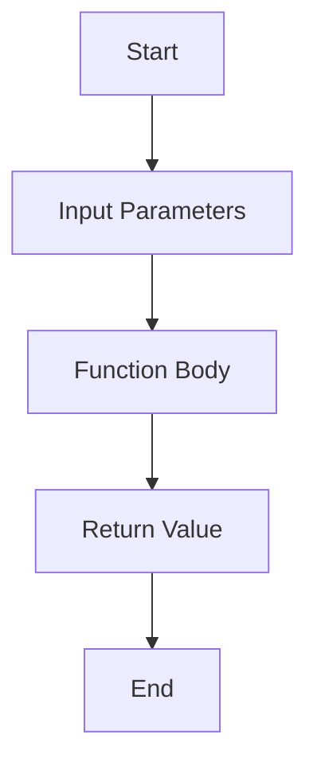

## 2.3.1 Defining Functions

In the world of programming, functions are indispensable tools that allow developers to write clean, efficient, and reusable code. In Dart, functions are first-class objects, meaning they can be assigned to variables, passed as arguments, and returned from other functions. This flexibility makes them a powerful feature in Dart and Flutter development. In this section, we will delve into the intricacies of defining functions in Dart, exploring their syntax, usage, and best practices.

### Understanding Functions

Functions are reusable blocks of code designed to perform a specific task. They help in organizing code, avoiding repetition, and improving readability. By encapsulating logic within functions, you can create modular code that is easier to maintain and debug.

#### Key Benefits of Using Functions

- **Code Reusability**: Functions allow you to write code once and reuse it multiple times, reducing redundancy.
- **Improved Readability**: By breaking down complex logic into smaller, manageable functions, your code becomes easier to read and understand.
- **Simplified Maintenance**: Functions make it easier to update and maintain code, as changes can be made in one place without affecting other parts of the program.
- **Enhanced Debugging**: Isolating functionality within functions helps in pinpointing errors and debugging code efficiently.

### Function Syntax

The syntax for defining a function in Dart is straightforward. Here is the general structure:

```dart
returnType functionName(parameters) {
  // Function body
  return value; // Optional
}
```

Let's break down each component:

- **Return Type**: Specifies the type of value the function returns. If the function does not return a value, the return type is `void`.
- **Function Name**: Should be descriptive and follow the `lowerCamelCase` convention.
- **Parameters**: Variables passed into the function, enclosed in parentheses. Parameters allow functions to accept input values.

#### Example: Calculating the Area of a Circle

```dart
double calculateArea(double radius) {
  return 3.14 * radius * radius;
}
```

- **Return Type**: `double` indicates that the function returns a double-precision floating-point number.
- **Function Name**: `calculateArea` clearly describes the function's purpose.
- **Parameters**: The function accepts a single parameter, `radius`, of type `double`.

### Void Functions

Void functions are those that do not return a value. They are often used to perform actions, such as printing output or modifying variables.

#### Example: Greeting a User

```dart
void greet(String name) {
  print('Hello, $name!');
}
```

In this example, the `greet` function takes a `String` parameter `name` and prints a greeting message. Since it does not return a value, its return type is `void`.

### Calling Functions

To use a function, you need to call it by its name and provide any required arguments. Here's how you can invoke the `calculateArea` function and use its return value:

```dart
double area = calculateArea(5.0);
print('Area: $area');
```

In this example, the `calculateArea` function is called with an argument of `5.0`, and the result is stored in the `area` variable, which is then printed.

### Visual Diagrams

To better understand the flow of functions, let's visualize the input-process-output model using a flowchart.



This flowchart illustrates the basic process of a function: it starts with input parameters, processes them within the function body, and optionally returns a value.

### Best Practices

When defining functions, consider the following best practices:

- **Single Responsibility**: Each function should perform a single, well-defined task. This makes your code easier to understand and maintain.
- **Descriptive Names**: Use clear and descriptive names for functions and parameters to convey their purpose.
- **Keep Functions Small**: Aim to keep functions short and focused. If a function becomes too long, consider breaking it into smaller functions.
- **Avoid Side Effects**: Functions should ideally not modify global variables or have unintended side effects.

### Interactive Exercise

To reinforce your understanding, try writing a function that converts temperatures between Celsius and Fahrenheit. Here's a starting point:

```dart
double celsiusToFahrenheit(double celsius) {
  return (celsius * 9/5) + 32;
}

double fahrenheitToCelsius(double fahrenheit) {
  return (fahrenheit - 32) * 5/9;
}
```

- **Task**: Implement these functions and test them with different temperature values. Consider edge cases, such as freezing and boiling points.

### Practical Examples and Real-World Scenarios

Functions are not just theoretical constructs; they are used extensively in real-world applications. Consider a scenario where you are developing a Flutter app that requires user authentication. You might define functions to handle tasks such as validating user input, checking credentials, and managing user sessions.

#### Example: User Authentication Functions

```dart
bool validateEmail(String email) {
  // Simple regex for email validation
  return RegExp(r'^[^@]+@[^@]+\.[^@]+').hasMatch(email);
}

bool validatePassword(String password) {
  // Check if password length is at least 8 characters
  return password.length >= 8;
}

void loginUser(String email, String password) {
  if (validateEmail(email) && validatePassword(password)) {
    print('Login successful!');
  } else {
    print('Invalid email or password.');
  }
}
```

In this example, functions are used to validate email and password inputs and to perform the login operation. This modular approach makes the code easier to test and maintain.

### Conclusion

Defining functions is a fundamental skill in Dart programming that enhances code organization, readability, and reusability. By understanding the syntax and best practices for defining functions, you can write more efficient and maintainable code. Remember to keep functions focused, use descriptive names, and avoid side effects. As you continue to develop your Flutter applications, consider how functions can simplify complex logic and improve your codebase.

## Quiz Time!



### What is the primary purpose of functions in programming?

- [x] To organize code and improve readability
- [ ] To increase the complexity of code
- [ ] To make code execution slower
- [ ] To eliminate the need for variables

> **Explanation:** Functions are used to organize code, avoid repetition, and improve readability, making the code easier to maintain and debug.

### Which of the following is a correct function definition in Dart?

- [x] `int add(int a, int b) { return a + b; }`
- [ ] `add(int a, int b) { return a + b; }`
- [ ] `int add(a, b) { return a + b; }`
- [ ] `int add(int a, int b) return a + b;`

> **Explanation:** The correct function definition includes a return type, function name, parameters, and a body enclosed in curly braces.

### What is the return type of a function that does not return any value?

- [x] `void`
- [ ] `null`
- [ ] `int`
- [ ] `String`

> **Explanation:** Functions that do not return a value have a return type of `void`.

### How do you call a function named `calculateArea` with a parameter `5.0`?

- [x] `calculateArea(5.0);`
- [ ] `calculateArea 5.0;`
- [ ] `calculateArea = 5.0;`
- [ ] `calculateArea(5.0)`

> **Explanation:** Functions are called by their name followed by parentheses containing any required arguments.

### Which of the following is a best practice when defining functions?

- [x] Keep functions small and focused
- [ ] Use long and complex names
- [ ] Include multiple tasks in one function
- [ ] Avoid using parameters

> **Explanation:** Functions should be small and focused, performing a single, well-defined task to enhance readability and maintainability.

### What is the purpose of parameters in a function?

- [x] To pass input values to the function
- [ ] To define the return type of the function
- [ ] To increase the function's complexity
- [ ] To eliminate the need for a function body

> **Explanation:** Parameters allow functions to accept input values, enabling them to perform operations based on those inputs.

### Which of the following functions correctly converts Celsius to Fahrenheit?

- [x] `double celsiusToFahrenheit(double celsius) { return (celsius * 9/5) + 32; }`
- [ ] `double celsiusToFahrenheit(double celsius) { return (celsius * 5/9) + 32; }`
- [ ] `double celsiusToFahrenheit(double celsius) { return (celsius - 32) * 5/9; }`
- [ ] `double celsiusToFahrenheit(double celsius) { return (celsius + 32) * 9/5; }`

> **Explanation:** The correct formula for converting Celsius to Fahrenheit is `(celsius * 9/5) + 32`.

### What is a common pitfall when defining functions?

- [x] Including side effects that modify global variables
- [ ] Using descriptive names
- [ ] Keeping functions focused
- [ ] Using parameters

> **Explanation:** Functions should avoid side effects, such as modifying global variables, to maintain predictability and reliability.

### True or False: Functions in Dart can be assigned to variables.

- [x] True
- [ ] False

> **Explanation:** In Dart, functions are first-class objects, meaning they can be assigned to variables, passed as arguments, and returned from other functions.

### What is the output of the following code snippet?
```dart
void greet(String name) {
  print('Hello, $name!');
}
greet('Alice');
```

- [x] `Hello, Alice!`
- [ ] `Hello, Bob!`
- [ ] `Hello, !`
- [ ] `Hello, name!`

> **Explanation:** The `greet` function prints a greeting message with the provided name, resulting in `Hello, Alice!`.


