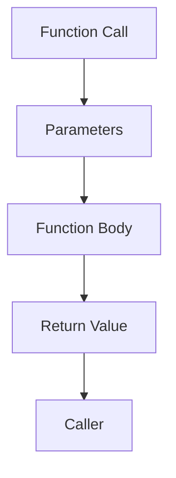

## 2.3.2 Parameters and Return Types

In the realm of Dart programming, understanding how to effectively use parameters and return types is crucial for writing clear, maintainable, and efficient code. Functions and methods are the building blocks of any application, and mastering their inputs and outputs can significantly enhance your development skills. This section delves into the intricacies of parameters and return types, providing you with the knowledge to harness their full potential in your Flutter applications.

### Positional Parameters

Positional parameters are the most straightforward type of parameters in Dart. They are defined without default values and must be provided in the exact order they are declared. This simplicity makes them ideal for functions where the order of arguments is intuitive and unlikely to change.

#### Example: Using Positional Parameters

Consider a function that prints a full name:

```dart
void printFullName(String firstName, String lastName) {
  print('$firstName $lastName');
}
```

In this example, `firstName` and `lastName` are positional parameters. When calling this function, you must provide the arguments in the correct order:

```dart
printFullName('John', 'Doe');
```

#### Best Practices for Positional Parameters

- Use positional parameters when the order of arguments is logical and unlikely to change.
- Keep the number of positional parameters small to avoid confusion.

### Named Parameters

Named parameters offer greater flexibility by allowing you to specify arguments by name. This can enhance code readability, especially in functions with many parameters or optional arguments.

#### Example: Using Named Parameters

Here's how you can define a function with named parameters:

```dart
void createUser({String? username, String? email}) {
  print('Username: $username, Email: $email');
}
```

When calling this function, you specify the parameters by name:

```dart
createUser(username: 'alice', email: 'alice@example.com');
```

#### Required Named Parameters

In Dart 2.12 and later, you can use the `required` keyword to enforce that certain named parameters must be provided:

```dart
void registerUser({required String username, required String password}) {
  print('User registered: $username');
}
```

This ensures that the function is called with all necessary information:

```dart
registerUser(username: 'bob', password: 'securepassword');
```

#### Best Practices for Named Parameters

- Use named parameters for functions with many parameters to improve readability.
- Mark essential parameters as `required` to prevent runtime errors.

### Default Parameter Values

Default parameter values allow you to specify a default value for a parameter, making it optional. This can simplify function calls and reduce the need for overloaded functions.

#### Example: Default Values with Positional Parameters

You can provide default values for optional positional parameters using square brackets:

```dart
void greet(String name, [String greeting = 'Hello']) {
  print('$greeting, $name!');
}
```

This function can be called with or without the optional parameter:

```dart
greet('Alice'); // Outputs: Hello, Alice!
greet('Bob', 'Hi'); // Outputs: Hi, Bob!
```

#### Example: Default Values with Named Parameters

Default values can also be used with named parameters:

```dart
void greet({String name = 'Guest'}) {
  print('Hello, $name!');
}
```

This allows for flexible function calls:

```dart
greet(); // Outputs: Hello, Guest!
greet(name: 'Charlie'); // Outputs: Hello, Charlie!
```

#### Best Practices for Default Values

- Use default values to simplify function calls and provide sensible defaults.
- Ensure that default values are logical and enhance the function's usability.

### Return Types

Specifying return types in Dart functions is a best practice that enhances code clarity and maintainability. It communicates the expected output of a function, making it easier for others (and yourself) to understand and use the function correctly.

#### Example: Specifying Return Types

Consider a function that calculates the sum of two numbers:

```dart
int add(int a, int b) {
  return a + b;
}
```

Here, the return type `int` indicates that the function will return an integer value.

#### Void Return Type

If a function does not return any value, you should specify the return type as `void`:

```dart
void logMessage(String message) {
  print(message);
}
```

#### Best Practices for Return Types

- Always specify a return type for functions, even if it's `void`.
- Use return types to communicate the function's purpose and expected output.

### Visual Diagrams

To better understand how parameters and return types work, consider the following diagram illustrating the flow of data in a function:



In this diagram:
- **Function Call**: Initiates the process by providing arguments.
- **Parameters**: Receive the input values.
- **Function Body**: Processes the inputs and performs operations.
- **Return Value**: Outputs the result back to the caller.

### Interactive Exercise

To solidify your understanding, try writing a function that combines both positional and named parameters, incorporating default values. Here's a challenge for you:

**Exercise**: Write a function `describePerson` that takes a positional parameter `name` and named parameters `age` and `city`, with default values for `age` and `city`. The function should print a description of the person.

```dart
void describePerson(String name, {int age = 30, String city = 'Unknown'}) {
  print('$name is $age years old and lives in $city.');
}

// Test the function
describePerson('Alice', age: 25, city: 'New York');
describePerson('Bob');
```

### Summary

Understanding parameters and return types is essential for writing effective Dart functions. By mastering positional, named, and default parameters, you can create flexible and robust functions. Specifying return types enhances code clarity and helps prevent errors. Remember to apply these concepts in your Flutter projects to improve code quality and maintainability.

### Additional Resources

- [Dart Language Tour](https://dart.dev/guides/language/language-tour#functions)
- [Effective Dart: Usage](https://dart.dev/guides/language/effective-dart/usage)
- [Flutter Documentation](https://flutter.dev/docs)

## Quiz Time!



### What is a positional parameter in Dart?

- [x] A parameter that must be provided in order.
- [ ] A parameter that can be specified by name.
- [ ] A parameter with a default value.
- [ ] A parameter that is optional.

> **Explanation:** Positional parameters are those that must be provided in the order they are declared in the function definition.

### How do you define a named parameter in Dart?

- [ ] Using square brackets.
- [x] Using curly braces.
- [ ] Using parentheses.
- [ ] Using angle brackets.

> **Explanation:** Named parameters in Dart are defined using curly braces, allowing them to be specified by name when the function is called.

### What keyword is used to make a named parameter required in Dart 2.12+?

- [ ] optional
- [ ] default
- [x] required
- [ ] mandatory

> **Explanation:** The `required` keyword is used to indicate that a named parameter must be provided when calling the function.

### How can you provide a default value for a positional parameter?

- [ ] Using curly braces.
- [x] Using square brackets.
- [ ] Using parentheses.
- [ ] Using angle brackets.

> **Explanation:** Default values for optional positional parameters are provided using square brackets.

### What is the return type of a function that does not return any value?

- [ ] int
- [ ] String
- [ ] bool
- [x] void

> **Explanation:** The `void` return type is used for functions that do not return any value.

### Why is it important to specify return types in Dart functions?

- [x] To enhance code clarity and maintainability.
- [ ] To make the code run faster.
- [ ] To reduce the number of parameters.
- [ ] To avoid using named parameters.

> **Explanation:** Specifying return types helps communicate the expected output of a function, making the code easier to understand and maintain.

### Which of the following is a best practice for using parameters in Dart functions?

- [x] Use named parameters for functions with many parameters.
- [ ] Use as many positional parameters as possible.
- [ ] Avoid using default values.
- [ ] Never specify return types.

> **Explanation:** Using named parameters for functions with many parameters improves readability and flexibility.

### How do you call a function with named parameters?

- [ ] By providing arguments in order.
- [x] By specifying arguments by name.
- [ ] By using default values.
- [ ] By omitting the parameters.

> **Explanation:** Named parameters are specified by name when calling the function, enhancing readability.

### What is the purpose of default parameter values?

- [x] To make parameters optional and provide sensible defaults.
- [ ] To enforce parameter order.
- [ ] To increase the number of parameters.
- [ ] To specify return types.

> **Explanation:** Default parameter values make parameters optional and provide sensible defaults, simplifying function calls.

### True or False: Named parameters must always be provided in the order they are declared.

- [ ] True
- [x] False

> **Explanation:** Named parameters can be specified in any order when calling the function, as they are identified by name.


