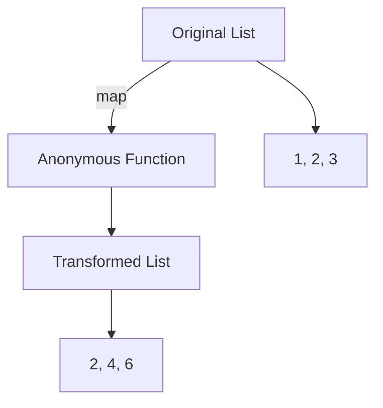

## 2.3.3 Anonymous Functions and Lambdas

In the world of programming, functions are fundamental building blocks that allow us to encapsulate logic and reuse it throughout our code. Dart, the language behind Flutter, offers a powerful feature known as anonymous functions, also referred to as lambdas or closures in some contexts. These functions are particularly useful in functional programming paradigms, allowing for concise and expressive code. In this section, we will delve into the intricacies of anonymous functions and lambdas, exploring their syntax, use cases, and practical applications in Dart.

### Understanding Anonymous Functions

Anonymous functions, as the name suggests, are functions without a name. They are often used as arguments to other functions, enabling a functional programming style where functions can be passed around as first-class citizens. This capability is particularly useful in scenarios where a function is needed only once or is used as a callback.

#### Syntax of Anonymous Functions

The syntax for an anonymous function in Dart is straightforward. It consists of a parameter list followed by a function body enclosed in curly braces:

```dart
(parameters) {
  // Function body
}
```

This syntax allows you to define a function inline, without the need for a separate function declaration. Here's a simple example:

```dart
List<int> numbers = [1, 2, 3];
numbers.forEach((number) {
  print(number * 2);
});
```

In this example, the anonymous function `(number) { print(number * 2); }` is passed as an argument to the `forEach` method, which iterates over each element in the list and applies the function.

#### Practical Example: Filtering a List

Let's consider a practical example where we use an anonymous function to filter a list of integers, keeping only the even numbers:

```dart
List<int> numbers = [1, 2, 3, 4, 5, 6];
List<int> evenNumbers = numbers.where((number) {
  return number % 2 == 0;
}).toList();

print(evenNumbers); // Output: [2, 4, 6]
```

In this example, the `where` method takes an anonymous function that returns `true` for even numbers, effectively filtering the list.

### Arrow Functions (Lambdas)

Arrow functions, also known as lambdas, provide a shorthand syntax for writing functions with a single expression. They are particularly useful for concise code and are often used in conjunction with collection methods.

#### Syntax of Arrow Functions

The syntax for an arrow function is as follows:

```dart
(parameters) => expression;
```

This syntax allows you to define a function in a single line, where the expression is implicitly returned. Here's an example:

```dart
List<int> doubledNumbers = numbers.map((number) => number * 2).toList();
```

In this example, the `map` method applies the arrow function `(number) => number * 2` to each element in the list, doubling each number.

#### Use Cases for Arrow Functions

Arrow functions are commonly used with collection methods such as `map`, `where`, `reduce`, and `sort`. They provide a simple way to pass functionality as data, enabling expressive and readable code.

### Visual Diagrams

To better understand how anonymous functions and lambdas work, let's visualize their use in higher-order functions. Consider the following diagram illustrating the flow of data through a list transformation using `map`:



In this diagram, the original list is transformed by applying an anonymous function to each element, resulting in a new list.

### Differences from Named Functions

Anonymous functions differ from named functions in several key ways:

- **No Name**: As the name implies, anonymous functions do not have a name and cannot be directly called elsewhere by name.
- **Scope**: They are often used in a limited scope, such as within a method call or as a callback.
- **Conciseness**: They are ideal for short, single-use functions that do not require a separate declaration.

### Interactive Exercise: Filtering a List

Let's put your understanding to the test with an interactive exercise. Use an anonymous function to filter a list of strings, keeping only those that contain the letter 'a':

```dart
List<String> words = ['apple', 'banana', 'cherry', 'date'];
List<String> wordsWithA = words.where((word) {
  return word.contains('a');
}).toList();

print(wordsWithA); // Output: ['apple', 'banana', 'date']
```

Try modifying the function to filter words based on different criteria, such as length or starting letter.

### Best Practices and Common Pitfalls

When using anonymous functions and lambdas, consider the following best practices:

- **Readability**: While concise, ensure that your use of anonymous functions does not sacrifice readability. Use named functions if the logic is complex or reused.
- **Performance**: Be mindful of performance implications, especially in large collections. Anonymous functions can introduce overhead if not used judiciously.
- **Debugging**: Debugging can be challenging with anonymous functions due to the lack of a name. Use comments and clear logic to aid in troubleshooting.

### Further Exploration

To deepen your understanding of anonymous functions and lambdas, consider exploring the following resources:

- [Dart Language Tour](https://dart.dev/guides/language/language-tour#functions)
- [Effective Dart: Usage](https://dart.dev/guides/language/effective-dart/usage)
- [Functional Programming in Dart](https://medium.com/flutter-community/functional-programming-in-dart-ecba5514f2de)

These resources provide additional insights and examples to enhance your proficiency with Dart's functional programming capabilities.

## Quiz Time!



### What is an anonymous function in Dart?

- [x] A function without a name, often used as an argument to other functions.
- [ ] A function that is always named and used globally.
- [ ] A function that cannot be passed as an argument.
- [ ] A function that is only used for mathematical operations.

> **Explanation:** An anonymous function is a function without a name, commonly used as an argument to other functions for tasks like callbacks or inline operations.

### How is an arrow function (lambda) defined in Dart?

- [x] (parameters) => expression;
- [ ] (parameters) { return expression; }
- [ ] function(parameters) => expression;
- [ ] (parameters) => { expression; }

> **Explanation:** An arrow function in Dart is defined using the syntax `(parameters) => expression;`, where the expression is implicitly returned.

### Which of the following is a use case for anonymous functions?

- [x] Passing functionality as data in collection methods.
- [ ] Defining global constants.
- [ ] Creating complex algorithms.
- [ ] Storing large amounts of data.

> **Explanation:** Anonymous functions are often used to pass functionality as data, particularly in collection methods like `map`, `where`, and `reduce`.

### What is a key difference between anonymous functions and named functions?

- [x] Anonymous functions cannot be directly called elsewhere by name.
- [ ] Named functions cannot be passed as arguments.
- [ ] Anonymous functions are always faster.
- [ ] Named functions are only used in libraries.

> **Explanation:** Anonymous functions do not have a name and cannot be directly called elsewhere, unlike named functions which can be reused throughout the code.

### Which method can be used with an anonymous function to filter a list?

- [x] where
- [ ] map
- [ ] reduce
- [ ] sort

> **Explanation:** The `where` method is used with an anonymous function to filter elements in a list based on a condition.

### What is the output of the following code snippet?
```dart
List<int> numbers = [1, 2, 3];
numbers.forEach((number) {
  print(number * 2);
});
```

- [x] 2, 4, 6
- [ ] 1, 2, 3
- [ ] 3, 6, 9
- [ ] 4, 5, 6

> **Explanation:** The anonymous function multiplies each number by 2, resulting in the output 2, 4, 6.

### What is a common pitfall when using anonymous functions?

- [x] Reduced readability if overused or complex.
- [ ] They cannot be used with collections.
- [ ] They always improve performance.
- [ ] They are not supported in Dart.

> **Explanation:** While anonymous functions are useful, overusing them or using them for complex logic can reduce code readability.

### Which of the following is NOT a characteristic of arrow functions?

- [x] They can contain multiple statements.
- [ ] They are concise and used for single expressions.
- [ ] They implicitly return the expression.
- [ ] They use the `=>` syntax.

> **Explanation:** Arrow functions are designed for single expressions and cannot contain multiple statements.

### How can you modify an anonymous function to return only odd numbers from a list?

- [x] Change the condition to `number % 2 != 0`.
- [ ] Use `number % 2 == 0`.
- [ ] Use `number > 0`.
- [ ] Use `number < 0`.

> **Explanation:** To filter odd numbers, the condition should be `number % 2 != 0`.

### True or False: Anonymous functions can be used as callbacks in asynchronous operations.

- [x] True
- [ ] False

> **Explanation:** Anonymous functions are often used as callbacks in asynchronous operations, providing a way to execute code once an operation completes.


