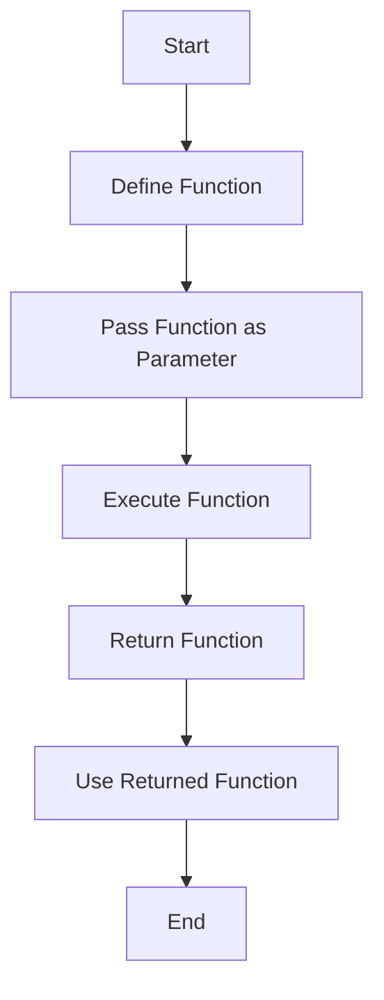

## 2.3.4 Higher-Order Functions

Higher-order functions are a powerful concept in programming, particularly in languages that support functional programming paradigms like Dart. They allow for more abstract and flexible code by enabling functions to be passed as parameters or returned as results. This section will delve into the intricacies of higher-order functions, providing you with the knowledge to leverage them effectively in your Dart applications.

### Definition

Higher-order functions are functions that can take other functions as arguments or return functions as their result. This capability allows for a more modular and reusable codebase, promoting the principles of functional programming.

### Passing Functions as Parameters

One of the most common uses of higher-order functions is passing functions as parameters. This allows you to abstract operations and apply them dynamically.

#### Example: Passing Functions as Parameters

Consider a scenario where you want to perform different operations on two numbers. Instead of writing separate functions for each operation, you can pass the operation itself as a function parameter.

```dart
void performOperation(int a, int b, int Function(int, int) operation) {
  print(operation(a, b));
}

int add(int x, int y) => x + y;

performOperation(5, 3, add); // Outputs: 8
```

In this example, `performOperation` is a higher-order function that takes another function `operation` as a parameter. The `add` function is passed to `performOperation`, which then executes it with the provided arguments.

### Returning Functions

Higher-order functions can also return other functions. This is particularly useful for creating function factories or closures.

#### Example: Returning Functions

Let's create a function that returns another function to multiply a number by a given multiplier.

```dart
Function multiplyBy(int multiplier) {
  return (int value) => value * multiplier;
}

var triple = multiplyBy(3);
print(triple(4)); // Outputs: 12
```

Here, `multiplyBy` returns a function that multiplies its input by the specified `multiplier`. The returned function is then used to triple a number.

### Common Higher-Order Functions

Dart provides several built-in higher-order functions that are commonly used for operations on collections. These include `map`, `filter` (also known as `where`), and `reduce`.

#### Map

The `map` function transforms each element in a collection using a provided function.

```dart
List<int> numbers = [1, 2, 3, 4];
List<int> doubled = numbers.map((n) => n * 2).toList();
print(doubled); // Outputs: [2, 4, 6, 8]
```

In this example, each element in the `numbers` list is doubled using the `map` function.

#### Filter (Where)

The `filter` function, known as `where` in Dart, selects elements that meet a specified condition.

```dart
List<int> numbers = [1, 2, 3, 4, 5, 6];
List<int> evenNumbers = numbers.where((n) => n.isEven).toList();
print(evenNumbers); // Outputs: [2, 4, 6]
```

Here, `where` filters out only the even numbers from the list.

#### Reduce

The `reduce` function combines all elements in a collection into a single value using a specified function.

```dart
List<int> numbers = [1, 2, 3, 4];
int sum = numbers.reduce((a, b) => a + b);
print(sum); // Outputs: 10
```

In this case, `reduce` is used to calculate the sum of all numbers in the list.

### Visual Diagrams

To better understand how higher-order functions work, let's visualize the process of passing and using functions within other functions.



This diagram illustrates the flow of using higher-order functions, from defining a function to passing it as a parameter, executing it, and potentially returning another function.

### Benefits

Higher-order functions offer several benefits:

- **Code Reuse**: By abstracting operations into functions, you can reuse them across different parts of your application.
- **Functional Programming**: They support functional programming paradigms, making your code more declarative and expressive.
- **Modularity**: Higher-order functions promote modular code, making it easier to maintain and extend.

### Interactive Exercise

To solidify your understanding, try the following exercise:

Create a list of numbers and use higher-order functions to:

- Filter out even numbers.
- Calculate the sum of the remaining numbers.

```dart
void main() {
  List<int> numbers = [1, 2, 3, 4, 5, 6, 7, 8, 9, 10];

  // Filter even numbers
  List<int> oddNumbers = numbers.where((n) => n.isOdd).toList();
  print('Odd Numbers: $oddNumbers');

  // Calculate the sum of odd numbers
  int sumOfOddNumbers = oddNumbers.reduce((a, b) => a + b);
  print('Sum of Odd Numbers: $sumOfOddNumbers');
}
```

### Best Practices and Common Pitfalls

- **Avoid Overuse**: While higher-order functions are powerful, overusing them can lead to complex and hard-to-read code. Use them judiciously.
- **Understand Scope**: Be mindful of variable scope when returning functions, as closures can capture and retain references to variables.
- **Performance Considerations**: Higher-order functions can introduce overhead. Consider performance implications, especially in performance-critical sections of your code.

### Further Exploration

To deepen your understanding of higher-order functions and functional programming, consider exploring the following resources:

- [Dart Language Tour](https://dart.dev/guides/language/language-tour)
- [Functional Programming in Dart](https://dart.dev/guides/language/language-tour#functions)
- Books like "Functional Programming in Scala" for concepts applicable across languages.

By mastering higher-order functions, you'll be well-equipped to write more flexible, reusable, and expressive code in Dart.

## Quiz Time!



### What is a higher-order function?

- [x] A function that takes other functions as parameters or returns functions.
- [ ] A function that only performs arithmetic operations.
- [ ] A function that is defined inside another function.
- [ ] A function that does not return any value.

> **Explanation:** Higher-order functions are those that can take other functions as parameters or return functions as their result, enabling more abstract and flexible code.

### Which of the following is an example of passing a function as a parameter?

- [x] `performOperation(5, 3, add);`
- [ ] `int add(int x, int y) => x + y;`
- [ ] `var result = add(5, 3);`
- [ ] `Function multiplyBy(int multiplier) { return (int value) => value * multiplier; }`

> **Explanation:** `performOperation(5, 3, add);` is an example where the `add` function is passed as a parameter to `performOperation`.

### What does the `map` function do?

- [x] Transforms each element in a collection using a provided function.
- [ ] Filters elements in a collection based on a condition.
- [ ] Combines all elements in a collection into a single value.
- [ ] Sorts elements in a collection.

> **Explanation:** The `map` function applies a transformation to each element in a collection, producing a new collection with the transformed elements.

### How does the `reduce` function work?

- [x] It combines all elements in a collection into a single value using a specified function.
- [ ] It filters elements in a collection based on a condition.
- [ ] It transforms each element in a collection using a provided function.
- [ ] It sorts elements in a collection.

> **Explanation:** The `reduce` function applies a combining operation to all elements in a collection, resulting in a single accumulated value.

### What is the output of the following code snippet?
```dart
Function multiplyBy(int multiplier) {
  return (int value) => value * multiplier;
}

var double = multiplyBy(2);
print(double(5));
```

- [x] 10
- [ ] 5
- [ ] 2
- [ ] 0

> **Explanation:** The `multiplyBy` function returns a function that multiplies its input by 2. When `double(5)` is called, it returns 10.

### Which higher-order function would you use to filter out even numbers from a list?

- [x] `where`
- [ ] `map`
- [ ] `reduce`
- [ ] `forEach`

> **Explanation:** The `where` function is used to filter elements in a collection based on a condition, such as filtering out even numbers.

### What is a closure in the context of higher-order functions?

- [x] A function that captures and retains references to variables from its surrounding scope.
- [ ] A function that is defined inside another function.
- [ ] A function that only performs arithmetic operations.
- [ ] A function that does not return any value.

> **Explanation:** A closure is a function that captures and retains references to variables from its surrounding scope, allowing it to access those variables even after the scope has exited.

### What is the benefit of using higher-order functions?

- [x] They promote code reuse and support functional programming paradigms.
- [ ] They make code execution faster.
- [ ] They reduce the need for variables.
- [ ] They eliminate the need for loops.

> **Explanation:** Higher-order functions promote code reuse and support functional programming paradigms, making code more modular and expressive.

### True or False: Higher-order functions can only be used with collections.

- [ ] True
- [x] False

> **Explanation:** False. Higher-order functions can be used in various contexts, not just with collections. They can be applied wherever functions need to be passed or returned.

### Which of the following is NOT a common higher-order function in Dart?

- [ ] `map`
- [ ] `where`
- [ ] `reduce`
- [x] `sort`

> **Explanation:** While `sort` is a function that can be used on collections, it is not typically considered a higher-order function like `map`, `where`, or `reduce`, which involve passing functions as arguments.


