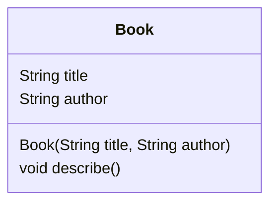

## 2.4.1 Classes and Objects

Object-Oriented Programming (OOP) is a paradigm that uses "objects" to represent data and methods to manipulate that data. In Dart, as in many other programming languages, classes and objects are the core components of OOP. Understanding these concepts is crucial for building robust and scalable applications in Flutter.

### Understanding OOP Concepts

#### Class

A **class** is essentially a blueprint for creating objects. It defines a set of properties (also known as attributes or fields) and methods (functions) that the objects created from the class will have. Think of a class as a template or a prototype that outlines the structure and behavior of the objects.

- **Properties**: These are the variables that hold the data related to the object.
- **Methods**: These are the functions that define the behavior of the object.

#### Object

An **object** is an instance of a class. When you create an object, you are creating a specific realization of the class with actual values. Each object can have different values for its properties, but it shares the same structure and behavior defined by its class.

### Defining a Class

In Dart, defining a class is straightforward. Here's the basic syntax:

```dart
class ClassName {
  // Fields (properties)
  // Constructors
  // Methods
}
```

Let's look at a practical example to illustrate this:

```dart
class Book {
  String title;
  String author;

  void describe() {
    print('$title by $author');
  }
}
```

In this example, `Book` is a class with two properties, `title` and `author`, and a method `describe()` that prints out the book's details.

### Creating Objects

To use a class, you need to create objects from it. This process is known as instantiation.

```dart
var myBook = Book();
myBook.title = '1984';
myBook.author = 'George Orwell';
myBook.describe(); // Outputs: 1984 by George Orwell
```

Here, `myBook` is an object of the `Book` class. We assign values to its properties and call its method to display the book's information.

### Constructors

Constructors are special methods used to initialize objects. They simplify the process of creating objects by allowing you to set initial values for properties at the time of object creation.

```dart
class Book {
  String title;
  String author;

  Book(this.title, this.author);

  void describe() {
    print('$title by $author');
  }
}

var myBook = Book('1984', 'George Orwell');
```

In this example, the `Book` class has a constructor that takes two parameters, `title` and `author`, and assigns them to the respective properties. This makes object creation more concise and less error-prone.

### Visual Diagrams

To better understand the structure of a class, we can use UML (Unified Modeling Language) class diagrams. Below is a simple UML diagram representing the `Book` class:



This diagram visually represents the `Book` class, showing its properties and methods.

### Encapsulation

Encapsulation is one of the four fundamental OOP concepts. It refers to the bundling of data (properties) and methods that operate on the data into a single unit, or class. Encapsulation helps protect the internal state of an object from unintended interference and misuse.

In Dart, you can control access to the properties and methods of a class using access modifiers. By default, all properties and methods are public. However, you can make them private by prefixing their names with an underscore (`_`).

```dart
class Book {
  String _title;
  String _author;

  Book(this._title, this._author);

  void describe() {
    print('$_title by $_author');
  }
}
```

In this example, `_title` and `_author` are private properties, meaning they cannot be accessed directly from outside the class.

### Interactive Exercise

To solidify your understanding of classes and objects, try creating a `Student` class with the following specifications:

- **Properties**: `name` (String), `id` (int)
- **Methods**: `enroll()` which prints a message indicating the student has enrolled.

Here's a starting point:

```dart
class Student {
  String name;
  int id;

  Student(this.name, this.id);

  void enroll() {
    print('$name with ID $id has enrolled.');
  }
}

// Create an instance of Student
var student = Student('Alice', 101);
student.enroll(); // Outputs: Alice with ID 101 has enrolled.
```

### Best Practices

- **Use meaningful class and property names**: Names should clearly indicate the purpose and use of the class or property.
- **Encapsulate data**: Use private properties to protect the internal state of the class.
- **Keep classes focused**: Each class should have a single responsibility or purpose.

### Common Pitfalls

- **Overusing classes**: Not every piece of code needs to be a class. Use classes when you need to model complex data and behavior.
- **Ignoring encapsulation**: Failing to encapsulate data can lead to code that is difficult to maintain and debug.

### Further Reading

- [Dart Language Tour](https://dart.dev/guides/language/language-tour)
- [Effective Dart: Style](https://dart.dev/guides/language/effective-dart/style)
- [Object-Oriented Programming in Dart](https://dart.dev/guides/language/language-tour#object-oriented-programming)

By understanding and applying these concepts, you can create well-structured and maintainable applications in Dart and Flutter. Experiment with creating your own classes and objects to deepen your understanding of OOP in Dart.

## Quiz Time!



### What is a class in Dart?

- [x] A blueprint for creating objects, defining properties and methods.
- [ ] An instance of an object.
- [ ] A function that performs a specific task.
- [ ] A variable that holds data.

> **Explanation:** A class is a blueprint for creating objects, defining the properties and methods that the objects will have.

### What is an object in Dart?

- [x] An instance of a class containing real values.
- [ ] A blueprint for creating classes.
- [ ] A method within a class.
- [ ] A data type in Dart.

> **Explanation:** An object is an instance of a class, containing real values for the properties defined by the class.

### How do you define a class in Dart?

- [x] Using the `class` keyword followed by the class name and curly braces.
- [ ] Using the `object` keyword followed by the object name.
- [ ] Using the `function` keyword followed by the function name.
- [ ] Using the `var` keyword followed by the variable name.

> **Explanation:** A class in Dart is defined using the `class` keyword, followed by the class name and curly braces to enclose its properties and methods.

### What is the purpose of a constructor in a class?

- [x] To initialize objects and set initial values for properties.
- [ ] To define methods within a class.
- [ ] To create a new data type.
- [ ] To encapsulate data within a class.

> **Explanation:** A constructor is a special method used to initialize objects and set initial values for the properties of a class.

### How do you make a property private in Dart?

- [x] By prefixing the property name with an underscore (`_`).
- [ ] By using the `private` keyword.
- [ ] By using the `protected` keyword.
- [ ] By declaring the property outside the class.

> **Explanation:** In Dart, a property is made private by prefixing its name with an underscore (`_`), restricting access from outside the class.

### What is encapsulation in OOP?

- [x] The bundling of data and methods that operate on the data into a single unit.
- [ ] The inheritance of properties and methods from a parent class.
- [ ] The ability to define multiple methods with the same name.
- [ ] The process of creating new classes from existing ones.

> **Explanation:** Encapsulation is the bundling of data and methods that operate on the data into a single unit, typically a class, to protect the internal state of an object.

### Which of the following is a correct way to create an object in Dart?

- [x] `var myObject = MyClass();`
- [ ] `var myObject = new MyClass();`
- [ ] `var myObject = create MyClass();`
- [ ] `var myObject = MyClass.create();`

> **Explanation:** The correct way to create an object in Dart is by using the class name followed by parentheses, e.g., `var myObject = MyClass();`.

### What does the `describe()` method do in the `Book` class example?

- [x] It prints the title and author of the book.
- [ ] It initializes the book's properties.
- [ ] It changes the book's title.
- [ ] It deletes the book object.

> **Explanation:** The `describe()` method in the `Book` class example prints the title and author of the book.

### True or False: In Dart, all properties and methods are public by default.

- [x] True
- [ ] False

> **Explanation:** In Dart, all properties and methods are public by default unless they are prefixed with an underscore (`_`), which makes them private.

### What is the benefit of using constructors in Dart?

- [x] They simplify object creation by allowing initial values to be set for properties.
- [ ] They allow multiple inheritance in Dart.
- [ ] They enable the use of global variables.
- [ ] They provide a way to define static methods.

> **Explanation:** Constructors simplify object creation by allowing initial values to be set for properties, making the code more concise and less error-prone.


