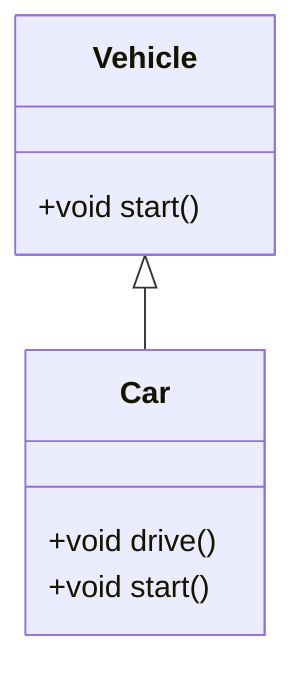

## 2.4.2 Inheritance and Polymorphism

In the realm of object-oriented programming (OOP), inheritance and polymorphism are two fundamental concepts that enable developers to create flexible and reusable code. Dart, the language behind Flutter, fully supports these OOP principles, allowing you to build robust and scalable applications. This section will delve into these concepts, providing you with a solid understanding and practical skills to apply them in your projects.

### Understanding Inheritance

Inheritance is a mechanism that allows a new class, known as a subclass or derived class, to inherit properties and methods from an existing class, referred to as a superclass or base class. This promotes code reuse and establishes a natural hierarchy between classes.

#### Base Class (Super Class)

A base class is a general class that provides common functionality to its subclasses. Let's consider a simple example with a `Vehicle` class:

```dart
class Vehicle {
  void start() {
    print('Vehicle started');
  }
}
```

In this example, `Vehicle` is a base class with a method `start()`, which can be used by any class that extends `Vehicle`.

#### Derived Class (Sub Class)

A derived class extends the functionality of a base class. Here's how you can create a `Car` class that inherits from `Vehicle`:

```dart
class Car extends Vehicle {
  void drive() {
    print('Car is driving');
  }
}
```

The `Car` class inherits the `start()` method from `Vehicle` and adds its own method `drive()`.

#### Usage Example

Let's see how you can use these classes:

```dart
void main() {
  var myCar = Car();
  myCar.start(); // Output: Vehicle started
  myCar.drive(); // Output: Car is driving
}
```

In this example, `myCar` is an instance of `Car`, which can use both the `start()` method from `Vehicle` and the `drive()` method from `Car`.

### Method Overriding

Method overriding allows a subclass to provide a specific implementation of a method that is already defined in its superclass. This is useful when you want to change or extend the behavior of a method.

```dart
class Car extends Vehicle {
  @override
  void start() {
    print('Car ignition started');
  }
}
```

Here, the `Car` class overrides the `start()` method of `Vehicle`. When you call `start()` on an instance of `Car`, it will execute the overridden method.

### Polymorphism

Polymorphism is the ability to treat objects of different classes through the same interface. This means you can write code that works on the superclass type, but it can operate on any subclass type.

```dart
void main() {
  Vehicle vehicle = Car();
  vehicle.start(); // Output: Car ignition started
}
```

In this example, `vehicle` is a reference of type `Vehicle`, but it points to an instance of `Car`. When `start()` is called, it executes the overridden method in `Car`.

### Visual Diagrams

To better understand the relationships between classes, let's visualize the inheritance hierarchy using Mermaid.js:



This diagram shows that `Car` inherits from `Vehicle` and overrides the `start()` method.

### Abstract Classes and Methods

Abstract classes are classes that cannot be instantiated directly. They are designed to be subclassed, providing a template for other classes. Abstract methods are methods that are declared without an implementation.

```dart
abstract class Shape {
  void draw(); // Abstract method
}

class Circle extends Shape {
  @override
  void draw() {
    print('Drawing a circle');
  }
}
```

In this example, `Shape` is an abstract class with an abstract method `draw()`. The `Circle` class extends `Shape` and provides an implementation for `draw()`.

### Interactive Exercise

To reinforce your understanding, try creating an inheritance hierarchy with the following classes:

- `Animal` (base class)
- `Mammal` (subclass of `Animal`)
- `Bird` (subclass of `Animal`)

Implement methods that demonstrate overriding, such as `speak()` for `Animal`, `walk()` for `Mammal`, and `fly()` for `Bird`.

### Best Practices and Common Pitfalls

- **Use Inheritance Judiciously**: While inheritance promotes code reuse, overusing it can lead to complex and tightly coupled code. Consider composition as an alternative.
- **Override Methods Carefully**: Ensure that overridden methods maintain the expected behavior of the superclass.
- **Leverage Polymorphism**: Use polymorphism to write flexible and maintainable code that can work with different subclasses.

### Additional Resources

- [Dart Language Tour](https://dart.dev/guides/language/language-tour)
- [Effective Dart: Style](https://dart.dev/guides/language/effective-dart/style)
- [Object-Oriented Programming in Dart](https://dart.dev/guides/language/language-tour#object-oriented-programming)

By mastering inheritance and polymorphism, you'll be able to create more organized and scalable applications. These concepts are foundational to object-oriented programming and are widely used in software development.

## Quiz Time!



### What is the primary purpose of inheritance in Dart?

- [x] To allow a new class to inherit properties and methods from an existing class
- [ ] To create multiple instances of a class
- [ ] To define a class without any methods
- [ ] To override existing methods in a class

> **Explanation:** Inheritance allows a new class to inherit properties and methods from an existing class, promoting code reuse and establishing a class hierarchy.

### Which keyword is used to indicate that a class is inheriting from another class in Dart?

- [ ] implements
- [x] extends
- [ ] with
- [ ] inherits

> **Explanation:** The `extends` keyword is used in Dart to indicate that a class is inheriting from another class.

### What is method overriding?

- [x] Allowing a subclass to provide a specific implementation of a method already defined in its superclass
- [ ] Creating a new method in a subclass
- [ ] Inheriting methods from a superclass
- [ ] Defining a method without implementation

> **Explanation:** Method overriding allows a subclass to provide a specific implementation of a method that is already defined in its superclass.

### What is polymorphism in Dart?

- [x] The ability to treat objects of different classes through the same interface
- [ ] The ability to create multiple instances of a class
- [ ] The ability to define a class without any methods
- [ ] The ability to override existing methods in a class

> **Explanation:** Polymorphism is the ability to treat objects of different classes through the same interface, allowing for flexible and reusable code.

### Which of the following is an abstract class?

- [x] A class that cannot be instantiated and is designed to be subclassed
- [ ] A class that can be instantiated directly
- [ ] A class with only static methods
- [ ] A class that does not have any methods

> **Explanation:** An abstract class cannot be instantiated and is designed to be subclassed, providing a template for other classes.

### What is the purpose of an abstract method?

- [x] To declare a method without an implementation, forcing subclasses to provide an implementation
- [ ] To provide a default implementation for a method
- [ ] To create a method that cannot be overridden
- [ ] To define a method that can be called without an instance

> **Explanation:** An abstract method is declared without an implementation, requiring subclasses to provide their own implementation.

### How can you create a polymorphic reference in Dart?

- [x] By declaring a variable of a superclass type and assigning it an instance of a subclass
- [ ] By declaring a variable of a subclass type and assigning it an instance of a superclass
- [ ] By using the `implements` keyword
- [ ] By using the `with` keyword

> **Explanation:** A polymorphic reference is created by declaring a variable of a superclass type and assigning it an instance of a subclass.

### What is the output of the following code?

```dart
class Vehicle {
  void start() {
    print('Vehicle started');
  }
}

class Car extends Vehicle {
  @override
  void start() {
    print('Car ignition started');
  }
}

void main() {
  Vehicle vehicle = Car();
  vehicle.start();
}
```

- [x] Car ignition started
- [ ] Vehicle started
- [ ] Error: Method not found
- [ ] No output

> **Explanation:** The output is "Car ignition started" because the `start()` method is overridden in the `Car` class, and the polymorphic reference calls the overridden method.

### True or False: An abstract class in Dart can have both abstract and concrete methods.

- [x] True
- [ ] False

> **Explanation:** True. An abstract class in Dart can have both abstract methods (without implementation) and concrete methods (with implementation).

### True or False: You can instantiate an abstract class directly in Dart.

- [ ] True
- [x] False

> **Explanation:** False. An abstract class cannot be instantiated directly; it is meant to be subclassed.


